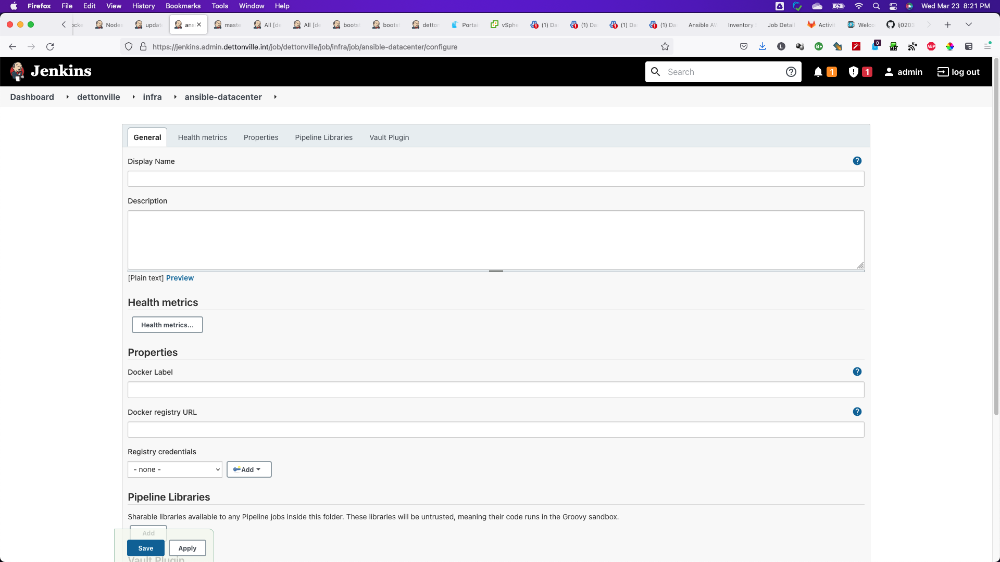
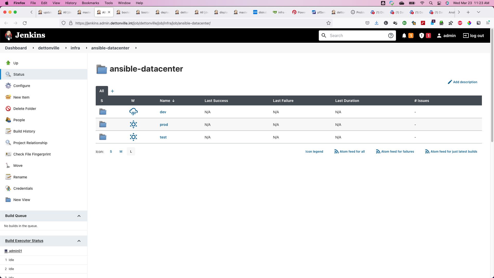
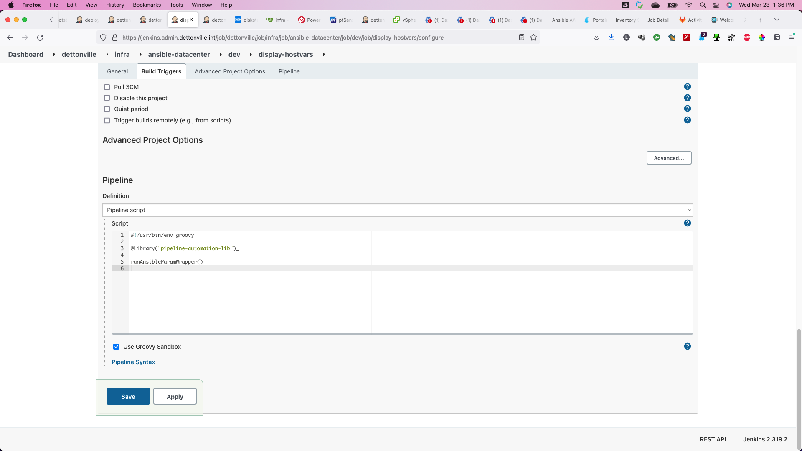
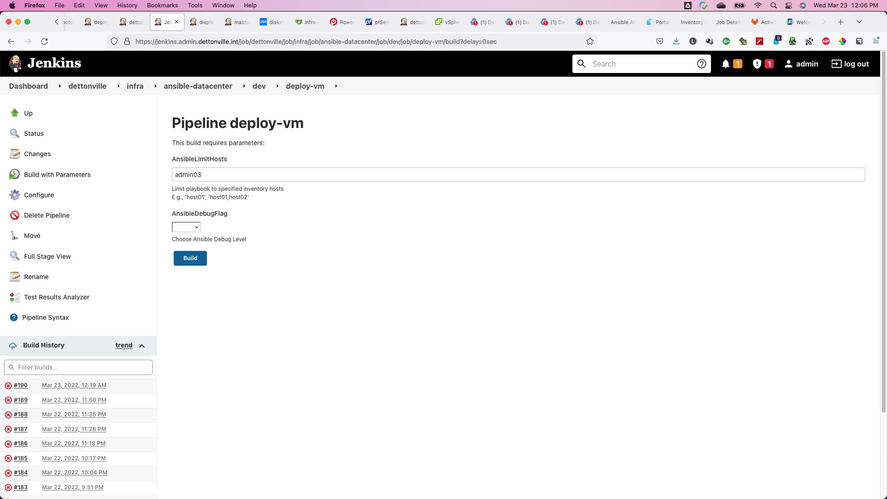
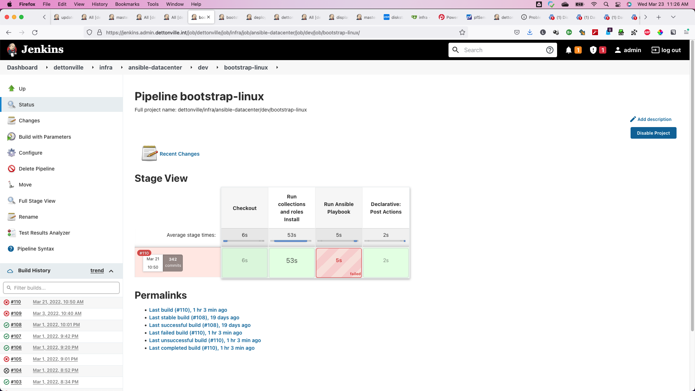
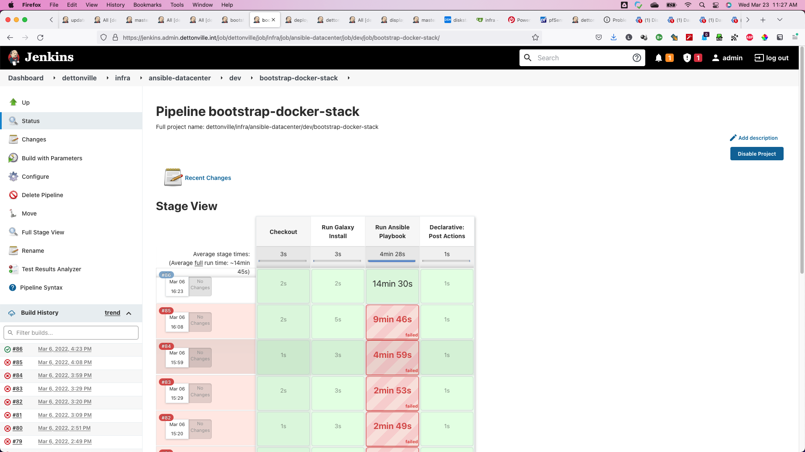
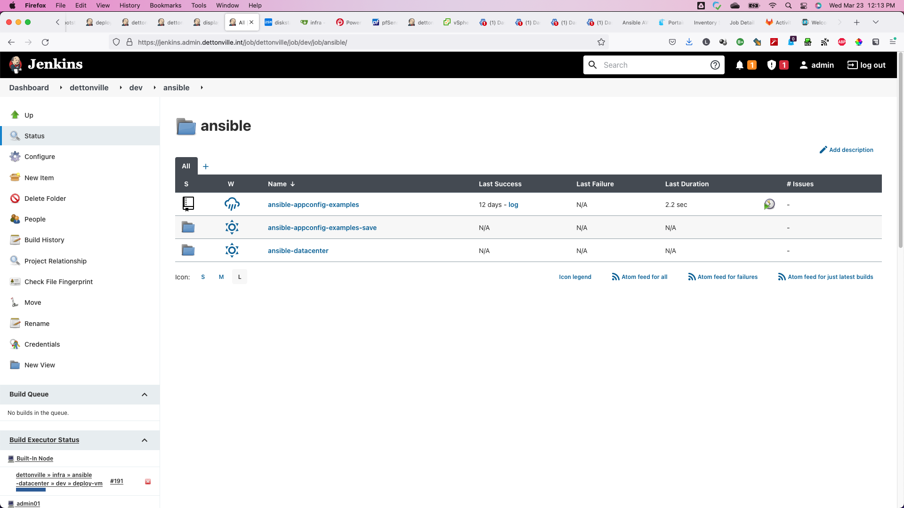
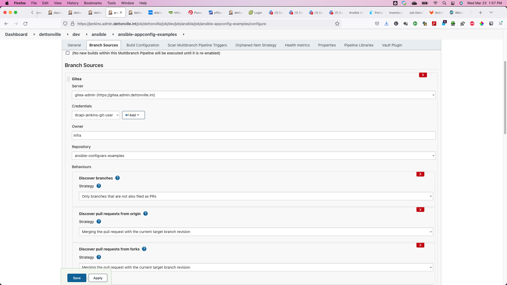
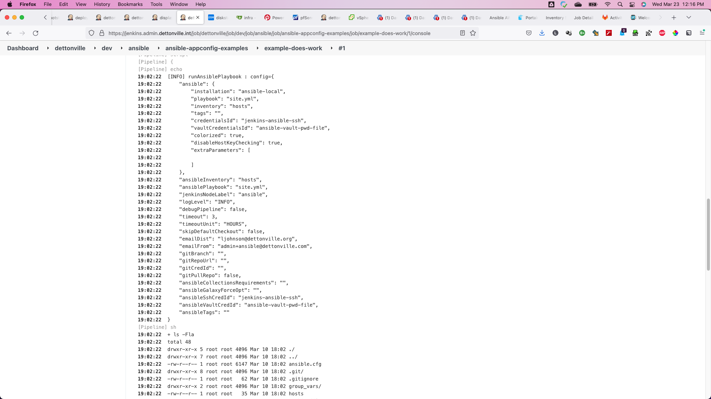

ansible-datacenter
===

This is an ansible playbook that will configure your datacenter based on roles on Ubuntu/Centos linux servers.


## Prerequisites

1.  Clone this Ansible deployment playbook
```
git clone https://github.com/lj020326/ansible-datacenter.git
```

2. Setup galaxy collections/roles to be used: *This is internally performed by script if using to run on remote ansible/control node

```
## install collections
ansible-galaxy collection install -r ./collections/requirements.yml

## install roles
ansible-galaxy install -r ./roles/requirements.yml
```

3. Add host info to hosts.ini inventory and ping the nodes

```bash
ansible -i inventory/hosts.ini all -m ping -b -vvvv
```

4. Create the vault file used to protect important data in source control.
    For more information go here (http://docs.ansible.com/playbooks_vault.html)

The vault file used has to have the name private_vars.yml. Ensure your editor environment variable is set or it defaults to vim.

    # create private file
    ansible-vault create vars/secrets.yml

Running the command above will ask you for a password to encrypt with, and open an editor. In that file set the variables highlighted in the secrets.yml.example file.


## Command Line Usage

### Display/Debug any vars

```bash
ansible all -m debug -a var=groups['ca_domain']
ansible -i inventory/dev/hosts.ini  windows -m debug -a var=ansible_port
ansible -i inventory/dev/hosts.ini  windows -m debug -a var=ansible_winrm_transport
ansible -i inventory/dev/hosts.ini  windows -m debug -a var=ansible_host
```


### Setup and Run the datacenter playbook roles

## Run playbooks

Run site-setup play:

`ansible-playbook site.yml`

Run site-setup play with a tag:

```
ansible-playbook site.yml --tags docker-media-node
```


Run plays for specific configuration needed

To run ansible commands from ansible/control node:

```bash
ansible -v -m ping
ansible -m ping ubuntu18
```

Run play for specific node:

```bash
ansible-playbook site.yml --tags display-hostvars --limit admin01
ansible-playbook site.yml --tags install-cacerts --limit media01
```


Run a play for a specific group of nodes:

```bash
ansible-playbook site.yml --tags install-cacerts --limit windows
ansible-playbook site.yml --tags install-cacerts --limit os_Ubuntu
ansible-playbook site.yml -t display-hostvars -l os_CentOS
ansible-playbook site.yml -t display-hostvars -l docker
```

E.g., Run site setup play on control node with a tag from windows/msys shell.

```
ansible-playbook site.yml --tags bootstrap-ansible
ansible-playbook site.yml --tags bootstrap-bind
ansible-playbook site.yml --tags bootstrap-cacert
ansible-playbook site.yml --tags bootstrap-caroot
ansible-playbook site.yml --tags bootstrap-cicd
ansible-playbook site.yml --tags bootstrap-docker
ansible-playbook site.yml --tags bootstrap-docker-stack
ansible-playbook site.yml --tags bootstrap-idrac
ansible-playbook site.yml --tags bootstrap-jenkins-agent
ansible-playbook site.yml --tags bootstrap-keyring
ansible-playbook site.yml --tags bootstrap-kvm
ansible-playbook site.yml --tags bootstrap-ldap-client
ansible-playbook site.yml --tags bootstrap-linux
ansible-playbook site.yml --tags bootstrap-mergerfs
ansible-playbook site.yml --tags bootstrap-linux-core
ansible-playbook site.yml --tags bootstrap-ntp
ansible-playbook site.yml --tags bootstrap-openstack
ansible-playbook site.yml --tags bootstrap-openstack-cloud
ansible-playbook site.yml --tags bootstrap-postfix
ansible-playbook site.yml --tags bootstrap-proxmox
ansible-playbook site.yml --tags bootstrap-stepcli
ansible-playbook site.yml --tags bootstrap-user
ansible-playbook site.yml --tags bootstrap-vmware-esxi
ansible-playbook site.yml --tags build-docker-images
ansible-playbook site.yml --tags deploy-cacerts
ansible-playbook site.yml --tags deploy-vm
ansible-playbook site.yml --tags deploy-vsphere-dc
ansible-playbook site.yml --tags display-hostvars
ansible-playbook site.yml --tags docker-admin-node
ansible-playbook site.yml --tags docker-control-node
ansible-playbook site.yml --tags docker-media-node
ansible-playbook site.yml --tags docker-samba-node
ansible-playbook site.yml --tags deploy-nfs-service
ansible-playbook site.yml --tags remount-vmware-datastores
ansible-playbook site.yml --tags upgrade-vmware-esxi
```

Setup vsphere dc
```bash
ansible-playbook site.yml --tags deploy-vsphere-dc
```

Deploy VMs
```bash
ansible-playbook site.yml --tags deploy-vm
```

Bootstrap VM nodes if needed
Note: This is not used any longer since this is now performed from the jenkins pipeline.
The jenkins pipeline is responsible for building VM template images using packer.
The vm image build pipeline source is located here [here](https://github.com/lj020326/pipeline-automation-lib/blob/public/vars/buildVmTemplate.groovy).

```bash
ansible-playbook site.yml --tags bootstrap-linux --limit admin02
```

Bootstrap node network config *should not be necessary since this is mostly done in deploy-VM
```bash
ansible-playbook site.yml --tags bootstrap-network --limit node01
```

Docker stack plays
```bash
ansible-playbook site.yml --tags docker-admin-node
ansible-playbook site.yml --tags docker-media-node
```

Useful commands to build/update/configure datacenter:

```bash
ansible-playbook site.yml --tags bootstrap-bind
ansible-playbook site.yml --tags bootstrap-docker
ansible-playbook site.yml --tags bootstrap-linux-core
ansible-playbook site.yml --tags bootstrap-openstack
ansible-playbook site.yml --tags bootstrap-openstack-cloud
ansible-playbook site.yml --tags bootstrap-user
ansible-playbook site.yml --tags bootstrap-vmware-esxi
ansible-playbook site.yml --tags build-docker-images
ansible-playbook site.yml --tags cacerts-deploy
ansible-playbook site.yml --tags deploy-vm
ansible-playbook site.yml --tags deploy-vsphere-dc
ansible-playbook site.yml --tags display-hostvars
ansible-playbook site.yml --tags docker-admin-node
ansible-playbook site.yml --tags docker-media-node
ansible-playbook site.yml --tags fetch-osimages
ansible-playbook site.yml --tags iscsi-client
ansible-playbook site.yml --tags nfs-service
ansible-playbook site.yml --tags remount-vmware-datastores
ansible-playbook site.yml --tags upgrade-vmware-esxi
```


## Jenkins Pipeline Usage

### Setup pipeline automation library used by all jenkins jobs
The pipeline automation library used can be found [here](https://github.com/lj020326/pipeline-automation-lib).
[The pipeline automation library](https://github.com/lj020326/pipeline-automation-lib) defines the shared jenkins templates that are used throughout all of the jenkins ansible pipelines.  

Configure the library in jenkins as seen below.


### Site Root folder

A root folder for the ansible-datacenter environment can be setup similar to the following.


### Inventory Environment folders

Then setup folders for each environment defined in the inventory similar to the following.


### Jenkins Pipelines to run Ansible tags

Each job folder corresponds to a tag defined in the site.yml playbook.


To make setting up each folder consistent and simple as possible, the jobs all are exactly the same except the folder name.
The job folders all use the same pipeline definition as seen below.  Using this method, whenever a new ansible tag is created, adding a corresponding jenkins job folder is as easy as copying an existing one and naming it respectively to match the newly created ansible tag. 


### Ansible Pipeline Parameters

All jobs use the same 2 parameters for the limit hosts directive and debug.


### Run for defined site.yml tags

The job history for the tag execution is readily/easily viewable.


Here is the bootstraps linux job history.


Specify host(s) or leave blank to run across all hosts for the group(s) defined for the play(s) associated with the tag.


See the job console for all ansible pipeline input values and play output.


The [pipeline job console output](./screenshots/ansible-datacenter-3d-bootstrap-linux-console.md).

Another job just created to bootstrap docker stacks onto machines.



## Ansible Role Development Pipelines

### Role Development Root Folder

Setup root folder.


### Role Development Root Folder

Setup jenkins CICD pipeline folders for each repository.


The jenkins CICD branch strategy folder is used to automatically pick up the respective branches and merge strategy.
We are using a clone of the [public ansible repo here](https://github.com/lj020326/ansible-configvars-examples). 
Once the pipeline is configured with the repo, jenkins will scan the repo branches for the existance of the Jenkinsfile and then setup the corresponding branch folders used to run ansible for each branch.






## Other useful 

To run play on a group

```bash
ansible-playbook site.yml --tags bootstrap --limit os_Ubuntu
```

To build ansible control node

```bash
ansible-playbook site.yml --tags bootstrap-ansible --limit admin02
```

To build docker images from source repos
Note: this is performed from jenkins docker build pipeline and not performed directly using ansible unless necessary 
The docker image build pipeline source is located here [here](https://github.com/lj020326/pipeline-automation-lib/blob/public/vars/buildDockerImage.groovy).

```bash
ansible-playbook site.yml --tags bootstrap-docker-images --limit admin02
```

To setup/configure samba server node
Note: We now use the samba docker container to run the samba server and no longer build on the VM.

```bash
ansible-playbook site.yml --tags docker-samba-node
```

To configure samba client node

```bash
ansible-playbook site.yml --tags samba-client
```

To configure linux users

```bash
ansible-playbook site.yml --tags bootstrap-user
```

To setup/configure iscsi client node

```bash
ansible-playbook site.yml --tags iscsi-client
```

working with openstack deploy node setup

```bash
ansible -i inventory/hosts.ini openstack -m ping
ansible -i inventory/hosts-openstack.ini openstack -m ping

ansible-playbook site.yml --tags bootstrap-linux --limit vmub2201
ansible-playbook site.yml --tags bootstrap-network --limit node01
ansible-playbook site.yml --tags bootstrap-openstack
ansible-playbook site.yml --tags bootstrap-openstack-deploy-node
ansible-playbook site.yml --tags bootstrap-user --limit ubuntu18
ansible-playbook site.yml --tags openstack-deploy-node
ansible-playbook site.yml --tags openstack-osclient

kolla-ansible -v -i inventory/hosts-openstack.ini bootstrap-servers
kolla-ansible -v -i inventory/hosts-openstack.ini prechecks
kolla-ansible -v -i inventory/hosts-openstack.ini deploy
kolla-ansible -v -i inventory/hosts-openstack.ini post-deploy

```


working with openstack node cleanup/destroy/reset

```bash
kolla-ansible -v -i inventory/hosts-openstack.ini destroy
kolla-ansible -v -i inventory/hosts-openstack.ini destroy --yes-i-really-really-mean-it

```

working with openstack env setup

```bash
scripts/kolla-ansible/init-runonce.sh
ansible-playbook site.yml --tags bootstrap-openstack-cloud
openstack server create --image cirros --flavor m1.tiny --key-name mykey --network demo-net demo1

```


Other useful plays
```bash
ansible-playbook site.yml --tags bootstrap-linux-mounts --limit media
ansible-playbook site.yml --tags bootstrap-openstack
ansible-playbook site.yml --tags bootstrap-openstack-cloud
ansible-playbook site.yml --tags bootstrap-openstack-deploy-node
```

Openstack plays
```bash
#ansible-playbook site.yml --tags openstack-deploy-node
ansible-playbook site.yml --tags bootstrap-openstack
kolla-ansible -i inventory/hosts-openstack.ini bootstrap-servers
kolla-ansible -i inventory/hosts-openstack.ini prechecks
kolla-ansible -i inventory/hosts-openstack.ini deploy

## running post-deploy creates the /etc/kolla/openrc.sh
## ref: https://github.com/openstack/kolla-ansible/blob/master/ansible/post-deploy.yml
kolla-ansible -i inventory/hosts-openstack.ini post-deploy

## setup osclient configs if necessary
## NOTE: not necessary to run this since it is included in bootstrap-openstack-cloud play
#ansible-playbook site.yml --tags openstack-osclient

openstack image list
openstack service list
openstack network list
openstack router list
openstack server list
openstack compute service list
openstack dns service list
openstack zone list

## if the above works - then can run custom cloud config
ansible-playbook site.yml --tags bootstrap-openstack-cloud

## to reconfigure kolla-ansible configure based on latest changes
kolla-ansible -i inventory/hosts-openstack.ini reconfigure

## to reconfigure a specific service, e.g., nova, neutron, etc
kolla-ansible -i inventory/hosts-openstack.ini reconfigure --tags nova
docker ps -f name=compute

kolla-ansible -i inventory/hosts-openstack.ini reconfigure --tags neutron
docker ps -f name=neutron

kolla-ansible -i inventory/hosts-openstack.ini reconfigure --tags designate
docker ps -f name=designate

#openstack zone create --email admin@openstack.example.int openstack.example.int.
openstack zone create --email admin@example.int openstack.example.int.


## or per (https://ask.openstack.org/en/question/113699/kolla-ansible-how-to-managemodify-configuration-files/)
kolla-ansible -i inventory/hosts-openstack.ini genconfig ## (and restart manually the containers)

./inventory/openstack_inventory.py --list

## to destroy/reset everything back to the beginning for the inventory:
kolla-ansible -i inventory/hosts-openstack.ini destroy --yes-i-really-really-mean-it

```

Other useful tests

```bash
ansible -u administrator -e ansible_password=${ANSIBLE_SSH_PASSWORD} -m ping ubuntu18
ansible -v -u administrator -e ansible_password=${ANSIBLE_SSH_PASSWORD} -e ansible_pyth/bin/python3 -i inventory/hosts.ini -m ping ubuntu18
```


```bash
ansible-playbook site.yml --tags display-vars -l control01
ansible-playbook site.yml --tags display-domain-vars -l control01
ansible-playbook site.yml --tags display-domain-vars -l nas02
ansible-playbook site.yml --tags display-domain-vars -l control01
ansible all -m debug -a var=groups['ca_domain']

ansible-playbook site.yml --tags bootstrap-bind
ansible-playbook site.yml --tags bootstrap-cacerts
ansible-playbook site.yml --tags deploy-cacerts
ansible-playbook site.yml --tags docker-control-node
ansible-playbook site.yml --tags docker-admin-node
ansible-playbook site.yml --tags docker-media-node
gethist | grep remote | uniq >> ./README.md 
```
