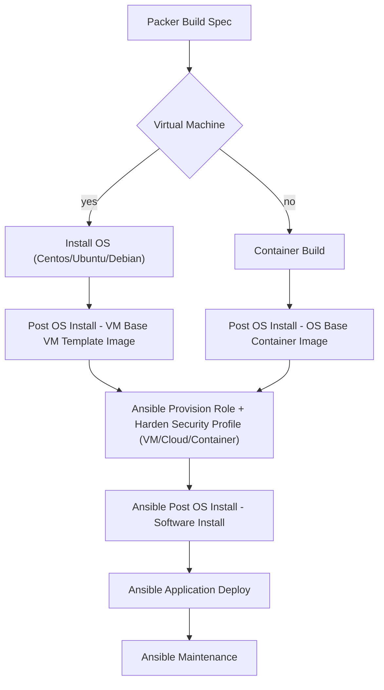

[](LICENSE)

# ansible-datacenter

This repository includes a `site.yml` ansible playbook that will configure a datacenter based on multi-OS-platform roles on Ubuntu/Centos/Debian linux and windows servers.

The [bootstrap_vm_template.yml](./bootstrap_vm_template.yml) playbook is used by [vm-templates repo](https://github.com/lj020326/vm-templates) to build VMware Ubuntu, Debian, and Centos templates. 

The 'ansible' and 'vm template build' pipelines are both automated using the [pipeline-automation-lib](https://github.com/lj020326/pipeline-automation-lib/) jenkins library.

## CI Status

[](https://github.com/lj020326/ansible-datacenter/actions/workflows/verify_all_green.yml)

## Linux OS Platform Molecule Tests

Testing of the linux OS bootstrap playbooks is performed by molecule with platforms defined in ['molecule.yml'](molecule/default/molecule.yml) and the ['converge.yml'](molecule/default/converge.yml).  Molecule scenarios have been set up to include the overall platform provisioning/orchestration role converge playbook for [bootstrap_linux](./molecule/bootstrap_linux/converge.yml) as well as multiple key roles invoked within the `bootstrap_linux` orchestration role to allow/enable isolated/granular testing when and as needed.

Further details on running molecule tests from this repo can be found in the 'Run molecule tests' section of the [molecule/README.md](tests/README.md).

The molecule test pipeline is set up in the github action [workflows](.github/workflows) and the molecule converge test results for each platform can be viewed on [github actions results page](https://github.com/lj020326/ansible-datacenter/actions).

The systemd-python enabled docker images used by the molecule tests can be found on [dockerhub](https://hub.docker.com/repositories/lj020326?search=systemd).  The corresponding dockerfile image definitions for the systemd-python enabled docker platform containers used in the molecule tests can be found [here](https://github.com/lj020326/systemd-python-dockerfiles).  

## Ansible Developer Environment

A companion [ansible-developer repository here](https://github.com/lj020326/ansible-developer) can be used to bootstrap/set-up an ansible development environment.

The installer shell script from this repo will:
1) create the local developer repo directory under $HOME/repos/ansible
2) clone the repo into the developer's local repo directory at $HOME/repos/ansible/ansible-developer
3) setup/synchronize the developer's bash environment with source bash files located in `files/scripts/bashenv`
4) source the bash env

For install from public github: 

```shell
$ INSTALL_REMOTE_SCRIPT="https://raw.githubusercontent.com/lj020326/ansible-developer/main/install.sh" && bash -c "$(curl -fsSL ${INSTALL_REMOTE_SCRIPT})"
```

The environment setup from the aforementioned repo is utilized to prepare the developer environment to:
1) run playbooks
2) run molecule testing 

## Summary

- Collection of Ansible roles, playbooks, plugins, and modules
- OS image build systems (packer, vsphere)
- Runtime environment software installs
- Runtime environment application deployments
- Runtime machine instance maintenance

### Example ansible image build workflow

> Workflow for ansible provisioning integration with image build systems


```mermaid
graph TD;
    A[Packer Build Spec] --> B{Virtual Machine}
    B -->|yes| C["Install OS (Centos/Ubuntu/Debian)"]
    B -->|no| D[Container Build]
    C --> E[Post OS Install - VM Base VM Template Image]
    D --> F[Post OS Install - OS Base Container Image]
    E --> G["Ansible Provision Role + Harden Security Profile (VM/Cloud/Container)"]
    F --> G["Ansible Provision Role + Harden Security Profile (VM/Cloud/Container)"]
    G --> H["Ansible Post OS Install - Software Install"]
    H --> I[Ansible Application Deploy]
    I --> J[Ansible Maintenance]

```


## Prerequisites

1.  Clone this Ansible deployment playbook
```
git clone https://github.com/lj020326/ansible-datacenter.git
```

2. Setup galaxy collections/roles to be used: *This is internally performed by script if using to run on remote ansible/control node

```
## install collections
ansible-galaxy collection install -r ./collections/requirements.yml

## install roles
ansible-galaxy install -r ./roles/requirements.yml
```

3. Add host info to hosts.yml inventory and ping the nodes

```shell
ansible -i inventory/hosts.yml all -m ping -b -vvvv
```

4. Create the vault file used to protect important data in source control.
    For more information go [here](http://docs.ansible.com/playbooks_vault.html).
    Also, [see here for an example of the vault file used for this project](vars/README.md) 

    The vault file used has to have the name vars/vault.yml. 
    ```shell
    # create private file
    ansible-vault create vars/vault.yml
    ```

    Running the command above will ask you for a password to encrypt with, and open an editor. In that file set the variables highlighted in the vault.yml.example file.

## Jenkins Ansible Jobs

The orchestration and execution of the datacenter site playbook tags can be managed via Jenkins pipelines. Detailed instructions on job configuration, parameter initialization, and command-line wrappers for Jenkins-led execution can be found in the documentation link below:

* **[Jenkins Operations & Job Control](./docs/jenkins-ansible-jobs.md)**

## Running Ansible Site Plays

Detailed instructions on how to run and test the `ansible-datacenter` site plays can be found in the documentation link below:

* **[Running Ansible Site Plays](./docs/ansible-site-plays.md)**

## Contact

[](https://www.linkedin.com/in/leejjohnson/)
