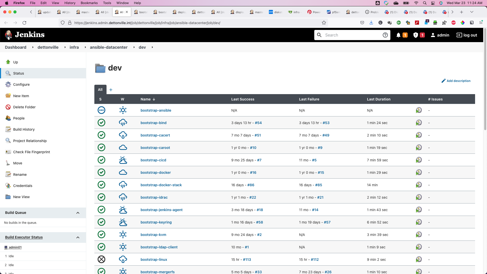
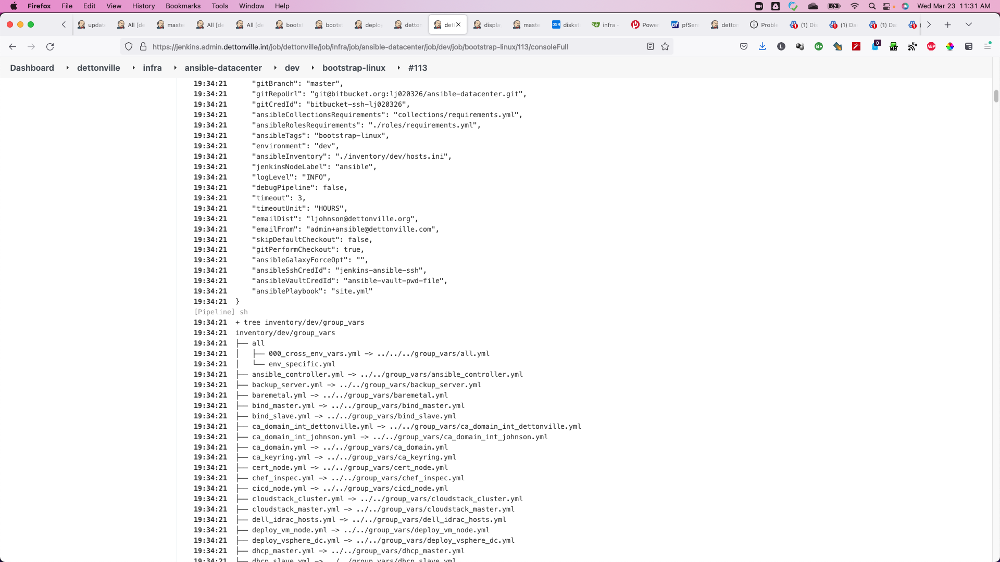

# ansible-datacenter

[](https://github.com/lj020326/ansible-datacenter/actions/workflows/ansible-lint.yml)
[](https://github.com/lj020326/ansible-datacenter/actions/workflows/inclusivity-lint.yml)
[](https://github.com/lj020326/ansible-datacenter/actions/workflows/yaml-lint.yml)
[](https://github.com/lj020326/ansible-datacenter/actions/workflows/molecule.yml)
[](LICENSE)

## Build Status

This is an ansible playbook that will configure your datacenter based on multi-OS-platform roles on Ubuntu/Centos/Debian linux and windows servers.

The [bootstrap_vm_template.yml](./bootstrap_vm_template.yml) playbook is used by [vm-templates repo](https://github.com/lj020326/vm-templates) to build VMware Ubuntu, Debian, and Centos templates. 

The 'ansible' and 'vm template build' pipelines are both automated using the [pipeline-automation-lib](https://github.com/lj020326/pipeline-automation-lib/) jenkins library.

## Linux OS Platform Molecule Tests

Testing of the linux OS bootstrap playbooks is performed by molecule with platforms defined in ['molecule.yml'](molecule/default/molecule.yml) and the ['converge.yml'](molecule/default/converge.yml).  Molecule scenarios have been set up to include the overall platform provisioning/orchestration role converge playbook for [bootstrap_linux](./molecule/bootstrap_linux/converge.yml) as well as multiple key roles invoked within the `bootstrap_linux` orchestration role to allow/enable isolated/granular testing when and as needed.

Further details on running molecule tests from this repo can be found in the 'Run molecule tests' section of the [molecule/README.md](tests/README.md).

The molecule test pipeline is set up in the github actions [ci.yml](.github/workflows/ci.yml) and the molecule converge test results for each platform can be viewed on [github actions results page](https://github.com/lj020326/ansible-datacenter/actions).

The systemd-python enabled docker images used by the molecule tests can be found on [dockerhub](https://hub.docker.com/repositories/lj020326?search=systemd).  The corresponding dockerfile image definitions for the systemd-python enabled docker platform containers used in the molecule tests can be found [here](https://github.com/lj020326/systemd-python-dockerfiles).  

## Ansible Developer Environment

A companion [ansible-developer repository here](https://github.com/lj020326/ansible-developer) can be used to bootstrap/set-up an ansible development environment.

The installer shell script from this repo will:
1) create the local developer repo directory under $HOME/repos/ansible
2) clone the repo into the developer's local repo directory at $HOME/repos/ansible/ansible-developer
3) setup/synchronize the developer's bash environment with source bash files located in `files/scripts/bashenv`
4) source the bash env

For install from public github: 

```shell
$ INSTALL_REMOTE_SCRIPT="https://raw.githubusercontent.com/lj020326/ansible-developer/main/install.sh" && bash -c "$(curl -fsSL ${INSTALL_REMOTE_SCRIPT})"
```

The environment setup from the aforementioned repo is utilized to prepare the developer environment to:
1) run playbooks
2) run molecule testing 

## Summary

- Collection of Ansible roles, playbooks, plugins, and modules
- OS image build systems (packer, vsphere)
- Runtime environment software installs
- Runtime environment application deployments
- Runtime machine instance maintenance

### Example ansible image build workflow

> Workflow for ansible provisioning integration with image build systems


## Prerequisites

1.  Clone this Ansible deployment playbook
```
git clone https://github.com/lj020326/ansible-datacenter.git
```

2. Setup galaxy collections/roles to be used: *This is internally performed by script if using to run on remote ansible/control node

```
## install collections
ansible-galaxy collection install -r ./collections/requirements.yml

## install roles
ansible-galaxy install -r ./roles/requirements.yml
```

3. Add host info to hosts.yml inventory and ping the nodes

```shell
ansible -i inventory/hosts.yml all -m ping -b -vvvv
```

4. Create the vault file used to protect important data in source control.
    For more information go [here](http://docs.ansible.com/playbooks_vault.html).
    Also, [see here for an example of the vault file used for this project](vars/README.md) 

    The vault file used has to have the name vars/vault.yml. 
    ```shell
    # create private file
    ansible-vault create vars/vault.yml
    ```

    Running the command above will ask you for a password to encrypt with, and open an editor. In that file set the variables highlighted in the vault.yml.example file.


## Jenkins Ansible Jobs

### Ansible role to setup docker jenkins control node

An ansible role is used to setup all docker stack instances.

The `bootstrap_docker_stack` ansible role used to stand up the docker stack [can be found here](https://github.com/lj020326/ansible-datacenter/tree/main/roles/bootstrap_docker_stack).

The [`bootstrap_docker_stack` ansible role](https://github.com/lj020326/ansible-datacenter/tree/main/roles/bootstrap_docker_stack) contains the [__jenkins config-as-code (jcac) yaml definition__](https://github.com/lj020326/ansible-datacenter/blob/main/roles/bootstrap_docker_stack/templates/jenkins_jcac/jenkins_casc.yml.j2) in template form used to setup the jenkins jcac instance.

[The jcac definition can be found here](https://github.com/lj020326/ansible-datacenter/blob/main/roles/bootstrap_docker_stack/templates/jenkins_jcac/jenkins_casc.yml.j2).  


### Setup pipeline automation library used by all jenkins jobs

The pipeline automation library used can be found [here](https://github.com/lj020326/pipeline-automation-lib).
[The pipeline automation library](https://github.com/lj020326/pipeline-automation-lib) defines the shared jenkins templates that are used throughout all of the jenkins ansible pipelines.  

Configure the library in jenkins as seen below.


### Site Root folder

A root folder for the ansible-datacenter environment can be setup similar to the following.


### Ansible Vault file credential

Setup the ansible vault file credential to be used by the ansible playbook pipeline and passed into every play.
If using the aforementioned [pipeline-automation-library](https://github.com/lj020326/pipeline-automation-lib), make sure the credential ID is 'ansible-vault-pwd-file'.


### Inventory Environment folders

Then setup folders for each environment defined in the inventory similar to the following.


### Jenkins Pipelines to run Ansible tags

Each job folder corresponds to a tag defined in the site.yml playbook.


To make setting up each folder consistent and simple as possible, the jobs all are exactly the same except the folder name.
The job folders all use the same pipeline definition as seen below.  Using this method, whenever a new ansible tag is created, adding a corresponding jenkins job folder is as easy as copying an existing one and naming it respectively to match the newly created ansible tag. 


### Ansible Pipeline Parameters

All jobs use the same 2 parameters for the limit hosts directive and debug.


### Run for defined site.yml tags

The job history for the tag execution is readily/easily viewable.


Here is the bootstraps linux job history.


Specify host(s) or leave blank to run across all hosts for the group(s) defined for the play(s) associated with the tag.


See the job console for all ansible pipeline input values and play output.


The [pipeline job console output](./docs/img/screenshots/ansible-datacenter-3d-bootstrap-linux-console.md).

Another job just created to bootstrap docker stacks onto machines.


## Ansible Role Development Pipelines

### Role Development Root Folder

Setup root folder.


### Role Development Root Folder

Setup jenkins CICD pipeline folders for each repository.


The jenkins CICD branch strategy folder is used to automatically pick up the respective branches and merge strategy.
We are using a clone of the [public ansible repo here](https://github.com/lj020326/ansible-configvars-examples). 
Once the pipeline is configured with the repo, jenkins will scan the repo branches for the existance of the Jenkinsfile and then setup the corresponding branch folders used to run ansible for each branch.


## Run tests from ansible control node

```
echo "foobarpass" > ~/.vault_pass
chmod 600 ~/.vault_pass
ansible-playbook report-windows-facts.yml -i inventory/DEV/hosts.yml -t untagged,report-windows-facts --vault-password-file ~/.vault_pass
```

## Run molecule tests

```shell
$ git clone https://github.com/lj020326/ansible-datacenter.git
$ cd ansible-datacenter
$ export MOLECULE_IMAGE_LABEL=redhat7-systemd-python
$ molecule login
$ molecule --debug test -s bootstrap_linux_package
$ molecule destroy
$ MOLECULE_IMAGE_LABEL=redhat8-systemd-python molecule --debug test -s bootstrap_linux_package
$ MOLECULE_IMAGE_LABEL=redhat8-systemd-python molecule login
$ molecule destroy
$ MOLECULE_IMAGE_LABEL=redhat8-systemd-python molecule converge
$ molecule destroy
$ MOLECULE_IMAGE_LABEL=centos8-systemd-python molecule --debug converge
$ molecule destroy
$ MOLECULE_IMAGE_LABEL=ubuntu2204-systemd-python molecule --debug converge

```

### To log into molecule created container

```shell
$ MOLECULE_IMAGE_LABEL=redhat8-systemd-python molecule create
$ MOLECULE_IMAGE_LABEL=redhat8-systemd-python molecule login
$ molecule destroy
```

## Other useful 

### To run/debug the VM template create playbook on packer created VM

```shell
# find the temp dir used for the ansible-local provisioner from the packer log 
$ cd /tmp/packer-provisioner-ansible-local/63b193ab-d1c4-b355-f4cf-9e9153570896
$ ansible-playbook bootstrap_vm_template.yml --vault-password-file=~/.vault_pass -c local -i vm_template.yml
```

### To run play on a group

```shell
$ ansible-playbook site.yml --tags bootstrap --limit dc_os_Ubuntu
```

### To build ansible control node

```shell
$ ansible-playbook site.yml --tags bootstrap-ansible --limit admin02
```

### To build docker images from source repos
Note: this is performed from jenkins docker build pipeline and not performed directly using ansible unless necessary 
The docker image build pipeline source is located here [here](https://github.com/lj020326/pipeline-automation-lib/blob/main/vars/buildDockerImage.groovy).

```shell
$ ansible-playbook site.yml --tags bootstrap-docker-images --limit admin02
```

### To setup/configure samba server node
Note: We now use the samba docker container to run the samba server and no longer build on the VM.

```shell
$ ansible-playbook site.yml --tags docker-samba-node
```

### To configure samba client node

```shell
$ ansible-playbook site.yml --tags bootstrap-samba-client
```

### To setup/configure linux users

```shell
$ ansible-playbook site.yml --tags bootstrap-user --vault-password-file ~/.vault_pass
```

### Using run-playbook.sh launch script

```shell
$ run-playbook.sh site.yml -t bootstrap-docker-stack -l admin01
$ run-playbook.sh bootstrap-ntp.yml -l testgroup_lnx
```

### To setup/configure iscsi client node

```shell
$ ansible-playbook site.yml --tags iscsi-client
```

## working with openstack deploy node setup

```shell
ansible -i inventory/hosts.yml openstack -m ping
ansible -i inventory/hosts-openstack.ini openstack -m ping

ansible-playbook site.yml --tags bootstrap-linux --limit os_linux
ansible-playbook site.yml --tags bootstrap-linux-firewalld --limit vmub2201
ansible-playbook site.yml --tags bootstrap-docker --limit docker
ansible-playbook site.yml --tags bootstrap-network --limit node01
ansible-playbook site.yml --tags bootstrap-openstack
ansible-playbook site.yml --tags bootstrap-openstack-deploy-node
ansible-playbook site.yml --tags bootstrap-user --limit ubuntu18
ansible-playbook site.yml --tags openstack-deploy-node
ansible-playbook site.yml --tags openstack-osclient

kolla-ansible -v -i inventory/hosts-openstack.ini bootstrap-servers
kolla-ansible -v -i inventory/hosts-openstack.ini prechecks
kolla-ansible -v -i inventory/hosts-openstack.ini deploy
kolla-ansible -v -i inventory/hosts-openstack.ini post-deploy

```


working with openstack node cleanup/destroy/reset

```shell
kolla-ansible -v -i inventory/hosts-openstack.ini destroy
kolla-ansible -v -i inventory/hosts-openstack.ini destroy --yes-i-really-really-mean-it

```

working with openstack env setup

```shell
scripts/kolla-ansible/init-runonce.sh
ansible-playbook site.yml --tags bootstrap-openstack-cloud
openstack server create --image cirros --flavor m1.tiny --key-name mykey --network demo-net demo1

```


Other useful plays
```shell
ansible-playbook site.yml --tags bootstrap-linux-mounts --limit os_linux
ansible-playbook site.yml --tags bootstrap-linux-mounts --limit dc_os_centos_7
ansible-playbook site.yml --tags bootstrap-linux-mounts --limit postgres
ansible-playbook site.yml --tags bootstrap-linux-mounts --limit media
ansible-playbook site.yml --tags bootstrap-openstack
ansible-playbook site.yml --tags bootstrap-openstack-cloud
ansible-playbook site.yml --tags bootstrap-openstack-deploy-node
```

Openstack plays
```shell
#ansible-playbook site.yml --tags openstack-deploy-node
ansible-playbook site.yml --tags bootstrap-openstack
kolla-ansible -i inventory/hosts-openstack.ini bootstrap-servers
kolla-ansible -i inventory/hosts-openstack.ini prechecks
kolla-ansible -i inventory/hosts-openstack.ini deploy

## running post-deploy creates the /etc/kolla/openrc.sh
## ref: https://github.com/lj020326/kolla-ansible/blob/main/ansible/post-deploy.yml
kolla-ansible -i inventory/hosts-openstack.ini post-deploy

## setup osclient configs if necessary
## NOTE: not necessary to run this since it is included in bootstrap-openstack-cloud play
#ansible-playbook site.yml --tags openstack-osclient

openstack image list
openstack service list
openstack network list
openstack router list
openstack server list
openstack compute service list
openstack dns service list
openstack zone list

## if the above works - then can run custom cloud config
ansible-playbook site.yml --tags bootstrap-openstack-cloud

## to reconfigure kolla-ansible configure based on latest changes
kolla-ansible -i inventory/hosts-openstack.ini reconfigure

## to reconfigure a specific service, e.g., nova, neutron, etc
kolla-ansible -i inventory/hosts-openstack.ini reconfigure --tags nova
docker ps -f name=compute

kolla-ansible -i inventory/hosts-openstack.ini reconfigure --tags neutron
docker ps -f name=neutron

kolla-ansible -i inventory/hosts-openstack.ini reconfigure --tags designate
docker ps -f name=designate

#openstack zone create --email admin@openstack.example.int openstack.example.int.
openstack zone create --email admin@example.int openstack.example.int.


## or per (https://ask.openstack.org/en/question/113699/kolla-ansible-how-to-managemodify-configuration-files/)
kolla-ansible -i inventory/hosts-openstack.ini genconfig ## (and restart manually the containers)

./inventory/openstack_inventory.py --list

## to destroy/reset everything back to the beginning for the inventory:
kolla-ansible -i inventory/hosts-openstack.ini destroy --yes-i-really-really-mean-it

```

Other useful tests

```shell
ansible -u administrator -e ansible_password=${ANSIBLE_SSH_PASSWORD} -m ping ubuntu18
ansible -v -u administrator -e ansible_password=${ANSIBLE_SSH_PASSWORD} -e ansible_pyth/bin/python3 -i inventory/hosts.yml -m ping ubuntu18
```


```shell
ansible-playbook site.yml --tags display-vars -l control01
ansible-playbook site.yml --tags display-domain-vars -l os_linux
ansible-playbook site.yml --tags display-domain-vars -l nas02
ansible-playbook site.yml --tags display-domain-vars -l control01
ansible all -m debug -a var=groups['ca_domain']

ansible-playbook site.yml --tags bootstrap-bind
ansible-playbook site.yml --tags bootstrap-cacerts
ansible-playbook site.yml --tags deploy-cacerts
ansible-playbook site.yml --tags docker-control-node
ansible-playbook site.yml --tags docker-admin-node
ansible-playbook site.yml --tags docker-media-node
gethist | grep remote | uniq >> ./README.md 
```


## Command Line Usage

### Display/Debug any vars

```shell
ansible-config dump
ansible-config dump |grep DEFAULT_MODULE_PATH

ansible-inventory --graph output -i inventory/
ansible-inventory --graph output -i inventory/ ntp
ansible-inventory --graph output -i inventory/ ntp_server
ansible-inventory --graph output -i inventory/DEV/
ansible-inventory --graph output -i inventory/PROD/ ntp
ansible-inventory -i inventory/ --graph ntp
ansible-inventory -i inventory/DEV/ --graph ntp
ansible-inventory -i inventory/QA/ --graph output
ansible-inventory -i inventory/PROD/ --graph output group
ansible-inventory -i inventory/PROD/ --graph output ntp
ansible-inventory -i inventory/PROD/ --list ntp
ansible-inventory -i inventory/PROD/ntp.yml --graph output
ansible-inventory -i inventory/DEV/site1.yml --graph output

ansible-playbook -i ./inventory display-ntp-servers.yml 
ansible-playbook -i ./inventory/ display-ntp-servers.yml
ansible-playbook -i ./inventory/ playbook.yml
ansible-playbook -i ./inventory/dmz display-ntp-servers.yml 
ansible-playbook -i ./inventory/internal display-ntp-servers.yml
ansible-playbook -i ./inventory/internal display-ntp-servers.yml 

ansible all -m debug -a var=groups['ca_domain']
ansible -i inventory/DEV/hosts.yml  windows -m debug -a var=ansible_port
ansible -i inventory/DEV/hosts.yml  windows -m debug -a var=ansible_winrm_transport
ansible -i inventory/DEV/hosts.yml  windows -m debug -a var=ansible_host,ansible_port
```


### Setup and Run the datacenter playbook roles

## Run playbooks

Run site-setup play:

`ansible-playbook site.yml`

Run site-setup play with a tag:

```
ansible-playbook site.yml --tags docker-media-node
```


Run plays for specific configuration needed

To run ansible commands from ansible/control node:

```shell
ansible -v -m ping
ansible -m ping ubuntu18
```

Run play for specific node:

```shell
ansible-playbook site.yml --tags display-hostvars --limit admin01
ansible-playbook site.yml --tags install-cacerts --limit media01
```


Run a play for a specific group of nodes:

```shell
ansible-playbook site.yml --tags install-cacerts --limit windows
ansible-playbook site.yml --tags install-cacerts --limit dc_os_ubuntu
ansible-playbook site.yml -t display-hostvars -l dc_os_centos
ansible-playbook site.yml -t display-hostvars -l docker
```

E.g., Run site setup play on control node with a tag from windows/msys shell.

```
ansible-playbook site.yml --tags bootstrap-ansible
ansible-playbook site.yml --tags bootstrap-bind
ansible-playbook site.yml --tags bootstrap-cacert
ansible-playbook site.yml --tags bootstrap-caroot
ansible-playbook site.yml --tags bootstrap-cicd
ansible-playbook site.yml --tags bootstrap-docker-stack
ansible-playbook site.yml --tags bootstrap-idrac
ansible-playbook site.yml --tags bootstrap-jenkins-agent
ansible-playbook site.yml --tags bootstrap-keyring
ansible-playbook site.yml --tags bootstrap-kvm
ansible-playbook site.yml --tags bootstrap-ldap-client
ansible-playbook site.yml --tags bootstrap-linux
ansible-playbook site.yml --tags bootstrap-linux-core
ansible-playbook site.yml --tags bootstrap-docker
ansible-playbook site.yml --tags bootstrap-linux-firewalld
ansible-playbook site.yml --tags configure-linux-firewall
ansible-playbook site.yml --tags bootstrap-mergerfs
ansible-playbook site.yml --tags bootstrap-ntp
ansible-playbook site.yml --tags bootstrap-openstack
ansible-playbook site.yml --tags bootstrap-openstack-cloud
ansible-playbook site.yml --tags bootstrap-postfix
ansible-playbook site.yml --tags bootstrap-proxmox
ansible-playbook site.yml --tags bootstrap-stepcli
ansible-playbook site.yml --tags bootstrap-user
ansible-playbook site.yml --tags bootstrap-vmware-esxi
ansible-playbook site.yml --tags build-docker-images
ansible-playbook site.yml --tags deploy-cacerts
ansible-playbook site.yml --tags deploy-vm
ansible-playbook site.yml --tags deploy-vsphere-dc
ansible-playbook site.yml --tags display-hostvars
ansible-playbook site.yml --tags docker-admin-node
ansible-playbook site.yml --tags docker-control-node
ansible-playbook site.yml --tags docker-media-node
ansible-playbook site.yml --tags docker-samba-node
ansible-playbook site.yml --tags deploy-nfs-service
ansible-playbook site.yml --tags vmware-remount-datastores
ansible-playbook site.yml --tags upgrade-vmware-esxi
```

Setup vsphere dc
```shell
ansible-playbook site.yml --tags deploy-vsphere-dc
```

Deploy VMs
```shell
ansible-playbook site.yml --tags deploy-vm
```

Bootstrap VM nodes if needed
Note: This is not used any longer since this is now performed from the jenkins pipeline.
The jenkins pipeline is responsible for building VM template images using packer.
The vm image build pipeline source is located here [here](https://github.com/lj020326/pipeline-automation-lib/blob/main/vars/buildVmTemplate.groovy).

```shell
ansible-playbook site.yml --tags bootstrap-linux --limit admin02
```

Bootstrap node network config *should not be necessary since this is mostly done in deploy-vm
```shell
ansible-playbook site.yml --tags bootstrap-network --limit node01
```

Docker stack plays
```shell
ansible-playbook site.yml --tags docker-admin-node
ansible-playbook site.yml --tags docker-media-node
```

Useful `site.yml` tag based plays to build/update/configure datacenter:

```shell
ansible-playbook site.yml --tags bootstrap-bind
ansible-playbook site.yml --tags bootstrap-docker
ansible-playbook site.yml --tags bootstrap-linux-core
ansible-playbook site.yml --tags bootstrap-docker
ansible-playbook site.yml --tags bootstrap-linux-firewalld
ansible-playbook site.yml --tags bootstrap-openstack
ansible-playbook site.yml --tags bootstrap-openstack-cloud
ansible-playbook site.yml --tags bootstrap-user
ansible-playbook site.yml --tags bootstrap-vmware-esxi
ansible-playbook site.yml --tags build-docker-images
ansible-playbook site.yml --tags cacerts-deploy
ansible-playbook site.yml --tags deploy-vm
ansible-playbook site.yml --tags deploy-vsphere-dc
ansible-playbook site.yml --tags display-hostvars
ansible-playbook site.yml --tags docker-admin-node
ansible-playbook site.yml --tags docker-media-node
ansible-playbook site.yml --tags fetch-osimages
ansible-playbook site.yml --tags iscsi-client
ansible-playbook site.yml --tags nfs-service
ansible-playbook site.yml --tags vmware-remount-datastores
ansible-playbook site.yml --tags upgrade-vmware-esxi
```

Example inventory checks
```shell
ansible -v all --list-hosts
ansible -i ./inventory/PROD/hosts.yml -m debug -a var=cacert_keystore_host admin03
ansible -i ./inventory/PROD/hosts.yml -m debug -a var=jenkins_swarm_agent_controller admin01
ansible -i ./inventory/PROD/hosts.yml -m debug -a var=jenkins_swarm_agent_labels admin01
ansible -i ./inventory/PROD/hosts.yml -m debug -a var=jenkins_swarm_agent_controller admin01
ansible -i inventory/ -m debug -a var=service_route_internal_root_domain vcontrol01
ansible -i inventory/ -m debug -a var=ca_domain vcontrol01
ansible -i inventory/ -m debug -a var=service_route_internal_root_domain vcontrol01
ansible -i inventory/hosts.yml -m debug -a var=ca_domain vcontrol01
ansible -i inventory/hosts.yml -m debug -a var=group_names admin01
ansible -i inventory/hosts.yml -m debug -a var=internal_root_domain vcontrol01
ansible -i inventory/hosts.yml -m debug -a var=jenkins_swarm_agent_controller admin01
ansible -i inventory/hosts.yml -m debug -a var=service_route_internal_root_domain vcontrol01
ansible -i inventory/PROD/ -m debug -a var=ansible_host vcenter7
ansible -i inventory/PROD/ -m debug -a var=bootstrap_docker__script_dirs admin03
ansible -i inventory/PROD/ -m debug -a var=bootstrap_docker__swarm_managers admin03
ansible -i inventory/PROD/ -m debug -a var=bootstrap_docker__swarm_remote_addrs admin03
ansible -i inventory/PROD/ -m debug -a var=ca_domain admin01
ansible -i inventory/PROD/ -m debug -a var=ca_domain vcontrol01
ansible -i inventory/PROD/ -m debug -a var=docker_stack_internal_domain admin03
ansible -i inventory/PROD/ -m debug -a var=docker_stack_internal_root_domain admin03
ansible -i inventory/PROD/ -m debug -a var=group_names admin01
ansible -i inventory/PROD/ -m debug -a var=group_names vcenter7
ansible -i inventory/PROD/ -m debug -a var=group_names vcontrol01
ansible -i inventory/PROD/ -m debug -a var=internal_domain vcenter7
ansible -i inventory/PROD/ -m debug -a var=internal_domain vcontrol01
ansible -i inventory/PROD/ -m debug -a var=internal_root_domain vcenter7
ansible -i inventory/PROD/ -m debug -a var=internal_subdomain vcontrol01
ansible -i inventory/PROD/ -m debug -a var=service_route_internal_root_domain admin01
ansible -i inventory/PROD/hosts.yml -m debug -a var=jenkins_swarm_agent_controller admin01
ansible-inventory --help
ansible-inventory -h
ansible-inventory -i ./inventory/PROD/hosts.yml --graph 
ansible-inventory -i inventory/PROD/ --graph vmware_vcenter
```

Example test playbook runs
```shell
runme.sh site.yml -t deploy-cacerts -l admin01
runme.sh bootstrap-pip.yml -l admin01
runme.sh -vvv bootstrap-docker.yml -l admin01
runme.sh bootstrap-docker-stack.yml -l docker_stack_jenkins_jcac
runme.sh bootstrap-jenkins-agent.yml -l admin01
```

### Using run-ansible.sh launch script for jump hosts

Using the run-ansible.sh script to automatically first install all dependencies then run the command

A [run-ansible.sh script](run-ansible.sh) is available that will upon execution always (1) check and create a virtualenv named 'venv' if not already exists, (2) install [pip library requirements](./requirements.txt), (3) install [collection requirements](collections/requirements.yml), (4) install [role requirements](roles/requirements.yml) and (5) run the command specified.  It also checks in the latest code via git Add/Commit/Push (ACP) before the steps just mentioned.  Finally, it also allows specification of a control/jump host to run the playbook via ssh wrapper.  

```shell
run-ansible.sh ansible-playbook -i inventory/PROD/hosts.yml site.yml --tags bootstrap-ansible-user -l control01
run-ansible.sh ansible-playbook -i inventory/PROD/hosts.yml site.yml --tags bootstrap-ansible-user -l media01
run-ansible.sh ansible-playbook -i inventory/PROD/hosts.yml site.yml --tags bootstrap-docker-stack -l media01
run-ansible.sh ansible-playbook -i inventory/PROD/hosts.yml site.yml --tags bootstrap-linux -l control01
run-ansible.sh ansible-playbook -i inventory/PROD/hosts.yml site.yml --tags bootstrap-linux -l media01
run-ansible.sh ansible-playbook -i inventory/PROD/hosts.yml site.yml --tags bootstrap-mounts -l media01
run-ansible.sh ansible-playbook -i inventory/PROD/hosts.yml site.yml --tags bootstrap-registry -l media01
run-ansible.sh ansible-playbook -i inventory/PROD/hosts.yml site.yml --tags bootstrap-user -l control01
run-ansible.sh ansible-playbook -i inventory/PROD/hosts.yml site.yml --tags bootstrap-user -l media01

```

## Contact

[](https://www.linkedin.com/in/leejjohnson/)

## Reference
