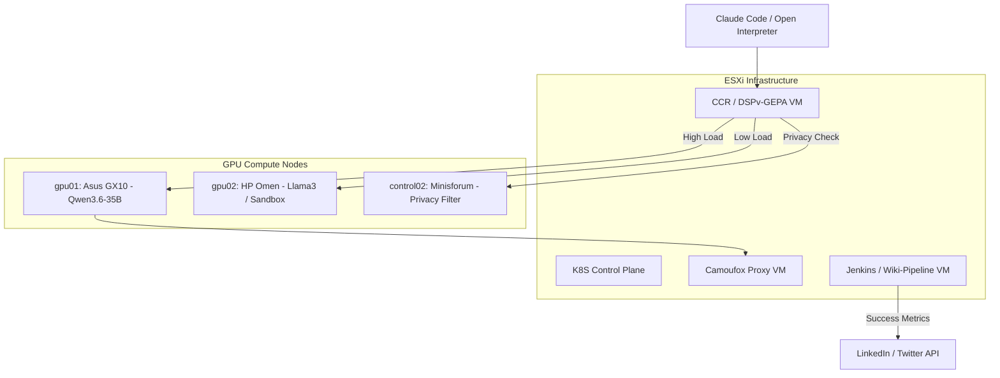

# **TODO Items & Roadmap (2026)**

---

## **Phase 1: Infrastructure Consolidation (VMware & Kubernetes)**

Transitioning from standalone Docker to a multi-node Kubernetes cluster allows for better resource distribution between your Supermicro servers and GPU hosts.

* **Kubernetes Control Plane:** Deploy a 3-node High Availability (HA) control plane across `esx00`, `esx01`, and `esx02` using Ubuntu 24.04 VMs.
* **Offloading Services to Ubuntu VMs:** Deploy the following non-GPU services as VMs on the ESXi cluster to maximize GPU availability:
    * **Jenkins & Wiki-Pipeline:** Move the aggregation engine and CI/CD logic to a dedicated VM on `esx03` (utilizing the SSD datastore for faster builds).
    * **Prometheus/Grafana Stack:** Host monitoring on `esx01` to track performance without consuming GPU host CPU.
    * **HashiCorp Vault:** Maintain security credentials on a hardened VM in the ESXi cluster.
* **Refactor `control02`:** Reinstall as a Kubernetes worker node. Its RTX 4060 can be used for lightweight tasks like the **Qwen-7B Privacy Filter** or **NemoClaw Sandbox**.

## **Phase 2: High-Performance Inference (vLLM & Aibrix)**

Treating the GPU inventory as a specialized "Compute Pool" within the Kubernetes cluster.

* **vLLM Cluster:** Use `gpu01` (GX10) for **Qwen3.6-35B** and `gpu02` (RTX 3090) for **Llama3** or **Codex**.
* **Aibrix Integration:** Deploy the Aibrix control plane on the ESXi-hosted Kubernetes workers to manage routing and prefix-cache awareness across all GPUs.
* **Ansible Automation:**
    * `deploy_vm`: Automates Ubuntu VM creation on ESXi via the VMware module.
    * `bootstrap_k8s_worker`: Joins `gpu01`, `gpu02`, and `control02` to the cluster as GPU-enabled nodes.

## **Phase 3: Agentic Stack & Routing**
Implementing the "OwnYourAI" pattern with long-lived, stateful agents.

* **Agent Sandbox (SIG Apps):** Deploy the **Sandbox CRD** to manage long-running agents. Use a **SandboxWarmPool** to eliminate cold starts for Claude Code interactions.
* **Routing & Proxy:** * Host the **CCR/DSPv-GEPA Router** and the **Playwright/Camoufox Proxy** on Ubuntu VMs within the ESXi cluster to save GPU host memory.
* **AgentFS:** Provide Claude Code with secure access to the `ansible-datacenter` filesystem via a mounted PersistentVolume (PV) from your Synology NAS.

## **Phase 4: The "Success-to-Social" Automation Pipeline**

Leverage your **wiki-pipeline** logic to automate personal branding and documentation.

- **Aggregation Engine:** A weekly Jenkins job that triggers a Python script to scan recent commits in `ansible-datacenter` and summarize **Molecule** test results.
- **Privacy Filter Layer:** Route all generated summaries through a local **Qwen-7B** instance wrapped in OpenAI’s open-sourced **privacy-filter**. This ensures that sensitive information like internal IP addresses or private Vault keys are redacted before social posting.
- **Social Integration:** Use a "Human-in-the-Loop" approval step in Jenkins. Once approved, the pipeline pushes formatted updates to LinkedIn/Twitter via their respective APIs.

## **Phase 5: ML Platform Automation (Ref: Benjamin Tan Wei Hao)**

- **IDP Implementation:** Build an Internal Developer Platform that allows you to provision model-serving endpoints as easily as you currently provision VM templates.
- **Monitoring & Drift:** Integrate **Evidently** to monitor the performance of your local **Qwen** and **Codex** models against drift, utilizing your existing Prometheus/Grafana stack.

---

## **Immediate To-Do List**

| Priority     | Task                                                                | Target Host                | Tooling                  |
|:-------------|:--------------------------------------------------------------------|:---------------------------|:-------------------------|
| **Critical** | **K8s Control Plane:** Deploy HA Ubuntu 24.04 VMs                   | `esx00, esx01, esx02`      | VMware / Ansible         |
| **Critical** | **High-Compute Inference:** Deploy Qwen3.6-35B + Dflash + DDTree    | `gpu01`                    | vLLM / Aibrix            |
| **High**     | **Agent Routing Stack:** Deploy CCR / DSPv-GEPA Router              | `ai-services` VM (`esx03`) | Python / K8s             |
| **High**     | **Privacy & Redaction:** Deploy Qwen-7B Privacy Filter              | `control02`                | OpenAI Privacy-Filter    |
| **High**     | **Agent Proxy:** Deploy Camoufox + Playwright                       | `agent-proxy` VM (`esx03`) | Docker / K8s             |
| **Medium**   | **Wiki-Pipeline:** Automate Social Integration & Molecule summaries | `ai-services` VM (`esx03`) | Jenkins / Python         |
| **Medium**   | **Security Sandbox:** Set up NemoClaw / OpenClaw in SandboxWarmPool | `gpu02`                    | Agent Sandbox (SIG Apps) |
| **Low**      | **Observability:** Integrate Evidently with Prometheus/Grafana      | `esx01` VM                 | Prometheus / Evidently   |

---

### **Key Refactor Notes:**
* **Offloading:** The **Agent Router** and **Proxy** have been moved from `control02` to dedicated Ubuntu VMs (`ai-services` and `agent-proxy`) on your ESXi cluster to maximize the availability of the RTX 4060 for model-based privacy filtering.
* **K8s Integration:** All infrastructure tasks now prioritize the establishment of the Kubernetes control plane on your Supermicro hardware before joining the GPU nodes.
* **Model Update:** The inference target has been updated to **Qwen3.6-35B** to align with the Google Cookbook agent requirements on the GB10 hardware.

### **Infrastructure Logic Flow**

### **Recommended VM Allocation**

| VM Name | Host | Specs (vCPU/RAM) | Primary Role |
| :--- | :--- | :--- | :--- |
| `k8s-cp-01` | `esx00` | 4 / 16G | K8s Control Plane Node 1 |
| `k8s-cp-02` | `esx01` | 4 / 16G | K8s Control Plane Node 2 |
| `k8s-cp-03` | `esx02` | 4 / 16G | K8s Control Plane Node 3 |
| `ai-services` | `esx03` | 8 / 32G | Jenkins, Aibrix Controller, CCR Router |
| `agent-proxy` | `esx03` | 4 / 16G | Playwright / Camoufox Containers |

---

### **References & Supporting Info**
* **Hardware Logic:** Reserve the **128G RAM** on each ESXi host for high-density management VMs, keeping the **GX10 (GB10)** exclusively for inference throughput.
* **Security:** Deploy **Agent Sandbox** to run untrusted code in isolated, pre-warmed pods.
* **Reference:** [Kubernetes Agent Sandbox Project](https://kubernetes.io/blog/2026/03/20/running-agents-on-kubernetes-with-agent-sandbox/).

## Backlinks

- [Project Overview](/docs/project-overview.md)
- [Architecture Diagrams](/docs/architecture-diagrams.md)
