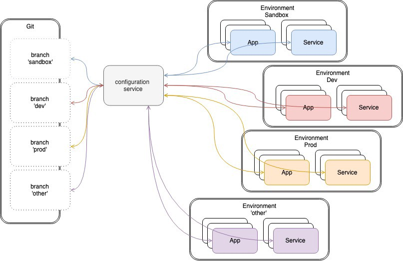
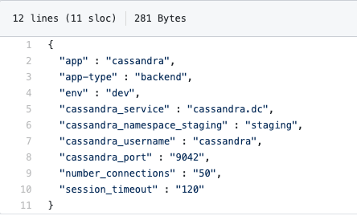
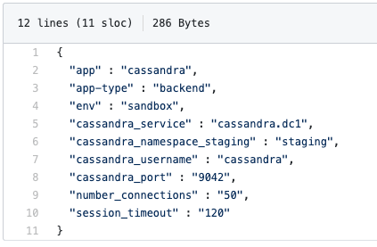
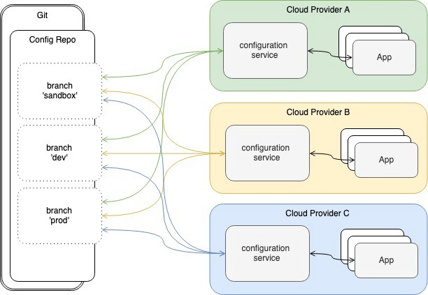

A common way of managing configurations for multiple environments (and clouds)
===

This article intended to share ideas and solutions to address some challenges related to Configuration Management, especially in the cloud environment. Hope you find this read helpful.

The approach described in this article was conceptualized a few years back, then implemented and used across many, many projects to build configuration management components for production-grade systems and applications.

## The Use Case

This problem is quite common and we have seen it over the years not only in cloud-based deployments and environments but also in the local type of deployments, similar to “3 blades in the rack next room”. This problem is applicable to any deployment with more than 1 environment in the picture, like DEV, QA, STG, PROD and so on.

And the problem is, as you probably have guessed, the configuration data and its management. Wiki talks about [Configuration Management](https://en.m.wikipedia.org/wiki/Configuration_management) in great length - CM planning and management, controls, status, so on and so forth, but I’m as architect and DevOps engineer always about the details (well, that’s where you-know-who is..) and about how to get this done in fastest and most efficient way.

So, let’s get to it...

When I refer to configuration data, I’m talking about different types of it:

-   Fetched once, used many times
-   Fetched every now and then, used many times
-   Fetched each time it is used

I’m not going to dive into details of what each type of configuration data looks like and it’s use cases — if you’re experienced engineer, chances are, you well familiar with these and if you’re not, [Google](http://google.com/) is here to help :)

At first, the problem arises when you start thinking how you’re going to manage the basic config parameters of your app or service, like a port number, a database connection string or your Consul DNS — I mean you can’t hardcode them! Okay, there are ways to solve that (config files, etc.). But, what happens if your app is containerized or runs in VMs? Meaning, in order to change one configuration param, you’d have to re-deploy the app. Or, if you change one thing in your app ecosystem it cascades into re-deploying other components as well — a bit costly, isn’t it? Now, as you go with the project, you add complexity to your solution you’d have to think about how to manage more and more configurations, something along the lines of having Hadoop cluster, plus Spark cluster with running jobs, plus the whole ecosystem of technologies to run Web services with load balancing and service discovery, plus, plus, plus… And, on top of that, you’d have CI/CD pipeline which has its own configurations. Now, multiply all this by the number of the environments you might have (i.e. `development`, `prod`, `staging`, `sandbox #1`, `sandbox #2`, `engineering`, etc.). And, if this is not enough, add futures like security and audit (who did what and when).

The most annoying part of all this, there is no single version of truth anymore — your configurations start drifting as you go through the lifecycle of the application or the system, and quite often you don’t have a clean record of what changed and by whom.

The complexity of CM takes a whole new level when we were delivering Analytical Projects — enabling Data Scientists to develop, train and deploy the models (sometimes quite complex) without having a bunch of engineers supporting them around the clock. In other words, the Analytical Platform has to be robust and stable, yet tailored for the needs of Data Scientists to avoid seeing 5–6 digit numbers on the cloud consumption bill.

At some point, I will have to find time to write the article to describe how we build open-source based, fully containerized and scalable Analytical Platform to manage the full lifecycle of Analytical Models (which saved hundreds of thousands of dollars per months on cloud costs for one of our clients… Really not kidding).

If all the above is not enough, we have come across the requirements from a few clients, to implement application or various components of it across multiple cloud platforms i.e. GCP + Azure + AWS, this implies CM at the cloud and application levels.

To sum it all up, we have identified the need for configuration data:

-   have a single version of the truth.
-   have a precise record of changes, along with a reference to what triggered the change (in other words, the audit trail).
-   implement separation of concerns i.e. applications should be busy implementing business logic, and not managing configs.
-   manage various complexities of configuration data, including nested configs.
-   as much cloud-agnostic as possible, hence support for application deployed across multiple cloud providers.
-   simplify and streamline deployment procedures.
-   all levels of config data — application, system, infrastructure, deployment, schedule, so on and so forth.

Phew...

## Is there a solution for all this?

Fortunately, yes. In this article, I’ll describe the solution we came up with to address the requirements above.

Solution highlights as follows

-   Centralized configuration service runs in HA capacity enabling config data users (clients) to retrieve it using the keys. Config service can be deployed as a container in stand-along node/machine or in Kubernetes cluster.
-   Configuration data retrieved by the means of API, in the form of key-value pares. For example, an application, to retrieve the Cassandra database port number, would make a REST call similar to

> `curl [http://config-service.mydomain/api/v1/cassandra/sandbox/cassandra_port](http://config-service.mydomain/api/v1/cassandra/sandbox/cassandra_port)`
> 
> Where `cassandra` is application configuration, `sandbox` is the environment and `cassandra_port` is config parameter-key.

-   Configuration data stored in JSON format and may take a form of flat layout or fairly complex and nested.
-   **We used Github service as a backend to store config data. For each deployed environment (dev, qa, etc), we have a corresponding Git branch.** Linkage between environments and branches is not limited to 1-to-1. As an example, you may have DEV environment referencing several branches: one for deployments, one for application A, one for infrastructure. Normally, the branches don’t get merged. This approach allows us to make changes to config data in one of the branches and the changes get propagated right away to apps and services running within given environment. Also, it makes super simple to track who and what changes were made. GitHub config data repo can be public or private. Also, instead of GitHub, one can use GitLab, GCP Source Control and so on.
-   By design, config service has pluggable architecture — we can plug it to any backend, like Consul, Cassandra or Git-compatible.
-   It makes easy integration with a secrets management backend, like HashiCorp Vault, Azure Key Vault and AWS KMS.

High-level sketch of config service architecture.



## How does it work exactly?

Let’s walk through an example in details to have a better understanding of the solution.

Let’s say we have an application that deployed in `sandbox` environment where we’re experimenting and in `dev` environment where we’re developing and testing it. The app needs to connect to the Cassandra database and do something and we have different Cassandra deployments for each environment. So, we would have 2 Git branches in config data repo: `dev` and `sandbox.`

In `dev` branch, `cassandra.json` file looks like this



In `sandbox` branch, `cassandra.json` file looks like this



Not much of difference, but the key `cassandra_service` contains different values — well, there are different deployments of Cassandra (`dev` and `sandbox`), and I need to make sure my app connects to Cassandra as the app gets deployed across the environments and does what it does.

Having said that, if we make a `curl` call as such: `curl [http://config-service.mydomain/api/v1/cassandra/sandbox/cassandra_service](http://config-service.mydomain/api/v1/cassandra/sandbox/cassandra_service.)`

It would return the value for the key `cassandra_service`for environment `sandbox` , which is `cassandra.dc1`

Same would happen if we make a call to the endpoint for `dev` environment (`[http://config-service.mydomain/api/v1/cassandra/dev/cassandra_service](http://config-service.mydomain/api/v1/cassandra/sandbox/cassandra_service.)`) and retrieve the value `cassandra.dc` for the same key.

Hence, your application uses the same keys to retrieve config data from config service that specific to the environment that it presently runs on — this makes it super easy to deploy the app to distinct environments. All you have to do it to set up a global environment variable ( this can be done at Jenkins level, in case of CI/CD) to identify the environment and pass it to `curl` call.

Quick `sh` snippet to demonstrate this point:

```
$ export ENV=sandbox$ echo $(curl http://config-service.mydomain/api/v1/cassandra/${ENV}/cassandra_service)cassandra.dc1$ export ENV=dev$ echo $(curl http://config-service.mydomain/api/v1/cassandra/${ENV}/cassandra_service)cassandra.dc
```

## Deploy many apps on many clouds, still, use same configs

In case you’d need to deploy multiple apps on more than one cloud provider, as it happened to me during one of the engagements, and you still like to maintain a single repository for all your config data needs, here’s a quick drawing of the deployment model.



Multi-cloud deployment model

Multi-cloud deployment model delivers consistency of how config data is managed and establishes a single version of the truth when it comes to configurations.

Whether you deploy config service in the container on Kubernetes, run it in a VM or run it locally on your laptop, you still connect to the same config backend (in this case git repo) hence it guarantees consistency of configurations across the board.

## Configuration service deployment

Quick note: please keep in mind that the deployment procedure described is very lightweight and intended to demonstrate functional points. Production grade deployment would look a bit more sophisticated.

First things first — before we deploy anything, we have to set up Git backend to host all our config data. I did set up [Git repo](https://github.com/lj020326/config-data) (lj020326/config-data) for demo purposes that contains multiple branches (dev, prod, sandbox) and a bunch of config data files.

Next, we’ll deploy config service on a local machine — all code and instructions on how to deploy locally and on Google Cloud Platform can be found [here](https://github.com/lj020326/service-config-data). If you feel like contributing to this work, feel free to drop me a line or open an issue in git. Any help and suggestions are highly appreciated :)

The first step is to check what config data we have committed on git backend. I’ll use `test.json` to demo execution of config service ([https://github.com/lj020326/config-data/blob/sandbox/test.json](https://github.com/lj020326/config-data/blob/sandbox/test.json))

```
{  "hello": "world"}
```

Install the main package and dependencies :

```
git clone https://github.com/lj020326/service-config-data
cd service-config-data
```

Setup GOPATH:

```
echo $GOPATHexport GOPATH=$GOPATH:$PWDecho $GOPATH
```

Make sure all dependencies are installed

```
make deps
```

At this point your directory should have the structure:

```
├── config-data  
├── pkg  
│ ├── darwin\_amd64  
│ └── dep  
│ └── sources  
└── service-config-data  
│ ├── github.com  
│ │ ├── lj020326  
│ │ │ └── service-common-lib  
│ │ ├── subosito  
│ │ └── tidwall  
│ ├── gitutil  
│ ├── handlers  
│ └── helpers  
├── vars-gcp.mk  
├── vars.mk  
└── watch.sh
```

Build `service-config-data` service binaries:

```
make build
```

To get service to run on your local machine (make sure docker is running):

```
make run
```

Now, test if the service runs correctly — open a new terminal window and run:

```
$ curl http://localhost:8000/api/v2/test/sandbox/helloworld
```

Service API allows an optional parameter specifying the output format (`?out`). For instance, to get config data in JSON format, run:

```
$ curl http://localhost:8000/api/v2/test/sandbox/hello?out=json"world"
```

## How to use config service

## `config-data` repository

Consider an example of the configuration file `[k8s-cluster.json](https://github.com/lj020326/config-data/blob/sandbox/k8s-cluster.json)` in branch `sandbox`, that looks like this

```json
{  
    "name" : "jx-sandbox",  
    "k8s-name" : "k8s-sandbox",  
    "apps": [  
        {  
            "name" : "jenkins",  
            "app-type" : "devops"  
        },  
        {  
            "name" : "grafana",  
            "app-type" : "devops"  
        },  
        {  
            "name" : "cassandra",  
            "app-type" : "storage"  
        }  
    ],  
    "env" : "sandbox",  
    "region" : "us-east",  
    "git-org" : "",  
    "kubectl-ver" : "v1.13.0",  
    "helm-ver": "v2.1.3",  
    "docker-ver" : "1.12.6",  
    "cloud-provider":{  
        "name": "ibmcloud",  
        "api-endpoint" : "https://api.us-east.bluemix.net"  
    }  
}
```

Assuming running the config service container locally ([http://localhost:8000](http://localhost:8000/))

## A few use cases of `service-config-data` service

Hope these examples are self-explanatory :)

```output
$ curl http://localhost:8000/api/v2/k8s-cluster/sandbox/region
us-east
$ curl http://localhost:8000/api/v2/k8s-cluster/sandbox/apps
[
  {
    "name" : "jenkins",
    "app-type" : "devops"
  },
  {
    "name" : "grafana",
    "app-type" : "devops"
  },
  {
    "name" : "cassandra",
    "app-type" : "storage"
  }
]
$ curl http://localhost:8000/api/v2/k8s-cluster/sandbox/apps.@
3
$ curl http://localhost:8000/api/v2/k8s-cluster/sandbox/apps.2
{      "name" : "cassandra",      "app-type" : "storage"    }
$ curl http://localhost:8000/api/v2/k8s-cluster/sandbox/apps.@.name
["jenkins","grafana","cassandra"]
$ curl http://localhost:8000/api/v2/k8s-cluster/sandbox/apps.1.name
["grafana"]
$ curl http://localhost:8000/api/v2/k8s-cluster/sandbox/apps.@(name=="cassandra").app-type
storage
$ curl http://localhost:8000/api/v2/k8s-cluster/sandbox/apps.@(app-type=="devops")@.name
["jenkins","grafana"]
```

## Deploy service on Kubernetes cluster using Helm chart

Make sure values file `./service-config/values.yaml` is populated based on the template `./service-config/src/github.com/lj020326/service-common-lib/docker/values-template.yaml`

For more details what values should be in `values.yaml`, refer to `Makefile` section `deploy` — it generates `values.yaml`

Deploy service by executing the following:

```
cd service-config-data/chartshelm upgrade — install config-service — values ./service-config/values.yaml — namespace default ./service-config/
```

Clean up:

```
helm del —-purge config-service
```

## Deployment with Jenkins

If you’d like to run this deployment with Jenkins, refer to [Jenkinsfile](https://github.com/lj020326/service-config-data/blob/master/Jenkinsfile).

## Next steps and useful futures

As we move along, I’m adding new futures to the service and here’s a quick roadmap.

-   The option of translating configs committed on Git into ConfigMaps on Kubernetes cluster and keeping in sync
-   Packages dependancies automation
-   Integration with KMS and Vault, to manage secrets
-   Plugins to have different types of backends, instead of Git
-   Service to support various formats for output of config data (plain text, JSON, XML, Yaml, CSV)

If you can think of a future or use case that wasn’t covered here, feel free shooting an email, post a comment below or simply raise an issue on my Git.

Cheers!

## Reference

* Inspired by [GitOps](https://www.weave.works/technologies/gitops/)...
