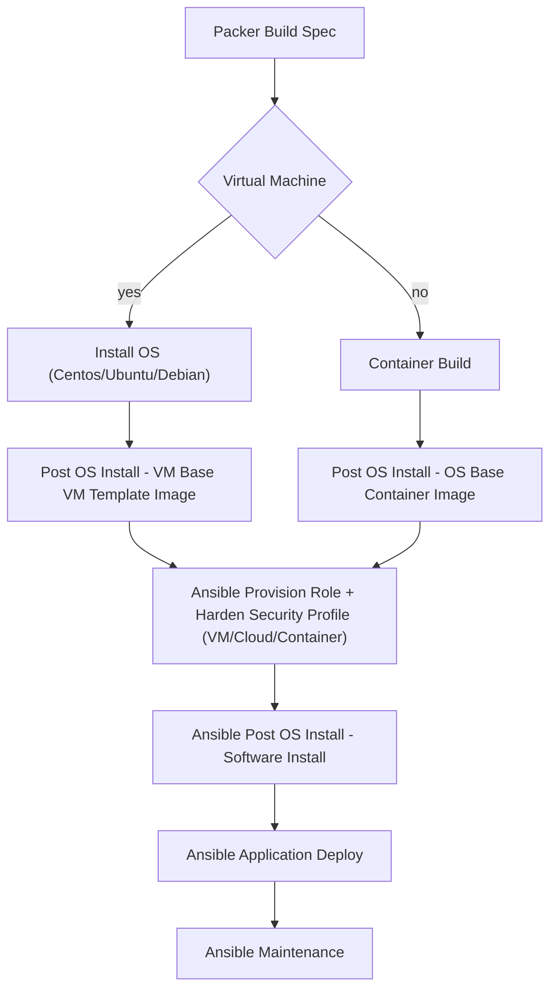

Ansible Datacenter Roles and Pipelines
===

> A collection of high quality roles and playbooks that follow current best practices, a common style and have detailed documentation and User Stories reflecting the use cases.
> 
> Roles can be used individually or combined in playbooks to solve common problems such as Cloud Image Factory, Discovery, Migration, Continuous Patching and Compliance, Cloud Provisioning, and Kubernetes/OpenShift deployment and management.
> 

Document Control

**TODO:**

-   Overall structure.
-   Presentation decks in Google Docs

## Problem Description and Solution[](#problem-description-and-solution "Permanent link")

#### Problems[](#problems "Permanent link")

-   **Cloud:** Building and managing virtual and cloud environments across DEV, TEST, STAGING and PRODUCTION requires a lot of manual steps that cannot be easily shared and re-used across platforms. Building and maintaining master images is expensive, and is not easily re-used.
-   **Security and Compliance**: DEV and PRODUCTION environments are built differently and don't usually share the same compliance or security settings.
-   **Migration** across platforms is difficult and re-install or re-platform approaches are time consuming.
-   **Container Builds**: are inconsistent and not aligned with OS security baselines.
-   **Security**: Update and maintain SSL and Certificate Authority configuration.
-   **Modernization and Migration**: how can I re-platform to a modern system that uses automation and configuration management? Ex: move from manually managed runbooks to runbook automation.

#### Solution[](#solution "Permanent link")

-   End-to-end automation that is modular, extensible and easily integrated with Continuous Deployment systems.
-   Automated image build system that creates modular images that target all virtual and cloud platforms, and can be extended / combined as part of a CI/CD pipeline to create tailored images (ex: PCI compliant PS images that target IBM Cloud VCS and Azure / AWS / VMware that share the same build systems and tools as the local images used for DEV/TEST that might run on VirtualBox, KVM, OpenStack or RHV platforms).
-   Security and compliance are built in, from day 1. Images are updated as part of the build process, and daily / continuous builds and automated testing allow for images to always be provisioned using a secure baseline.
-   Discovery scripts used for OS migration. Modular images used as landing platforms.
-   Modern, two-stage container builds that use buildah to package applications for container platforms.

#### Technical description[](#technical-description "Permanent link")

-   Collection of Ansible roles, playbooks, plugins, and modules
-   OS image build systems (packer, vsphere)

#### Example Workflow[](#example-workflow "Permanent link")

> Workflow for ansible provisioning integration with image build systems

#### Role Development Workflow[](#role-development-workflow "Permanent link")

-   Init a new role from the Cookiecutter Template
-   Lint code with `yamllint` and `ansible-lint`
-   Install role with `molecule` on Docker and KVM
-   Unit test role with `goss`
-   Push to Github
-   Trigger automatic CI/CD using Travis-CI (test matrix against supported Operating Systems). Runs molecule / goss tests.

## Personas Served[](#personas-served "Permanent link")

-   Developer: writes code, sets up static analysis, runs builds.
-   Image Architect / Migration Engineer: migrate and convert virtual machines. Discover applications and systems. Install middleware.
-   CI/CD/Build Engineer/Delivery Engineer: sets up CI/CD, automates builds.
-   Cloud Architect: uses multiple cloud providers, APIs, SDKs and toolkits. Provision entire landscapes.
-   SRE Engineer / Linux and UNIX Systems Administrator: Install various server roles, configure and secure systems.
-   Ansible Developer: Writes ansible playbooks and roles.
-   Kubernetes Engineer: sets up Kubernetes / OpenShift environments. Creates container builds.
-   Linux Desktop User: sets up Linux desktop environments and configures dotfiles.
-   Compliance Officer: sets up compliance and security rules.

## Use Cases and User Stories[](#use-cases-and-user-stories "Permanent link")

> Use cases include Provisioning, Configuration Management and Configuring Operating Systems, Application Deployment Continuous Delivery, Security and Compliance Automation, Orchestration, and Migration.

## Playbooks[](#playbooks "Permanent link")

-   Linux Node
-   Python Development
-   Patching
-   Continuous Compliance
-   Windows
-   MacOS
-   Backup

## Tested Operating Systems[](#tested-operating-systems "Permanent link")

Most linux roles are developed/tested on:

-   CentOS / RHEL 7
-   CentOS / RHEL 8
-   Debian 10
-   Ubuntu 18.04
-   Ubuntu 20.04

