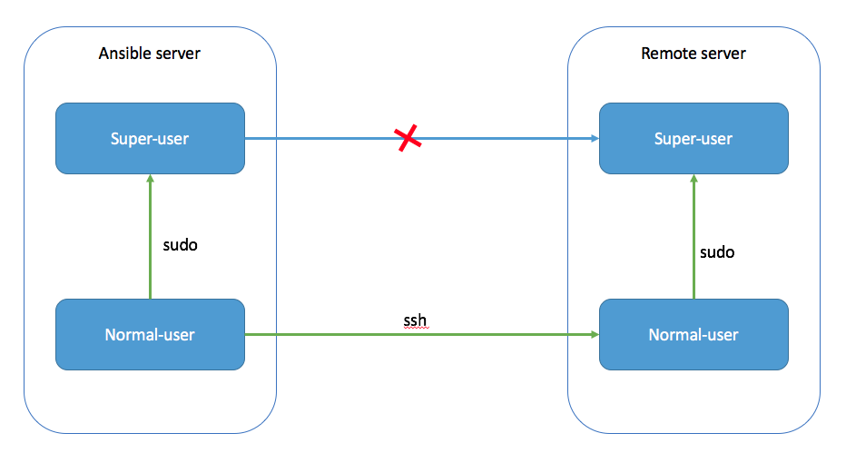

# Ansible Playbook: Deploy the public key to remote hosts

Since ansible uses ssh to access to each of the remote hosts, before we execute a playbook, we need to put the public key to the **_~/.ssh/authorized\_keys_** so that you don’t need to input the password for ssh every time you execute the playbook.

Usually, people just manually copy the public key to the remote hosts’ **_~/.ssh/authorized\_keys_** files. But things could get quite exhausting when you have an inventory with more than hundreds of nodes. That’s why people are asking how to use ansible playbook to deploy the public key to the remote hosts.

This post will show how to do that with examples. And later on, we will talk about it in a more complex (and more realistic) scenario, where users are not allowed to ssh to the remote as the **super-user**.

## In the simple world

Deploying your public key to the remote hosts as the same user is quite simple. It is just like checking if there is a line if the file on the remote hosts:

The only thing you want to pay attention here is that when you execute the playbook, you need to specify [**_ask-pass_**](http://docs.ansible.com/ansible/latest/intro_getting_started.html#remote-connection-information) to let ansible ask you for the ssh password if it is needed:

There is one more problem. If you access to a host via ssh for the first time, you will be asked about whether to add RSA key fingerprint of this host.  
However, with **_ask-pass_** being specified, ansible will directly run into an error if this is the first time you access to that host.

To walk through this, you will need to disable SSH authenticity checking by adding an **_ansible.cfg_** to the place where you want to execute the playbook:

> You can also put this file in the home directory as **_~/.ansible.cfg_**.

**To sum up**, three things to do:

-   Prepare your playbook to deploy the key.
-   Specify **ask-pass**.
-   Specify **_host\_key\_checking_** as _False_ in the config file.

This will deploy your public key to all the remote hosts, even if they have never been accessed before.

## A more complicated situation

Sometimes, you want to run your playbook as a super user. However, you can not access the remote hosts as this super user. In this scenario, the above approach no longer works.

> The above situation usually comes with the security policy of the company you are working for. Allowing people to ssh to remote as **super-user** will expose the password of the **super-user**, which could be a potential security risk.

First, you will need to get the public key of the **_super-user_** you want to deploy.

Since you can only ssh to the remote hosts via the **normal-user**, you need to run the deploy playbook under **normal-user** on your ansible server. Also, because you are deploying the public key to **_~/.ssh/authorized\_keys_** under **super-user** on the remote hosts, you will need to use [**_become_**](http://docs.ansible.com/ansible/latest/become.html) to tell ansible: Once ansible gets on to the remote hosts as the **normal-user**, change to **super-user** to execute the tasks:

Here, you will have a problems if you just run this playbook like we did before: Since we are going to change to **super-user** on remote hosts, we will be asked sudo password. To let ansible ask us for the sudo password, we will be using [**ask-sudo-pass**](http://docs.ansible.com/ansible/latest/intro_getting_started.html#remote-connection-information)**:**

With **ask-become-pass** and **ask-pass** being specified, ansible will ask you for your ssh password and sudo password when you kick the playbook.

By doing so, you will be able to deploy your public key to the remote hosts as the user you want in several seconds. :)

## Reference

* https://medium.com/@visualskyrim/ansible-playbook-deploy-the-public-key-to-remote-hosts-da3f3b4b5481
* 
