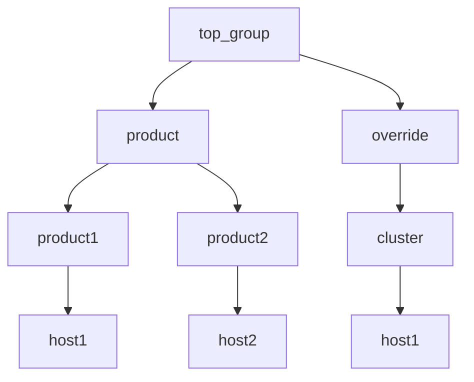

# Example 1: Test with child groups having same depth

One might observe what is believed to be unexpected results when `ansible_group_priority` is used in inventory groups that have a parent/child relationship. 

For example, create an inventory structurally that looks like this:

```
  |--@top_group:
  |  |--@override:
  |  |  |--@cluster:
  |  |  |  |--host1
  |  |--@product:
  |  |  |--@product1:
  |  |  |  |--host1
  |  |  |--@product2:
  |  |  |  |--host2
  |--@ungrouped:
```

Note in this inventory that 'host1' appears in both 'cluster' and 'product1' groups.

## Groups and depth level

The group 'cluster' is below group 'override' which is directly below 'top_group' making it 3 levels below the 'all' group; in other terms, 'top_group' has a depth level of 3.

Similarly, the 'product1' group is below 'product' which is below 'top_group' making it 3 levels below the 'all' group; in other terms, 'product1' has a depth level of 3.

Viewing the parent/child hierarchy diagrammed as follows:



## Inventory 

The inventory implementing the aforementioned hierarchy as an ini inventory [hosts.ini](./hosts.ini):

```ini
[top_group:vars]
test=top_group
ansible_connection=local
ansible_group_priority=1

[top_group:children]
product
override

[product:vars]
test="product"
ansible_group_priority=2

[product:children]
product1
product2

[product1]
host1

[product2]
host2

[product1:vars]
test="product1"
ansible_group_priority=3

[product2:vars]
test="product2"
ansible_group_priority=3

[override:vars]
test="override"
ansible_group_priority=9

[override:children]
cluster

[cluster]
host1

[cluster:vars]
test="cluster"
ansible_group_priority=10

```


## Test 1

Now run a simple query on the variable `test` for host1 and observe the results of the query:

```output
ansible -i hosts.ini -m debug -a var=test host1
host1 | SUCCESS => {
    "test": "cluster"
}
```

So far so good, since the `cluster` group priority is '10'. 

The same results can be confirmed when you convert the same inventory to yaml as [hosts.yml](./hosts.yml):

```output
ansible -i hosts.yml -m debug -a var=test host1
host1 | SUCCESS => {
    "test": "cluster"
}
```


## Conclusions/Next Steps

The merging of multiple groups works as expected for this case.

The [next example](../example2/README.md) will validate/test a change to a group var.

