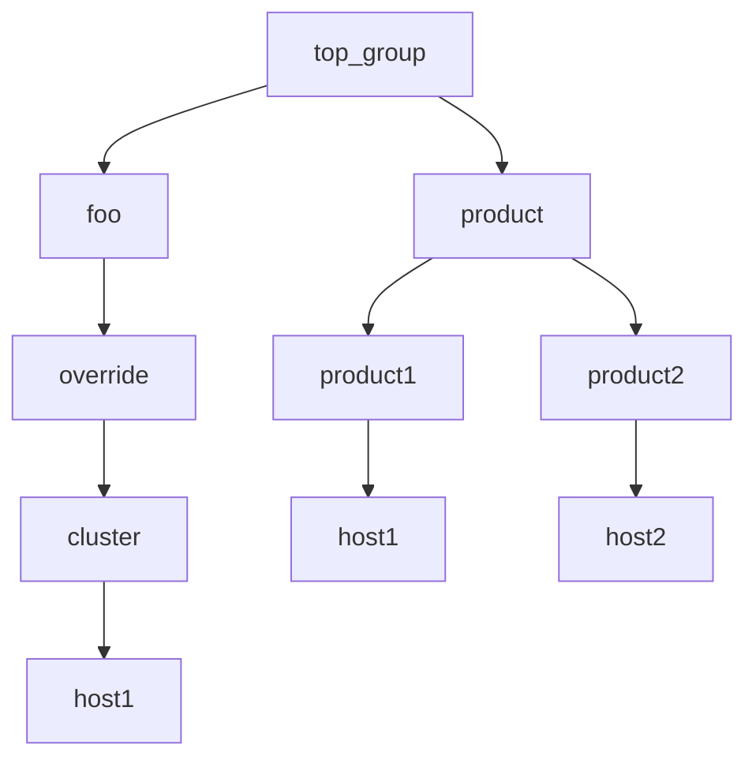

# Example 4: Validate prioritization with child groups

The next example validates the following rule observed in the prior example:

>
> the child group having the greatest child depth and greatest priority within that depth will always win.

With the inventory used in the prior example 3 as the starting point, make the groups 'override', 'product1', and 'product2' have the same depth. 

Add a group 'foo' between 'override' and 'top_group', such that 'override' is the same depth, 3 levels deep, as 'product1' and 'product2'.  
Note the 'cluster' child group now has a depth of 4, resulting in it have the greatest depth path among the other groups (product1/product2).




The resulting yaml inventory with this hierarchy can be found in [hosts.yml](./hosts.yml):

```yaml
all:
  children:
    top_group:
      vars:
        test: top_group
        ansible_connection: local
        ansible_group_priority: 1
      children:
        foo:
          children:
            override:
              vars:
                test: "override"
                ansible_group_priority: 9
              children:
                cluster:
                  vars:
                    test: "cluster"
                    ansible_group_priority: 10
                  hosts:
                    host1: {}
        product:
          vars:
            test: "product"
            ansible_group_priority: 2
          children:
            product1:
              vars:
                test: "product1"
                ansible_group_priority: 3
              hosts:
                host1: {}
            product2:
              vars:
                test: "product2"
                ansible_group_priority: 3
              hosts:
                host2:
                  test: product2

```

The ini inventory implementing this hierarchy can be found in [hosts.ini](./hosts.ini):

```ini
[top_group:vars]
test=top_group
ansible_connection=local
ansible_group_priority=1

[top_group:children]
product
foo

[product:vars]
test="product"
ansible_group_priority=2

[product:children]
product1
product2

[product1]
host1

[product2]
host2

[product1:vars]
test="product1"
ansible_group_priority=3

[product2:vars]
test="product2"
ansible_group_priority=3

[override:vars]
test="override"
ansible_group_priority=9

[override:children]
cluster

[foo:children]
override

[cluster]
host1

[cluster:vars]
test="cluster"
ansible_group_priority=10
```

Since the 'cluster' group now has the greatest depth path, using the rule it would be expected that the 'test' variable value will be set to 'cluster'. 

In fact, the observed results are now consistent with the stated rule:

```output
ansible -i hosts.ini -m debug -a var=test host1
host1 | SUCCESS => {
    "test": "cluster"
}
ansible -i hosts.yml -m debug -a var=test host1
host1 | SUCCESS => {
    "test": "cluster"
}

```


## Conclusions/Next Steps

The [next example](../example5/README.md) will look to further into the group variable merge behavior.
