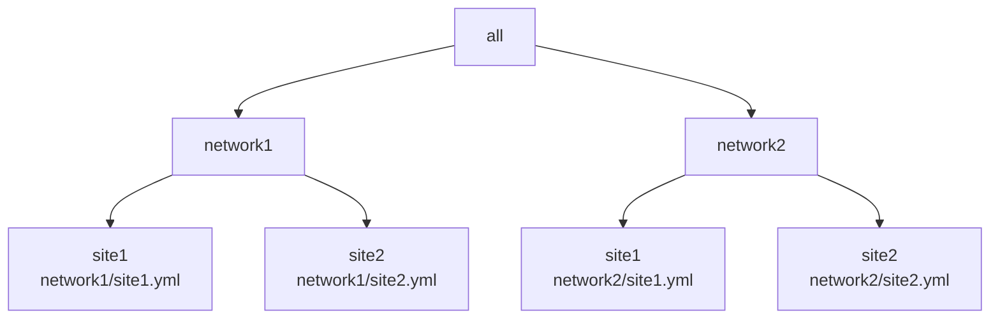
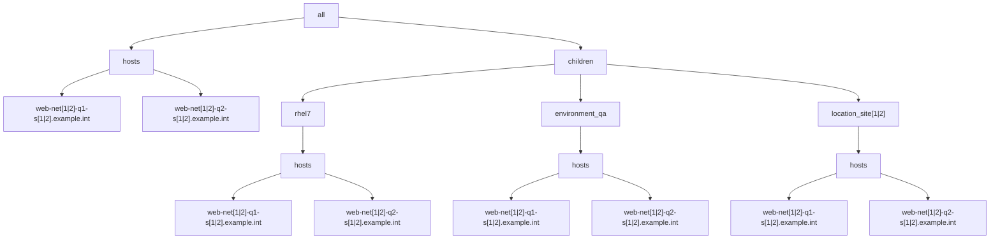

# Example 1: Playbook using multiple YAML inventories with overlapping parent groups  

The playbook as follows:

```yaml
- name: "Run trace var play"
  hosts: all
  gather_facts: false
  connection: local
  tasks:
    - debug:
        var: trace_var
    - debug:
        var: group_names
```

In this example there are 2 networks located at 2 sites resulting in 4 YAML inventory files, with hierarchy diagrammed as follows:




For each of the 4 inventory files, the following group/host hierarchy will be implemented:




Each site.yml inventory will be setup similar to the following with the "[1|2]" regex pattern evaluated for each of the 4 cases:

```yaml
all:
  hosts:
    web-net[1|2]-q1-s[1|2].example.int:
      trace_var: site[1|2]/web-net[1|2]-q1-s[1|2].example.int
      foreman: <94 keys>
      facts: {}
    web-net[1|2]-q2-s[1|2].example.int:
      trace_var: site[1|2]/rhel7/web-net[1|2]-q2-s[1|2].example.int
      foreman: <94 keys>
      facts: {}
  children:
    rhel7:
      vars:
        trace_var: site[1|2]/rhel7
      hosts:
        web-net[1|2]-q1-s[1|2].example.int: {}
        web-net[1|2]-q2-s[1|2].example.int: {}
    environment_qa:
      vars:
        trace_var: site[1|2]/environment_qa
      hosts:
        web-net[1|2]-q1-s[1|2].example.int: {}
        web-net[1|2]-q2-s[1|2].example.int: {}
    location_site[1|2]:
      vars:
        trace_var: site[1|2]/location_site[1|2]
      hosts:
        web-net[1|2]-q1-s[1|2].example.int: {}
        web-net[1|2]-q2-s[1|2].example.int: {}
    ungrouped: {}

```

Each of the respective inventory files:

* [network1/site1 inventory](./inventory/network1/site1.yml)
* [network1/site2 inventory](./inventory/network1/site2.yml)
* [network2/site1 inventory](./inventory/network2/site1.yml)
* [network2/site2 inventory](./inventory/network2/site2.yml)


With the 4 inventories mentioned, we now seek to confirm that the expected value appears for the 'group_names' special variable and the 'trace_var' variable for both hosts.

playbook run for inventory/network1/site1.yml:
```output
ansible-playbook -i ./inventory/network1/site1.yml playbook.yml

PLAY [Run trace var play] ************************************************************************************************************************************************************************************************************************************************

TASK [debug] *************************************************************************************************************************************************************************************************************************************************************
ok: [web-q1-net1-s1.example.int] => {
    "trace_var": "network1/site1/web-q1-net1-s1.example.int"
}
ok: [web-q2-net1-s1.example.int] => {
    "trace_var": "network1/site1/web-q2-net1-s1.example.int"
}

TASK [debug] *************************************************************************************************************************************************************************************************************************************************************
ok: [web-q1-net1-s1.example.int] => {
    "group_names": [
        "environment_qa",
        "location_site1",
        "rhel7"
    ]
}
ok: [web-q2-net1-s1.example.int] => {
    "group_names": [
        "environment_qa",
        "location_site1",
        "rhel7"
    ]
}

PLAY RECAP ***************************************************************************************************************************************************************************************************************************************************************
web-q1-net1-s1.example.int : ok=2    changed=0    unreachable=0    failed=0    skipped=0    rescued=0    ignored=0   
web-q2-net1-s1.example.int : ok=2    changed=0    unreachable=0    failed=0    skipped=0    rescued=0    ignored=0   

```

This is as expected.

playbook run for inventory/network1/site2.yml:
```output
ansible-playbook -i ./inventory/network1/site2.yml playbook.yml

PLAY [Run trace var play] ************************************************************************************************************************************************************************************************************************************************

TASK [debug] *************************************************************************************************************************************************************************************************************************************************************
ok: [web-q1-net1-s2.example.int] => {
    "trace_var": "network1/site2/web-q1-net1-s2.example.int"
}
ok: [web-q2-net1-s2.example.int] => {
    "trace_var": "network1/site2/web-q2-net1-s2.example.int"
}

TASK [debug] *************************************************************************************************************************************************************************************************************************************************************
ok: [web-q1-net1-s2.example.int] => {
    "group_names": [
        "environment_qa",
        "location_site2",
        "rhel7"
    ]
}
ok: [web-q2-net1-s2.example.int] => {
    "group_names": [
        "environment_qa",
        "location_site2",
        "rhel7"
    ]
}

PLAY RECAP ***************************************************************************************************************************************************************************************************************************************************************
web-q1-net1-s2.example.int : ok=2    changed=0    unreachable=0    failed=0    skipped=0    rescued=0    ignored=0   
web-q2-net1-s2.example.int : ok=2    changed=0    unreachable=0    failed=0    skipped=0    rescued=0    ignored=0   

```

This is as expected.


playbook run for inventory/network2/site1.yml:
```output
ansible-playbook -i ./inventory/network2/site1.yml playbook.yml

PLAY [Run trace var play] ************************************************************************************************************************************************************************************************************************************************

TASK [debug] *************************************************************************************************************************************************************************************************************************************************************
ok: [web-q1-net2-s1.example.int] => {
    "trace_var": "network2/site1/web-q1-net2-s1.example.int"
}
ok: [web-q2-net2-s1.example.int] => {
    "trace_var": "network2/site1/web-q2-net2-s1.example.int"
}

TASK [debug] *************************************************************************************************************************************************************************************************************************************************************
ok: [web-q1-net2-s1.example.int] => {
    "group_names": [
        "environment_qa",
        "location_site1",
        "rhel7"
    ]
}
ok: [web-q2-net2-s1.example.int] => {
    "group_names": [
        "environment_qa",
        "location_site1",
        "rhel7"
    ]
}

PLAY RECAP ***************************************************************************************************************************************************************************************************************************************************************
web-q1-net2-s1.example.int : ok=2    changed=0    unreachable=0    failed=0    skipped=0    rescued=0    ignored=0   
web-q2-net2-s1.example.int : ok=2    changed=0    unreachable=0    failed=0    skipped=0    rescued=0    ignored=0   

```

This is as expected.

playbook run for inventory/network2/site2.yml:
```output
ansible-playbook -i ./inventory/network2/site2.yml playbook.yml

PLAY [Run trace var play] ************************************************************************************************************************************************************************************************************************************************

TASK [debug] *************************************************************************************************************************************************************************************************************************************************************
ok: [web-q1-net2-s2.example.int] => {
    "trace_var": "network2/site2/web-q1-net2-s2.example.int"
}
ok: [web-q2-net2-s2.example.int] => {
    "trace_var": "network2/site2/web-q2-net2-s2.example.int"
}

TASK [debug] *************************************************************************************************************************************************************************************************************************************************************
ok: [web-q1-net2-s2.example.int] => {
    "group_names": [
        "environment_qa",
        "location_site2",
        "rhel7"
    ]
}
ok: [web-q2-net2-s2.example.int] => {
    "group_names": [
        "environment_qa",
        "location_site2",
        "rhel7"
    ]
}

PLAY RECAP ***************************************************************************************************************************************************************************************************************************************************************
web-q1-net2-s2.example.int : ok=2    changed=0    unreachable=0    failed=0    skipped=0    rescued=0    ignored=0   
web-q2-net2-s2.example.int : ok=2    changed=0    unreachable=0    failed=0    skipped=0    rescued=0    ignored=0   

```

This is as expected.


## Combined inventory run.


playbook run for combined inventory:
```output
ansible-playbook -i ./inventory/ playbook.yml

PLAY [Run trace var play] ************************************************************************************************************************************************************************************************************************************************

TASK [debug] *************************************************************************************************************************************************************************************************************************************************************
ok: [web-q1-net1-s1.example.int] => {
    "trace_var": "network1/site1/web-q1-net1-s1.example.int"
}
ok: [web-q2-net1-s1.example.int] => {
    "trace_var": "network1/site1/web-q2-net1-s1.example.int"
}
ok: [web-q1-net1-s2.example.int] => {
    "trace_var": "network1/site2/web-q1-net1-s2.example.int"
}
ok: [web-q2-net1-s2.example.int] => {
    "trace_var": "network1/site2/web-q2-net1-s2.example.int"
}
ok: [web-q1-net2-s1.example.int] => {
    "trace_var": "network2/site1/web-q1-net2-s1.example.int"
}
ok: [web-q2-net2-s1.example.int] => {
    "trace_var": "network2/site1/web-q2-net2-s1.example.int"
}
ok: [web-q1-net2-s2.example.int] => {
    "trace_var": "network2/site2/web-q1-net2-s2.example.int"
}
ok: [web-q2-net2-s2.example.int] => {
    "trace_var": "network2/site2/web-q2-net2-s2.example.int"
}

TASK [debug] *************************************************************************************************************************************************************************************************************************************************************
ok: [web-q1-net1-s1.example.int] => {
    "group_names": [
        "environment_qa",
        "location_site1",
        "rhel7"
    ]
}
ok: [web-q2-net1-s1.example.int] => {
    "group_names": [
        "environment_qa",
        "location_site1",
        "rhel7"
    ]
}
ok: [web-q1-net1-s2.example.int] => {
    "group_names": [
        "environment_qa",
        "location_site2",
        "rhel7"
    ]
}
ok: [web-q2-net1-s2.example.int] => {
    "group_names": [
        "environment_qa",
        "location_site2",
        "rhel7"
    ]
}
ok: [web-q1-net2-s1.example.int] => {
    "group_names": [
        "environment_qa",
        "location_site1",
        "rhel7"
    ]
}
ok: [web-q2-net2-s1.example.int] => {
    "group_names": [
        "environment_qa",
        "location_site1",
        "rhel7"
    ]
}
ok: [web-q1-net2-s2.example.int] => {
    "group_names": [
        "environment_qa",
        "location_site2",
        "rhel7"
    ]
}
ok: [web-q2-net2-s2.example.int] => {
    "group_names": [
        "environment_qa",
        "location_site2",
        "rhel7"
    ]
}

PLAY RECAP ***************************************************************************************************************************************************************************************************************************************************************
web-q1-net1-s1.example.int : ok=2    changed=0    unreachable=0    failed=0    skipped=0    rescued=0    ignored=0   
web-q1-net1-s2.example.int : ok=2    changed=0    unreachable=0    failed=0    skipped=0    rescued=0    ignored=0   
web-q1-net2-s1.example.int : ok=2    changed=0    unreachable=0    failed=0    skipped=0    rescued=0    ignored=0   
web-q1-net2-s2.example.int : ok=2    changed=0    unreachable=0    failed=0    skipped=0    rescued=0    ignored=0   
web-q2-net1-s1.example.int : ok=2    changed=0    unreachable=0    failed=0    skipped=0    rescued=0    ignored=0   
web-q2-net1-s2.example.int : ok=2    changed=0    unreachable=0    failed=0    skipped=0    rescued=0    ignored=0   
web-q2-net2-s1.example.int : ok=2    changed=0    unreachable=0    failed=0    skipped=0    rescued=0    ignored=0   
web-q2-net2-s2.example.int : ok=2    changed=0    unreachable=0    failed=0    skipped=0    rescued=0    ignored=0   

```

## Conclusions/Next Steps

The merging of multiple inventories works as expected for this case.

When dealing with the combined/merged, it would be essential to be able to target the sites/networks by groups.
While the groups in this example exist for the sites dimension, it does not exist for the networks.

The [next example](../example2/README.md) will look to solve this.
