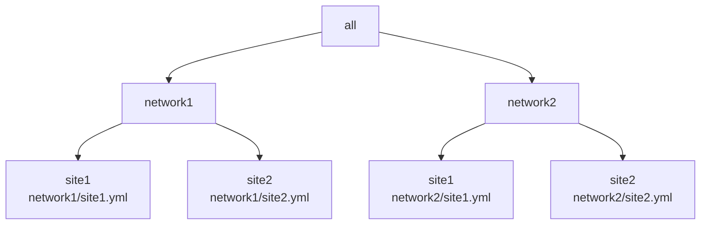
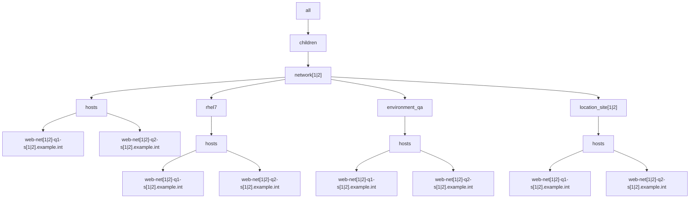

# Example 2: Playbook using multiple YAML inventories with non-overlapping parent groups

In the prior [Example 1](../example1/README.md), with running on the merged inventory, the merging of multiple inventories works as expected.

When dealing with the combined/merged, it would be essential to be able to target the sites/networks by groups.
While the groups in the prior example existed for the sites dimension, the groups did not exist for the networks.

The following example attempts to solve this.

## Playbook used

The playbook as follows:

```yaml
- name: "Run trace var play"
  hosts: all
  gather_facts: false
  connection: local
  tasks:
    - debug:
        var: trace_var
    - debug:
        var: group_names
```

In this example there are 2 networks located at 2 sites resulting in 4 YAML inventory files, with hierarchy diagrammed as follows:



In this example, there is a desire to have the network expressed as a group for use in playbooks.

For each of the 4 inventory files, the following group/host hierarchy will be implemented:




Each site.yml inventory will be setup similar to the following with the "[1|2]" regex pattern evaluated for each of the 4 cases:

```yaml
all:
  children:
    network[1|2]:
      children:
        hosts:
          web-net[1|2]-q1-s[1|2].example.int:
            trace_var: site[1|2]/web-net[1|2]-q1-s[1|2].example.int
            foreman: <94 keys>
            facts: {}
          web-net[1|2]-q2-s[1|2].example.int:
            trace_var: site[1|2]/rhel7/web-net[1|2]-q2-s[1|2].example.int
            foreman: <94 keys>
            facts: {}
        rhel7:
          vars:
            trace_var: site[1|2]/rhel7
          hosts:
            web-q1.example.int: {}
            web-q2.example.int: {}
        environment_qa:
          vars:
            trace_var: site[1|2]/environment_qa
          hosts:
            web-q1.example.int: {}
            web-q2.example.int: {}
        location_site[1|2]:
          vars:
            trace_var: site[1|2]/location_site[1|2]
          hosts:
            web-q1.example.int: {}
            web-q2.example.int: {}
        ungrouped: {}
    
```

Each of the respective inventory files:

* [network1/site1 inventory](./inventory/network1/site1.yml)
* [network1/site2 inventory](./inventory/network1/site2.yml)
* [network2/site1 inventory](./inventory/network2/site1.yml)
* [network2/site2 inventory](./inventory/network2/site2.yml)


With the 4 inventories mentioned, we now seek to confirm that the expected value appears for the 'group_names' special variable and the 'trace_var' variable for both hosts.

playbook run for inventory/network1/site1.yml:
```output
ansible-playbook -i ./inventory/network1/site1.yml playbook.yml

PLAY [Run trace var play] ************************************************************************************************************************************************************************************************************************************************

TASK [debug] *************************************************************************************************************************************************************************************************************************************************************
ok: [web-q1-net1-s1.example.int] => {
    "trace_var": "network1/site1/web-q1-net1-s1.example.int"
}
ok: [web-q2-net1-s1.example.int] => {
    "trace_var": "network1/site1/web-q2-net1-s1.example.int"
}

TASK [debug] *************************************************************************************************************************************************************************************************************************************************************
ok: [web-q1-net1-s1.example.int] => {
    "group_names": [
        "environment_qa",
        "location_site1",
        "network1",
        "rhel7"
    ]
}
ok: [web-q2-net1-s1.example.int] => {
    "group_names": [
        "environment_qa",
        "location_site1",
        "network1",
        "rhel7"
    ]
}

PLAY RECAP ***************************************************************************************************************************************************************************************************************************************************************
web-q1-net1-s1.example.int : ok=2    changed=0    unreachable=0    failed=0    skipped=0    rescued=0    ignored=0   
web-q2-net1-s1.example.int : ok=2    changed=0    unreachable=0    failed=0    skipped=0    rescued=0    ignored=0   

```

This is as expected.

playbook run for inventory/network1/site2.yml:
```output
ansible-playbook -i ./inventory/network1/site2.yml playbook.yml

PLAY [Run trace var play] ************************************************************************************************************************************************************************************************************************************************

TASK [debug] *************************************************************************************************************************************************************************************************************************************************************
ok: [web-q1-net1-s2.example.int] => {
    "trace_var": "network1/site2/web-q1-net1-s2.example.int"
}
ok: [web-q2-net1-s2.example.int] => {
    "trace_var": "network1/site2/web-q2-net1-s2.example.int"
}

TASK [debug] *************************************************************************************************************************************************************************************************************************************************************
ok: [web-q1-net1-s2.example.int] => {
    "group_names": [
        "environment_qa",
        "location_site2",
        "network1",
        "rhel7"
    ]
}
ok: [web-q2-net1-s2.example.int] => {
    "group_names": [
        "environment_qa",
        "location_site2",
        "network1",
        "rhel7"
    ]
}

PLAY RECAP ***************************************************************************************************************************************************************************************************************************************************************
web-q1-net1-s2.example.int : ok=2    changed=0    unreachable=0    failed=0    skipped=0    rescued=0    ignored=0   
web-q2-net1-s2.example.int : ok=2    changed=0    unreachable=0    failed=0    skipped=0    rescued=0    ignored=0   

```

This is as expected.


playbook run for inventory/network2/site1.yml:
```output
ansible-playbook -i ./inventory/network2/site1.yml playbook.yml

PLAY [Run trace var play] ************************************************************************************************************************************************************************************************************************************************

TASK [debug] *************************************************************************************************************************************************************************************************************************************************************
ok: [web-q1-net2-s1.example.int] => {
    "trace_var": "network2/site1/web-q1-net2-s1.example.int"
}
ok: [web-q2-net2-s1.example.int] => {
    "trace_var": "network2/site1/web-q2-net2-s1.example.int"
}

TASK [debug] *************************************************************************************************************************************************************************************************************************************************************
ok: [web-q1-net2-s1.example.int] => {
    "group_names": [
        "environment_qa",
        "location_site1",
        "network2",
        "rhel7"
    ]
}
ok: [web-q2-net2-s1.example.int] => {
    "group_names": [
        "environment_qa",
        "location_site1",
        "network2",
        "rhel7"
    ]
}

PLAY RECAP ***************************************************************************************************************************************************************************************************************************************************************
web-q1-net2-s1.example.int : ok=2    changed=0    unreachable=0    failed=0    skipped=0    rescued=0    ignored=0   
web-q2-net2-s1.example.int : ok=2    changed=0    unreachable=0    failed=0    skipped=0    rescued=0    ignored=0   

```

This is as expected.

playbook run for inventory/network2/site2.yml:
```output
ansible-playbook -i ./inventory/network2/site2.yml playbook.yml

PLAY [Run trace var play] ************************************************************************************************************************************************************************************************************************************************

TASK [debug] *************************************************************************************************************************************************************************************************************************************************************
ok: [web-q1-net2-s2.example.int] => {
    "trace_var": "network2/site2/web-q1-net2-s2.example.int"
}
ok: [web-q2-net2-s2.example.int] => {
    "trace_var": "network2/site2/web-q2-net2-s2.example.int"
}

TASK [debug] *************************************************************************************************************************************************************************************************************************************************************
ok: [web-q1-net2-s2.example.int] => {
    "group_names": [
        "environment_qa",
        "location_site2",
        "network2",
        "rhel7"
    ]
}
ok: [web-q2-net2-s2.example.int] => {
    "group_names": [
        "environment_qa",
        "location_site2",
        "network2",
        "rhel7"
    ]
}

PLAY RECAP ***************************************************************************************************************************************************************************************************************************************************************
web-q1-net2-s2.example.int : ok=2    changed=0    unreachable=0    failed=0    skipped=0    rescued=0    ignored=0   
web-q2-net2-s2.example.int : ok=2    changed=0    unreachable=0    failed=0    skipped=0    rescued=0    ignored=0   

```

This is as expected.


## Combined inventory run.


playbook run for combined inventory:
```output
ansible-playbook -i ./inventory/ playbook.yml

PLAY [Run trace var play] ************************************************************************************************************************************************************************************************************************************************

TASK [debug] *************************************************************************************************************************************************************************************************************************************************************
ok: [web-q1-net1-s1.example.int] => {
    "trace_var": "network1/site1/web-q1-net1-s1.example.int"
}
ok: [web-q2-net1-s1.example.int] => {
    "trace_var": "network1/site1/web-q2-net1-s1.example.int"
}
ok: [web-q1-net1-s2.example.int] => {
    "trace_var": "network1/site2/web-q1-net1-s2.example.int"
}
ok: [web-q2-net1-s2.example.int] => {
    "trace_var": "network1/site2/web-q2-net1-s2.example.int"
}
ok: [web-q1-net2-s1.example.int] => {
    "trace_var": "network2/site1/web-q1-net2-s1.example.int"
}
ok: [web-q2-net2-s1.example.int] => {
    "trace_var": "network2/site1/web-q2-net2-s1.example.int"
}
ok: [web-q1-net2-s2.example.int] => {
    "trace_var": "network2/site2/web-q1-net2-s2.example.int"
}
ok: [web-q2-net2-s2.example.int] => {
    "trace_var": "network2/site2/web-q2-net2-s2.example.int"
}

TASK [debug] *************************************************************************************************************************************************************************************************************************************************************
ok: [web-q1-net1-s1.example.int] => {
    "group_names": [
        "environment_qa",
        "location_site1",
        "network1",
        "network2",
        "rhel7"
    ]
}
ok: [web-q2-net1-s1.example.int] => {
    "group_names": [
        "environment_qa",
        "location_site1",
        "network1",
        "network2",
        "rhel7"
    ]
}
ok: [web-q1-net1-s2.example.int] => {
    "group_names": [
        "environment_qa",
        "location_site2",
        "network1",
        "network2",
        "rhel7"
    ]
}
ok: [web-q2-net1-s2.example.int] => {
    "group_names": [
        "environment_qa",
        "location_site2",
        "network1",
        "network2",
        "rhel7"
    ]
}
ok: [web-q1-net2-s1.example.int] => {
    "group_names": [
        "environment_qa",
        "location_site1",
        "network1",
        "network2",
        "rhel7"
    ]
}
ok: [web-q2-net2-s1.example.int] => {
    "group_names": [
        "environment_qa",
        "location_site1",
        "network1",
        "network2",
        "rhel7"
    ]
}
ok: [web-q1-net2-s2.example.int] => {
    "group_names": [
        "environment_qa",
        "location_site2",
        "network1",
        "network2",
        "rhel7"
    ]
}
ok: [web-q2-net2-s2.example.int] => {
    "group_names": [
        "environment_qa",
        "location_site2",
        "network1",
        "network2",
        "rhel7"
    ]
}

PLAY RECAP ***************************************************************************************************************************************************************************************************************************************************************
web-q1-net1-s1.example.int : ok=2    changed=0    unreachable=0    failed=0    skipped=0    rescued=0    ignored=0   
web-q1-net1-s2.example.int : ok=2    changed=0    unreachable=0    failed=0    skipped=0    rescued=0    ignored=0   
web-q1-net2-s1.example.int : ok=2    changed=0    unreachable=0    failed=0    skipped=0    rescued=0    ignored=0   
web-q1-net2-s2.example.int : ok=2    changed=0    unreachable=0    failed=0    skipped=0    rescued=0    ignored=0   
web-q2-net1-s1.example.int : ok=2    changed=0    unreachable=0    failed=0    skipped=0    rescued=0    ignored=0   
web-q2-net1-s2.example.int : ok=2    changed=0    unreachable=0    failed=0    skipped=0    rescued=0    ignored=0   
web-q2-net2-s1.example.int : ok=2    changed=0    unreachable=0    failed=0    skipped=0    rescued=0    ignored=0   
web-q2-net2-s2.example.int : ok=2    changed=0    unreachable=0    failed=0    skipped=0    rescued=0    ignored=0   

```


## Conclusions/Next Steps

In the last case, with running on the merged inventory, the expected results would be that only the appropriate network group would be assigned for each host.

Instead, we found that all the hosts in both networks have both 'network' groups assigned.

This is not the intended or expected behavior.

The [next example](../example3/README.md) will look to solve this.

