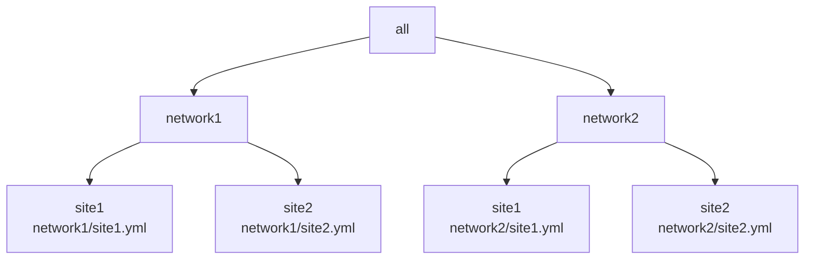
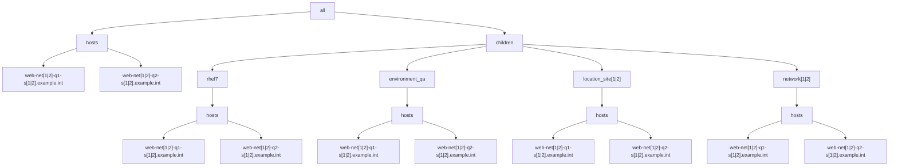

# Example 3: Playbook using multiple YAML inventories with group requirement sufficiency  

In the prior [Example 2](../example2/README.md), with running on the merged inventory, the expected results were that only the appropriate network group would be assigned for each host.
Instead, we found that all the hosts in both networks have both 'network' groups assigned.
This is not the intended or expected behavior.

The following example will look to solve this.

## Playbook used

The playbook as follows:

```yaml
- name: "Run trace var play"
  hosts: all
  gather_facts: false
  connection: local
  tasks:
    - debug:
        var: trace_var
    - debug:
        var: group_names
```

In this example there are 2 networks located at 2 sites resulting in 4 YAML inventory files, with hierarchy diagrammed as follows:




For each of the 4 inventory files, the following group/host hierarchy will be implemented:




Each site.yml inventory will be setup similar to the following with the "[1|2]" regex pattern evaluated for each of the 4 cases:

```yaml
all:
  hosts:
    web-net[1|2]-q1-s[1|2].example.int:
      trace_var: site[1|2]/web-net[1|2]-q1-s[1|2].example.int
      foreman: <94 keys>
      facts: {}
    web-net[1|2]-q2-s[1|2].example.int:
      trace_var: site[1|2]/rhel7/web-net[1|2]-q2-s[1|2].example.int
      foreman: <94 keys>
      facts: {}
  children:
    rhel7:
      vars:
        trace_var: site[1|2]/rhel7
      hosts:
        web-net[1|2]-q1-s[1|2].example.int: {}
        web-net[1|2]-q2-s[1|2].example.int: {}
    environment_qa:
      vars:
        trace_var: site[1|2]/environment_qa
      hosts:
        web-net[1|2]-q1-s[1|2].example.int: {}
        web-net[1|2]-q2-s[1|2].example.int: {}
    location_site[1|2]:
      vars:
        trace_var: site[1|2]/location_site[1|2]
      hosts:
        web-net[1|2]-q1-s[1|2].example.int: {}
        web-net[1|2]-q2-s[1|2].example.int: {}
    network[1|2]:
      vars:
        trace_var: site[1|2]/network[1|2]
      hosts:
        web-net[1|2]-q1-s[1|2].example.int: {}
        web-net[1|2]-q2-s[1|2].example.int: {}
    ungrouped: {}

```

Each of the respective inventory files:

* [network1/site1 inventory](./inventory/network1/site1.yml)
* [network1/site2 inventory](./inventory/network1/site2.yml)
* [network2/site1 inventory](./inventory/network2/site1.yml)
* [network2/site2 inventory](./inventory/network2/site2.yml)


With the 4 inventories mentioned, we now seek to confirm that the expected value appears for the 'group_names' special variable and the 'trace_var' variable for both hosts.

playbook run for inventory/network1/site1.yml:
```output
ansible-playbook -i ./inventory/network1/site1.yml playbook.yml

PLAY [Run trace var play] ************************************************************************************************************************************************************************************************************************************************

TASK [debug] *************************************************************************************************************************************************************************************************************************************************************
ok: [web-q1-net1-s1.example.int] => {
    "trace_var": "network1/site1/web-q1-net1-s1.example.int"
}
ok: [web-q2-net1-s1.example.int] => {
    "trace_var": "network1/site1/web-q2-net1-s1.example.int"
}

TASK [debug] *************************************************************************************************************************************************************************************************************************************************************
ok: [web-q1-net1-s1.example.int] => {
    "group_names": [
        "environment_qa",
        "location_site1",
        "rhel7"
    ]
}
ok: [web-q2-net1-s1.example.int] => {
    "group_names": [
        "environment_qa",
        "location_site1",
        "rhel7"
    ]
}

PLAY RECAP ***************************************************************************************************************************************************************************************************************************************************************
web-q1-net1-s1.example.int : ok=2    changed=0    unreachable=0    failed=0    skipped=0    rescued=0    ignored=0   
web-q2-net1-s1.example.int : ok=2    changed=0    unreachable=0    failed=0    skipped=0    rescued=0    ignored=0   

```

This is as expected.

playbook run for inventory/network1/site2.yml:
```output
ansible-playbook -i ./inventory/network1/site2.yml playbook.yml

PLAY [Run trace var play] ************************************************************************************************************************************************************************************************************************************************

TASK [debug] *************************************************************************************************************************************************************************************************************************************************************
ok: [web-q1-net1-s2.example.int] => {
    "trace_var": "network1/site2/web-q1-net1-s2.example.int"
}
ok: [web-q2-net1-s2.example.int] => {
    "trace_var": "network1/site2/web-q2-net1-s2.example.int"
}

TASK [debug] *************************************************************************************************************************************************************************************************************************************************************
ok: [web-q1-net1-s2.example.int] => {
    "group_names": [
        "environment_qa",
        "location_site2",
        "rhel7"
    ]
}
ok: [web-q2-net1-s2.example.int] => {
    "group_names": [
        "environment_qa",
        "location_site2",
        "rhel7"
    ]
}

PLAY RECAP ***************************************************************************************************************************************************************************************************************************************************************
web-q1-net1-s2.example.int : ok=2    changed=0    unreachable=0    failed=0    skipped=0    rescued=0    ignored=0   
web-q2-net1-s2.example.int : ok=2    changed=0    unreachable=0    failed=0    skipped=0    rescued=0    ignored=0   

```

This is as expected.


playbook run for inventory/network2/site1.yml:
```output
ansible-playbook -i ./inventory/network2/site1.yml playbook.yml

PLAY [Run trace var play] ************************************************************************************************************************************************************************************************************************************************

TASK [debug] *************************************************************************************************************************************************************************************************************************************************************
ok: [web-q1-net2-s1.example.int] => {
    "trace_var": "network2/site1/web-q1-net2-s1.example.int"
}
ok: [web-q2-net2-s1.example.int] => {
    "trace_var": "network2/site1/web-q2-net2-s1.example.int"
}

TASK [debug] *************************************************************************************************************************************************************************************************************************************************************
ok: [web-q1-net2-s1.example.int] => {
    "group_names": [
        "environment_qa",
        "location_site1",
        "rhel7"
    ]
}
ok: [web-q2-net2-s1.example.int] => {
    "group_names": [
        "environment_qa",
        "location_site1",
        "rhel7"
    ]
}

PLAY RECAP ***************************************************************************************************************************************************************************************************************************************************************
web-q1-net2-s1.example.int : ok=2    changed=0    unreachable=0    failed=0    skipped=0    rescued=0    ignored=0   
web-q2-net2-s1.example.int : ok=2    changed=0    unreachable=0    failed=0    skipped=0    rescued=0    ignored=0   

```

This is as expected.

playbook run for inventory/network2/site2.yml:
```output
ansible-playbook -i ./inventory/network2/site2.yml playbook.yml

PLAY [Run trace var play] ************************************************************************************************************************************************************************************************************************************************

TASK [debug] *************************************************************************************************************************************************************************************************************************************************************
ok: [web-q1-net2-s2.example.int] => {
    "trace_var": "network2/site2/web-q1-net2-s2.example.int"
}
ok: [web-q2-net2-s2.example.int] => {
    "trace_var": "network2/site2/web-q2-net2-s2.example.int"
}

TASK [debug] *************************************************************************************************************************************************************************************************************************************************************
ok: [web-q1-net2-s2.example.int] => {
    "group_names": [
        "environment_qa",
        "location_site2",
        "rhel7"
    ]
}
ok: [web-q2-net2-s2.example.int] => {
    "group_names": [
        "environment_qa",
        "location_site2",
        "rhel7"
    ]
}

PLAY RECAP ***************************************************************************************************************************************************************************************************************************************************************
web-q1-net2-s2.example.int : ok=2    changed=0    unreachable=0    failed=0    skipped=0    rescued=0    ignored=0   
web-q2-net2-s2.example.int : ok=2    changed=0    unreachable=0    failed=0    skipped=0    rescued=0    ignored=0   

```

This is as expected.


## Combined inventory run.


playbook run for combined inventory:
```output
ansible-playbook -i ./inventory/ playbook.yml

PLAY [Run trace var play] ************************************************************************************************************************************************************************************************************************************************

TASK [debug] *************************************************************************************************************************************************************************************************************************************************************
ok: [web-q1-net1-s1.example.int] => {
    "trace_var": "network1/site1/web-q1-net1-s1.example.int"
}
ok: [web-q2-net1-s1.example.int] => {
    "trace_var": "network1/site1/web-q2-net1-s1.example.int"
}
ok: [web-q1-net1-s2.example.int] => {
    "trace_var": "network1/site2/web-q1-net1-s2.example.int"
}
ok: [web-q2-net1-s2.example.int] => {
    "trace_var": "network1/site2/web-q2-net1-s2.example.int"
}
ok: [web-q1-net2-s1.example.int] => {
    "trace_var": "network2/site1/web-q1-net2-s1.example.int"
}
ok: [web-q2-net2-s1.example.int] => {
    "trace_var": "network2/site1/web-q2-net2-s1.example.int"
}
ok: [web-q1-net2-s2.example.int] => {
    "trace_var": "network2/site2/web-q1-net2-s2.example.int"
}
ok: [web-q2-net2-s2.example.int] => {
    "trace_var": "network2/site2/web-q2-net2-s2.example.int"
}

TASK [debug] *************************************************************************************************************************************************************************************************************************************************************
ok: [web-q1-net1-s1.example.int] => {
    "group_names": [
        "environment_qa",
        "location_site1",
        "network1",
        "rhel7"
    ]
}
ok: [web-q2-net1-s1.example.int] => {
    "group_names": [
        "environment_qa",
        "location_site1",
        "network1",
        "rhel7"
    ]
}
ok: [web-q1-net1-s2.example.int] => {
    "group_names": [
        "environment_qa",
        "location_site2",
        "network1",
        "rhel7"
    ]
}
ok: [web-q2-net1-s2.example.int] => {
    "group_names": [
        "environment_qa",
        "location_site2",
        "network1",
        "rhel7"
    ]
}
ok: [web-q1-net2-s1.example.int] => {
    "group_names": [
        "environment_qa",
        "location_site1",
        "network2",
        "rhel7"
    ]
}
ok: [web-q2-net2-s1.example.int] => {
    "group_names": [
        "environment_qa",
        "location_site1",
        "network2",
        "rhel7"
    ]
}
ok: [web-q1-net2-s2.example.int] => {
    "group_names": [
        "environment_qa",
        "location_site2",
        "network2",
        "rhel7"
    ]
}
ok: [web-q2-net2-s2.example.int] => {
    "group_names": [
        "environment_qa",
        "location_site2",
        "network2",
        "rhel7"
    ]
}

PLAY RECAP ***************************************************************************************************************************************************************************************************************************************************************
web-q1-net1-s1.example.int : ok=2    changed=0    unreachable=0    failed=0    skipped=0    rescued=0    ignored=0   
web-q1-net1-s2.example.int : ok=2    changed=0    unreachable=0    failed=0    skipped=0    rescued=0    ignored=0   
web-q1-net2-s1.example.int : ok=2    changed=0    unreachable=0    failed=0    skipped=0    rescued=0    ignored=0   
web-q1-net2-s2.example.int : ok=2    changed=0    unreachable=0    failed=0    skipped=0    rescued=0    ignored=0   
web-q2-net1-s1.example.int : ok=2    changed=0    unreachable=0    failed=0    skipped=0    rescued=0    ignored=0   
web-q2-net1-s2.example.int : ok=2    changed=0    unreachable=0    failed=0    skipped=0    rescued=0    ignored=0   
web-q2-net2-s1.example.int : ok=2    changed=0    unreachable=0    failed=0    skipped=0    rescued=0    ignored=0   
web-q2-net2-s2.example.int : ok=2    changed=0    unreachable=0    failed=0    skipped=0    rescued=0    ignored=0   

```

## Debug host vars using groups to target sets of hosts

Run debug using a group defined set of hosts.

Run for group 'network2'
```shell
ansible -i ./inventory/ network2 -m debug -a var=trace_var 
web-q1-net2-s1.example.int | SUCCESS => {
    "trace_var": "network2/site1/web-q1-net2-s1.example.int"
}
web-q2-net2-s1.example.int | SUCCESS => {
    "trace_var": "network2/site1/web-q2-net2-s1.example.int"
}
web-q1-net2-s2.example.int | SUCCESS => {
    "trace_var": "network2/site2/web-q1-net2-s2.example.int"
}
web-q2-net2-s2.example.int | SUCCESS => {
    "trace_var": "network2/site2/web-q2-net2-s2.example.int"
}

```

Run for group 'location_site1'
```shell
ansible -i ./inventory/ -m debug -a var=trace_var location_site1
web-q1-net1-s1.example.int | SUCCESS => {
    "trace_var": "network1/site1/web-q1-net1-s1.example.int"
}
web-q2-net1-s1.example.int | SUCCESS => {
    "trace_var": "network1/site1/web-q2-net1-s1.example.int"
}
web-q1-net2-s1.example.int | SUCCESS => {
    "trace_var": "network2/site1/web-q1-net2-s1.example.int"
}
web-q2-net2-s1.example.int | SUCCESS => {
    "trace_var": "network2/site1/web-q2-net2-s1.example.int"
}

```

Run for group(s) matching expression '*site1'
```shell
ansible -i ./inventory/ -m debug -a var=trace_var *site1
web-q1-net1-s1.example.int | SUCCESS => {
    "trace_var": "network1/site1/web-q1-net1-s1.example.int"
}
web-q2-net1-s1.example.int | SUCCESS => {
    "trace_var": "network1/site1/web-q2-net1-s1.example.int"
}
web-q1-net2-s1.example.int | SUCCESS => {
    "trace_var": "network2/site1/web-q1-net2-s1.example.int"
}
web-q2-net2-s1.example.int | SUCCESS => {
    "trace_var": "network2/site1/web-q2-net2-s1.example.int"
}

```

Run for group(s) matching multiple groups 'location_site1,&network1'
```shell
ansible -i ./inventory/ -m debug -a var=trace_var location_site1,\&network1
web-q1-net1-s1.example.int | SUCCESS => {
    "trace_var": "network1/site1/web-q1-net1-s1.example.int"
}
web-q2-net1-s1.example.int | SUCCESS => {
    "trace_var": "network1/site1/web-q2-net1-s1.example.int"
}

```


## Limit hosts in a group

Run for group 'site1' with a specified limit
```shell
ansible -i ./inventory/ -m debug -a var=trace_var location_site1 -l web-q2*
web-q2-net1-s1.example.int | SUCCESS => {
    "trace_var": "network1/site1/web-q2-net1-s1.example.int"
}
web-q2-net2-s1.example.int | SUCCESS => {
    "trace_var": "network2/site1/web-q2-net2-s1.example.int"
}

```

```shell
ansible -i ./inventory/ -m debug -a var=foreman.capabilities location_site1 -l web-q1*
web-q1-net1-s1.example.int | SUCCESS => {
    "foreman.capabilities": [
        "build"
    ]
}
web-q1-net2-s1.example.int | SUCCESS => {
    "foreman.capabilities": [
        "build"
    ]
}

```

```shell
ansible -i ./inventory/ network2 -l web-q1* -m debug -a var=foreman.content_facet_attributes.lifecycle_environment.name
web-q1-net2-s1.example.int | SUCCESS => {
    "foreman.content_facet_attributes.lifecycle_environment.name": "QA"
}
web-q1-net2-s2.example.int | SUCCESS => {
    "foreman.content_facet_attributes.lifecycle_environment.name": "QA"
}

```


```shell
ansible -i ./inventory/ network2 -l web-q1* -m debug -a var=foreman.content_facet_attributes.lifecycle_environment
web-q1-net2-s1.example.int | SUCCESS => {
    "foreman.content_facet_attributes.lifecycle_environment": {
        "id": 3,
        "name": "QA"
    }
}
web-q1-net2-s2.example.int | SUCCESS => {
    "foreman.content_facet_attributes.lifecycle_environment": {
        "id": 3,
        "name": "QA"
    }
}

```


```shell
ansible -i ./inventory/ -m debug -a var=foreman.content_facet_attributes network2 -l web-q1*
web-q1-net2-s1.example.int | SUCCESS => {
    "foreman.content_facet_attributes": {
        "applicable_module_stream_count": 0,
        "applicable_package_count": 7,
        "content_source": null,
        "content_source_id": null,
        "content_source_name": null,
        "content_view": {
            "id": 8,
            "name": "RHEL7_composite"
        },
        "content_view_id": 8,
        "content_view_name": "RHEL7_composite",
        "errata_counts": {
            "bugfix": 0,
            "enhancement": 0,
            "security": 0,
            "total": 0
        },
        "id": 105,
        "kickstart_repository": null,
        "kickstart_repository_id": null,
        "kickstart_repository_name": null,
        "lifecycle_environment": {
            "id": 3,
            "name": "QA"
        },
        "lifecycle_environment_id": 3,
        "lifecycle_environment_name": "QA",
        "upgradable_module_stream_count": 0,
        "upgradable_package_count": 0,
        "uuid": "7a1cb585-1265-4232-baf1-eee16f2cf819"
    }
}
web-q1-net2-s2.example.int | SUCCESS => {
    "foreman.content_facet_attributes": {
        "applicable_module_stream_count": 0,
        "applicable_package_count": 7,
        "content_source": null,
        "content_source_id": null,
        "content_source_name": null,
        "content_view": {
            "id": 8,
            "name": "RHEL7_composite"
        },
        "content_view_id": 8,
        "content_view_name": "RHEL7_composite",
        "errata_counts": {
            "bugfix": 0,
            "enhancement": 0,
            "security": 0,
            "total": 0
        },
        "id": 105,
        "kickstart_repository": null,
        "kickstart_repository_id": null,
        "kickstart_repository_name": null,
        "lifecycle_environment": {
            "id": 3,
            "name": "QA"
        },
        "lifecycle_environment_id": 3,
        "lifecycle_environment_name": "QA",
        "upgradable_module_stream_count": 0,
        "upgradable_package_count": 0,
        "uuid": "7a1cb585-1265-4232-baf1-eee16f2cf819"
    }
}

```