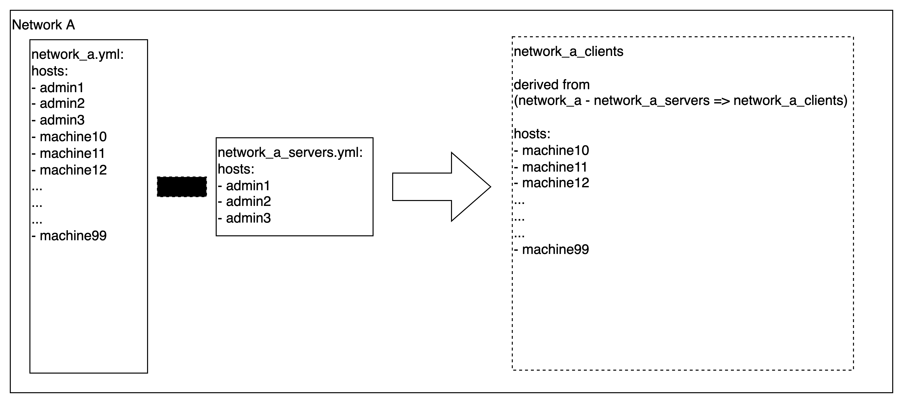
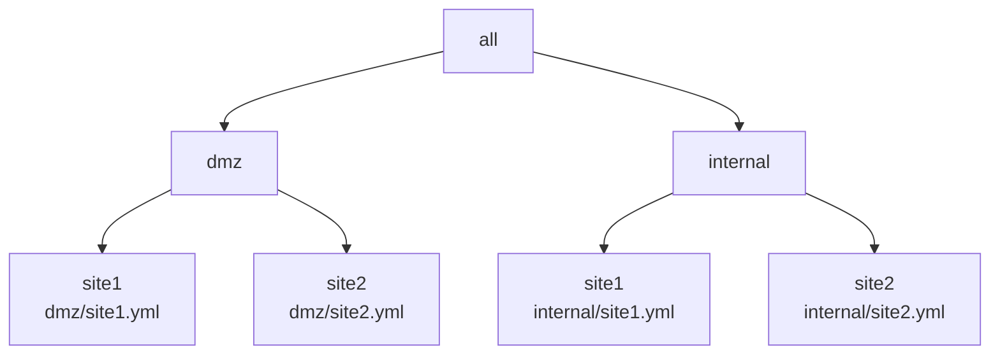
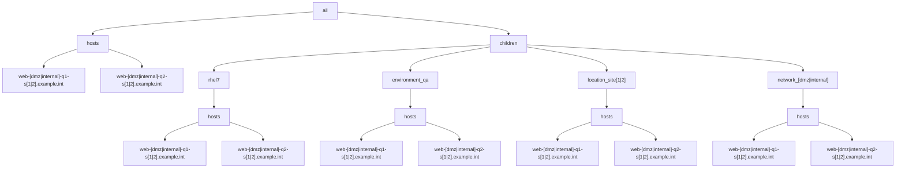

# Example 6: Using dynamic groups to derive large "subset" groups

This example use case is related to whenever the need exists to set up a set and disjoint set of sub-group configurations required for any playbook and corresponding roles (e.g., client/server configurations).

Basically / put simply, whenever there is the following conditions: 

1) a large group A, and 
2) a very small/finite subset group B within A, and 
3) the need exists to have a 3rd group C which is the difference of A - B = C, and 
4) the need to maintain the configuration state for group C in group_vars/groupC.yml format

Many use cases require network-specific servers/fixtures/assets to be setup for to serve/enable clients for network groups within an enterprise.
Some examples with servers within networks serving clients machines in the respective networks fitting this use case:

- router gateways
- firewalls
- dns servers
- ntp servers
- ldap servers
- postfix servers
- nfs servers
- repo/archive

and the list goes on...

The following section addresses the network/client needs for this use case specifically with respect to ansible YAML based inventory.


#### Simple Example for a derived group

Currently, functionality exists in ansible playbook to sufficiently limit hosts to an implied "subset" set of machines using the [patterns supported by the limit feature](https://docs.ansible.com/ansible/latest/user_guide/intro_patterns.html).  For example, to specify all hosts in webservers except those in atlanta:

```shell
ansible-playbook site.yml --limit 'webservers:!atlanta' 
```

Now consider the following inventory use case.


In the aforementioned diagram/example, to limit the targeted hosts to only clients:
```shell
ansible-playbook site.yml --limit 'network_a:!network_a_servers' 
```

However, if there are any configurations that the client group requires, then this method is insufficient.

Ideally, the YAML-based inventory could support derived groupings with operators similar to the limit directive.

For example, if the YAML-based inventory supported the following feature then the solution mentioned in the next section would not be necessary:

```yaml
all:
  children:
    network_a_clients: 
      hosts: network_a:!network_a_servers
      vars:
        network_server_list: "{{ groups['network_a_servers'] }}"
      
    network_a:
      hosts:
        admin01: {}
        admin02: {}
        admin03: {}
        machine10: {}
        machine11: {}
        machine12: {}
        ...
        ...
        ...
        machine99: {}
    
    network_a_servers:
      hosts:
        admin01: {}
        admin02: {}
        admin03: {}


```

But alas, the YAML-based ansible inventory does not support this feature, at least not at present.

#### Generalized Case

In the prior [Example 5](../example5/README.md), we successfully matched role-based group settings to an existing YAML-based inventory.

We also leveraged a special group called 'network_client' to apply the ntp client settings.

Maintaining such a group configuration can be problematic.

E.g., Say the following parameters are given:

* A 'network' (parent) group has 100, 1000, or lets say __N machines__ and 
* A subset 'network_server' group only has a far less _finite number_ of instances, say 2, 4, or __M machines__
* A derived 'network_client' defined as the parent group of __N machines__ minus the server group of __M machines__.

So given an inventory with a 'network' group of 1000 machines, and a 'network_server' group of 4 machines, then the 'network_client' group would have 996 machines. 

Maintaining a 'network_client' group for multiple use-cases would have to re-define the child group of __(N - M) machines__. 

This can present risks since then each 'network_client' group is almost the same size as the parent 'network_server' group and exposes risks of maintaining synchronization of the group.

Multiply this by the number of use cases having the same/similar pattern.

Ideally, we do not want to explicitly define and maintain a 'network_client' group since it can be simply derived from the obtaining the difference of the 'network' and 'network_server' groups.

The following example will look to resolve the challenge of deriving the 'network_client' child group.

## Overview

In this example there are 2 networks located at 2 sites resulting in 4 YAML inventory files, with hierarchy diagrammed as follows:




For each of the 4 inventory files, the following group/host hierarchy will be implemented:




Each site.yml inventory will be setup similar to the following with the "[dmz|internal]" and "[1|2]" regex patterns evaluated for each of the 4 cases:

```yaml
all:
  hosts:
    admin-[dmz|internal]-q1-s[1|2].example.int: 
      trace_var: site[1|2]/admin-[dmz|internal]-q1-s[1|2].example.int
      foreman: <94 keys>
    admin-[dmz|internal]-q2-s[1|2].example.int: 
      trace_var: site[1|2]/admin-[dmz|internal]-q1-s[1|2].example.int
      foreman: <94 keys>
    app-[dmz|internal]-q1-s[1|2].example.int: 
      trace_var: site[1|2]/app-[dmz|internal]-q1-s[1|2].example.int
      foreman: <94 keys>
    app-[dmz|internal]-q2-s[1|2].example.int: 
      trace_var: site[1|2]/app-[dmz|internal]-q1-s[1|2].example.int
      foreman: <94 keys>
    web-[dmz|internal]-q1-s[1|2].example.int:
      trace_var: site[1|2]/web-[dmz|internal]-q1-s[1|2].example.int
      foreman: <94 keys>
    web-[dmz|internal]-q2-s[1|2].example.int:
      trace_var: site[1|2]/rhel7/web-[dmz|internal]-q2-s[1|2].example.int
      foreman: <94 keys>
  children:
    rhel6:
      vars:
        trace_var: dmz/site1/rhel6
      hosts:
        admin-[dmz|internal]-q1-s[1|2].example.int: {}
    rhel7:
      vars:
        trace_var: site[1|2]/rhel7
      hosts:
        admin-[dmz|internal]-q2-s[1|2].example.int: {}
        app-[dmz|internal]-q1-s[1|2].example.int: {}
        app-[dmz|internal]-q2-s[1|2].example.int: {}
        web-[dmz|internal]-q1-s[1|2].example.int: {}
        web-[dmz|internal]-q2-s[1|2].example.int: {}
    environment_qa:
      vars:
        trace_var: site[1|2]/environment_qa
      hosts:
        admin-[dmz|internal]-q1-s[1|2].example.int: {}
        admin-[dmz|internal]-q1-s[1|2].example.int: {}
        app-[dmz|internal]-q1-s[1|2].example.int: {}
        app-[dmz|internal]-q2-s[1|2].example.int: {}
        web-[dmz|internal]-q1-s[1|2].example.int: {}
        web-[dmz|internal]-q2-s[1|2].example.int: {}
    location_site[1|2]:
      vars:
        trace_var: site[1|2]/location_site[1|2]
      hosts:
        admin-[dmz|internal]-q1-s[1|2].example.int: {}
        admin-[dmz|internal]-q1-s[1|2].example.int: {}
        app-[dmz|internal]-q1-s[1|2].example.int: {}
        app-[dmz|internal]-q2-s[1|2].example.int: {}
        web-[dmz|internal]-q1-s[1|2].example.int: {}
        web-[dmz|internal]-q2-s[1|2].example.int: {}
    network_[dmz|internal]:
      vars:
        trace_var: site[1|2]/network_[dmz|internal]
      hosts:
        admin-[dmz|internal]-q1-s[1|2].example.int: {}
        admin-[dmz|internal]-q1-s[1|2].example.int: {}
        app-[dmz|internal]-q1-s[1|2].example.int: {}
        app-[dmz|internal]-q2-s[1|2].example.int: {}
        web-[dmz|internal]-q1-s[1|2].example.int: {}
        web-[dmz|internal]-q2-s[1|2].example.int: {}
    ungrouped: {}

```

Each of the respective inventory files:

* [dmz/site1 inventory](./inventory/dmz/site1.yml)
* [dmz/site2 inventory](./inventory/dmz/site2.yml)
* [internal/site1 inventory](./inventory/internal/site1.yml)
* [internal/site2 inventory](./inventory/internal/site2.yml)


## Define NTP inventory groups

For the ntp playbook/role to work on both servers and clients, we will define the 'ntp_server' and 'ntp_client' groups to correctly scope the machines to be applied.

All machines in the 'network_dmz' group will have the __ntp_servers__ variable set to the externally defined ntp servers.

For each site in the 'network_internal' group, there will be 2 machines defined in the 'ntp_servers' group.
All ntp clients in the 'network_internal' group will have the __ntp_servers__ variable set to the 2 ntp_server machines in the respective site.

### Internal Network NTP Client Configuration

For the internal network inventory, the 'ntp_client_internal' group is defined with the parent group of 'ntp_client' without any children groups or hosts defined.  The group is a _placeholder_ group used by the dynamic group_by strategy/pattern later in this example.

[inventory/internal/ntp.yml](./inventory/internal/ntp.yml):
```yaml
all:
  children:
    ntp_client:
      vars:
        group_trace_var: internal/ntp.yml[ntp_client]
      children:
        ntp_client_internal: {}
    ntp_client_internal:
      vars:
        group_trace_var: internal/ntp.yml[ntp_client_internal]
      children:
        network_client: {}
    ntp_server:
      vars:
        group_trace_var: internal/ntp.yml[ntp_server]
      hosts:
        admin-q1-internal-s1.example.int: {}
        admin-q2-internal-s1.example.int: {}
        admin-q1-internal-s2.example.int: {}
        admin-q2-internal-s2.example.int: {}
    ntp:
      children:
        ntp_client: {}
        ntp_server: {}
```

The 'ntp_client_internal' _placeholder_ group also allows the binding to the respective group_vars found in [ntp_client_internal.yml](./internal/group_vars/ntp_client_internal.yml) needed for hosts that get applied to this group.

The expected results from the __ntp_servers__ variable evaluation in the ['ntp_client_internal'](./inventory/internal/group_vars/ntp_client_internal.yml) group would be as follows for each site.

site1:
```output
"ntp_servers": [
    "admin-q1-internal-s1.example.int",
    "admin-q2-internal-s1.example.int"
]

```

site2:
```output
ntp_servers: [
    "admin-q1-internal-s2.example.int",
    "admin-q2-internal-s2.example.int"
]
```


### DMZ Network NTP Client Configuration

The 'ntp-client' group will include all linux machines for the respective environment.
In this case, the environment will be defined with the existing test environment group named 'environment_test'.

Now we can define the YAML groups to be used by the 'ntp' playbook/role as follows:

[inventory/dmz/ntp.yml](./inventory/dmz/ntp.yml):
```yaml
all:
  children:
    ntp_client:
      children:
        environment_test: {}
    ntp:
      children:
        ntp_client: {}
```

Note that for the DMZ network, that there are no internal ntp servers and that all machines are ntp clients with the __ntp_server__ variable set to external/public ntp server machines.

This can be seen in the __ntp_servers__ variable in the ['ntp_client'](./inventory/dmz/group_vars/ntp_client.yml) group variable configuration:

```yaml
ntp_servers:
  - 0.rhel.pool.ntp.org
  - 1.rhel.pool.ntp.org
  - 2.rhel.pool.ntp.org
  - 3.rhel.pool.ntp.org

```

## NTP parent group
A ntp parent group is defined such that it contains all the related groups useful for targetting plays to run against for the entire NTP configuration playbook.

[inventory/internal/ntp.yml](./inventory/internal/ntp.yml):
```yaml
all:
  children:
    ntp_client:
      vars:
        group_trace_var: internal/ntp.yml[ntp_client]
      children:
        ntp_client_internal: {}
    ntp_client_internal:
      vars:
        group_trace_var: internal/ntp.yml[ntp_client_internal]
      children:
        network_client: {}
    ntp_server:
      vars:
        group_trace_var: internal/ntp.yml[ntp_server]
      hosts:
        admin-q1-internal-s1.example.int: {}
        admin-q2-internal-s1.example.int: {}
        admin-q1-internal-s2.example.int: {}
        admin-q2-internal-s2.example.int: {}
    ntp:
      children:
        ntp_client: {}
        ntp_server: {}
```

## Setup play to derive the ntp_client_internal group

Next we define a play to derive the ntp_client_internal group

[display-ntp-servers.yml](display-ntp-servers.yml):
```yaml
---

- name: "Define derived ntp_client_internal"
  hosts: localhost
  gather_facts: false
  connection: local
  tasks:

    - name: Derive __ntp_client_internal list of hosts based on difference of network_internal and ntp_server groups
      set_fact:
        __ntp_client_internal: "{{ groups['network_internal'] | difference(groups['ntp_server']) }}"

    - debug:
        var: groups['network_internal']
        verbosity: 1

    - debug:
        var: groups['ntp_server']
        verbosity: 1

    - debug:
        var: __ntp_client_internal
        verbosity: 1

    ## Using set_fact with delegate_to, delegate_facts and with_items to set facts derived on first play on localhost to targeted host
    ## ref: https://github.com/ansible/ansible/issues/20508
    - name: "Copy __ntp_client_internal fact to other servers"
      set_fact:
        __ntp_client_internal: "{{ __ntp_client_internal }}"
      delegate_to: "{{ item }}"
      delegate_facts: True
      with_items: "{{ groups['all'] }}"
      when: item != "localhost"

- name: "Apply ntp_client_internal group setting to machines in the derived list"
  hosts: network_internal
  gather_facts: false
  connection: local
  tasks:

    - debug:
        var: __ntp_client_internal
        verbosity: 1

    - name: Derive ntp_client_internal child group of hosts based on difference of network_internal and ntp_server
      when: inventory_hostname in __ntp_client_internal
      group_by:
        key: "ntp_client_internal"
        parents: ['ntp','ntp_client','network_internal']

- name: "Run trace var play for machines in the newly defined ntp_client_internal group"
#  hosts: ntp_client_internal
  hosts: ntp
  gather_facts: false
  connection: local
  tasks:

    - debug:
        var: trace_var
        verbosity: 1
    - debug:
        var: group_trace_var
        verbosity: 1
    - debug:
        var: group_names
        verbosity: 1
    - debug:
        var: foreman.ip
        verbosity: 1
    - debug:
        var: ntp_servers

```

## Expected Play Results

### Internal Network NTP Server Expected Results
Upon running the [display-ntp-servers.yml play](display-ntp-servers.yml), the expected results should be as follows for all machines defined in the ['ntp_server'](./inventory/internal/group_vars/ntp_server.yml) group:
```output
"ntp_servers": [
    "0.us.pool.ntp.org",
    "1.us.pool.ntp.org",
    "2.us.pool.ntp.org",
    "3.us.pool.ntp.org"
]

```

### Internal Network NTP Client Expected Results
Upon running the [display-ntp-servers.yml play](display-ntp-servers.yml), the expected results should be as follows for all machines defined in the ['ntp_client_internal'](./inventory/internal/group_vars/ntp_client_internal.yml) group:

site1:
```output
"ntp_servers": [
    "admin-q1-internal-s1.example.int",
    "admin-q2-internal-s1.example.int"
]

```

site2:
```output
ntp_servers: [
    "admin-q1-internal-s2.example.int",
    "admin-q2-internal-s2.example.int"
]
```


## Verify Play Run Results
Now we run the play for the internal network to determine if the correct ntp_server configuration is made for the server and client groups.

```shell
ansible-playbook -i ./inventory/internal display-ntp-servers.yml

PLAY [Define derived ntp_client_internal] *******************************************************************************************************************************************************************************************************************************

TASK [Derive __ntp_client_internal list of hosts based on difference of network_internal and ntp_server groups] *********************************************************************************************************************************************************
ok: [localhost]

TASK [debug] ************************************************************************************************************************************************************************************************************************************************************
skipping: [localhost]

TASK [debug] ************************************************************************************************************************************************************************************************************************************************************
skipping: [localhost]

TASK [debug] ************************************************************************************************************************************************************************************************************************************************************
skipping: [localhost]

TASK [Copy __ntp_client_internal fact to other servers] *****************************************************************************************************************************************************************************************************************
ok: [localhost -> admin-q1-internal-s1.example.int] => (item=admin-q1-internal-s1.example.int)
ok: [localhost -> admin-q2-internal-s1.example.int] => (item=admin-q2-internal-s1.example.int)
ok: [localhost -> app-q1-internal-s1.example.int] => (item=app-q1-internal-s1.example.int)
ok: [localhost -> app-q2-internal-s1.example.int] => (item=app-q2-internal-s1.example.int)
ok: [localhost -> web-q1-internal-s1.example.int] => (item=web-q1-internal-s1.example.int)
ok: [localhost -> web-q2-internal-s1.example.int] => (item=web-q2-internal-s1.example.int)
ok: [localhost -> admin-q1-internal-s2.example.int] => (item=admin-q1-internal-s2.example.int)
ok: [localhost -> admin-q2-internal-s2.example.int] => (item=admin-q2-internal-s2.example.int)
ok: [localhost -> app-q1-internal-s2.example.int] => (item=app-q1-internal-s2.example.int)
ok: [localhost -> app-q2-internal-s2.example.int] => (item=app-q2-internal-s2.example.int)
ok: [localhost -> web-q1-internal-s2.example.int] => (item=web-q1-internal-s2.example.int)
ok: [localhost -> web-q2-internal-s2.example.int] => (item=web-q2-internal-s2.example.int)

PLAY [Apply ntp_client_internal group setting to machines in the derived list] ******************************************************************************************************************************************************************************************

TASK [debug] ************************************************************************************************************************************************************************************************************************************************************
skipping: [admin-q1-internal-s1.example.int]
skipping: [admin-q2-internal-s1.example.int]
skipping: [app-q1-internal-s1.example.int]
skipping: [app-q2-internal-s1.example.int]
skipping: [web-q1-internal-s1.example.int]
skipping: [web-q2-internal-s1.example.int]
skipping: [admin-q1-internal-s2.example.int]
skipping: [admin-q2-internal-s2.example.int]
skipping: [app-q1-internal-s2.example.int]
skipping: [app-q2-internal-s2.example.int]
skipping: [web-q1-internal-s2.example.int]
skipping: [web-q2-internal-s2.example.int]

TASK [Derive ntp_client_internal child group of hosts based on difference of network_internal and ntp_server] ***********************************************************************************************************************************************************
skipping: [admin-q1-internal-s1.example.int]
skipping: [admin-q2-internal-s1.example.int]
changed: [app-q1-internal-s1.example.int]
changed: [app-q2-internal-s1.example.int]
changed: [web-q1-internal-s1.example.int]
changed: [web-q2-internal-s1.example.int]
skipping: [admin-q1-internal-s2.example.int]
skipping: [admin-q2-internal-s2.example.int]
changed: [app-q1-internal-s2.example.int]
changed: [app-q2-internal-s2.example.int]
changed: [web-q1-internal-s2.example.int]
changed: [web-q2-internal-s2.example.int]

PLAY [Run trace var play for machines in the newly defined ntp_client_internal group] ***********************************************************************************************************************************************************************************

TASK [debug] ************************************************************************************************************************************************************************************************************************************************************
skipping: [admin-q1-internal-s1.example.int]
skipping: [admin-q2-internal-s1.example.int]
skipping: [admin-q1-internal-s2.example.int]
skipping: [admin-q2-internal-s2.example.int]
skipping: [app-q1-internal-s1.example.int]
skipping: [app-q2-internal-s1.example.int]
skipping: [web-q1-internal-s1.example.int]
skipping: [web-q2-internal-s1.example.int]
skipping: [app-q1-internal-s2.example.int]
skipping: [app-q2-internal-s2.example.int]
skipping: [web-q1-internal-s2.example.int]
skipping: [web-q2-internal-s2.example.int]

TASK [debug] ************************************************************************************************************************************************************************************************************************************************************
skipping: [admin-q1-internal-s1.example.int]
skipping: [admin-q2-internal-s1.example.int]
skipping: [admin-q1-internal-s2.example.int]
skipping: [admin-q2-internal-s2.example.int]
skipping: [app-q1-internal-s1.example.int]
skipping: [app-q2-internal-s1.example.int]
skipping: [web-q1-internal-s1.example.int]
skipping: [web-q2-internal-s1.example.int]
skipping: [app-q1-internal-s2.example.int]
skipping: [app-q2-internal-s2.example.int]
skipping: [web-q1-internal-s2.example.int]
skipping: [web-q2-internal-s2.example.int]

TASK [debug] ************************************************************************************************************************************************************************************************************************************************************
skipping: [admin-q1-internal-s1.example.int]
skipping: [admin-q2-internal-s1.example.int]
skipping: [admin-q1-internal-s2.example.int]
skipping: [admin-q2-internal-s2.example.int]
skipping: [app-q1-internal-s1.example.int]
skipping: [app-q2-internal-s1.example.int]
skipping: [web-q1-internal-s1.example.int]
skipping: [web-q2-internal-s1.example.int]
skipping: [app-q1-internal-s2.example.int]
skipping: [app-q2-internal-s2.example.int]
skipping: [web-q1-internal-s2.example.int]
skipping: [web-q2-internal-s2.example.int]

TASK [debug] ************************************************************************************************************************************************************************************************************************************************************
skipping: [admin-q1-internal-s1.example.int]
skipping: [admin-q2-internal-s1.example.int]
skipping: [admin-q1-internal-s2.example.int]
skipping: [admin-q2-internal-s2.example.int]
skipping: [app-q1-internal-s1.example.int]
skipping: [app-q2-internal-s1.example.int]
skipping: [web-q1-internal-s1.example.int]
skipping: [web-q2-internal-s1.example.int]
skipping: [app-q1-internal-s2.example.int]
skipping: [app-q2-internal-s2.example.int]
skipping: [web-q1-internal-s2.example.int]
skipping: [web-q2-internal-s2.example.int]

TASK [debug] ************************************************************************************************************************************************************************************************************************************************************
ok: [admin-q1-internal-s1.example.int] => {
    "ntp_servers": [
        "0.us.pool.ntp.org",
        "1.us.pool.ntp.org",
        "2.us.pool.ntp.org",
        "3.us.pool.ntp.org"
    ]
}
ok: [admin-q2-internal-s1.example.int] => {
    "ntp_servers": [
        "0.us.pool.ntp.org",
        "1.us.pool.ntp.org",
        "2.us.pool.ntp.org",
        "3.us.pool.ntp.org"
    ]
}
ok: [admin-q1-internal-s2.example.int] => {
    "ntp_servers": [
        "0.us.pool.ntp.org",
        "1.us.pool.ntp.org",
        "2.us.pool.ntp.org",
        "3.us.pool.ntp.org"
    ]
}
ok: [admin-q2-internal-s2.example.int] => {
    "ntp_servers": [
        "0.us.pool.ntp.org",
        "1.us.pool.ntp.org",
        "2.us.pool.ntp.org",
        "3.us.pool.ntp.org"
    ]
}
ok: [app-q1-internal-s1.example.int] => {
    "ntp_servers": [
        "admin-q1-internal-s1.example.int",
        "admin-q2-internal-s1.example.int"
    ]
}
ok: [app-q2-internal-s1.example.int] => {
    "ntp_servers": [
        "admin-q1-internal-s1.example.int",
        "admin-q2-internal-s1.example.int"
    ]
}
ok: [web-q1-internal-s1.example.int] => {
    "ntp_servers": [
        "admin-q1-internal-s1.example.int",
        "admin-q2-internal-s1.example.int"
    ]
}
ok: [web-q2-internal-s1.example.int] => {
    "ntp_servers": [
        "admin-q1-internal-s1.example.int",
        "admin-q2-internal-s1.example.int"
    ]
}
ok: [app-q1-internal-s2.example.int] => {
    "ntp_servers": [
        "admin-q1-internal-s2.example.int",
        "admin-q2-internal-s2.example.int"
    ]
}
ok: [app-q2-internal-s2.example.int] => {
    "ntp_servers": [
        "admin-q1-internal-s2.example.int",
        "admin-q2-internal-s2.example.int"
    ]
}
ok: [web-q1-internal-s2.example.int] => {
    "ntp_servers": [
        "admin-q1-internal-s2.example.int",
        "admin-q2-internal-s2.example.int"
    ]
}
ok: [web-q2-internal-s2.example.int] => {
    "ntp_servers": [
        "admin-q1-internal-s2.example.int",
        "admin-q2-internal-s2.example.int"
    ]
}

PLAY RECAP **************************************************************************************************************************************************************************************************************************************************************
admin-q1-internal-s1.example.int : ok=1    changed=0    unreachable=0    failed=0    skipped=6    rescued=0    ignored=0   
admin-q1-internal-s2.example.int : ok=1    changed=0    unreachable=0    failed=0    skipped=6    rescued=0    ignored=0   
admin-q2-internal-s1.example.int : ok=1    changed=0    unreachable=0    failed=0    skipped=6    rescued=0    ignored=0   
admin-q2-internal-s2.example.int : ok=1    changed=0    unreachable=0    failed=0    skipped=6    rescued=0    ignored=0   
app-q1-internal-s1.example.int : ok=2    changed=1    unreachable=0    failed=0    skipped=5    rescued=0    ignored=0   
app-q1-internal-s2.example.int : ok=2    changed=1    unreachable=0    failed=0    skipped=5    rescued=0    ignored=0   
app-q2-internal-s1.example.int : ok=2    changed=1    unreachable=0    failed=0    skipped=5    rescued=0    ignored=0   
app-q2-internal-s2.example.int : ok=2    changed=1    unreachable=0    failed=0    skipped=5    rescued=0    ignored=0   
localhost                  : ok=2    changed=0    unreachable=0    failed=0    skipped=3    rescued=0    ignored=0   
web-q1-internal-s1.example.int : ok=2    changed=1    unreachable=0    failed=0    skipped=5    rescued=0    ignored=0   
web-q1-internal-s2.example.int : ok=2    changed=1    unreachable=0    failed=0    skipped=5    rescued=0    ignored=0   
web-q2-internal-s1.example.int : ok=2    changed=1    unreachable=0    failed=0    skipped=5    rescued=0    ignored=0   
web-q2-internal-s2.example.int : ok=2    changed=1    unreachable=0    failed=0    skipped=5    rescued=0    ignored=0   


```


