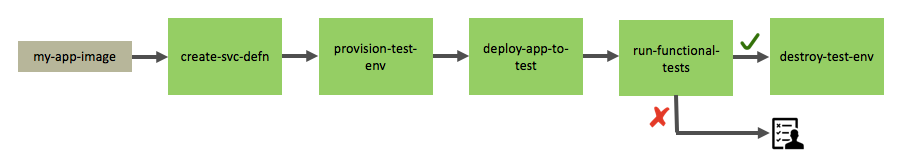

# On-Demand Test Environments With Ansible and Shippable

one of the biggest challenges to implementing an end-to-end [continuous delivery](https://martinfowler.com/bliki/continuousdelivery.html) pipeline is making sure adequate test automation is in place. however, even if you have automated across your entire test suite, there is a second challenge: how do you manage test infrastructure and environments without breaking the bank?

if you want to move towards continuous delivery, you need to execute a majority of your tests for each code change in a pristine environment that is as close to your production environment as possible. this ensures that code defects are identified immediately and every code change is therefore "shippable." however, creating these environments and updating them with each new application version or every time the config changes adds a lot of overhead. if you're testing an application with many tiers or microservices, the complexity increases since each tier might need to be tested independently in its own environment against specific versions of other tiers.

the utopia of test automation is the following:

-   environment definitions are represented by infrastructure-as-code tools like ansible, terraform, puppet, or chef. the provisioning scripts are committed to source control and versioned, so you can go back to an earlier state if needed.
-   all (or at least a good majority) of your tests are automated and either committed to source control or hosted on services such as nouvola, sauce, etc.
-   you have a completely automated deployment pipeline that automatically spins up a production-like test environment for every code change, triggers your automation, and if all tests succeed, destroys the environment. if tests fail, the right folks are notified and the environment is kept live until someone can debug the failures.

the first step is already happening in most organizations. the devops movement encouraged ops teams to start writing scripts to provision and manage environments and infrastructure, and multiple vendors support this effort quite effectively. the second step is still a challenge in many organizations, but this is really something that needs executive buy-in and a commitment to automation, even if it slows down product development for a while.

this whitepaper presents a method of implementing the third step - spinning up test environments on-demand and destroying them automatically after the automated test suite is executed.

## the scenario

to make things simpler, we'll skip the ci step which builds and tests the application docker image and pushes it to amazon ecr. this can be accomplished by following instructions for ci: [run ci for a sample app](http://docs.shippable.com/getting-started/ci-sample/) .



our example follows the steps below:

1\. a service definition, aka [manifest](http://docs.shippable.com/platform/workflow/job/manifest/) , is created, including the docker image and some options

2\. a test environment is provisioned using [ansible](https://www.ansible.com/) under the cover. ansible config files are templatized using environment variables defined in

shippable, allowing ansible config to become highly reusable to provision multiple test clusters if needed.

3\. the manifest is deployed to the test environment and functional test suite is triggered

4\. if tests pass, the test environment is destroyed using ansible and test owner is notified.

5\. if tests fail, the test owner is notified and the environment is not destroyed. the test owner can always destroy the environment manually after he/she has extracted the information they need about the failure.

## before we start

you will need the following to implement this scenario:

-   a [github](https://github.com/) or [bitbucket](https://bitbucket.org/product) account that you will use to login to shippable
-   an aws account
-   a [docker hub](https://hub.docker.com/) account (or amazon ecr/gcr/quay)
-   ideally, some familiarity with ansible is desirable, though not required.

if you're not familiar with shippable, here are some basic concepts you should know before you start:

-   **configuration** : the assembly lines configuration for shippable resides in a [shippable.yml](http://docs.shippable.com/platform/tutorial/workflow/shippable-jobs-yml/) file. the repository that contains this config in your source control is called a [sync repository, aka syncrepo](http://docs.shippable.com/platform/tutorial/workflow/crud-syncrepo) . a syncrepo is added through your shippable ui to add your assembly line.
-   [jobs](http://docs.shippable.com/platform/workflow/job/overview/) are executable units of your pipeline and can perform any activity such as ci, provisioning an environment, deploying your application, or running pretty much any custom script. a simple way to think of it is, if something can execute in the shell of your laptop, it can execute as a job.
-   to execute, such as credentials, pointer to [resources](http://docs.shippable.com/platform/workflow/resource/overview/) typically contain information needed for a jobs [cluster](http://docs.shippable.com/platform/workflow/resource/cluster/) on a container engine or an [image](http://docs.shippable.com/platform/workflow/resource/image/) on a hub, or any [key-value pairs](http://docs.shippable.com/platform/workflow/resource/params/) . resources are also used to store information produced by a job which can be then accessed by downstream jobs.
-   [integrations](http://docs.shippable.com/platform/integration/overview/) are used to configure connections to third-party services, such as aws, docker hub, gke, artifactory, etc.
-   the [single pane of glass](http://docs.shippable.com/platform/visibility/single-pane-of-glass-spog/) view shows a real-time, interactive view of your assembly line(s).

## how the sample application is structured

our sample repositories are on github:

-   the sample application that we will run functional tests on is a voting app that is built using python flask and redis. the source for the front end (flask) can be found in the [vote\_fe](https://github.com/devops-recipes/vote_fe) repository and the backend (redis) in the [vote\_be](https://github.com/devops-recipes/vote_be) repository. the shippable.yml in these repositories contains the ci configuration to build and deploy their docker images to their public repositories on docker hub.
-   [devops-recipes/on\_demand\_test\_environments](https://github.com/devops-recipes/on-demand-test-environments) contains the shippable configuration and required ansible playbooks for this scenario. the sections below explain in detail how the shippable configuration is built.

### step 1: enabling ci for the sample application

-   fork the [vote\_fe](https://github.com/devops-recipes/vote_fe) and the [vote\_be](https://github.com/devops-recipes/vote_be) repositories into your scm.
-   login to shippable with your scm account and enable ci using [these steps](http://docs.shippable.com/ci/enable-project/) .
-   create a docker registry integration using [these steps](http://docs.shippable.com/platform/integration/dockerregistrylogin/) and call it drship\_dockerhub. if you use a different integration name, replace drship\_dockerhub in the shippable.yml file.
-   specify your docker repository and account in the shippable.yml file and commit the file.
-   trigger ci for these repositories using [these steps](http://docs.shippable.com/ci/trigger-job/) .

at the end of step 1, you should have two images published in your docker registry integration.

### step 2: create the service definition

#### a. define the resource in the shippable.yml file

the **shippable.yml** file can be committed in one of the app repositories or to a separate repository. we have used a different repository, [devops-recipes/on\_demand\_test\_environments](https://github.com/devops-recipes/on-demand-test-environments) , in our sample. the repository containing your jobs and resources ymls is called a [sync repository](http://docs.shippable.com/platform/tutorial/workflow/crud-syncrepo/) and represents your workflow configuration.

```yaml
resources: 
###---------------------------------------------------------------# 
###----------------------- build/ci resources --------------------# 
###---------------------------------------------------------------# 
# back-end image 
  - name: vote_be_odte 
    type: image 
    # replace dr-dockerhub with your docker registry integration name 
    integration: dr-dockerhub pointer: 
    # replace devopsrecipes/vote_be with your repository 
      sourcename: "devopsrecipes/vote_be" 
      seed: 
      # specify the latest tag of the image in your docker registry 
        versionname: "master.2" 

# front-end image 
  - name: vote_fe_odte 
    type: image 
    # replace dr-dockerhub with your docker registry integration name 
    integration: dr-dockerhub 
    pointer: 
    # replace devopsrecipes/vote_fe with your repository 
      sourcename: "devopsrecipes/vote_fe" 
    seed: 
    # specify the latest tag of the image in your docker registry 
    versionname: "master.3"

# docker options to expose port 80 on the front-end container and link the redis container 
  - name: vote_fe_options_odte 
    type: dockeroptions 
    version: 
      memory: 128 
      portmappings: 
        - "80:5000/tcp" 
      links: 
        - vote_be_odte:redis
```

#### b. define the jobs in the shippable.yml file

`create_app_man_odte` is a [manifest](http://docs.shippable.com/platform/workflow/job/manifest) job that defines all the containers that run in the ecs cluster. this definition is versioned and each version is immutable.

add the following to your shippable.yml file and commit it.

```yaml
jobs: 
#---------------------------------------------------------------#
#------------------- build/ci with shippable ci ----------------#
#---------------------------------------------------------------#

# ci job definition. the image that is pushed to docker hub is specified in an out image resource. 
# this image resource becomes an in to the manifest job and triggers the manifest job whenever 
# a new image version (tag) is created. 

  - name: vote_be_runci 
    type: runci 
    steps: 
      - out: vote_be_odte 

  - name: vote_fe_runci 
    type: runci 
    steps: 
      - out: vote_fe_odte 

# application service definition 

  - name: create_app_man_odte 
    type: manifest 
    steps: 
       - in: vote_fe_odte 
       - in: vote_fe_options_odte 
         applyto: 
           - vote_fe_odte 
       - in: vote_be_odte
```

### step 3: provision the test environment

we use an ansible playbook to create the ecs cluster, whose implementation can be found [here](https://github.com/devops-recipes/on-demand-test-environments/tree/master/infra/provision-ecs-ansible) .

we templatize the ansible configuration files to make them flexible.the configuration in then defined by shippable generated environment variables and resources.

#### a. ansible.cfg file

here we use the scripts\_repo\_odte\_state environment variable to point to the root of the repository when the playbook is run in a shippable node.

```ini
[defaults] 
# update, as needed, for your scenario 
host_key_checking=false 
inventory = ${scripts_repo_odte_state}/infra/provision-ecs-ansible/inventory/ 

[ssh_connection] 
# for running on ubuntu 
control_path=%(directory)s/%%h-%%r
```

#### b. group variables

all the variables used by ansible modules to create the cluster are defined as placeholders. these placeholders are replaced at runtime by values defined in a [params](http://docs.shippable.com/platform/workflow/resource/params/#params) resource.

```yaml
ec2_instance_type: "${ec2_instance_type}" 
ec2_image: "${ec2_image}" 
ec2_keypair: "${ec2_keypair}" 
ec2_user_data: "#!/bin/bash \n echo ecs_cluster=\"${ecs_cluster_name}\" >> /etc/ecs/ecs.config" 
ec2_region: "${ec2_region}" 
ec2_tag_role: "${ec2_tag_role}" 
ec2_tag_type: "${ec2_tag_type}" 
ec2_volume_size: ${ec2_volume_size} 
ec2_count: ${ec2_count} 
state_res_name: "${state_res_name}" 
ec2_security_group: "${test_public_sg_id}" 
ec2_subnet_ids: ["${test_public_sn_01_id}","${test_public_sn_02_id}"] 
ec2_tag_environment: "${environment}" 
ecs_cluster_name: "${ecs_cluster_name}"

```


#### c. define ansible configuration in the shippable.yml file

```yaml
resources: 

#---------------------------------------------------------------# 
#-------------------- common infra resources -------------------# 
#---------------------------------------------------------------# 

# ansible scripts repository 
  - name: scripts_repo_odte 
    type: gitrepo 
    integration: "dr-github" 
    pointer: 
      sourcename: "devops-recipes/on-demand-test-environments" 
      branch: master 

# aws integration that sets up the aws cli environment used by ansible playbook 
  - name: aws_cli_config_odte 
    type: cliconfig 
    integration: dr-aws-keys 
    pointer: 
      region: us-east-1 

# secops approved ami 
  - name: ami_sec_approved_odte 
    type: params 
    version: 
      params: 
        ami_id: "ami-9eb4b1e5" 

#---------------------------------------------------------------# 
#----------------------- test vpc resources --------------------# 
#---------------------------------------------------------------# 

# test environment config 
  - name: test_conf_odte 
    type: params 
    version: 
      params: 
        ec2_region: "us-east-1" 
        ec2_tag_role: "dr-on-demand-test-environments" 
        ec2_tag_type: "ecs-container-instance" 
        ec2_volume_size: 30 
        ec2_count: 1 
        state_res_name: "test_info_odte" 
        ecs_cluster_name: "test_env_ecs_odte" 
        environment: "test" 
        ec2_instance_type: "t2.large" 
        ec2_image: "ami-9eb4b1e5" 
        ec2_keypair: "ambarish-useast1" 

# test vpc info 
  - name: test_vpc_conf_odte 
    type: params 
    version: 
      params: 
        test_vpc_id: "vpc-a36912da" 
        test_public_sg_id: "sg-c30fc8b6" 
        test_public_sn_01_id: "subnet-34378e50" 
        test_public_sn_02_id: "subnet-34378e50" 
        region: "us-east-1" 

# output of test ecs provisioning 
  - name: test_info_odte 
    type: params 
    version: 
      params: 
        seed: "initial_version" 

# reference to ecs test cluster 
  - name: test_env_ecs_odte 
  type: cluster 
  integration: "dr-aws-keys" 
  pointer: 
     sourcename : "test_env_ecs_odte" 
     region: "us-east-1"

```

#### d. augment the ansible playbook ansible-ecs-provision that provisions the ecs cluster

after the cluster is created, we use shippable platform resources and api to persist important cluster metadata such as the arn and public ip of the cluster in a params resource test\_info\_odte and the cluster resource test\_env\_ecs\_odte.

the ansible-ecs-provision playbook calls two roles to provision the ecs cluster.

```yaml
--- 
### provision aws ecs cluster 
- hosts: localhost 
  connection: local 
  gather_facts: false 
  user: root 
  pre_tasks: 
    - include_vars: group_vars/ecs-cluster-vars.yml 
  roles: 
    - ecs-cluster-provision 
    - ec2-container-inst-provision 
  post_tasks: 
    - name: refresh hosts inventory list 
      meta: refresh_inventory
```

- ecs-cluster-provision

```yaml
--- 
# update shippable resource state with this job number 
- name: run cmd 
  shell: | 
    shipctl post_resource_state "" versionname "build-${build_number}" 

# provision ecs cluster 
- name: create ecs cluster 
  ecs_cluster: 
    name: "" 
    state: present 
  register: ecs 

# update shippable resource state with provisioned cluster_arn 
- name: run cmd 
  shell: | 
    shipctl put_resource_state "" cluster_arn "" 
    shipctl put_resource_state "" test_ecs_cluster_id ""
```

- ec2-container-inst-provision

```yaml
--- 
- name: provision instances with tag 
  local_action: 
    module: ec2 
    key_name: "" 
    group_id: "" 
    instance_type: "" 
    instance_profile_name: "ecsinstancerole" 
    image: "" 
    user_data: "" 
    vpc_subnet_id: "" 
    region: "" 
    instance_tags: '{"name":"","role":"","type":"","environment":""}' 
    assign_public_ip: yes 
    wait: true 
    exact_count: "" 
    count_tag: 
      role: "" 
    volumes: 
      - device_name: /dev/xvda 
      volume_type: gp2 
      volume_size: "" 
      delete_on_termination: true 
   register: ec2 

- add_host: 
    name: "{{item.public_ip}}" 
    groups: tag_type_,tag_environment_ 
    ec2_region: "" 
    ec2_tag_name: "" 
    ec2_tag_role: "" 
    ec2_tag_type: "" 
    ec2_tag_environment: "" 
    ec2_ip_address: "{{item.public_ip}}" 
  with_items: "" 

- name: wait for the instances to boot by checking the ssh port 
  wait_for: host={{item.public_ip}} port=22 delay=15 timeout=300 state=started 
  with_items: "" 

# update shippable resource state 
  - name: run cmd 
    shell: | 
      shipctl put_resource_state "" "inst_{{item.ami_launch_index}}_public_ip" "{{item.public_ip}}" 
      shipctl put_resource_state "" "inst_{{item.ami_launch_index}}_id" "{{item.id}}" 
      shipctl put_resource_state "" "region" "" 
      shipctl put_resource_state "" "inst_{{item.ami_launch_index}}_public_ip" "{{item.public_ip}}" 
      shipctl put_resource_state "" "inst_{{item.ami_launch_index}}_id" "{{item.id}}" 
    with_items: ""

```

[shipctl](http://docs.shippable.com/platform/tutorial/workflow/using-shipctl/#shipctl-reference) provides a comprehensive library of utilities that can be used to extract and persist useful data in a shippable param or state resource. this data can then be used by jobs downstream.

#### e. define the shippable job that runs the ansible playbook ansible-ecs-provision.yml

add the following to shippable.yml file and commit it.

```yaml
--- 
- name: provision instances with tag 
  local_action: 
    module: ec2 
    key_name: "" 
    group_id: "" 
    instance_type: "" 
    instance_profile_name: "ecsinstancerole" 
    image: "" 
    user_data: "" 
    vpc_subnet_id: "" 
    region: "" 
    instance_tags: '{"name":"","role":"","type":"","environment":""}' 
    assign_public_ip: yes 
    wait: true 
    exact_count: "" 
    count_tag: 
      role: "" 
    volumes: 
       - device_name: /dev/xvda 
         volume_type: gp2 
         volume_size: "" 
         delete_on_termination: true 
   register: ec2 

- add_host: 
    name: "{{item.public_ip}}" 
    groups: tag_type_,tag_environment_ 
    ec2_region: "" 
    ec2_tag_name: "" 
    ec2_tag_role: "" 
    ec2_tag_type: "" 
    ec2_tag_environment: "" 
    ec2_ip_address: "{{item.public_ip}}" 
  with_items: "" 

- name: wait for the instances to boot by checking the ssh port 
  wait_for: host={{item.public_ip}} port=22 delay=15 timeout=300 state=started 
  with_items: "" 

- name: display ecs cluster 
  debug: 
    msg: "{{item}}" 
  with_items: "" 

# update shippable resource state 
- name: run cmd 
  shell: | 
    shipctl put_resource_state "" "inst_{{item.ami_launch_index}}_public_ip" "{{item.public_ip}}" 
    shipctl put_resource_state "" "inst_{{item.ami_launch_index}}_id" "{{item.id}}" 
    shipctl put_resource_state "" "inst_{{item.ami_launch_index}}_public_dns" "{{item.public_dns_name}}" 
    shipctl put_resource_state "" "region" "" 
    shipctl put_resource_state "" "inst_{{item.ami_launch_index}}_public_ip" "{{item.public_ip}}" 
    shipctl put_resource_state "" "inst_{{item.ami_launch_index}}_id" "{{item.id}}" 
  with_items: ""

```


### step 4: deploy the application to the test ecs environment

`deploy_app_test_odte` is a [deploy](http://docs.shippable.com/platform/workflow/job/deploy) job, which creates the service and task definition in the ecs cluster and starts the service. since it needs to run after the ecs cluster is created in the workflow, **prov\_test\_vpc\_odte** is specified as an input.

add the following to the shippable.yml file and commit it.

```yaml
jobs: 

##---------------------------------------------------------------# 
##-------------------- app release automation -------------------# 
##---------------------------------------------------------------# 

# deploy to test environment 
  - name: deploy_app_test_odte 
    type: deploy 
    steps: 
      - in: create_app_man_odte 
        switch: off 
      - in: prov_test_vpc_odte 
      - in: test_env_ecs_odte 
        switch: off 
      - task: managed

```


### step 5: run functional tests on the test cluster

add the **`deploy_app_test_odte`** job to your **shippable.yml** file. this job extracts the public dns of the ecs cluster from the test\_info\_odte params resource and passes it to the script that runs some tests using the public dns.

it is a [runsh](http://docs.shippable.com/platform/workflow/job/runsh/) job that lets you run any shell script. since it needs to run after the application is deployed in the workflow, test\_env\_ecs\_odte is specified as an input. in addition, we also provide the manifest job as an input to the job.

```yaml
jobs: 

# run system integration testing 
  - name: sit_odte 
    type: runsh 
    steps: 
      - in: scripts_repo_odte 
        switch: off 
      - in: deploy_app_test_odte 
      - task: 
        # run tests 
        - script: | 
            pushd $(shipctl get_resource_state "scripts_repo_odte")/tests 
              params_json=$(shipctl get_resource_version_key test_info_odte params) 
              cluster_dns=$(echo $params_json | jq -r .inst_0_public_dns) 
              echo "ecs cluster dns: "$cluster_dns 
              ./run-tests.sh $cluster_dns 
            popd 
  on_success: 
    - script: echo "success" 
  on_failure: 
    - script: echo "failure"

```


### step 5: deprovision the cluster

#### a. add the **`deprov_test_infra_ode`** job to your **shippable.yml** file

it is a [runsh](http://docs.shippable.com/platform/workflow/job/runsh/) job that lets you run any shell script. since it needs to run after the system integrations tests are run, sit\_odte is specified as an input.

```yaml
jobs: 

#---------------------------------------------------------------# 
#----------------------- deprov test infra----------------------# 
#---------------------------------------------------------------# 

# deprov test infra with ansible 
  - name: deprov_test_infra_odte 
    type: runsh 
    steps: 
      - in: sit_odte 
      - in: aws_cli_config_odte 
        switch: off 
      - in: test_vpc_conf_odte 
        switch: off 
      - in: test_conf_odte 
        switch: off 
      - in: test_info_odte 
        switch: off 
      - in: scripts_repo_odte 
        switch: off 
      - in: ami_sec_approved_odte 
        switch: off 
      - task: 
        - script: shipctl replace 
            $scripts_repo_odte_state/infra/provision-ecs-ansible/ansible.cfg 
            $scripts_repo_odte_state/infra/provision-ecs-ansible/group_vars/ecs-cluster-vars.yml 
        - script: sudo pip install boto3 
        - script: | 
            cd $scripts_repo_odte_state/infra/provision-ecs-ansible 
            ansible-playbook -v ansible-ecs-terminate.yml 
    on_success: 
      - script: echo "success" 
    on_failure: 
      - script: echo "failure"
 
```

#### b. commit shippable.yml and create a sync repo in your shippable account

follow [these instructions](http://docs.shippable.com/platform/tutorial/workflow/crud-syncrepo/) to import your configuration files into your shippable account.

your pipeline should now look like this in the [spog](http://docs.shippable.com/platform/visibility/single-pane-of-glass-spog/) view.


  
different sections of the pipeline expanded.


### 

### 

### 6\. trigger your pipeline

right click on create\_app\_man\_odtein the [spog](http://docs.shippable.com/platform/visibility/single-pane-of-glass-spog/) and click on **build job** . this will trigger the entire pipeline.


####   
screenshot of the manifest job

##### 

#### screenshot of the cluster provision job

#### 

#### screenshot of resources populated by the cluster provision job

##### 


####   
screenshot of the deploy job

#### 

#### screenshot of the deprovision job


Testing Ansible (software) Docker (software) career Repository (version control) application source control CI/CD

## References

* https://dzone.com/articles/on-demand-test-environments-with-ansible-and-shipp
* https://github.com/devops-recipes/on-demand-test-environments
* https://github.com/devops-recipes/on-demand-test-environments/blob/master/shippable.yml
