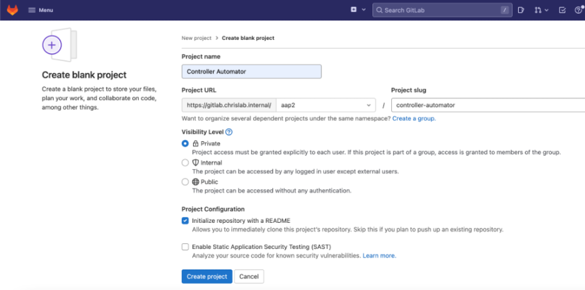
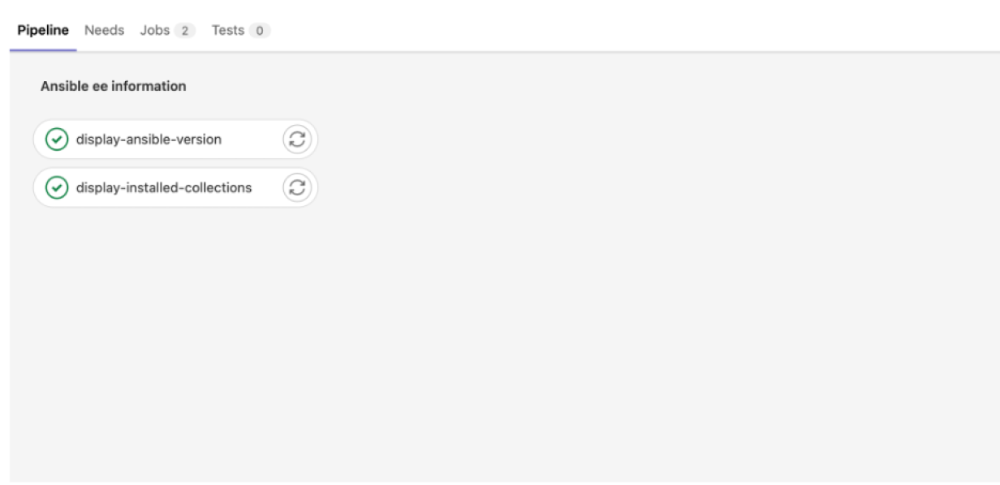
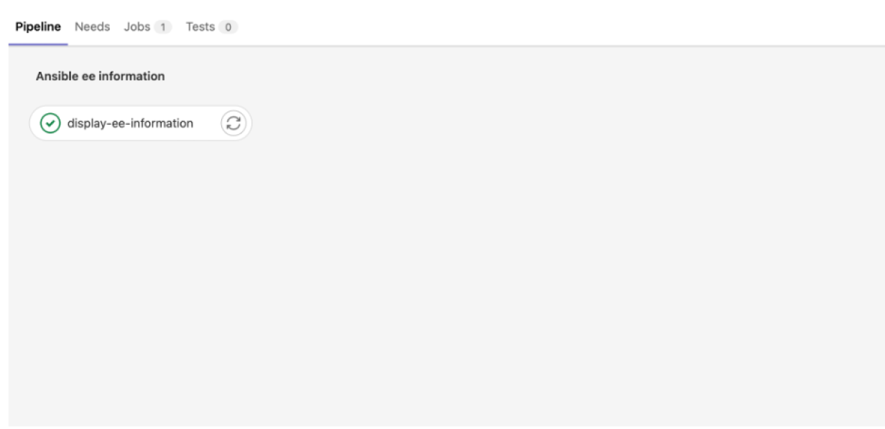
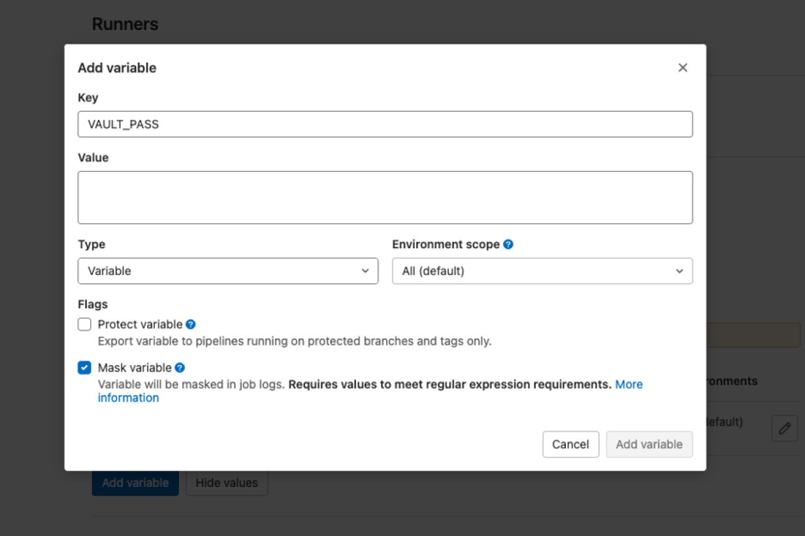
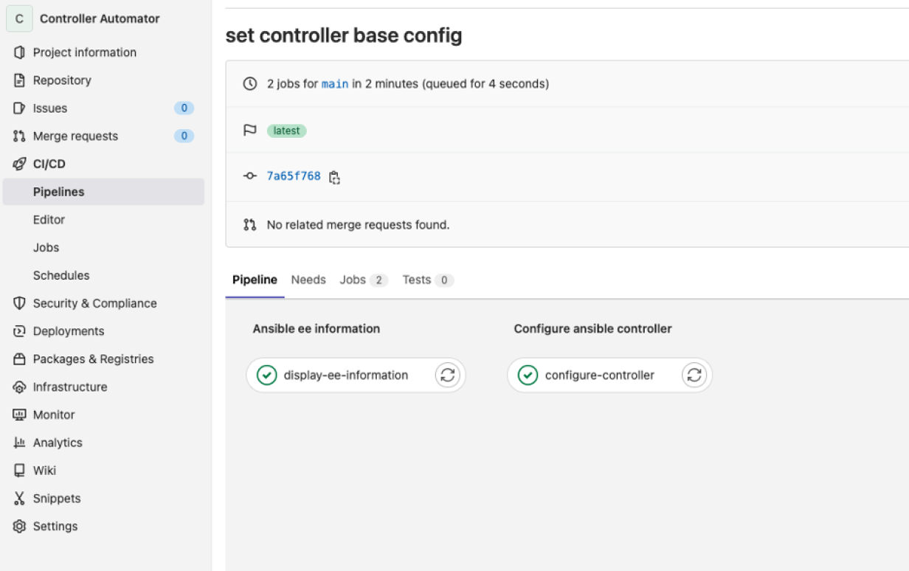
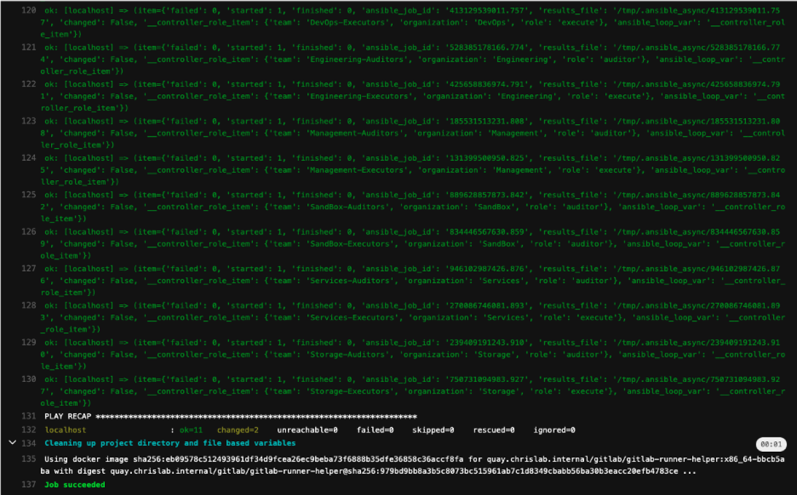
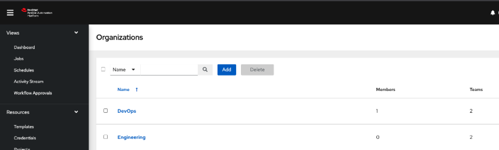

# Set up base configurations for Ansible automation controller using GitLab CI

## Objective

Write Ansible automation controller configurations in code and initiate a pipeline with a code commit.

## Overview

The previous article, [Set up GitLab CI and GitLab Runner to configure Ansible automation controller](aap-gitlab-runner-ansible-config-code.md), explained how to set up GitLab Runner to manage an [Ansible](http://www.redhat.com/en/topics/automation/learning-ansible-tutorial?intcmp=701f20000012ngPAAQ) automation controller with Configuration as Code. The emphasis was on a disconnected environment, although similar settings will work on internet-connected networks. This article focuses on writing the actual automation controller configurations in code and initiating a pipeline with a code commit.

The following steps continue the process begun in the first article, so complete all the tasks in part 1 to follow along with this tutorial.

**_[ Learn more about server and configuration management by downloading [Ansible for DevOps](https://www.ansible.com/resources/ebooks/ansible-for-devops?intcmp=701f20000012ngPAAQ). ]_**

## Step 1: Create a GitLab project

I'll start by creating a new project in GitLab named Controller Automator.



Once you have created the project, clone it into your working directory.

**_[ Download now: [A system administrator's guide to IT automation](https://www.redhat.com/en/engage/system-administrator-guide-s-202107300146?intcmp=701f20000012ngPAAQ). ]_**

## Step 2: Configure the pipeline

You are now ready to configure the pipeline file. Copy the following text into a file named `.gitlab-ci.yml`. GitLab recognizes this file name by default and will read it as a pipeline.

```yaml
# List of pipeline stages
stages:
 - Ansible EE Information

display-ansible-version:    # Job name (sometimes called a Build Step) - Appropriately named to aid the user at runtime
  tags:  # Tags will ensure GitLab choses the correct runner to run this job
    - controller-system-ee 
  stage: Ansible EE Information # Appropriate stage name to help with debugging if required
  environment: dev # environment parameter allows for separation of jobs
  only: # Ensures this is only run on the main branch. (For future branching strategy)
    - main
  script:
    - echo "Display Versions"
    - ansible --version

display-installed-collections:
  tags:
    - controller-system-ee 
  stage: Ansible EE Information
  environment: dev
  only: 
    - main
  script:
    - echo "Display Collections installed"
    - ansible-galaxy collection list
```

As you can see above, this simple pipeline contains one stage: `Ansible EE Information`. This stage is purely informative and gets the pipeline up and running. It is important to remember when writing a pipeline in GitLab that you can have multiple jobs under a single stage. As shown in the pipeline above, you have `display-ansible-version` and `display-installed-collections` under the same `Ansible EE Information` stage. However, each job executes its own container environment, which will hinder the performance of the pipeline.

In the example above, it makes more sense to have one job displaying the Ansible version and collections installed. That example just shows how to write a pipeline. More complex pipelines require multiple jobs (or to perform the jobs in multiple environments).

Give it a try. Commit this code to your main branch and watch the pipeline kick off automatically. You will see the following in GitLab:



### Job details

If you click on each job, you will see more details on the performed job. As shown below, each job prepares the environment and executes the given command. I have removed some of the text for readability. Pay particular attention to the `echo "Display Versions"` content.

The `display-ansible-version` job:

```output
Running with gitlab-runner 15.3.0 (bbcb5aba)
2  on Ansible EE: controller-system-ee:dev from quay.chrislab.internal/aap2/ AtEZHPJv
3Preparing the "docker" executor00:04
4Using Docker executor with image quay.chrislab.internal/aap2/controller-system-ee:dev ...
5Pulling docker image quay.chrislab.internal/gitlab/gitlab-runner-helper:x86_64-bbcb5aba ...
6Using docker image sha256:eb09578c512493961df34d9fcea26ec9beba73f6888b35dfe36858c36accf8fa for quay.chrislab.internal/gitlab/gitlab-runner-helper:x86_64-bbcb5aba with digest quay.chrislab.internal/gitlab/gitlab-runner-helper@sha256:979bd9bb8a3b5c8073bc515961ab7c1d8349cbabb56ba30b3eacc20efb4783ce ...
7Using docker image sha256:eb09578c512493961df34d9fcea26ec9beba73f6888b35dfe36858c36accf8fa for quay.chrislab.internal/gitlab/gitlab-runner-helper:x86_64-bbcb5aba with digest quay.chrislab.internal/gitlab/gitlab-runner-helper@sha256:979bd9bb8a3b5c8073bc515961ab7c1d8349cbabb56ba30b3eacc20efb4783ce ...
8Pulling docker image quay.chrislab.internal/aap2/controller-system-ee:dev ...
9Using docker image sha256:a4dd910a7d39d4e8271b82a6a1dc428447b2793cd751bdd0d280d7a2b7537551 for quay.chrislab.internal/aap2/controller-system-ee:dev with digest quay.chrislab.internal/aap2/controller-system-ee@sha256:29cec1df6bf6138cb426e78c0acd6d284ea39fb1e6312cf80c681312c9160390 ...
Preparing environment00:00
Using docker image sha256:eb09578c512493961df34d9fcea26ec9beba73f6888b35dfe36858c36accf8fa for quay.chrislab.internal/gitlab/gitlab-runner-helper:x86_64-bbcb5aba with digest quay.chrislab.internal/gitlab/gitlab-runner-helper@sha256:979bd9bb8a3b5c8073bc515961ab7c1d8349cbabb56ba30b3eacc20efb4783ce ...
13Running on runner-atezhpjv-project-4-concurrent-0 via gitlabrunner1.chrislab.internal...
Getting source from Git repository00:02
Using docker image sha256:eb09578c512493961df34d9fcea26ec9beba73f6888b35dfe36858c36accf8fa for quay.chrislab.internal/gitlab/gitlab-runner-helper:x86_64-bbcb5aba with digest quay.chrislab.internal/gitlab/gitlab-runner-helper@sha256:979bd9bb8a3b5c8073bc515961ab7c1d8349cbabb56ba30b3eacc20efb4783ce ...
Fetching changes with git depth set to 20...
Reinitialized existing Git repository in /builds/aap2/controller-automator/.git/
Checking out 38538724 as main...
Skipping Git submodules setup
Executing "step_script" stage of the job script00:05
Using docker image sha256:a4dd910a7d39d4e8271b82a6a1dc428447b2793cd751bdd0d280d7a2b7537551 for quay.chrislab.internal/aap2/controller-system-ee:dev with digest quay.chrislab.internal/aap2/controller-system-ee@sha256:29cec1df6bf6138cb426e78c0acd6d284ea39fb1e6312cf80c681312c9160390 ...
echo "Display Versions"
Display Versions
ansible --version
ansible [core 2.13.0]
  config file = /etc/ansible/ansible.cfg
  configured module search path = ['/home/runner/.ansible/plugins/modules',    '/usr/share/ansible/plugins/modules']
  ansible python module location = /usr/lib/python3.9/site-packages/ansible
  ansible collection location = /home/runner/.ansible/collections:/usr/share/ansible/collections
  executable location = /usr/bin/ansible
  python version = 3.9.7 (default, Sep 13 2021, 08:18:39) [GCC 8.5.0 20210514 (Red Hat 8.5.0-3)]
  jinja version = 3.0.3
  libyaml = True
Cleaning up project directory and file based variables00:02
Using docker image sha256:eb09578c512493961df34d9fcea26ec9beba73f6888b35dfe36858c36accf8fa for quay.chrislab.internal/gitlab/gitlab-runner-helper:x86_64-bbcb5aba with digest quay.chrislab.internal/gitlab/gitlab-runner-helper@sha256:979bd9bb8a3b5c8073bc515961ab7c1d8349cbabb56ba30b3eacc20efb4783ce ...
Job succeeded
```

The `display-installed-collections` job (with some output removed for readability):

```output
. . .
sha256:a4dd910a7d39d4e8271b82a6a1dc428447b2793cd751bdd0d280d7a2b7537551 for quay.chrislab.internal/aap2/controller-system-ee:dev with digest quay.chrislab.internal/aap2/controller-system-ee@sha256:29cec1df6bf6138cb426e78c0acd6d284ea39fb1e6312cf80c681312c9160390 ...[0;m
[32;1m$ echo "Display Collections installed"[0;m
Display Collections installed
[32;1m$ ansible-galaxy collection list[0;m

# /usr/share/ansible/collections/ansible_collections
Collection                          Version
----------------------------------- -------
amazon.aws                          3.2.0  
ansible.controller                  4.2.0  
. . .  
infra.controller_configuration      2.1.6  
servicenow.itsm                     1.3.3  
splunk.es                           2.0.0  
trendmicro.deepsec                  2.0.0  
vmware.vmware_rest                  2.1.4  
vyos.vyos                           3.0.0  
section_end:1663749069:step_script
[0Ksection_start:1663749069:cleanup_file_variables
[0K[0K[36;1mCleaning up project directory and file based variables[0;m[0;m
[0KUsing docker image sha256:eb09578c512493961df34d9fcea26ec9beba73f6888b35dfe36858c36accf8fa for quay.chrislab.internal/gitlab/gitlab-runner-helper:x86_64-bbcb5aba with digest quay.chrislab.internal/gitlab/gitlab-runner-helper@sha256:979bd9bb8a3b5c8073bc515961ab7c1d8349cbabb56ba30b3eacc20efb4783ce ...[0;m
section_end:1663749071:cleanup_file_variables
[0K[32;1mJob succeeded[0;m
```

The required collections are installed.

I will clean up and simplify the above pipeline example by doing the following:

```yaml
# List of pipeline stages
stages:
 - Ansible EE Information

display-ee-information:    # Job name (sometimes called a Build Step) - Appropriately named to aid the user at runtime
  tags:    # Tags will ensure GitLab choses the correct runner to run this job
    - controller-system-ee 
  stage: Ansible EE Information # Appropriate stage name to help with debugging if required
  environment: dev # environment parameter allows for separation of jobs
  only: # Ensures this is only run on the main branch. (For future branching strategy)
    - main
  script:
   - echo "Display Versions"
   - ansible --version
   - echo "Display Collections installed"
   - ansible-galaxy collection list
```

You now have one stage corresponding to one job.

Push the code up to your main branch. A pipeline should start automatically, and you should see the following:



You now have one job showing in the pipeline. If you click inside the job, you will note that it displays the Ansible version and collection information.

You now have a basic understanding of how to create an initial GitLab pipeline. It might be a good time to grab a coffee because next, you'll write the configuration code for the automation controller.

**_[ Learn practical steps and best practices for enterprise network automation implementation: Download the [Enterprise automation in a DevOps world](https://www.redhat.com/en/engage/automation-consulting-ansible-201904090336?intcmp=701f20000012ngPAAQ) checklist. ]_**

## Step 3: Write the automation controller Configuration as Code

Inside your Controller Automator repo, create a directory for the configuration:

```shell
$ mkdir controller_configs
```

First, configure access to the controller by creating a `controller_auth.yml` file within `controller_configs`.

```shell
$ vim controller_configs/controller_auth.yml
```

Copy the following into `controller_auth.yml`, replacing the values with your corresponding controller instance values:

```yaml
---
controller_hostname: aapcontroller0.chrislab.internal
controller_validate_certs: false
controller_username: admin
controller_password: <Encrypted password>
```

I recommend encrypting your `controller_password` using `ansible-vault` with:

```shell
ansible-vault encrypt_string --name 'controller_password'
```

Now you have a file containing the necessary variables to gain access to the automation controller as an admin to perform configuration changes.

### Create organizations

Next, create the organizations as code. Separating your automation controller into organizations is very important. It allows you to break down who should access department-specific controller objects easily. For example, a Linux-ops org should have access to Linux operational job templates and should not have access to the Windows templates.

Open the file for editing:

```shell
$ vim controller_configs/organizations.yml
```

You can list the organizations you want in your controller. For example, I have DevOps and Engineering organizations:

```yaml
---
controller_organizations:
 - name: DevOps
   description: DevOps
 - name: Engineering
   description: Engineering
```

Next, give the organizations an admin user to configure organizational-level changes.

### Create an admin user

To recap, you will be using the main admin user (superuser) for the controller base configurations—organizations, teams, roles, settings, and so forth—all the stuff a production-level controller should have. You will have other organizational-level admins that departments can leverage to make config-as-code changes to their organizations.

```shell
$ vim controller_configs/org_admin_users.yml
```

```yaml
---
controller_user_accounts:
  # DevOps Admin User
  - user: devops_org_admin
    is_superuser: false
    password: <Encrypted password>
  # Engineering Admin User
  - user: engineering_org_admin
    is_superuser: false
    password: <Encrypted password>
```

```shell
$ vim controller_configs/roles.yml
```

```yaml
---
controller_roles:
  # Assign roles to users
  - user: devops_org_admin
    organization: DevOps
    role: admin
  - user: engineering_org_admin
    organization: Engineering
    role: admin
```

From here, you have free rein on the other customizations you want to add to your Ansible base configuration. You could add some teams under your organizations, set up role-based access controls ([RBAC](https://www.redhat.com/sysadmin/rbac-openshift-role)), add Lightweight Directory Access Protocol (LDAP) integration, configure monitoring, or change the default controller settings. The [controller\_configuration collection](https://github.com/redhat-cop/controller_configuration) documents the customization options.

Your entire automation controller base configuration should go inside the `controller_configs` directory. Essentially, you should do anything you can configure within the controller graphical user interface (GUI) from here so that you can save the settings as code.

Here is an example of my partially configured `controller_configs` directory:

```shell
.
├── README.md
└── controller_configs
    ├── controller_auth.yml
    ├── ldap.yml
    ├── org_admin_users.yml
    ├── organizations.yml
    ├── roles.yml
    └── teams.yml
```

## Create the playbook

Once you have this in place, you can create the main playbook to communicate with the controller to make the changes. You will leverage a role named `dispatch` in the `controller_configuration` collection.

```shell
$ vim automator.yml
```

```yaml
---
- name: Configure automation controller
  gather_facts: false
  hosts: localhost
  connection: local
  pre_tasks:
    - name: Include vars from controller_configs directory
      include_vars:
        dir: ./controller_configs
        extensions: ["yml"]
  roles:
    - infra.controller_configuration.dispatch
```

The `dispatch` role loops through all roles in the `controller_configuration` collection. This reduces the lines of code required to configure each part of the controller. You can find more details in the [controller\_configuration.projects docs](https://github.com/redhat-cop/controller_configuration/tree/devel/roles/dispatch).

Your directory structure should look more like this now:

```shell
.
├── .gitlab-ci.yml
├── README.md
├── automator.yml
└── controller_configs
    ├── controller_auth.yml
    ├── ldap.yml
    ├── org_admin_users.yml
    ├── organizations.yml
    ├── roles.yml
    └── teams.yml
```

Take another look at `.gitlab-ci.yml`. You need to create a new stage that will utilize this new playbook. Watch for the amendments in the output.

Breaking the amendments down, you can see I added a stage and created a new job corresponding to that stage. This new job creates a file to store the vault password. It then stores the `${VAULT_PASS}` within that file. Then an `ANSIBLE_VAULT_PASSWORD_FILE` variable is set to be the `vaultpass` file location. Ansible automatically recognizes this variable and uses the command to decrypt the secrets stored in `controller_configs/controller_auth.yml`.

```yaml
stages:
  - Ansible EE Information
  - Configure Ansible Controller

display-ee-information:   
  tags:
    - controller-system-ee 
  stage: Ansible EE Information
  environment: dev
  only:
    - main
  script:
    - echo "Display Versions"
    - ansible --version
    - echo "Display Collections installed"
    - ansible-galaxy collection list

configure-controller:
  tags:
    - controller-system-ee
  stage: Configure Ansible Controller
  environment: dev
  only
    - main
  script:
    - touch /tmp/vaultpass
    - echo ${VAULT_PASS} > /tmp/vaultpass
    - ansible-playbook automator.yml --vault-password-file /tmp/vaultpass
```

Notice you don't have `${VAULT_PASS}` defined anywhere. You will do that now.

Inside the repo in GitLab, click on **Settings**, then **CI/CD**. Expand the **Variables** section and click **Add variable**. You will assign the **VAULT\_PASS** variable a value. Under the **Value** section, type the password you used to encrypt your controller password. Make sure to select **Mask variable** so that the password does not appear in the logs.



Now the pipeline has access to the vault password to decrypt your controller authentication password variable.

## Step 4: Test the configuration

You're ready to test the configuration. Head back to your code and push your changes. A pipeline should kick off automatically.

You should see the following:



You should see the `configure-controller` job implementing the changes set in the `controller_configs` directory.



If you log onto the automation controller, you should now be able to see your changes:



You have completed this section and have the tools and knowledge for a base config-as-code approach to the automation controller.

## Next steps

You have set up your Ansible automation controller to use a Configuration as Code approach to its base configuration with GitLab CI/CD using GitLab Runners. If you wish, you could adopt a branching strategy at this point to allow other engineers to contribute their own base configurations.

The ability to manage the base configuration of the automation controller is great, but it's not useful until you have the controller running automation. The next article focuses on [configuring the controller at a departmental (or organizational) level](aap-self-service-config-code-ansible.md). This approach shows how to allow teams to add their projects to the controller, similar to how you manage the base configuration.

## Reference

* https://www.redhat.com/sysadmin/cicd-gitlab-runner-ansible
* 