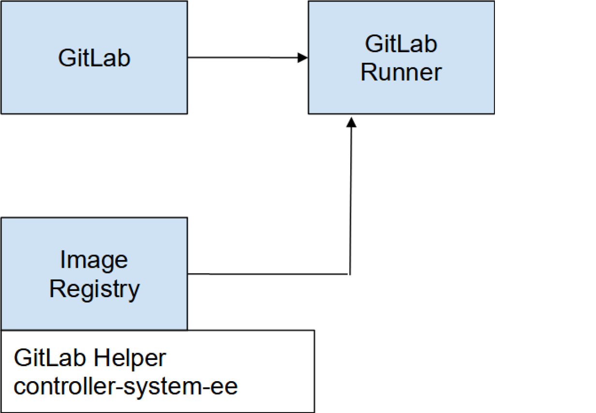

# Set up GitLab CI and GitLab Runner to configure Ansible automation controller

## Objective

Set up GitLab CI and GitLab Runner (with a Podman executor) to create the foundations to deploy a Configuration-as-Code pipeline.

## Overview

GitLab Runner's [docs](https://docs.gitlab.com/runner/) describe it as "an application that works with GitLab CI/CD to run jobs in a pipeline." This step-by-step tutorial covers installing and configuring GitLab Runner to allow a Configuration-as-Code (CaC) approach to managing an [Ansible](http://www.redhat.com/en/topics/automation/learning-ansible-tutorial?intcmp=701f20000012ngPAAQ) automation controller. This solution will work in any environment where GitLab Runner has connectivity (port 80/443) to the automation controller API.

**_[ Related reading: [The history of an API: GitLab Runner and Podman](https://www.redhat.com/sysadmin/history-api). ]_**

The automation controller configuration in this solution is loosely based on [Creating an Ansible controller config as code pipeline](https://www.redhat.com/en/blog/creating-ansible-controller-config-code-pipeline). However, instead of using Ansible controller and webhooks for configuration, it uses GitLab CI, GitLab Runners, and [Podman](https://www.redhat.com/en/topics/containers/what-is-podman?intcmp=701f20000012ngPAAQ). Although having a pipeline do the configuration adds an extra dependency, this solution is potentially better due to the tight integration with the Git repository, allowing the ability to reuse existing processes and more easily rerun failed jobs. GitLab CI is also very user-friendly. You'll see later in this tutorial how quickly you can get up and running.

Also note that I am running this in a disconnected (air-gapped) environment, meaning I have no internet connection to pull down dependencies. This is a common security approach in some enterprise environments. You can still follow along and complete this tutorial in a connected environment; just watch out for anything that says "disconnected only" in the steps.

I am using GitLab Runner in this example, but you can apply the same principle in Jenkins or other CI/CD tools.

Prerequisites:

-   Run an [automation controller](https://www.ansible.com/products/controller) with admin access.
-   Run a GitLab instance with admin access.
-   Provide connectivity over port 80/443 from GitLab Runner to the automation controller.
-   Provide a container registry to store images.
-   Provide an Ansible Execution Environment image (EE) configured with the `ansible.controller` and `infra.controller_configuration` collections installed. This image should be on your container registry. Find more information on creating an Ansible EE in the [Ansible docs](https://docs.ansible.com/automation-controller/latest/html/userguide/execution_environments.html).

## Deploy and configure GitLab Runner

I will install GitLab Runner on a [Red Hat Enterprise Linux (RHEL)](https://www.redhat.com/en/technologies/linux-platforms/enterprise-linux?intcmp=701f20000012ngPAAQ) 8 node I created in my virtual machine environment. After initially configuring the node, you can start the installation of GitLab Runner.

### Step 1: Obtain GitLab Runner

Obtain the [GitLab Runner RPM](https://gitlab-runner-downloads.s3.amazonaws.com/latest/index.html) and ensure it is on your RHEL 8 machine. Make sure you choose the correct RPM for your processor type. In my case, it was the `gitlab-runner_amd64.rpm`.

**_[ Download now: [A system administrator's guide to IT automation](https://www.redhat.com/en/engage/system-administrator-guide-s-202107300146?intcmp=701f20000012ngPAAQ). ]_**

### Step 2: Install GitLab Runner

Install the RPM:

```shell
$ sudo rpm -i gitlab-runner_amd64.rpm
```

### Step 3: Start the GitLab Runner service

Start GitLab Runner:

```shell
$ sudo gitlab-runner start
```

Verify GitLab Runner started:

```shell
$ sudo gitlab-runner status
```

You should see the following:

```shell
gitlab-runner: Service is running
```

### Step 4: Connect GitLab to GitLab Runner

Now connect GitLab Runner to GitLab. Before doing this, create a group in GitLab to store the CaC repos. You will deploy a group runner under the newly created group. This will ensure that only repos within this group can use this runner.

As an admin user, click **Menu** on the top left, then **Groups**, and **Your Groups**. From there, select **Create group**. The interface looks like this:


Name the new group and click **Create group**.


Once you create the new group, you are taken to the group's management screen. **CI/CD > Runners** is on the left side.

Select **Register a group runner** on the top right, then copy the registration token.


On the GitLab Runner node, execute the following command to register the runner with your GitLab instance. Make sure to replace the URL with your own GitLab instance:

```shell
$ sudo gitlab-runner register --url https://gitlab_url
```

The interface asks for your registration token and a description of the runner, tags, and optional maintenance notes. Next, it asks for the executor. Type `docker` to ensure the runner uses Docker to run the job rather than running it as a regular process on the host (you will swap Docker for Podman later in this article). Finally, it asks for a Docker image. Point it to the Ansible EE image mentioned in the prerequisites.

NOTE: Tags are important. You must list tag(s) so that GitLab's CI/CD process knows which runner to use for which job. I have set a tag `controller-system-ee`, which is the name of the EE that will be used (this is the EE that contains the required collections). I will explain how this runner tag will be called later in the tutorial.

You will get something like the following during the registration process:

```shell
Enter the GitLab instance URL (for example, https://gitlab.com/):
[https://gitlab.chrislab.internal]: 
Enter the registration token:
token
Enter a description for the runner:
[gitlabrunner1.chrislab.internal]: Ansible EE: controller-system-ee:dev from quay.chrislab.internal/aap2/     
Enter tags for the runner (comma-separated):
controller-system-ee
Enter optional maintenance note for the runner:

Registering runner... succeeded                     runner=yoKUDnv-
Enter an executor: docker, shell, ssh, docker+machine, custom, docker-ssh, parallels, virtualbox, docker-ssh+machine, kubernetes:
docker
Enter the default Docker image (for example, ruby:2.7):
quay.chrislab.internal/aap2/controller-system-ee:dev
Runner registered successfully. Feel free to start it, but if it's running already the config should be automatically reloaded!
 
Configuration (with the authentication token) was saved in "/etc/gitlab-runner/config.toml"
```

You can now see the runner in GitLab:


### Step 5: Configure the helper image (disconnected only)

If your environment is disconnected, you will need to adjust the `config.toml` file to point to the helper image. GitLab will try to reach out to the internet to obtain this helper image if you do not specify otherwise.

What is a helper image? Every pipeline stage requires two container images: The helper image and the image you specified in the gitlab-runner config. The helper image is essentially there to pull down the dependencies needed to run your pipeline, that is, using Git to clone down repos and any artifacts.

Once a pipeline begins, the runner first downloads the helper image from the internet: `registry.gitlab.com/gitlab-org/gitlab-runner/gitlab-runner-helper`.

Ensure you have a copy of the `gitlab-runner-helper` image in your local image registry. You can then point to this image in the config.

Specify the helper image in the runner config:

```shell
$ vim /etc/gitlab-runner/config.toml
```

```ini
  
  [runners.docker]
    tls_verify = false
    image = "quay.chrislab.internal/aap2/controller-system-ee:dev"
    privileged = false
    disable_entrypoint_overwrite = false
    oom_kill_disable = false
    disable_cache = false
    volumes = ["/cache"]
    shm_size = 0
    helper_image ="quay.chrislab.internal/gitlab/gitlab-runner-helper:x86_64-bbcb5aba"
```

### Step 6: Replace Docker with Podman

If you are installing GitLab Runner on a RHEL 8 machine, the default container engine is [Podman](https://www.redhat.com/en/topics/containers/what-is-podman?intcmp=701f20000012ngPAAQ), so it makes sense to configure GitLab Runner to use Podman instead of Docker. Before you start, ensure you are not logged in as the root user. You do not need Podman root privileges to complete this tutorial.

**_[ Download now: [Podman basics cheat sheet](https://developers.redhat.com/cheat-sheets/podman-basics-cheat-sheet?intcmp=701f20000012ngPAAQ) ]_**

Podman is installed by default on RHEL 8. You just have to enable it for use by GitLab Runner:

```shell
$ sudo systemctl enable --now --user podman.socket
```

Run the following command to check the Podman configuration:

```shell
$ sudo systemctl status --user podman.socket
```

You should get something like:

```output
● podman.socket - Podman API Socket
   Loaded: loaded (/usr/lib/systemd/user/podman.socket; enabled; vendor preset: enabled)
   Active: active (listening) since Fri 2022-09-02 16:25:23 BST; 7min ago
     Docs: man:podman-system-service(1)
   Listen: /run/user/1001/podman/podman.sock (Stream)
   CGroup: /user.slice/user-0.slice/user@0.service/podman.socket
```

Copy the string on the Listen line. In my example, it is `/run/user/1001/podman/podman.sock`.

Open the GitLab Runner configuration file:

```shell
$ sudo vim /etc/gitlab-runner/config.toml
```

Near the bottom of the file is a `runners.docker` section. Add the following host line to ensure the runner uses the Podman socket:

```ini
host = "unix:///run/user/1001/podman/podman.sock"
```

Remember to add `unix:///` to the beginning of the target socket location to ensure the runner looks for the socket on localhost.

The result should look similar to:

```ini
[runners.docker]
    tls_verify = false
    image = "aapah.chrislab.internal/controller-system-ee:latest"
    privileged = false
    disable_entrypoint_overwrite = false
    oom_kill_disable = false
    disable_cache = false
    volumes = ["/cache"]
    shm_size = 0
    host = "unix:///run/user/1001/podman/podman.sock"
```

You have now configured GitLab Runner to use Podman instead of Docker.

**_[ Learn more about server and configuration management by downloading [Ansible for DevOps](https://www.ansible.com/resources/ebooks/ansible-for-devops?intcmp=701f20000012ngPAAQ). ]_**

### Step 7: Create the Controller Automator CI/CD project

The system should now look like the following:



You need a project to contain the base configuration for the automation controller. This project will be responsible for the main automation controller configuration, from creating organizations to the team configs, Lightweight Directory Access Protocol (LDAP), role-based access controls ([RBAC](https://www.redhat.com/sysadmin/rbac-openshift-role)), and other settings. The next article in this series covers this content.

**_[ Learn practical steps and best practices for enterprise network automation implementation: Download the [Enterprise automation in a DevOps world](https://www.redhat.com/en/engage/automation-consulting-ansible-201904090336?intcmp=701f20000012ngPAAQ) checklist. ]_**

## Wrap up

One way to accomplish a Configuration as Code approach to managing an automation controller is by using GitLab Runner. The above explanations and steps showed how to configure this solution in either a connected or disconnected environment.

The fundamental steps include:

-   Obtain, install, and configure GitLab Runner.
-   Connect GitLab Runner to GitLab.
-   Replace the default Docker settings with Podman.
-   Create a CI/CD project to manage the automation controller.

The [next article in the series](aap-cicd-gitlab-runner-ansible.md) continues with the project configuration and establishes the pipeline for managing the automation controller. It also includes the automation controller's base Configuration as Code file and the option for additional configurations with branching.

The [third article in the series](aap-self-service-config-code-ansible.md) includes automation controller configurations at the departmental level with more specific customizations.

## Reference

* https://www.redhat.com/sysadmin/gitlab-runner-ansible-config-code
* 