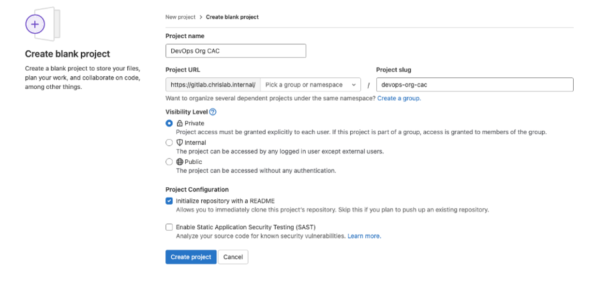
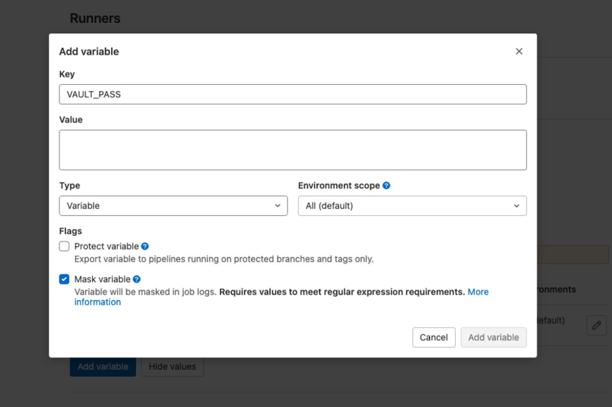
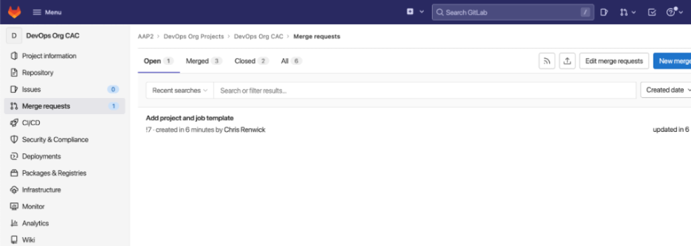
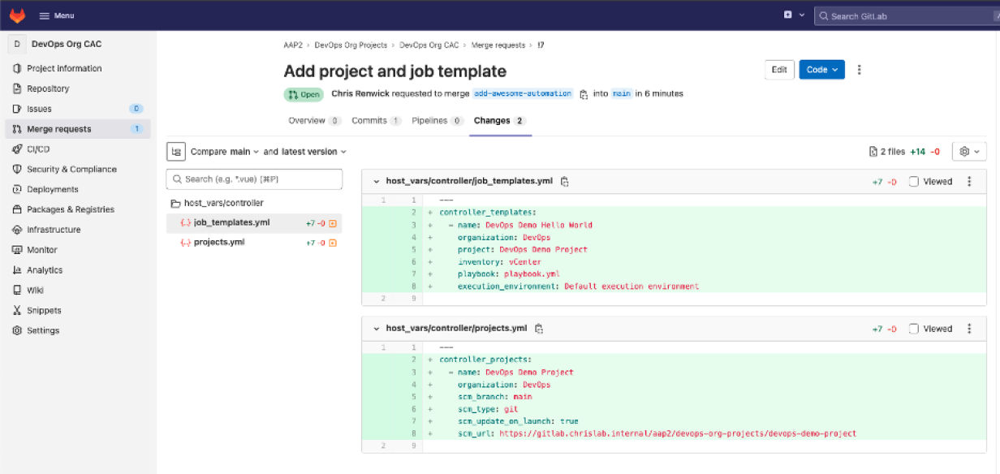
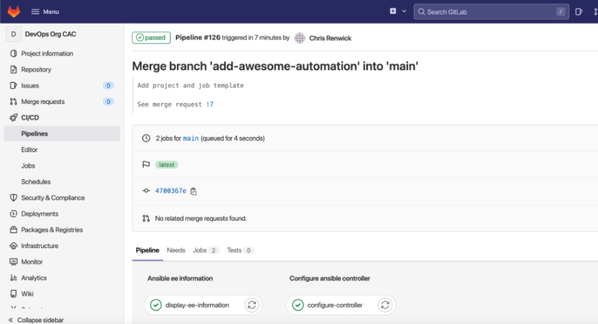
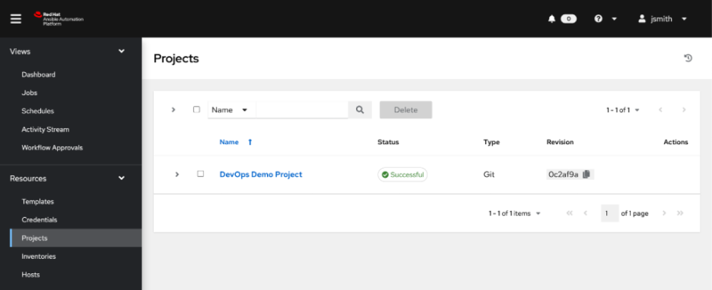
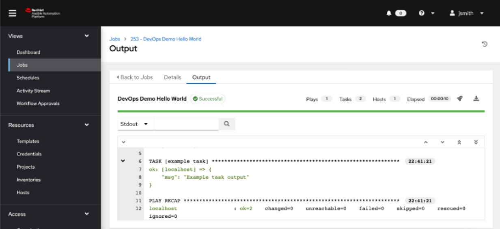

# Enable organization-level CI/CD controls in Ansible automation controller using configuration as code

## Objective

Allow departments to make changes to their Ansible automation controller configurations without affecting base settings or other organizations' configurations.

## Overview

Allow departments to make changes to their Ansible automation controller configurations without affecting base settings or other organizations' configurations.

The first two articles in this series on creating a model for making Configuration-as-Code (CaC) changes to an [Ansible](http://www.redhat.com/en/topics/automation/learning-ansible-tutorial?intcmp=701f20000012ngPAAQ) automation controller covered [setting up GitLab Runner](aap-gitlab-runner-ansible-config-code.md) and [configuring the base automation controller settings](aap-cicd-gitlab-runner-ansible.md).

If you followed along with those tutorials, you have those configurations in place. Now you're ready to give organizational-level controls to the departments using the controller. These controls will allow the departments to make changes to their own organization without affecting any base controller settings or other organizations' configurations.

For clarity, it is usually best practice having a department or product team line up directly with a controller organization. This makes it easier to segregate automation projects between departments.

**_[ Download now: [A system administrator's guide to IT automation](https://www.redhat.com/en/engage/system-administrator-guide-s-202107300146?intcmp=701f20000012ngPAAQ). ]_**

The previous articles configured an organizational admin user for DevOps and Engineering organizations. I will use the DevOps org as an example here.

## Step 1: Create the repo

Begin by creating a Git repo to contain only the DevOps organization code:



## Step 2: Set the vault password in GitLab

Next, get the vault password set in the CI/CD settings in the new repo. Each org should have its own vault password to handle the separation of organizations securely.



**_[ Learn more about server and configuration management by downloading [Ansible for DevOps](https://www.ansible.com/resources/ebooks/ansible-for-devops?intcmp=701f20000012ngPAAQ). ]_**

## Step 3: Create the .gitlab-ci.yml file

Next, create the `.gitlab-ci.yml` file to configure the pipeline. You can copy this from the example written in the previous article. Notice I have added an inventory to the file:

```yaml
stages:
  - Ansible EE Information
  - Configure Ansible Controller


display-ee-information:   
  tags:
    - controller-system-ee 
  stage: Ansible EE Information
  environment: dev
  only:
    - main
  script:
    - echo "Display Versions"
    - ansible --version
    - echo "Display Collections installed"
    - ansible-galaxy collection list

configure-controller:
  tags:
    - controller-system-ee
  stage: Configure Ansible Controller
  environment: dev
  only:
    - main
  script:
    - touch /tmp/vaultpass
    - echo ${VAULT_PASS} > /tmp/vaultpass
    - ansible-playbook automator.yml --vault-password-file /tmp/vaultpass --inventory inventory
```

**_[ Get the [YAML cheat sheet](https://opensource.com/downloads/yaml-cheat-sheet?intcmp=701f20000012ngPAAQ). ]_**

## Step 4: Create the inventory file

Next, create that inventory file. It simply contains `controller`. You will use this as a target for the host vars.

```shell
$ vim inventory
```

```ini
controller
```

## Step 5: Create the automation playbook

Populate the playbook that will do the configuration:

```shell
$ vim automator.yml
```

```yaml
---
- hosts: controller
  connection: local
  roles:
    - infra.controller_configuration.dispatch
```

## Step 6: Add the variable

You can now add the host vars related to `controller` in the inventory.

```shell
$ mkdir -r host_vars/controller
```

Inside the `host_vars/controller` directory, add the `controller_auth.yml` so that you can connect to the controller. You created an admin user for each organization in the previous article (so you can refer back to that if you want). You need this account to access the controller and limit permissions so that the user cannot change the configurations for the main controller or other organizations. Make sure to use `ansible-vault` to encrypt the password:

```shell
$ ansible-vault encrypt_string --name 'password'
```

```shell
$ vim host_vars/controller/controller_auth.yml
```

```yaml
---
controller_hostname: aapcontroller0.chrislab.internal
controller_validate_certs: false
controller_username: devops_org_admin
controller_password: <Encrypted Password>
```

**_[ Related reading: [How to encrypt sensitive data in playbooks with Ansible Vault](https://www.redhat.com/sysadmin/ansible-vault-secure-playbooks) ]_**

It makes sense to add some extra files under the container directory to make it easier for engineers to use. In the example below, the additional configuration files include the three inventory files, the job\_templates, and projects files.

Populating the files is out of the scope of this article; however, I will give an example of adding a new project in the next step. You can find extra information regarding the variable data structure for each controller object in each role directory in [the docs](https://github.com/redhat-cop/controller_configuration/tree/devel/roles).

```shell
host_vars/
└── controller
    ├── controller_auth.yml
    ├── inventories.yml
    ├── inventory_source_vars.yml
    ├── inventory_sources.yml
    ├── job_templates.yml
    └── projects.yml
```

## Step 7: Example of an engineer adding a project in their org

I will now show an example of how a developer can utilize this CaC approach using the DevOps org.

A new developer named Jessie Smith has joined the DevOps team. Jessie has created a new project in GitLab with a fantastic new playbook. It appears to be ready to deploy onto the automation controller.

Jessie creates a branch on the DevOps org CaC repository to work safely, knowing the code changes cannot affect automation controller configurations. (In the `.gitlab-ci.yml`, only code changes on the `main` branch will kick off the pipeline.)

```shell
$ git checkout -b add-awesome-automation
```

Jessie makes the following code changes. The first is creating a new project definition, ensuring the `scm_url` points to the new project. You can find information on project data structure in the [controller\_configuration.projects docs](https://github.com/redhat-cop/controller_configuration/tree/devel/roles/projects).

```shell
$ vim host_vars/controller/projects.yml
```

```yaml
---
controller_projects:
  - name: DevOps Demo Project
    organization: DevOps
    scm_branch: main
    scm_type: git
    scm_update_on_launch: true
    scm_url: https://gitlab.chrislab.internal/aap2/devops-org-projects/devops-demo-project
```

The next step is defining the job template for that project, including the project it relates to (above), inventory, playbook to use, and execution environment. You can find information on job template data structure in the [controller\_configuration.job\_templates docs](https://github.com/redhat-cop/controller_configuration/tree/devel/roles/job_templates).

```shell
$ vim host_vars/controller/job_templates.yml
```

```yaml
---
controller_templates:
  - name: DevOps Demo Hello World
    organization: DevOps
    project: DevOps Demo Project
    inventory: vCenter
    playbook: playbook.yml
    execution_environment: Default execution environment
```

Now that Jessie has defined the project and job template, the changes can be pushed to the newly created branch created:

```shell
$ git add .

$ git commit -m "project and job template added"

$ git push --set-upstream origin add-awesome-automation
```

Remember, this new branch should not kick off a pipeline. If it does, go back and review the GitLab CI configurations.

Once Jessie is happy with the changes, the next step is creating a merge request from Jessie's branch to the main branch.



At this point, Jessie's org admin (or DevOps lead) will look at the configuration changes requested and merge them.



Note: It is a good idea for the org CaC repo to have a protected branching structure in place. This will allow an org leader (such as a DevOps team lead) to check and approve any merge requests (configuration changes, in this instance). When the code is merged into the main branch, it kicks off a pipeline to make the requested changes to the automation controller.

Jessie will see the pipeline initializing after the merge in **CI/CD** > **Pipelines** on the left side menu. It should complete successfully.



Jessie then checks the automation controller to confirm the new project has been configured.



Jessie can then go and launch this new piece of automation.



**_[ Learn practical steps and best practices for enterprise network automation implementation: Download the [Enterprise automation in a DevOps world](https://www.redhat.com/en/engage/automation-consulting-ansible-201904090336?intcmp=701f20000012ngPAAQ) checklist. ]_**

## Wrap up

This model creates a reliable CaC approach to managing organizations within the automation controller. It allows engineers within an organization to be responsible for adding their own projects to an automation controller. This reduces reliance on an "org admin" team member to go in and make the changes manually. It also reduces the potential of making mistakes in the configuration, as the merge requests should require a code review. The configurations are "as code," so it also has great disaster-recovery benefits (the code can be rerun, restoring the automation controller).

## Reference

* https://www.redhat.com/sysadmin/self-service-config-code-ansible
* 