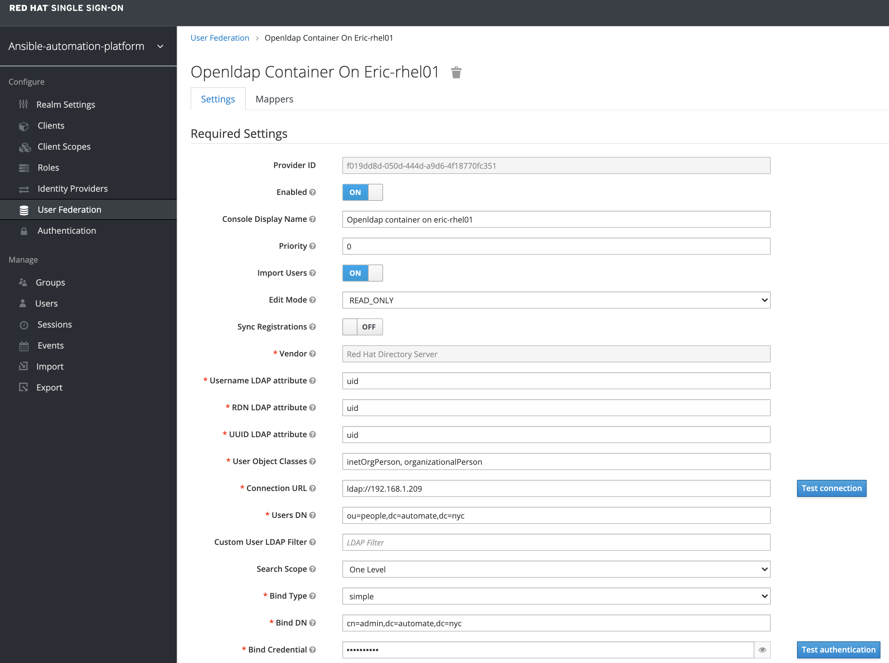
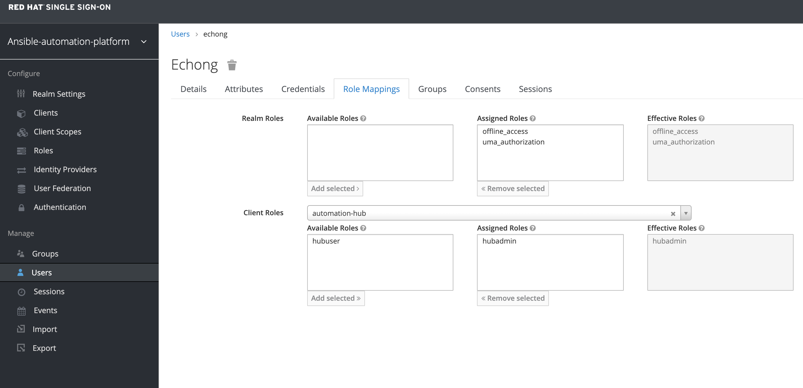

# How to setup a lab LDAP for AAP controller and hub

## Automation Hub, LDAP and SSO

Latest version of Automation Hub does not has built-in LDAP support. Instead it relies on Red Hat SSO to provide integration with the LDAP authentication. Fortunately the AAP installation playbooks will assist setting up the SSO application on a separate VM with Automation Hub.

## [Openldap](#openldap "Permalink")

First we will need a simple LDAP server. We will be using [Osixia OpenLDAP container image](https://github.com/osixia/docker-openldap).

Create a `Containerfile`:

```
FROM docker.io/osixia/openldap:latest

LABEL maintainer="echong@redhat.com"

ENV LDAP_ORGANISATION="Lab" \
    LDAP_DOMAIN="automate.example.int"

COPY bootstrap.ldif /container/service/slapd/assets/config/bootstrap/ldif/50-bootstrap.ldif
```

Create the bootstrap.ldif to preload the image with OUs, users and groups:

```yaml
dn: ou=people,dc=automate,dc=example,dc=int
changetype: add
objectClass: organizationalUnit
ou: people

dn: ou=groups,dc=automate,dc=example,dc=int
changetype: add
objectClass: organizationalUnit
ou: groups

dn: uid=bbanner,ou=people,dc=automate,dc=example,dc=int
changetype: add
objectClass: inetOrgPerson
description: The Hulk
givenName: Bruce
sn: Banner
cn: Bruce Banner
uid: bbanner
mail: bbanner@automate.example.int
userpassword: secret_password

dn: uid=cbarton,ou=people,dc=automate,dc=example,dc=int
changetype: add
objectClass: inetOrgPerson
description: Hawkeye
givenName: Clint
sn: barton
cn: Clint Barton
uid: cbarton
mail: cbarton@automate.example.int
userpassword: secret_password

... <-- skipping the rest of the super heroes here
```

```yaml
dn: cn=admins,ou=groups,dc=automate,dc=example,dc=int
changetype: add
objectClass: groupOfUniqueNames
objectClass: top
cn: admins
uniqueMember: uid=bbanner,ou=people,dc=automate,dc=example,dc=int
uniqueMember: uid=echong,ou=people,dc=automate,dc=example,dc=int

dn: cn=operators,ou=groups,dc=automate,dc=example,dc=int
changetype: add
objectClass: groupOfUniqueNames
objectClass: top
cn: operators
uniqueMember: uid=cbarton,ou=people,dc=automate,dc=example,dc=int
uniqueMember: uid=tstark,ou=people,dc=automate,dc=example,dc=int
uniqueMember: uid=cdanvers,ou=people,dc=automate,dc=example,dc=int
uniqueMember: uid=slang,ou=people,dc=automate,dc=example,dc=int
```

Build the image with the LDAP data:

```shell
podman build --tag localhost/openldap:withdata .
```

Start the container as root, since we are using privilege port 389:

```shell
podman run \
   --name openldap \
   --env LDAP_ORGANISATION="Lab" \
   --env LDAP_DOMAIN="automate.example.int" \
   --env LDAP_ADMIN_PASSWORD="test1234" \
   -p 389:389 \
   --detach localhost/openldap:withdata
```

Bonus. We can also start the `phpldapadmin` GUI in a second container:

```shell
podman run -p 8090:80 \
   --name phpldapadmin \
   --env PHPLDAPADMIN_LDAP_HOSTS=192.168.1.209 \
   --env PHPLDAPADMIN_HTTPS='false' \
   --detach docker.io/osixia/phpldapadmin:0.9.0
```

Test the connection from AAP servers using `ldapsearch` command:

```shell
ldapsearch -x -v -b 'dc=automate,dc=example,dc=int' -H ldap://192.168.1.209:389 \
-D 'cn=admin,dc=automate,dc=example,dc=int' -w test1234 -LLL
```

## [Automation Hub and SSO servers](#automation-hub-and-sso-servers "Permalink")

Update the `inventory` file with additional information for setting SSO server.

```ini
[sso]
aap-sso.lab.automate.example.int

[all:vars]
sso_keystore_password: secret_password
sso_console_admin_password: secret_password
```

Now run AAP installation script `setup.sh` to install SSO on the assigned server and setup the Automation Hub to use the SSO server for authentication.

See [Installing and Configuring Central Authentication for the Ansible Automation Platform](https://access.redhat.com/documentation/en-us/red_hat_ansible_automation_platform/2.1/html/installing_and_configuring_central_authentication_for_the_ansible_automation_platform)

My final SSO setting: 

My user role mapping setting: 

## Reference

* [Lab ldap for aap](https://www.automate.nyc/ansible/lab-ldap-for-aap/)
* 