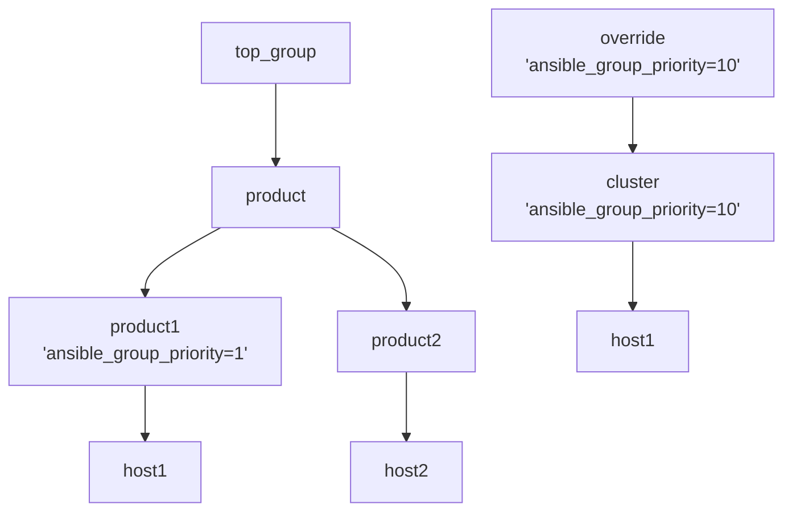

# Example 3: Validate prioritization with child groups having different depths

In the next example, set the group 'override' such that it is not set at the same child 'depth' or 'level' as the 'product' group. 

Consider the following case.

Remove the parent/child relationship of '[override]' from '[top_group]' group, in the following way:




As can be clearly seen above, the 'cluster' group has a depth of 2 while the 'product1' and 'product2' groups each have depths of 3.

The INI inventory implementing this hierarchy can be found in [hosts.ini](./hosts.ini) and the equivalent YAML inventory implementing this hierarchy can be found in [hosts.yml](./hosts.yml):

```yaml
all:
  children:
    override:
      vars:
        test: "override"
        ansible_group_priority: 10
      children:
        cluster1:
          vars:
            test: "cluster1"
            ansible_group_priority: 10
          hosts:
            host1: {}
    top_group:
      vars:
        test: top_group
        ansible_connection: local
      children:
        product:
          vars:
            ansible_group_priority: 1
            test: "product"
          children:
            product1:
              vars:
                test: "product1"
              hosts:
                host1:
                  host1: {}
            product2:
              vars:
                test: "product2"
              hosts:
                host2: {}
```

Now confirm that the results are as expected for the 2 equivalent inventory implementations:

```output
ansible -i hosts.ini -m debug -a var=test host1
host1 | SUCCESS => {
    "test": "product1"
}
...
...

ansible -i hosts.yml -m debug -a var=test host1
host1 | SUCCESS => {
    "test": "product1"
}
```


## Conclusions/Next Steps

The results may not be what are expected, since the variable set in `product1` group always wins even when the priority of the 'override' group is set higher. 

Even if the priority of the 'override' group and all of its child groups were set to the highest, in this case, 10, the 'test' variable is set by the `product1` group.

The priority does not follow an intuitive merge path.  The deepest child group gets set and if multiple child group peers exist at the same depth, then the one with the greatest priority in that peer depth group will be set.  If the priority is the same among multiple groups at the greatest depth, then alphabetical sort order is used with the last in the sort group winning. 

To summarize in the case when using the ansible_group_priority variable, the child group having the greatest child depth and greatest priority within that depth will always win.

The [next example](../example4/README.md) will look to further into the group variable merge behavior.
