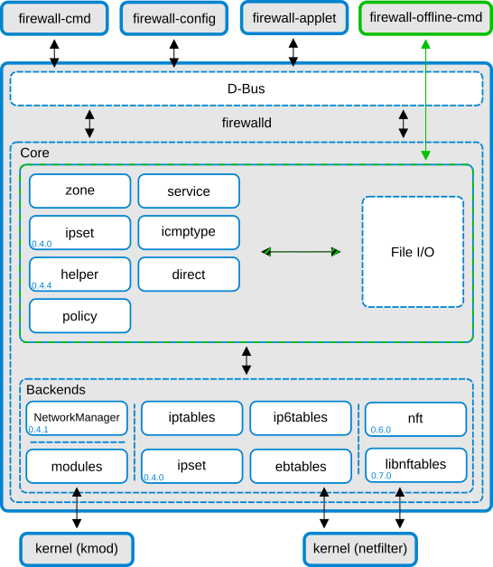

In this article, we will learn how to switch a Linux firewall from IPtables to nftables on Ubuntu. IPtables, which is based on the Linux kernel Netfilter module, is currently the default firewall for many Linux distributions. It protects against multiple threat vectors and allows your server to block unwanted traffic based on a specific ruleset.

nftables is a new subsystem of the Linux kernel that replaces several parts of the Netfilter framework (upon which IPtables is based), which allows for improved functionality. These changes were implemented in kernel version 3.13. This module enhances the firewall-like functionality of Netfilter for filtering network traffic. The advanced framework of nftables is modeled after the Berkeley Packet Filter (BPF) system, which uses a basic set of expressions to build grouped, complex filtering rules. It’s worth pointing out that this is not an update to IPtables, but rather a replacement. IPtables will soon be superseded by nftables on most all systems as a single unified platform, providing the firewall configuration on top of an in-kernel virtual machine.

## How is nftables different from IPtables?

In IPtables, there are several chains and tables that are loaded by default.  
In nftables, there are no default chains or tables.

In IPtables, there is only one target per rule.  
In nftables, you can perform multiple actions within a single rule.

In nftables, there is a tool called ipset. Using ipset allows for the listing of multiple networks or addresses which can be matched in a single rule.

In the iptables structure, there are four tools per family:

-   iptables
-   ip6tables
-   arptables
-   ebtables

nftables contain a compatibility layer that encompasses all of these tools, which allows the use of the old iptables rules syntax.

## What are the benefits of nftables?

The main advantages of nftables are:

-   Architecture that's built right into the kernel
-   A syntax that consolidates IPtables tools into a single command-line tool
-   A compatibility layer that allows the use of IPtables rules syntax.
-   A new, easy to learn syntax.
-   Simplified process of adding firewall rules.
-   Improved error reporting.
-   Reduction in code replication.
-   Better overall performance, retention and gradual changes in rule filtering.

## Rule Comparison

.All of the firewall information is viewable utilizing a single command-line tool called nft. nft uses a single rule for both IPv4 and IPv6 addresses instead of using multiple rules for each task. It does not assume complete control of the firewall's backend and will not delete firewall rules installed by other tools or users. nft also improves the firewall ruleset by adding in the options for logging and deny functions in the same rule. Lastly, the new nft backend is nearly 100% compatible with preexisting firewall configurations.

Here is a simple drop rule for an IP in nftables:

```
nft add rule ip filter output ip daddr 10.10.10.10 drop
```

In IPtables, the rule would be:

```
iptables -A OUTPUT -d 10.10.10.10 -j DROP
```

These examples below create a firewall ruleset that allows IPv6 traffic to various port services.

```
root@host [~]# nft add rule ip6 filter input tcp dport {ftp, http, telnet, https} accept

root@host [~]# nft add rule ip6 filter input icmpv6 type { nd-echo-request,  nd-router-advert, neighbor-solicit, nd-neighbor-advert } accept
```

Here are a few other examples:

```
#review current configuration:
root@host [~]# nft list ruleset

#Add a new table, with family "inet" and table "filter":
root@host [~]# nft add table inet filter

#Add a new chain, to accept all inbound traffic:
root@host [~]# nft add chain inet filter input \{ type filter hook input priority 0 \; policy accept \}

#Add a new rule, to accept several TCP ports:
root@host [~]# nft add rule inet filter input tcp dport \{ ssh, telnet, https, http \} accept

#To show rule handles:
root@host [~]# nft --handle --numeric list chain family table chain

#To delete a rule:
root@host [~]# nft delete rule inet filter input handle 3

#To save the current configuration:
root@host [~]# nft list ruleset > /etc/nftables.conf
```

This is a quick overview of the drop-in replacements that are used:

Translators|Usage
---|---
iptables-translate<br>ip6tables-translate|Call like iptables/ip6tables. <br>Will print an equivalent nft command.
iptables-restore-translate<br>ip6tables-restore-translate|Call like iptables-restore/ip6tables-restore. <br>Will print an equivalent nft ruleset dump.

## Debian/Ubuntu Install

The method to install nftables on a Debian/Ubuntu server is very straightforward. In the section below, we have saved the current iptables ruleset to a .txt file, reviewed the file, translated it to an nft readable format, and then imported it into the new nft ruleset.

```
root@host:~# iptables-save > fwrules.txt
root@host:~# cat fwrules.txt
root@host:~# iptables-restore-translate -f fwrules.txt
root@host:~# iptables-restore-translate -f fwrules.txt > ruleset.nft
```

Translators|Usage
---|---
iptables-translate<br>ip6tables-translate|Call like iptables/ip6tables. <br>Will print an equivalent nft command.
iptables-restore-translate<br>ip6tables-restore-translate|Call like iptables-restore/ip6tables-restore. <br>Will print an equivalent nft ruleset dump.

In the second part of the process, we install nftables, and the iptables-nftables-compat tool (which loads the rules into the nf\_tables kernel subsystem), and lastly, we enable the service.

```
root@host:~# apt install nftables
root@host:~# apt install iptables-nftables-compat
root@host:~# systemctl enable nftables.service
```

In the final section, we pull in the previous ruleset from the ruleset.nft file. We then review the ruleset with the ‘list’ flag.

```
root@host:~# nft -f ruleset.nft
root@host:~# nft list ruleset
table ip nat {
chain PREROUTING {
type nat hook prerouting priority 0; policy accept;
}

chain INPUT {
type nat hook input priority 0; policy accept;
}

chain OUTPUT {
type nat hook output priority 0; policy accept;
}

chain POSTROUTING {
type nat hook postrouting priority 0; policy accept;
}
}
table ip mangle {
chain PREROUTING {
type filter hook prerouting priority 0; policy accept;
}

chain INPUT {
type filter hook input priority 0; policy accept;
}

chain FORWARD {
type filter hook forward priority 0; policy accept;
}

chain OUTPUT {
type filter hook output priority 0; policy accept;
}

chain POSTROUTING {
type filter hook postrouting priority 0; policy accept;
}
}
table ip raw {
chain PREROUTING {
type filter hook prerouting priority 0; policy accept;
}

chain OUTPUT {
type filter hook output priority 0; policy accept;
}
}
table ip filter {
chain INPUT {
type filter hook input priority 0; policy accept;
}

chain FORWARD {
type filter hook forward priority 0; policy accept;
}

chain OUTPUT {
type filter hook output priority 0; policy accept;
}
}
table inet filter {
chain input {
type filter hook input priority 0; policy accept;
}

chain forward {
type filter hook forward priority 0; policy accept;
}

chain output {
type filter hook output priority 0; policy accept;
}
}
root@host:~# 
```

## nft Command Synopsis

```
#nft command options and syntax
root@host [~]# nft [ -nNscaeSupyj ] [ -I directory ] [ -f filename | -i | cmd …]

root@host [~]#  nft -h
Usage: nft [ options ] [ cmds... ]

Options:
  -h, --helpShow this help
  -v, --versionShow version information

  -c, --checkCheck commands validity without actually applying the changes.
  -f, --file <filename>Read input from <filename>
  -i, --interactiveRead input from interactive CLI

  -n, --numericWhen specified once, show network addresses numerically (default behaviour).
  Specify twice to also show Internet services (port numbers) numerically.
Specify three times to also show protocols, user IDs, and group IDs numerically.
  -s, --statelessOmit stateful information of ruleset.
  -NTranslate IP addresses to names.
  -a, --handleOutput rule handle.
  -e, --echoEcho what has been added, inserted or replaced.
  -I, --includepath <directory>Add <directory> to the paths searched for include files. Default is: /etc
  --debug <level [,level...]>Specify debugging level (scanner, parser, eval, netlink, mnl, proto-ctx, segtree, all)

root@host [~]#  nft -v
nftables v0.8.2 (Joe Btfsplk)
```

## firewalld and nftables

What about firewalld? Thankfully, firewalld interacts easily with nftables via the nft command itself. In the firewalld image below, we see how iptables and firewalld currently interact with each other.



An early issue with iptables and firewalld was that firewalld assumed full control of the firewall on the server. Now, when using nftables as the backend, this no longer holds true, as nftables will allow for multiple namespaces, and firewalld will scope the rules, sets, and chains into the firewalld table. This avoids many conflicts that can be encountered with other software that does not directly interact with firewalld. In upcoming releases, nftables will be updated to use the new libnftables.

## Restore

If for some reason, you need to revert to the old iptables backend, you can easily do so by resetting the ‘_firewallbackend_‘ entry in _/etc/firewalld/firewalld.conf_ back to ‘_iptables_‘, and then restart firewalld.

Learn how this new service can fit into your overall security plan for your server. Still unsure about how to implement this on your Ubuntu server or have additional questions? Our support technicians are standing by to offer our assistance in answering these and any other questions you may have about this technology.

## Reference

* https://wiki.nftables.org/wiki-nftables/index.php/Configuring_chains
* https://www.liquidweb.com/kb/how-to-install-nftables-in-ubuntu/

