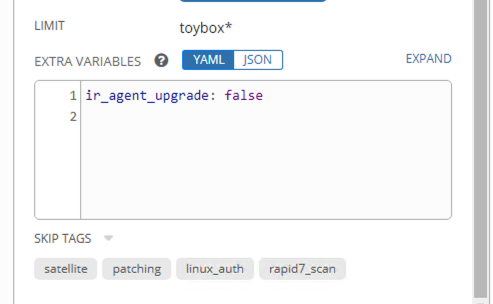

# Pets vs cattle with Ansible

Breaking bad habits can be hard especially with respect to host vars.

## Command line variable arguments

The bad habit we are targeting here is passing variable values via the command line for a playbook.
E.g.,

```bash
ansible-playbook release.yml --extra-vars "version=1.23.45 other_variable=foo"
```

Or in ansible tower, might look like this.

.

Passing variable values at command line is done for many reasons.

Some of them include:

- familiar to system admins who are very accustomed to command line usage patterns.
- the variable value used will override all others values in the inventory.
- the targeted host has a special state that is not represented in the current group/host vars

The most motivating/compelling reason is the last, where dealing with a special target case such that it requires overriding the existing values set in the inventory.

## Problems/Issues with command line approach

As can be seen [here](https://docs.ansible.com/ansible/latest/user_guide/playbooks_variables.html#ansible-variable-precedence), setting variable values at the command line, squashes all other values for the variable no matter where the variable is specified.  

Some issues/hazards associated with this method include:

- The inventory state is not stored in the inventory.
- If storing the inventory state in a git repo for the benefits of revision history/tracking/audit/CICD pipelines/etc..., the values used on the command line variable will not appear in git.
- If there are advanced methods to derive variable values, such as inventory group/host methods, they are overridden.
- Since the command line value overrides any other, it can conflict for variable values with the intended value maintained in the target host inventory.
- Untraceable making it difficult, if not impossible, to support. When a target host has issues arising from the parameters used, there is no efficient method for the person to determine the value(s) used leading to the issue.
- No point of reference.  Say a playbook ran successfully yesterday but failed this morning.  Most would check what changed in the respective git history. The value change will not appear there.
- This method circumvents/ignores the group/host and inventory functionality offered by ansible.  Another way to put it, is you might as well have any vehicle/engine responsible for kicking off shell scripts at this point.

## Recommended Approach

Minimize the usage of command line variable to the extent possible and instead use either group_vars or host_vars to set the respective value.

In the vein of provisioning many hosts (think 'cattle') versus higly bespoke/customized one-by-one hosts (think 'pets'), we will use use group_vars whenever possible and only use host_vars in the rare exception that we are dealing with a singleton/pet host.
Even in the pet instance, we use the host_vars to set the variable values and not the command line.

This makes for a far better support and traceability framework for maintaining the inventory state.

The hosts inventory can define the groups that a inventory host belong and the respective group variable(s).
Also, at scale, regex patterns can associate a collection of hosts to appropriate grouping(s).

Take the following example:

```ini

[prod:children]
vmware_vm_prod

[vmware_vm_prod:children]
vmware_rhel8_prod

[vmware_rhel8_prod:children]
vmware_rhel8_prod_MEMPHIS
vmware_rhel8_prod_DALLAS
vmware_rhel8_prod_OTHER

[vmware_rhel8_prod_MEMPHIS]
vmrhel08-prod-mem_[001:999]

[vmware_rhel8_prod_DALLAS]
vmrhel08-prod-dls_[001:999]

[vmware_rhel8_prod_OTHER]
vmrhel08-prod-oth_[001:999]

```

Then set env vars for the corresponding environments in the respective group files.
For example, global vars for all of production would go in:

* group_vars/prod/all.yml:
    ```yml
    ---
    env: prod
    
    ```

* group_vars/prod/vmware_rhel8_prod.yml:
    ```yml
    ---
    ### CERTS
    ca_cert_bundle: "/etc/pki/ca-trust/extracted/pem/tls-ca-bundle.pem"
    ca_java_keystore: "/etc/pki/ca-trust/extracted/java/cacerts"
    
    trust_ca_cacert_dir: /etc/pki/ca-trust/source/anchors
    trust_ca_update_trust_cmd: update-ca-trust extract
    root_domain: "alsac.stjude.org"
    subdomain: "prod"
    domain: "{{ subdomain }}.{{ root_domain }}"
    ```

* group_vars/prod/vmware_rhel8_prod_MEMPHIS.yml:
    ```yml
    ---
    location: "MEMPHIS"
    location_abbr: "MEM"
    subdomain: "memphis"
    ```

* group_vars/prod/vmware_rhel8_prod_DALLAS.yml:
    ```yml
    ---
    location: "DALLAS"
    location_abbr: "DLS"
    subdomain: "dallas"
    ```


The key is to have an inventory hostname as a key that can be used in a meaningful way to derive all the necessary attributes using the inventory hostname matching to groups.

For some grouping like OS or OS version, ansible has a useful (awesome) grouping technique to dynamically match hosts to respective groups and match to specific group variables if defined.

In fact, I use the following group method in most of my OS sensitive plays.
E.g., In my master ['site.yml'](../../../../ansible-datacenter/src/master/site.yml) playbook, I invoke the following for every play in order to have any OS/OS+version group specific variables defined for the following play(s):

```yml

- name: "Gather facts for all hosts to apply OS specific group vars for them"
  tags: always
  hosts: server_node
  ignore_unreachable: yes
  ignore_errors: yes
  tasks:
    - name: Classify hosts depending on their OS distribution
      changed_when: no
      group_by:
        key: os_{{ ansible_facts['distribution']|d('Unknown') }}

    - name: Classify hosts depending on their OS distribution-version
      changed_when: no
      group_by:
        key: os_{{ ansible_facts['distribution']|d('Unknown') }}_{{ ansible_facts['distribution_major_version']|d('Unknown') }}

```

To see group/host vars used in a more realistic way, see [the site.yml playbook here](../../../../ansible-datacenter/src/master/site.yml), the [os_* group var files](../../../../ansible-datacenter/src/master/inventory/group_vars/) and [host settings](../../../../ansible-datacenter/src/master/inventory/host_vars/).

The additional benefits of the group/host vars approach is that one can still have target nodes that have specific/custom needs as well as groups; however, now the specific host variable values are now stored in a git repo with all the benefits of the traceability and persistent inventory tracking.


