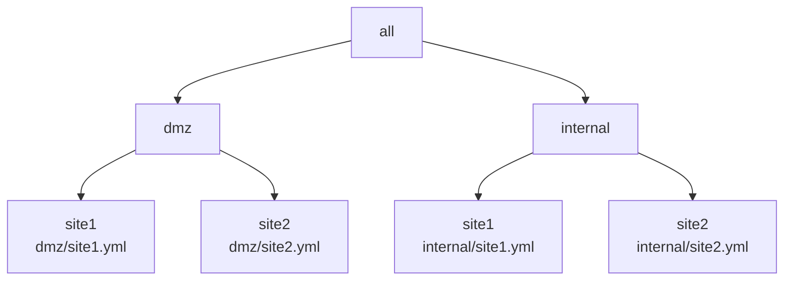
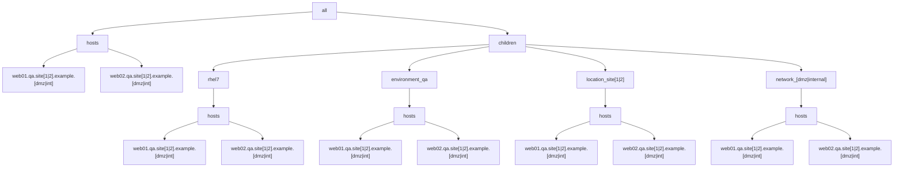

# Example 4: Multiple YAML inventories with 'role-based' INI inventory groups

In the prior [Example 3](../example3/README.md), we found the method to merge multiple YAML inventories with the merged results observing intended or expected behavior.

Now we will look to apply plays that can target machines in the merged inventory with 'role-based' inventory groups.

E.g., the following scenario will discuss a simple NTP client/server based playbook to apply across the merged inventory. 

## Overview

In this example there are 2 networks located at 2 sites resulting in 4 YAML inventory files, with hierarchy diagrammed as follows:




For each of the 4 inventory files, the following group/host hierarchy will be implemented:




Each site.yml inventory will be setup similar to the following with the "[dmz|internal]" and "[1|2]" regex patterns evaluated for each of the 4 cases:

```yaml
all:
  hosts:
    admin01.qa.site[1|2].example.[dmz|int]: 
      trace_var: site[1|2]/admin01.qa.site[1|2].example.[dmz|int]
    admin02.qa.site[1|2].example.[dmz|int]: 
      trace_var: site[1|2]/admin01.qa.site[1|2].example.[dmz|int]
    app01.qa.site[1|2].example.[dmz|int]: 
      trace_var: site[1|2]/app01.qa.site[1|2].example.[dmz|int]
    app02.qa.site[1|2].example.[dmz|int]: 
      trace_var: site[1|2]/app01.qa.site[1|2].example.[dmz|int]
    web01.qa.site[1|2].example.[dmz|int]:
      trace_var: site[1|2]/web01.qa.site[1|2].example.[dmz|int]
    web02.qa.site[1|2].example.[dmz|int]:
      trace_var: site[1|2]/rhel7/web02.qa.site[1|2].example.[dmz|int]
  children:
    rhel6:
      vars:
        trace_var: dmz/site1/rhel6
      hosts:
        admin01.qa.site[1|2].example.[dmz|int]: {}
    rhel7:
      vars:
        trace_var: site[1|2]/rhel7
      hosts:
        admin02.qa.site[1|2].example.[dmz|int]: {}
        app01.qa.site[1|2].example.[dmz|int]: {}
        app02.qa.site[1|2].example.[dmz|int]: {}
        web01.qa.site[1|2].example.[dmz|int]: {}
        web02.qa.site[1|2].example.[dmz|int]: {}
    environment_qa:
      vars:
        trace_var: site[1|2]/environment_qa
      hosts:
        admin01.qa.site[1|2].example.[dmz|int]: {}
        admin01.qa.site[1|2].example.[dmz|int]: {}
        app01.qa.site[1|2].example.[dmz|int]: {}
        app02.qa.site[1|2].example.[dmz|int]: {}
        web01.qa.site[1|2].example.[dmz|int]: {}
        web02.qa.site[1|2].example.[dmz|int]: {}
    location_site[1|2]:
      vars:
        trace_var: site[1|2]/location_site[1|2]
      hosts:
        admin01.qa.site[1|2].example.[dmz|int]: {}
        admin01.qa.site[1|2].example.[dmz|int]: {}
        app01.qa.site[1|2].example.[dmz|int]: {}
        app02.qa.site[1|2].example.[dmz|int]: {}
        web01.qa.site[1|2].example.[dmz|int]: {}
        web02.qa.site[1|2].example.[dmz|int]: {}
    network_[dmz|internal]:
      vars:
        trace_var: site[1|2]/network_[dmz|internal]
      hosts:
        admin01.qa.site[1|2].example.[dmz|int]: {}
        admin01.qa.site[1|2].example.[dmz|int]: {}
        app01.qa.site[1|2].example.[dmz|int]: {}
        app02.qa.site[1|2].example.[dmz|int]: {}
        web01.qa.site[1|2].example.[dmz|int]: {}
        web02.qa.site[1|2].example.[dmz|int]: {}
    ungrouped: {}

```

Each of the respective inventory files:

* [dmz/site1 inventory](./inventory/dmz/site1.yml)
* [dmz/site2 inventory](./inventory/dmz/site2.yml)
* [internal/site1 inventory](./inventory/internal/site1.yml)
* [internal/site2 inventory](./inventory/internal/site2.yml)


## Define NTP inventory groups

For the ntp playbook/role to work on both servers and clients, we will define the 'ntp_server' and 'ntp_client' groups to correctly scope the machines to be applied.

For each network/site, there will be 2 __ntp servers__ resulting in a total of 8 hosts to be targeted for the 'ntp-server' play/role application.

Specifically, the 'ntp_server' group configuration will be applied to the following 8 'admin' machines (2 host instances for each specific network/site):

```output
admin01.qa.site1.example.dmz
admin02.qa.site1.example.dmz
admin01.qa.site2.example.dmz
admin02.qa.site2.example.dmz
admin01.qa.site1.example.int
admin02.qa.site1.example.int
admin01.qa.site2.example.int
admin02.qa.site2.example.int
```


The 'ntp-client' group will include all linux machines for the respective environment.
In this case, the environment will be defined with the existing test environment group named 'environment_test'.

Now we can define the YAML groups to be used by the 'ntp' playbook/role as follows:

[inventory/dmz/ntp.yml](./inventory/dmz/ntp.ini):
```ini

[ntp_server]
admin01.qa.site1.example.dmz
admin02.qa.site1.example.dmz
admin01.qa.site2.example.dmz
admin02.qa.site2.example.dmz

[ntp_client:children]
environment_test


[ntp:children]
ntp_client
ntp_server

[location_site1:vars]
trace_var=dmz/ntp/location_site1
gateway_ipv4=112.112.0.1
gateway_ipv4_network_cidr=112.112.0.0/16

[location_site2:vars]
trace_var=dmz/ntp/location_site2
gateway_ipv4=221.221.0.1
gateway_ipv4_network_cidr=221.221.0.0/16
```

[inventory/internal/ntp.ini](./inventory/internal/ntp.ini):
```ini
[ntp_server]
admin01.qa.site1.example.int
admin02.qa.site1.example.int
admin01.qa.site2.example.int
admin02.qa.site2.example.int

[ntp_client:children]
environment_test

[ntp:children]
ntp_client
ntp_server

[location_site1:vars]
trace_var=internal/ntp/location_site1
gateway_ipv4=192.168.112.1
gateway_ipv4_network_cidr=192.168.112.0/16

[location_site2:vars]
trace_var=internal/ntp/location_site2
gateway_ipv4=192.168.221.1
gateway_ipv4_network_cidr=192.168.221.0/16
```

The 'ntp_client' group is defined with the children group of 'environment_test'.  

Note that the 'ntp_client' group includes the 8 admin machines already included in the 'ntp_server' group.  This overlap can be addressed by making sure that the 'ntp_server' group is excluded for the respective plays that only mean to target the 'ntp_client' machines.  This will be demonstrated in the following verifications section. 

We will now run through several ansible CLI tests to verify that the correct machines result for each respective limit used.

### Test 1: Show list of all ntp hosts

First we verify that the correct list of machines appear by running .
We run the first '--list-hosts' test with the following results.

```shell
ansible -i ./inventory --list-hosts ntp
[WARNING]: Could not match supplied host pattern, ignoring: ntp
[WARNING]: No hosts matched, nothing to do
  hosts (0):
```

This is not what we expect.

According to several known issues (TODO - cite issue link(s) here), the ini files must be renamed without the INI extension for ansible to properly pull in the respective files.

So rename the ntp.ini files to remove the ini extension from the file names.

We now re-run the first '--list-hosts' test with the following results.


```shell
ansible -i ./inventory --list-hosts ntp
  hosts (24):
    admin01.qa.site1.example.dmz
    admin02.qa.site1.example.dmz
    app01.qa.site1.example.dmz
    app02.qa.site1.example.dmz
    web01.qa.site1.example.dmz
    web02.qa.site1.example.dmz
    admin01.qa.site2.example.dmz
    admin02.qa.site2.example.dmz
    app01.qa.site2.example.dmz
    app02.qa.site2.example.dmz
    web01.qa.site2.example.dmz
    web02.qa.site2.example.dmz
    admin01.qa.site1.example.int
    admin02.qa.site1.example.int
    app01.qa.site1.example.int
    app02.qa.site1.example.int
    web01.qa.site1.example.int
    web02.qa.site1.example.int
    admin01.qa.site2.example.int
    admin02.qa.site2.example.int
    app01.qa.site2.example.int
    app02.qa.site2.example.int
    web01.qa.site2.example.int
    web02.qa.site2.example.int

```

### Test 2: Show debug for ntp servers

```shell
ansible -i ./inventory/internal -m debug -a var="ntp_servers|d('')" ntp
admin01.qa.site1.example.int
    "ntp_servers|d('')": "('10.10.10.56', ['0.us.pool.ntp.org', '1.us.pool.ntp.org', '2.us.pool.ntp.org', '3.us.pool.ntp.org'])"
}
admin02.qa.site1.example.int
    "ntp_servers|d('')": "('10.10.10.60', ['0.us.pool.ntp.org', '1.us.pool.ntp.org', '2.us.pool.ntp.org', '3.us.pool.ntp.org'])"
}
admin01.qa.site2.example.int
    "ntp_servers|d('')": "('10.10.20.56', ['0.us.pool.ntp.org', '1.us.pool.ntp.org', '2.us.pool.ntp.org', '3.us.pool.ntp.org'])"
}
admin02.qa.site2.example.int
    "ntp_servers|d('')": "('10.10.20.60', ['0.us.pool.ntp.org', '1.us.pool.ntp.org', '2.us.pool.ntp.org', '3.us.pool.ntp.org'])"
}
app01.qa.site1.example.int
    "ntp_servers|d('')": "('10.10.10.61', ['admin01.qa.site1.example.int', 'admin02.qa.site1.example.int
}
app02.qa.site1.example.int
    "ntp_servers|d('')": "('10.10.10.62', ['admin01.qa.site1.example.int', 'admin02.qa.site1.example.int
}
web01.qa.site1.example.int
    "ntp_servers|d('')": "('10.10.10.63', ['admin01.qa.site1.example.int', 'admin02.qa.site1.example.int
}
web02.qa.site1.example.int
    "ntp_servers|d('')": "('10.10.10.64', ['admin01.qa.site1.example.int', 'admin02.qa.site1.example.int
}
app01.qa.site2.example.int
    "ntp_servers|d('')": "('10.10.20.90', ['admin01.qa.site2.example.int', 'admin02.qa.site2.example.int
}
app02.qa.site2.example.int
    "ntp_servers|d('')": "('10.10.20.91', ['admin01.qa.site2.example.int', 'admin02.qa.site2.example.int
}
web01.qa.site2.example.int
    "ntp_servers|d('')": "('10.10.20.92', ['admin01.qa.site2.example.int', 'admin02.qa.site2.example.int
}
web02.qa.site2.example.int
    "ntp_servers|d('')": "('10.10.20.93', ['admin01.qa.site2.example.int', 'admin02.qa.site2.example.int
}

```

We can verify that the correct ntp servers have been matched to the correct clients based on the 'ntp_allow_networks', which is indirectly based on the respective gateways.
The results are as expected/intended.


## Conclusion/Next Steps

From this test, we conclude that using the INI method to match role-based group settings to an existing YAML-based inventory works as expected.

The only 2 downsides with the approach are

1) the inventory and groups are now expressed using mixed formats in YAML and INI and
2) the INI formatted files cannot be stored with the '*.ini' extension causing most IDEs to not invoke the correct code styling/formatting.

The [next example](../example5/README.md) will use a complete YAML-based method to do the same.
