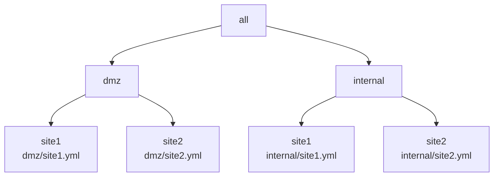
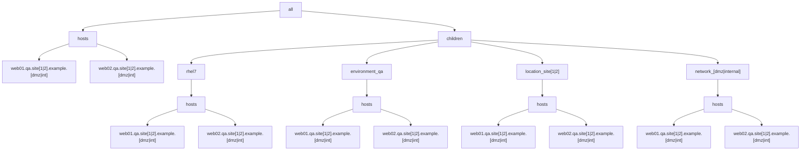

# Example 5: Multiple YAML inventories with 'role-based' YAML inventory groups


Many use cases require network-specific servers/fixtures/assets to be setup for to serve/enable clients for network groups within an enterprise.
Some examples with servers within networks serving clients machines in the respective networks fitting this use case:

- router gateways
- firewalls
- dns servers
- ntp servers
- ldap servers
- postfix servers
- nfs servers
- repo/archive

and the list goes on...

The following section addresses the network/client needs for this use case specifically with respect to ansible based inventory.

In the prior [Example 4](../example4/README.md), we merged Multiple YAML inventories using 'role-based' INI inventory groups.

It was also noted that INI the approach had the following 2 downsides:

1) the inventory and groups are now expressed using mixed formats in YAML and INI and
2) the INI formatted files cannot be stored with the '*.ini' extension causing most IDEs to not invoke the correct code styling/formatting.

The following section will use YAML-only approach by implementing the inventory role-based groups in YAML.

The benefit of this approach will be that the inventory and groups will be represented in the same YAML format.

## Overview

In this example there are 2 networks located at 2 sites resulting in 4 YAML inventory files, with hierarchy diagrammed as follows:




For each of the 4 inventory files, the following group/host hierarchy will be implemented:




Each site.yml inventory will be setup similar to the following with the "[dmz|internal]" and "[1|2]" regex patterns evaluated for each of the 4 cases:

```yaml
all:
  hosts:
    admin01.qa.site[1|2].example.[dmz|int]: 
      trace_var: site[1|2]/admin01.qa.site[1|2].example.[dmz|int]
    admin02.qa.site[1|2].example.[dmz|int]: 
      trace_var: site[1|2]/admin01.qa.site[1|2].example.[dmz|int]
    app01.qa.site[1|2].example.[dmz|int]: 
      trace_var: site[1|2]/app01.qa.site[1|2].example.[dmz|int]
    app02.qa.site[1|2].example.[dmz|int]: 
      trace_var: site[1|2]/app01.qa.site[1|2].example.[dmz|int]
    web01.qa.site[1|2].example.[dmz|int]:
      trace_var: site[1|2]/web01.qa.site[1|2].example.[dmz|int]
    web02.qa.site[1|2].example.[dmz|int]:
      trace_var: site[1|2]/rhel7/web02.qa.site[1|2].example.[dmz|int]
  children:
    rhel6:
      vars:
        trace_var: dmz/site1/rhel6
      hosts:
        admin01.qa.site[1|2].example.[dmz|int]: {}
    rhel7:
      vars:
        trace_var: site[1|2]/rhel7
      hosts:
        admin02.qa.site[1|2].example.[dmz|int]: {}
        app01.qa.site[1|2].example.[dmz|int]: {}
        app02.qa.site[1|2].example.[dmz|int]: {}
        web01.qa.site[1|2].example.[dmz|int]: {}
        web02.qa.site[1|2].example.[dmz|int]: {}
    environment_qa:
      vars:
        trace_var: site[1|2]/environment_qa
      hosts:
        admin01.qa.site[1|2].example.[dmz|int]: {}
        admin01.qa.site[1|2].example.[dmz|int]: {}
        app01.qa.site[1|2].example.[dmz|int]: {}
        app02.qa.site[1|2].example.[dmz|int]: {}
        web01.qa.site[1|2].example.[dmz|int]: {}
        web02.qa.site[1|2].example.[dmz|int]: {}
    location_site[1|2]:
      vars:
        trace_var: site[1|2]/location_site[1|2]
      hosts:
        admin01.qa.site[1|2].example.[dmz|int]: {}
        admin01.qa.site[1|2].example.[dmz|int]: {}
        app01.qa.site[1|2].example.[dmz|int]: {}
        app02.qa.site[1|2].example.[dmz|int]: {}
        web01.qa.site[1|2].example.[dmz|int]: {}
        web02.qa.site[1|2].example.[dmz|int]: {}
    network_[dmz|internal]:
      vars:
        trace_var: site[1|2]/network_[dmz|internal]
      hosts:
        admin01.qa.site[1|2].example.[dmz|int]: {}
        admin01.qa.site[1|2].example.[dmz|int]: {}
        app01.qa.site[1|2].example.[dmz|int]: {}
        app02.qa.site[1|2].example.[dmz|int]: {}
        web01.qa.site[1|2].example.[dmz|int]: {}
        web02.qa.site[1|2].example.[dmz|int]: {}
    ##
    ## 'network_client' group is only used in the internal inventory
    ##    to separate the ntp-clients from the servers
    ##
    ## For the DMZ environment, all machines are ntp-clients 
    ##    and have the same ntp_servers config  
    ##    to common external/publicly-hosted ntp-servers
    ##
    network_client:
      vars:
        trace_var: site[1|2]/network_client
      hosts:
        app01.qa.site[1|2].example.int
        app02.qa.site[1|2].example.int
        web01.qa.site[1|2].example.int
        web02.qa.site[1|2].example.int
    ungrouped: {}

```

Each of the respective inventory files:

* [dmz/site1 inventory](./inventory/dmz/site1.yml)
* [dmz/site2 inventory](./inventory/dmz/site2.yml)
* [internal/site1 inventory](./inventory/internal/site1.yml)
* [internal/site2 inventory](./inventory/internal/site2.yml)


## Define NTP inventory groups

For the ntp playbook/role to work on both servers and clients, we will define the 'ntp_server' and 'ntp_client' groups to correctly scope the machines to be applied.

All machines in the 'network_dmz' group will have the __ntp_servers__ variable set to the externally defined ntp servers.

For each site in the 'network_internal' group, there will be 2 machines defined in the 'ntp_servers' group.
All ntp clients in the 'network_internal' group will have the __ntp_servers__ variable set to the 2 ntp_server machines in the respective site.

### Internal Network NTP Client Configuration

For the internal network inventory, the 'ntp_client_internal' group is defined with the parent group of 'ntp_client'.  The 'ntp_client_internal' group has its child group set to the inventory defined group 'network_client'.  

[inventory/internal/ntp.yml](./inventory/internal/ntp.yml):
```yaml
all:
  children:
    ntp_client:
      vars:
        group_trace_var: internal/ntp.yml[ntp_client]
      children:
        ntp_client_internal: {}
    ntp_client_internal:
      vars:
        group_trace_var: internal/ntp.yml[ntp_client_internal]
      children:
        network_client: {}
    ntp_server:
      vars:
        group_trace_var: internal/ntp.yml[ntp_server]
      hosts:
        admin01.qa.site1.example.int
        admin02.qa.site1.example.int
        admin01.qa.site2.example.int
        admin02.qa.site2.example.int
    ntp:
      children:
        ntp_client: {}
        ntp_server: {}
```


The __ntp_servers__ variable setting in the ['ntp_client_internal'](./inventory/internal/group_vars/ntp_client_internal.yml) group:

site1:
```output
"ntp_servers": [
    "admin01.qa.site1.example.int
    "admin02.qa.site1.example.int
]

```

site2:
```output
ntp_servers: [
    "admin01.qa.site2.example.int
    "admin02.qa.site2.example.int
]
```


### DMZ Network NTP Client Configuration

The 'ntp-client' group will include all linux machines for the respective environment.
In this case, the environment will be defined with the existing test environment group named 'environment_test'.

Now we can define the YAML groups to be used by the 'ntp' playbook/role as follows:

[inventory/dmz/ntp.yml](./inventory/dmz/ntp.yml):
```yaml
all:
  children:
    ntp_client:
      children:
        environment_test: {}
    ntp:
      children:
        ntp_client: {}
```

Note that for the DMZ network, that there are no internal ntp servers and that all machines are ntp clients with the __ntp_server__ variable set to external/public ntp server machines.

This can be seen in the __ntp_servers__ variable in the ['ntp_client'](./inventory/dmz/group_vars/ntp_client.yml) group variable configuration:

```yaml
ntp_servers:
  - 0.rhel.pool.ntp.org
  - 1.rhel.pool.ntp.org
  - 2.rhel.pool.ntp.org
  - 3.rhel.pool.ntp.org

```

## NTP parent group
A ntp parent group is defined such that it contains all the related groups useful for targetting plays to run against for the entire NTP configuration playbook.

[inventory/internal/ntp.yml](./inventory/internal/ntp.yml):
```yaml
all:
  children:
    ntp_client:
      vars:
        group_trace_var: internal/ntp.yml[ntp_client]
      children:
        ntp_client_internal: {}
    ntp_client_internal:
      vars:
        group_trace_var: internal/ntp.yml[ntp_client_internal]
      children:
        network_client: {}
    ntp_server:
      vars:
        group_trace_var: internal/ntp.yml[ntp_server]
      hosts:
        admin01.qa.site1.example.int
        admin02.qa.site1.example.int
        admin01.qa.site2.example.int
        admin02.qa.site2.example.int
    ntp:
      children:
        ntp_client: {}
        ntp_server: {}
```


We will now run through several ansible CLI tests to verify that the correct machines result for each respective limit used.

### Test 1: Show list of all ntp hosts

```shell
ansible -i ./inventory --list-hosts ntp
  hosts (24):
    admin01.qa.site1.example.dmz
    admin02.qa.site1.example.dmz
    app01.qa.site1.example.dmz
    app02.qa.site1.example.dmz
    web01.qa.site1.example.dmz
    web02.qa.site1.example.dmz
    admin01.qa.site2.example.dmz
    admin02.qa.site2.example.dmz
    app01.qa.site2.example.dmz
    app02.qa.site2.example.dmz
    web01.qa.site2.example.dmz
    web02.qa.site2.example.dmz
    admin01.qa.site1.example.int
    admin02.qa.site1.example.int
    app01.qa.site1.example.int
    app02.qa.site1.example.int
    web01.qa.site1.example.int
    web02.qa.site1.example.int
    admin01.qa.site2.example.int
    admin02.qa.site2.example.int
    app01.qa.site2.example.int
    app02.qa.site2.example.int
    web01.qa.site2.example.int
    web02.qa.site2.example.int

```

### Test 2: Show debug for ntp servers

```shell
ansible -i ./inventory/internal -m debug -a var="foreman.ip,ntp_servers|d('')" ntp
admin01.qa.site1.example.int
    "foreman.ip,ntp_servers|d('')": "('10.10.10.56', ['0.us.pool.ntp.org', '1.us.pool.ntp.org', '2.us.pool.ntp.org', '3.us.pool.ntp.org'])"
}
admin02.qa.site1.example.int
    "foreman.ip,ntp_servers|d('')": "('10.10.10.60', ['0.us.pool.ntp.org', '1.us.pool.ntp.org', '2.us.pool.ntp.org', '3.us.pool.ntp.org'])"
}
admin01.qa.site2.example.int
    "foreman.ip,ntp_servers|d('')": "('10.10.20.56', ['0.us.pool.ntp.org', '1.us.pool.ntp.org', '2.us.pool.ntp.org', '3.us.pool.ntp.org'])"
}
admin02.qa.site2.example.int
    "foreman.ip,ntp_servers|d('')": "('10.10.20.60', ['0.us.pool.ntp.org', '1.us.pool.ntp.org', '2.us.pool.ntp.org', '3.us.pool.ntp.org'])"
}
app01.qa.site1.example.int
    "foreman.ip,ntp_servers|d('')": "('10.10.10.61', ['admin01.qa.site1.example.int', 'admin02.qa.site1.example.int
}
app02.qa.site1.example.int
    "foreman.ip,ntp_servers|d('')": "('10.10.10.62', ['admin01.qa.site1.example.int', 'admin02.qa.site1.example.int
}
web01.qa.site1.example.int
    "foreman.ip,ntp_servers|d('')": "('10.10.10.63', ['admin01.qa.site1.example.int', 'admin02.qa.site1.example.int
}
web02.qa.site1.example.int
    "foreman.ip,ntp_servers|d('')": "('10.10.10.64', ['admin01.qa.site1.example.int', 'admin02.qa.site1.example.int
}
app01.qa.site2.example.int
    "foreman.ip,ntp_servers|d('')": "('10.10.20.90', ['admin01.qa.site2.example.int', 'admin02.qa.site2.example.int
}
app02.qa.site2.example.int
    "foreman.ip,ntp_servers|d('')": "('10.10.20.91', ['admin01.qa.site2.example.int', 'admin02.qa.site2.example.int
}
web01.qa.site2.example.int
    "foreman.ip,ntp_servers|d('')": "('10.10.20.92', ['admin01.qa.site2.example.int', 'admin02.qa.site2.example.int
}
web02.qa.site2.example.int
    "foreman.ip,ntp_servers|d('')": "('10.10.20.93', ['admin01.qa.site2.example.int', 'admin02.qa.site2.example.int
}

```

We can verify that the correct ntp servers have been matched to the correct clients based on the 'ntp_allow_networks', which is indirectly based on the respective gateways.
The results are as expected/intended.

## Testing Conclusion

The 2 test results demonstrate that we can safely target the ntp_server and ntp_client machines with the appropriate group targets.

We now seek to apply those filters in the next ntp playbook section.


## NTP group variables

### Environment specific variable settings

Each network-site environment has a different gateway with a respective unique ipv4 address.  The gateway ipv4 address is used to derive the network mask for each respective environment, which in turn is used to properly derive the ntp allow/restrict network mask setting used for each ntp server.

Set up the gateway_ipv4 variable for each network/site.

We do this by adding a section for each site group (location_site[1|2]) for the appropriate variable settings to be added to the respective inventory ntp.yml as follows.

[inventory/dmz/ntp.yml](./inventory/dmz/ntp.yml)
```yaml
all:
  children:
    ntp_server:
      hosts:
        admin01.qa.site1.example.dmz
        admin02.qa.site1.example.dmz
        admin01.qa.site2.example.dmz
        admin02.qa.site2.example.dmz
    ntp_client:
      children:
        environment_test: {}
    ntp:
      children:
        ntp_client: {}
    location_site1:
      vars:
        trace_var: dmz/ntp/location_site1
        gateway_ipv4: 112.112.0.1
        gateway_ipv4_network_cidr: 112.112.0.0/16
    location_site2:
      vars:
        trace_var: dmz/ntp/location_site2
        gateway_ipv4: 221.221.0.1
        gateway_ipv4_network_cidr: 221.221.0.0/16

```

[inventory/internal/ntp.yml](./inventory/internal/ntp.yml)
```yaml
all:
  children:
    ntp_client:
      vars:
        group_trace_var: internal/ntp.yml[ntp_client]
      children:
        ntp_client_internal: {}
    ntp_client_internal:
      vars:
        group_trace_var: internal/ntp.yml[ntp_client_internal]
      children:
        network_client: {}
    ntp_server:
      vars:
        group_trace_var: internal/ntp.yml[ntp_server]
      hosts:
        admin01.qa.site1.example.int
        admin02.qa.site1.example.int
        admin01.qa.site2.example.int
        admin02.qa.site2.example.int
    ntp:
      children:
        ntp_client: {}
        ntp_server: {}
    location_site1:
      vars:
        trace_var: internal/ntp.yml[location_site1]
        gateway_ipv4: 10.10.10.1
        gateway_ipv4_network_cidr: 10.10.10.0/24
    location_site2:
      vars:
        trace_var: internal/ntp.yml[location_site2]
        gateway_ipv4: 10.10.20.1
        gateway_ipv4_network_cidr: 10.10.20.0/24
```


### Verify that the correct gateway_ipv4 setting appears for each ntp server.

```shell
ansible -i ./inventory/ -m debug -a var=group_trace_var,gateway_ipv4 ntp_server
admin01.qa.site1.example.int
    "group_trace_var,gateway_ipv4": "('group_vars/ntp_client.yml', '10.10.10.1')"
}
admin02.qa.site1.example.int
    "group_trace_var,gateway_ipv4": "('group_vars/ntp_client.yml', '10.10.10.1')"
}
admin01.qa.site2.example.int
    "group_trace_var,gateway_ipv4": "('group_vars/ntp_client.yml', '10.10.20.1')"
}
admin02.qa.site2.example.int
    "group_trace_var,gateway_ipv4": "('group_vars/ntp_client.yml', '10.10.20.1')"
}

```


### Group vars for play/role specific settings

Set up group variables for the respective ntp groups.

[inventory/internal/group_vars/ntp_server.yml](./inventory/internal/group_vars/ntp_server.yml)
```yaml
---

## ntp-server configs
## ref: https://github.com/geerlingguy/ansible-role-ntp
ntp_timezone: America/New_York
ntp_area: 'us'

ntp_tinker_panic: true

ntp_allow_networks:
  - "{{ gateway_ipv4_network_cidr }}"

ntp_servers:
  - 0{{ '.' + ntp_area if ntp_area else '' }}.pool.ntp.org
  - 1{{ '.' + ntp_area if ntp_area else '' }}.pool.ntp.org
  - 2{{ '.' + ntp_area if ntp_area else '' }}.pool.ntp.org
  - 3{{ '.' + ntp_area if ntp_area else '' }}.pool.ntp.org

ntp_peers: |
  [
    
    {{ host }},
    
  ]
  
ntp_local_stratum_enabled: yes

ntp_leapsectz_enabled: yes

ntp_log_info:
  - measurements
  - statistics
  - tracking

ntp_cmdport_disabled: no

## used for variable-to-inventory trace/debug
group_trace_var: internal/group_vars/ntp_server.yml

```

[inventory/internal/group_vars/ntp_client.yml](./inventory/internal/group_vars/ntp_client.yml)
```yaml
---

## ntp-client configs
## ref: https://github.com/geerlingguy/ansible-role-ntp
ntp_timezone: America/New_York

ntp_tinker_panic: yes

ntp_servers: |
  [
    
    
    
    
    "{{ server }}",
    
    
    
    
  ]

ntp_cmdport_disabled: yes

## used for variable-to-inventory trace/debug
group_trace_var: internal/groups_vars/ntp_client.yml

```


## NTP Playbook

[playbook.yml](./playbook.yml):
```yaml
---

- name: "Setup ntp servers"
  hosts: ntp_server
  tags:
    - bootstrap-ntp
    - bootstrap-ntp-server
  become: yes
  roles:
    - role: geerlingguy.ntp

- name: "Setup ntp clients"
  hosts: ntp_client,!ntp_server
  tags:
    - bootstrap-ntp
    - bootstrap-ntp-client
  become: yes
  roles:
    - role: geerlingguy.ntp

```


### Show the resulting ntp_servers variable

Run for groups 'ntp_server,\&network_internal'
```shell
ansible -i ./inventory/ -m debug -a var=ntp_servers ntp_server,\&network_internal
admin01.qa.site1.example.int
    "ntp_servers": [
        "0.us.pool.ntp.org iburst xleave",
        "1.us.pool.ntp.org iburst xleave",
        "2.us.pool.ntp.org iburst xleave",
        "3.us.pool.ntp.org iburst xleave"
    ]
}
admin02.qa.site1.example.int
    "ntp_servers": [
        "0.us.pool.ntp.org iburst xleave",
        "1.us.pool.ntp.org iburst xleave",
        "2.us.pool.ntp.org iburst xleave",
        "3.us.pool.ntp.org iburst xleave"
    ]
}
admin01.qa.site2.example.int
    "ntp_servers": [
        "0.us.pool.ntp.org iburst xleave",
        "1.us.pool.ntp.org iburst xleave",
        "2.us.pool.ntp.org iburst xleave",
        "3.us.pool.ntp.org iburst xleave"
    ]
}
admin02.qa.site2.example.int
    "ntp_servers": [
        "0.us.pool.ntp.org iburst xleave",
        "1.us.pool.ntp.org iburst xleave",
        "2.us.pool.ntp.org iburst xleave",
        "3.us.pool.ntp.org iburst xleave"
    ]
}

```


## Debug host vars using groups to target sets of hosts

Run debug using a group defined set of hosts.

### Specify role & network/location groups

Run for groups 'ntp_server,\&network_internal'
```shell
ansible -i ./inventory/ -m debug -a var=trace_var,group_names ntp_server,\&network_internal
admin01.qa.site1.example.int
    "trace_var,group_names": "('internal/site1/admin01.qa.site1.example.int
}
admin02.qa.site1.example.int
    "trace_var,group_names": "('internal/site1/admin02.qa.site1.example.int
}
admin01.qa.site2.example.int
    "trace_var,group_names": "('internal/site2/admin01.qa.site2.example.int
}
admin02.qa.site2.example.int
    "trace_var,group_names": "('internal/site2/admin02.qa.site2.example.int
}

```

Run for groups 'ntp_server,\&location_site2'
```shell
ansible -i ./inventory/ -m debug -a var=trace_var,group_names ntp_server,\&location_site2
admin01.qa.site2.example.dmz
    "trace_var,group_names": "('dmz/site2/admin01.qa.site2.example.dmz
}
admin02.qa.site2.example.dmz
    "trace_var,group_names": "('dmz/site2/admin02.qa.site2.example.dmz
}
admin01.qa.site2.example.int
    "trace_var,group_names": "('internal/site2/admin01.qa.site2.example.int
}
admin02.qa.site2.example.int
    "trace_var,group_names": "('internal/site2/admin02.qa.site2.example.int
}

```

### Specify network/location groups

Run for group 'network_internal'
```shell
ansible -i ./inventory/ -m debug -a var=trace_var,group_names network_internal
admin01.qa.site1.example.int
    "trace_var,group_names": "('internal/site1/admin01.qa.site1.example.int
}
admin02.qa.site1.example.int
    "trace_var,group_names": "('internal/site1/admin02.qa.site1.example.int
}
app01.qa.site1.example.int
    "trace_var,group_names": "('internal/site1/app01.qa.site1.example.int
}
app02.qa.site1.example.int
    "trace_var,group_names": "('internal/site1/app02.qa.site1.example.int
}
web01.qa.site1.example.int
    "trace_var,group_names": "('internal/site1/web01.qa.site1.example.int
}
web02.qa.site1.example.int
    "trace_var,group_names": "('internal/site1/web02.qa.site1.example.int
}
admin01.qa.site2.example.int
    "trace_var,group_names": "('internal/site2/admin01.qa.site2.example.int
}
admin02.qa.site2.example.int
    "trace_var,group_names": "('internal/site2/admin02.qa.site2.example.int
}
app01.qa.site2.example.int
    "trace_var,group_names": "('internal/site2/app01.qa.site2.example.int
}
app02.qa.site2.example.int
    "trace_var,group_names": "('internal/site2/app02.qa.site2.example.int
}
web01.qa.site2.example.int
    "trace_var,group_names": "('internal/site2/web01.qa.site2.example.int
}
web02.qa.site2.example.int
    "trace_var,group_names": "('internal/site2/web02.qa.site2.example.int
}

```

Run for group 'location_site1'
```shell
ansible -i ./inventory/ -m debug -a var=trace_var,group_names location_site1
admin01.qa.site1.example.dmz
    "trace_var,group_names": "('dmz/site1/admin01.qa.site1.example.dmz
}
admin02.qa.site1.example.dmz
    "trace_var,group_names": "('dmz/site1/admin02.qa.site1.example.dmz
}
app01.qa.site1.example.dmz
    "trace_var,group_names": "('dmz/site1/app01.qa.site1.example.dmz
}
app02.qa.site1.example.dmz
    "trace_var,group_names": "('dmz/site1/app02.qa.site1.example.dmz
}
web01.qa.site1.example.dmz
    "trace_var,group_names": "('dmz/site1/web01.qa.site1.example.dmz
}
web02.qa.site1.example.dmz
    "trace_var,group_names": "('dmz/site1/web02.qa.site1.example.dmz
}
admin01.qa.site1.example.int
    "trace_var,group_names": "('internal/site1/admin01.qa.site1.example.int
}
admin02.qa.site1.example.int
    "trace_var,group_names": "('internal/site1/admin02.qa.site1.example.int
}
app01.qa.site1.example.int
    "trace_var,group_names": "('internal/site1/app01.qa.site1.example.int
}
app02.qa.site1.example.int
    "trace_var,group_names": "('internal/site1/app02.qa.site1.example.int
}
web01.qa.site1.example.int
    "trace_var,group_names": "('internal/site1/web01.qa.site1.example.int
}
web02.qa.site1.example.int
    "trace_var,group_names": "('internal/site1/web02.qa.site1.example.int
}

```

Run for group(s) matching multiple groups 'ntp_server,&network_dmz'
```shell
ansible -i ./inventory/ -m debug -a var=trace_var,group_names ntp_server,\&network_dmz
admin01.qa.site1.example.dmz
    "trace_var,group_names": "('dmz/site1/admin01.qa.site1.example.dmz
}
admin02.qa.site1.example.dmz
    "trace_var,group_names": "('dmz/site1/admin02.qa.site1.example.dmz
}
admin01.qa.site2.example.dmz
    "trace_var,group_names": "('dmz/site2/admin01.qa.site2.example.dmz
}
admin02.qa.site2.example.dmz
    "trace_var,group_names": "('dmz/site2/admin02.qa.site2.example.dmz
}

```

Run for group(s) matching multiple groups 'location_site2,&ntp_server'
```shell
ansible -i ./inventory/ -m debug -a var=trace_var,group_names location_site2,\&ntp_server
admin01.qa.site2.example.dmz
    "trace_var,group_names": "('dmz/site2/admin01.qa.site2.example.dmz
}
admin02.qa.site2.example.dmz
    "trace_var,group_names": "('dmz/site2/admin02.qa.site2.example.dmz
}
admin01.qa.site2.example.int
    "trace_var,group_names": "('internal/site2/admin01.qa.site2.example.int
}
admin02.qa.site2.example.int
    "trace_var,group_names": "('internal/site2/admin02.qa.site2.example.int
}

```

## Limits

### Limit to specific hosts in a group

```shell
ansible -i ./inventory/ -m debug -a var=trace_var,group_names ntp_server -l admin01.qa.site1.example.dmz
admin01.qa.site1.example.dmz
    "trace_var,group_names": "('dmz/site1/admin01.qa.site1.example.dmz
}

```

### Limit hosts in the role-based group

Run for the role-based group 'ntp_client' with a specified limit
```shell
ansible -i ./inventory/ -m debug -a var=trace_var,group_names ntp_client -l web-*
web01.qa.site1.example.dmz
    "trace_var,group_names": "('dmz/site1/web01.qa.site1.example.dmz
}
web02.qa.site1.example.dmz
    "trace_var,group_names": "('dmz/site1/web02.qa.site1.example.dmz
}
web01.qa.site2.example.dmz
    "trace_var,group_names": "('dmz/site2/web01.qa.site2.example.dmz
}
web02.qa.site2.example.dmz
    "trace_var,group_names": "('dmz/site2/web02.qa.site2.example.dmz
}
web01.qa.site1.example.int
    "trace_var,group_names": "('internal/site1/web01.qa.site1.example.int
}
web02.qa.site1.example.int
    "trace_var,group_names": "('internal/site1/web02.qa.site1.example.int
}
web01.qa.site2.example.int
    "trace_var,group_names": "('internal/site2/web01.qa.site2.example.int
}
web02.qa.site2.example.int
    "trace_var,group_names": "('internal/site2/web02.qa.site2.example.int
}

```


## Conclusion/Next Steps

From this test, we conclude that using the YAML method to match role-based group settings to an existing YAML-based inventory works as expected.

Note that for the ntp clients in the internal group, we leveraged a special group called 'network_client'.

Maintaining such a group configuration can be problematic.

E.g., Say the following parameters are given:

* A 'network' (parent) group has 100, 1000, or lets say __N machines__ and 
* A subset 'network_server' group only has a far less _finite number_ of instances, say 2, 4, or __M machines__
* A derived 'network_client' defined as the parent group of __N machines__ minus the server group of __M machines__.

So given an inventory with a 'network' group of 1000 machines, and a 'network_server' group of 4 machines, then the 'network_client' group would have 996 machines. 

Maintaining a 'network_client' group for multiple use-cases would have to re-define the child group of __(N - M) machines__. 

This can present risks since then each 'network_client' group is almost the same size as the parent 'network_server' group and exposes risks of maintaining synchronization of the group.

Multiply this by the number of use cases having the same/similar pattern.

Ideally, we do not want to explicitly define and maintain a 'network_client' group since it can be simply derived from the obtaining the difference of the 'network' and 'network_server' groups.

The [next example](../example6/README.md) will look to resolve the challenge of deriving the 'network_client' child group.
