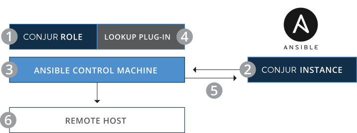

# Strategy for running environment specific jobs

## Overview

There is a need to lookup Ansible machine credentials for a specified environment/group (e.g., DEV/linux, TEST/Windows, etc).

In a properly secure environment, there would be separate credentials used for each environment.

## Running Jobs

One possible idea for running jobs for specific environments is to simply use tags on existing templates.
 
Say you have N groups (10, 20, 50, etc). and M environments (2, 5, 10, etc).
It becomes quickly impractical to have a single CICD pipeline or Ansible Tower job template setup to derive all the necessary variables, secrets, and credentials at runtime given this circumstance. There will be many headaches/credential overloading issues that will become problematic in having multiple environment credentials for a single job template and multiply that by N * M.

In most multi-environment CICD frameworks, one has the intention of starting a job knowing the specific environment that they plan to act on.

# Multi-environment ansible playbook implementation

The environment specified in the play leads to the env-specific vars as defined by the inventory group_vars and host_vars.

This can be achieved with an inventory layout similar to the one encouraged as a best practice by ansible.  It basically involes the separation of inventory at the top level by environment.  Then specify any symbolic links to any global group_vars if and as necessary. Then upon playbook execution, set to the respective inventory environment-specific directory.

## Idempotent Playbook types

At a high level, there are two flavors of playbooks:<br>
  * direct target based - the play is meant to be applied directly against a target node<br>
  * API controller based - in this case the play is run locally on the ansible controller and specifies an API destination to send all related information regarding the ultimate target node.


## Separate playbook runtime environments per best practice

* Set up implementation to derive environmental information based on ansible multi-env variable grouping [best practices referenced here](../../../../ansible/how-to-manage-multistage-environments-with-ansible.md).

  * Upon playbook execution, set inventory to use the respective environment-specific directory (DEV/TEST/PROD).
    * In Tower, this can be done by setting the inventory directory used in the job template. 
## Setup ansible to leverage conjur to obtain environment credentials

1. Install [Ansible Conjur Role](https://github.com/cyberark/ansible-conjur-host-identity) and [Lookup Plug-in](https://docs.ansible.com/ansible/latest/collections/cyberark/conjur/conjur_variable_lookup.html) 
2. Load a Conjur policy that grants the Ansible control machine privileges on secrets 
3. Run a playbook containing references to secrets stored in Conjur 
4. Authenticate the control machine to Conjur 
5. Issue the secrets 
6. Playbook fetches secrets from Conjur and executes



* ansible playbook derives the environment-specific credentials using the credential identifiers set in the respective inventory group vars.
* Using the [conjur variable lookup plugin](https://docs.ansible.com/ansible/latest/collections/cyberark/conjur/conjur_variable_lookup.html)
* The [CyberArk Ansible Conjur Collection](https://github.com/cyberark/ansible-conjur-collection)
* The git repo for the [Conjur Ansible Lookup Plugin](https://github.com/cyberark/ansible-conjur-collection#conjur-ansible-lookup-plugin)


In env specific group vars, then set the respective machine credential.
For example, in the prod case.

inventory/PROD/group_vars/all/env_specific.yml:
```yaml
---
## ref: https://github.com/cyberark/ansible-conjur-collection

env: prod

ansible_user: "{{ lookup('cyberark.conjur.conjur_variable', 'PROD/Linux/ansible_user') }}"
ansible_password: "{{ lookup('cyberark.conjur.conjur_variable', 'PROD/Linux/ansible_password') }}"

machine_credential:
  username: "{{ ansible_user }}"
  password: "{{ ansible_password }}"
network_credential:
  username: "{{ lookup('cyberark.conjur.conjur_variable', 'PROD/ANSIBLE_NET_USERNAME') }}"
  password: "{{ lookup('cyberark.conjur.conjur_variable', 'PROD/ANSIBLE_NET_PASSWORD') }}"
aws_credential:
  access_key: "{{ lookup('cyberark.conjur.conjur_variable', 'PROD/AWS_ACCESS_KEY_ID') }}"
  secret_key: "{{ lookup('cyberark.conjur.conjur_variable', 'PROD/AWS_SECRET_ACCESS_KEY') }}"
  security_token: "{{ lookup('cyberark.conjur.conjur_variable', 'PROD/AWS_SECURITY_TOKEN') }}"
vmware_credential:
  host: "{{ lookup('cyberark.conjur.conjur_variable', 'PROD/VMWARE_HOST') }}"
  username: "{{ lookup('cyberark.conjur.conjur_variable', 'PROD/VMWARE_USER') }}"
  password: "{{ lookup('cyberark.conjur.conjur_variable', 'PROD/VMWARE_PASSWORD') }}"
gce_credential:
  email: "{{ lookup('cyberark.conjur.conjur_variable', 'PROD/GCE_EMAIL') }}"
  project: "{{ lookup('cyberark.conjur.conjur_variable', 'PROD/GCE_PROJECT') }}"
azure_credential:
  client_id: "{{ lookup('cyberark.conjur.conjur_variable', 'PROD/AZURE_CLIENT_ID') }}"
  secret: "{{ lookup('cyberark.conjur.conjur_variable', 'PROD/AZURE_SECRET') }}"
  tenant: "{{ lookup('cyberark.conjur.conjur_variable', 'PROD/AZURE_TENANT') }}"
  subscription_id: "{{ lookup('cyberark.conjur.conjur_variable', 'PROD/AZURE_SUBSCRIPTION_ID') }}"
rhev_credential:
  ovirt_url: "{{ lookup('cyberark.conjur.conjur_variable', 'PROD/OVIRT_URL') }}"
  ovirt_username: "{{ lookup('cyberark.conjur.conjur_variable', 'PROD/OVIRT_USERNAME') }}"
  ovirt_password: "{{ lookup('cyberark.conjur.conjur_variable', 'PROD/OVIRT_PASSWORD') }}"

ansible_ssh_private_key_file: "{{ lookup('cyberark.conjur.conjur_variable', 'PROD/Linux/ansible_ssh_private_key_file', as_file=True) }}"

```

This can be further abstracted such that the environment uses a variable for environment reference and not hard-coded into the look-up paths above.  Then the complete code block above can be moved into the environment-agnostic path.

inventory/group_vars/all.yml:
```yaml
---
## ref: https://github.com/cyberark/ansible-conjur-collection

machine_credential:
#  username: "{{ ansible_user }}"
#  password: "{{ ansible_password }}"
  username: "{{ lookup('cyberark.conjur.conjur_variable', env|upper + '/' + os_version_shortname + '/ansible_user') }}"
  password: "{{ lookup('cyberark.conjur.conjur_variable', env|upper + '/' + os_version_shortname + '/ansible_password') }}"
  
network_credential:
  username: "{{ lookup('cyberark.conjur.conjur_variable', env|upper + '/ANSIBLE_NET_USERNAME') }}"
  password: "{{ lookup('cyberark.conjur.conjur_variable', env|upper + '/ANSIBLE_NET_PASSWORD') }}"
aws_credential:
  access_key: "{{ lookup('cyberark.conjur.conjur_variable', env|upper + '/AWS_ACCESS_KEY_ID') }}"
  secret_key: "{{ lookup('cyberark.conjur.conjur_variable', env|upper + '/AWS_SECRET_ACCESS_KEY') }}"
  security_token: "{{ lookup('cyberark.conjur.conjur_variable', env|upper + '/AWS_SECURITY_TOKEN') }}"
vmware_credential:
  host: "{{ lookup('cyberark.conjur.conjur_variable', env|upper + '/VMWARE_HOST') }}"
  username: "{{ lookup('cyberark.conjur.conjur_variable', env|upper + '/VMWARE_USER') }}"
  password: "{{ lookup('cyberark.conjur.conjur_variable', env|upper + '/VMWARE_PASSWORD') }}"
gce_credential:
  email: "{{ lookup('cyberark.conjur.conjur_variable', env|upper + '/GCE_EMAIL') }}"
  project: "{{ lookup('cyberark.conjur.conjur_variable', env|upper + '/GCE_PROJECT') }}"
azure_credential:
  client_id: "{{ lookup('cyberark.conjur.conjur_variable', env|upper + '/AZURE_CLIENT_ID') }}"
  secret: "{{ lookup('cyberark.conjur.conjur_variable', env|upper + '/AZURE_SECRET') }}"
  tenant: "{{ lookup('cyberark.conjur.conjur_variable', env|upper + '/AZURE_TENANT') }}"
  subscription_id: "{{ lookup('cyberark.conjur.conjur_variable', env|upper + '/AZURE_SUBSCRIPTION_ID') }}"
rhev_credential:
  ovirt_url: "{{ lookup('cyberark.conjur.conjur_variable', env|upper + '/OVIRT_URL') }}"
  ovirt_username: "{{ lookup('cyberark.conjur.conjur_variable', env|upper + '/OVIRT_USERNAME') }}"
  ovirt_password: "{{ lookup('cyberark.conjur.conjur_variable', env|upper + '/OVIRT_PASSWORD') }}"

ansible_ssh_private_key_file: "{{ lookup('cyberark.conjur.conjur_variable', env|upper + '/' + os_version_shortname + '/ansible_ssh_private_key_file', as_file=True) }}"

```

The machine credentials for the OS can be set in the respective os groups.

inventory/group_vars/dc_os_linux.yml:
```yaml
---
## ref: https://github.com/cyberark/ansible-conjur-collection

## env is set in the respective env_specific.yml
ansible_user: "{{ lookup('cyberark.conjur.conjur_variable', env|upper + '/Linux/ansible_user') }}"
ansible_password: "{{ lookup('cyberark.conjur.conjur_variable', env|upper + '/Linux/ansible_password') }}"

```

inventory/group_vars/dc_os_windows.yml:
```yaml
---
## ref: https://github.com/cyberark/ansible-conjur-collection

## env is set in the respective env_specific.yml
ansible_user: "{{ lookup('cyberark.conjur.conjur_variable', env|upper + '/Window/ansible_user') }}"
ansible_password: "{{ lookup('cyberark.conjur.conjur_variable', env|upper + '/Window/ansible_password') }}"

```


* Limit Tower job templates to just the following user inputs:
  * specifying the environment identifier (e.g., DEV/TEST/PROD)
  * ansible --limit directive
  * ansible --tag directive
  * ansible verbosity
  * ansible check/diff mode
  * all other play inputs should be done in code if the play is idempotent
  * for operational plays using operational inputs that dont make sense to place into code, then only use survey inputs for those values instead of extra-vars.
    * examples here usually are one-off plays such as migration oriented plays

* The benefit with this approach is that the Ansible Tower UI is no longer setting the credential to the job template.  Instead the ansible play will derive all the necessary credentials in code via conjur lookup.


## CICD Jenkins POCs

* Setup jenkins pipelines to run ansible playbooks 
  * Create folders for each environment. 
  * Setup pipeline for essential idempotent ansible plays (e.g., bootstrap machine OS: windows/linux, bootstrap-docker, etc) 
  * derive environment and any other key/essential dimensions using the node hierarchy. 
    * use groovy to consistently derive from the node hierarchy key/essential/common ansible pipeline variable values to be passed into the ansible pipeline job. (E.g, environment, region/site, repo branch/etc)
    * Setup groovy wrapper used by all ansible idempotent leaf nodes to derive all variable values from the node hierarchy from conjur using [jenkins conjur plugin](https://plugins.jenkins.io/conjur-credentials/) and configure [conjur in jenkins ansible wrapper](https://docs.conjur.org/Latest/en/Content/Integrations/jenkins-configure.htm).  
  * Setup initial set of ansible plays in each environment node to demonstrate/solidify the concept.

## Reference

* https://stackoverflow.com/questions/59993825/how-to-use-ansible-tower-login-credentials-into-playbook
* https://github.com/cyberark/ansible-conjur-collection


