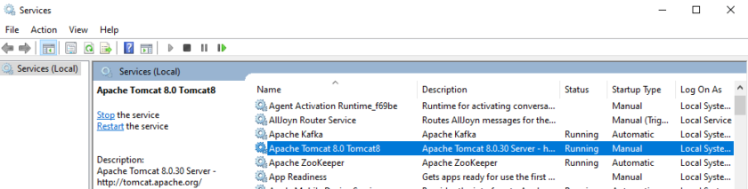
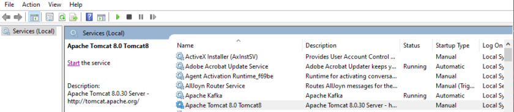
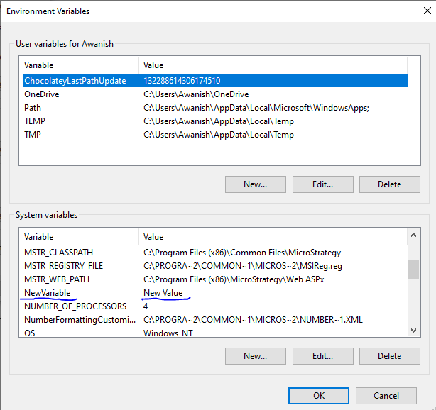
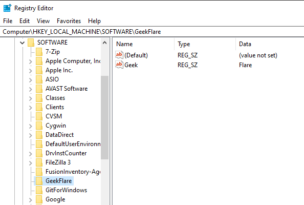

# 9 Ansible Playbooks Example for Windows Administration

I will show you several operations which an administrator can perform on a remote windows system using ansible-playbook.

[Ansible](https://geekflare.com/ansible-basics/) is one of the most used DevOps tools in the market today. It provides a bunch of windows modules that are used to configure and manage the Windows server. I assume you already have [Ansible installed on Windows](https://geekflare.com/ansible-installation-windows/) from where you want to manage the Windows servers.

The following are some of the commonly used tasks performed by Windows administrators on a daily basis. You will be amazed to see how easy it is administered Windows using Ansible.

My Ansible Windows controller machine’s IP address is 192.168.0.106, and my remote Windows system’s IP address is 192.168.0.102. Before you get started, make sure you run a `win_ping` module to check whether you are able to connect to windows remote server or not.

My connection to a remote host is successful.

So, let’s get started with Ansible Playbooks…

## Copying Files

_win\_copy_ is an ansible module that copies a file from the local server to a remote Windows host. I will use this module to copy a single PDF.

Use the below YAML code, give the source and destination paths.

Run the ansible-playbook for win\_copy.

The file has been copied successfully at the destination location on a remote windows system.

## Install/UnInstall MSI

To install an application using the MSI file, you need to use _win\_get\_url_ to mention the path of the MSI file to download and then use the _win\_package_ module to install it. The state present means the MSI will be installed on the machine, and the application is in the present state.

Here, I am installing Apache.

YAML code to be used:

Run the ansible-playbook to install using MSI.

Now, go to the windows system and check if the apache application got installed successfully.

You can also install applications using MSI with arguments. Below is the same example as above, but instead of a state, we are using an install argument to install apache.

YAML code to be used:

To uninstall an application using the MSI file, you need to use the _win\_package_ module. The state absent means the application will be uninstalled using the MSI file.

Here, I am uninstalling Apache.

Run the ansible-playbook to uninstall using MSI.

Now, if I check the apache version, I will get the below output as the application got uninstalled.

## Uninstall Software (.EXE)

You can also uninstall software with .exe file using the product id of that software.

Run the ansible-playbook to uninstall 7-Zip.

## Stop/Start/Restart Windows Services

_win\_service_ ansible module is used to start, stop, or restart a service. Here, I will show you how to stop the tomcat service.

You need to mention the service name in the YAML file and set the state to stop.

Run the ansible-playbook to stop the tomcat service.

If you check the tomcat service on the windows system, it is now in stopped status.

You can define state to started or restarted or paused to change the status of the service.

## Gathering Facts

Using _win\_disk\_facts_ ansible module, you can retrieve all the disk information of the target host.

Run the ansible-playbook to get the disk information.

Using _win\_command_ ansible module, you can execute commands on the remote host and get CPU information, device details, and much more.

Run the ansible-playbook to get remote system information.

## Running Commands

Whatever commands you run on a window, they can be run through the ansible _win\_command_ module. You just need to specify the command in your YAML file. Here, I am just creating a directory.

Run the ansible-playbook to perform win\_command operation.

## Environment Variables

A windows system has multiple environment variables, for example, JAVA\_HOME. Using the _win\_environment_ ansible module, you can add or modify environment variables on a windows system. In this example, I am adding a new variable to the windows environment variables list.

Run the ansible-playbook to add the environment variable on a remote windows machine.

Go to the environment variables window; you will see the new variable you just added is present here.

## Add/Edit Registry

_win\_regedit_ ansible module is used to add or edit registry details on a remote windows machine. You need to give the path of the registry and content to be added/updated. Here I am creating a new registry entry GeekFlare inside HKLM:\\SOFTWARE path and then adding name and data to this registry.

Run the ansible-playbook to add the registry.

If you go to Registry Editor on the remote system, you can see this registry has been added successfully with Name and Data parameters.

## Delete Log

_win\_eventlog_ ansible module is used to add, clear, or remove windows event logs from the windows system.

Go to Windows Powershell, and list the EventLogs present on the remote windows machine.

Now, I will show how to remove logs from all sources for Internet Explorer.

Run the ansible-playbook to remove the Internet Explorer form the remote windows machine.

Now, if you list the EventLogs again, you will see Internet Explorer logs have been removed.

So, that was all about Ansible playbooks, which can be used for remote windows administration. Go ahead and try out these playbooks. You can also try other [Ansible Windows modules](https://docs.ansible.com/ansible/2.9/modules/list_of_windows_modules.html) available.

## Reference

* https://geekflare.com/ansible-playbook-windows-example/
* 