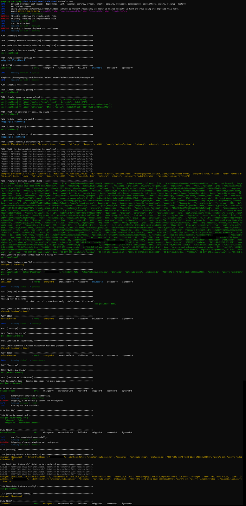

# Use Molecule to test Ansible roles on Windows

The goal is to test Ansible roles for Windows with Molecule, using SSH public key authentication on Openstack instances.

**Versions used**

```output
Molecule: 3.3  
Driver: Openstack  
Target OS: Windows Server 2019  
OpenSSH: Win32-OpenSSH v8.1.0.0p1-Beta
```

**Install prerequisites**

If you’re not working on a Linux workstation, I recommend you [install WSL2](https://docs.microsoft.com/en-us/windows/wsl/install-win10) and install a Debian/Ubuntu distribution.

We’ll install ansible, molecule, and generate a keypair that’ll be used by molecule to logon on the Windows host to test your roles.

```shell
apt-get -y install python3-pip
pip3 install ansible molecule molecule-openstack molecule-openstack pywinrm ansible-lint
ssh-keygen -t rsa -b 4096
```

**Prepare the Openstack Windows image**

Launch a clean Windows Server instance, logon with RDP and configure WinRM.

```shell
winrm set winrm/config/service '@{AllowUnencrypted="true"}'
winrm set winrm/config/service/auth @{Basic="true";CredSSP="true"}
$result = sc.exe config WinRM start= auto
```

Next, we’ll run an Ansible role on the server, to setup Win32-OpenSSH.  
We’ll use the [existing role](https://galaxy.ansible.com/jborean93/win_openssh) from Ansible galaxy for this.

```shell
ansible-galaxy install jborean93.win_openssh
```

Create an Ansible hosts file:

```ini
myServer ansible_ssh_host=x.x.x.x ansible_user=administrator ansible_password=Abc123?? ansible_connection=winrm ansible_port=5985 ansible_winrm_transport=credssp
```

Create a playbook in which you insert your own public key:

```yaml
- hosts:
  - myServer
  roles:
  - role: jborean93.win_openssh
    opt_openssh_pubkeys: ssh-rsa AAAA...
```

Run the playbook:

```shell
ansible-playbook -i ~/ansible/hosts ~/ansible/playbook_openssh
```

When finished, you should be able to login using your private key:

```shell
ssh -i ~/ansible/ssh_key administrator@x.x.x.x
Microsoft Windows [Version 10.0.17763.1879]
(c) 2018 Microsoft Corporation. All rights reserved.
administrator@WIN2019TEST003 C:\Users\Administrator>sshd -V
unknown option -- V
OpenSSH_for_Windows_8.1p1, LibreSSL 2.9.2

```

Take a snapshot/image of this instance, we’ll use this image to launch an instance for the Molecule run.

**Molecule**

Within your Ansible role dir, initiate a new Molecule scenario.  
This will create a molecule directory with a default scenario.

```shell
molecule init scenario -d openstack
```

Edit _create.yml_ to use our previously created ssh keypair (only changes shown below, leave the defaults):

```yaml
key_pair_name: "molecule-windows"
key_pair_path: "~/ansible/ssh_key"
```

Edit _molecule.yml_ to set the logon user & connection (only changes shown below, leave the defaults):

```yaml
platforms:
  - name: demo-role
    ssh_user: Administrator
provisioner:
  connection_options:
    ansible_shell_type: powershell
```

Edit _prepare.yml_ and insert any tasks you want to run, before testing your actual roles will start. Remove the _Install python for Ansible_ task in this file, this won’t work on Windows.  

For example, I install chocolatey in this stage:

```yaml
---
- name: Prepare
  hosts: all
  gather_facts: false
  tasks:
    - name: pause
      pause:
        seconds: 30
- name: install chocolatey
      win_shell: |
        Set-ExecutionPolicy Bypass -Scope Process -Force; [System.Net.ServicePointManager]::SecurityProtocol = [System.Net.ServicePointManager]::SecurityProtocol -bor 3072; iex ((New-Object System.Net.WebClient).DownloadString('https://chocolatey.org/install.ps1'))
```

Almost ready to run Molecule, but we need to load the Openstack & Molecule variables first.  
Download your Openstack RC file, and create a file for the Molecule variables:

```shell
export MOLECULE_OPENSTACK_IMAGE=win2019export MOLECULE_OPENSTACK_FLAVOR=m1.largeexport MOLECULE_OPENSTACK_NETWORK=private
```

Load variables from both files:

```shell
source ~/ansible/openrc.shsource ~/ansible/molecule.sh
```

All ready to run molecule on your role now.  
_test_ will launch the full molecule test sequence  
_create_ will only create your Openstack instance  
_login_ will create the instance and logon

Read more information on the different Molecule stages [here](https://molecule.readthedocs.io/en/latest/).

Run a full test sequence:

```
molecule test
```



**CI integration**

You can integrate Molecule in your CI/CD, for example Gitlab.  
Create a Docker image with all the requirements we made in the previous steps, and use it like this:

```yaml
---
image:
  name: myRegistry:4567/docker-molecule-windows:latest
stages:
  - test
before_script:
  - source /usr/local/bin/openrc.sh
win-2019:
  stage: tests
  except:
    - master
  script:
    - molecule test -s win2019
```

## Reference

* https://gregorystorme.medium.com/use-molecule-to-test-ansible-roles-on-windows-5bd40db3e331
