# Trunk based CICD pipeline at Amazon

## Introduction

Before Amazon adopted continuous delivery, developers on many teams played a role called the _release captain_. The release captain was responsible for coordinating the release of code changes for their team’s services and deploying the release to production. The release captain role has now largely disappeared at Amazon, thanks to the way they practice continuous delivery internally. Instead of a developer acting as the release captain, their continuous integration/continuous delivery (CI/CD) pipelines have become automated release captains. An old team wiki page about release management summed up the shift that Amazon teams have experienced since adopting CI/CD: “We have moved to using pipelines. We no longer manage individual releases.” Music to my ears!  

Developers at Amazon generally didn’t love the release captain role. It was time-consuming and took developers away from building their service and working on new features for customers. Because of this, the role typically rotated to a different developer on the team each week. A lot of work went into coordinating each release: the release captain scheduled the release date, determined which changes needed to be in the release, assigned a release number, created a release branch in the source code repository, and built and tested release candidates. Then, the release captain wrote up and got approval for a detailed list of manual steps to deploy the release to production, including which release candidate would be deployed, the order of deployments to different production environments, and steps for rolling back each production environment in case any operational issues were triggered by the new release. Today, developers at Amazon don’t need to think about shipping changes for a specific release, managing release branches, or coordinating release delivery. Instead, developers push their code and let the CI/CD pipeline continuously handle releasing their changes.

This article walks through how Amazon’s continuous delivery practices and pipelines now automate the release captain responsibilities and let developers focus on being builders. This article covers how we continuously release changes to production by practicing trunk-based development, by using CI/CD pipelines to manage deployment artifacts and coordinate releases across multiple production environments, and by practicing proactive and automatic rollbacks.  

To learn more about Amazon’s continuous delivery practices, check out the following Builders’ Library articles:

-   [Going faster with continuous delivery](https://aws.amazon.com/builders-library/going-faster-with-continuous-delivery/) introduces our journey to adopting CI/CD pipelines.
-   [Automating safe, hands-on deployments](https://aws.amazon.com/builders-library/automating-safe-hands-off-deployments/) describes how we structure our CI/CD pipelines and deployment safety checks.
-   [Ensuring rollback safety during deployments](https://aws.amazon.com/builders-library/ensuring-rollback-safety-during-deployments/) explains how we design software changes that can be automatically rolled back by our pipelines.

## Trunk-based development

Code changes at Amazon are continuously deployed to production, meaning that a change is picked up by the CI/CD pipeline and is on its way to production as soon as a code review is approved and merged. As developers, we don’t need to schedule individual releases to production, and we don’t spend any time determining which changes should be included in any individual deployment to production.

Previously, a release captain needed to create a release branch and carefully manage the changes that were merged into that release branch up until the scheduled release date. Now, developers at Amazon rarely interact with any branch in their Git repository other than the main branch. Release branches are no longer needed, because the CI/CD pipeline automatically releases new code changes as soon as they are merged into the main branch of the repository.

Most teams at Amazon practice trunk-based development, a core practice needed for our teams to stop managing releases and to let their CI/CD pipelines continuously release changes for them. _Trunk-based development_ is a practice for managing source code version control where developers make code changes through frequent, small commits to a single shared branch in the source code repository, instead of infrequently merging large sets of code changes to the shared branch from long-lived feature branches. This single shared branch is often named _trunk_ in Subversion, _main_ in Git, and _mainline_ in Amazon’s internal Git system. With trunk-based development, developers don’t need to manage any long-lived feature branches to collaborate on code changes or any release branches to manage delivery of code changes. Instead, developers collaborate on code changes only on the main branch of the source code repository, and work independently on their code changes in their own repository clone, fork, or temporary branch.

At Amazon, developers generally don’t think about or see branches as part of their everyday development flow. In the Amazon practice of trunk-based development, local development of a new code change is done on a local clone of the main branch of the Git repository. Developers can set up their development environment to automatically back up local commits to a personal branch in the background, but otherwise local code changes aren’t pushed to any branches such as a feature branch or fork. When picking up a new task or project, developers split their work into small, incremental code changes that can each be code reviewed, merged, and released as soon as an individual code change is finished. Typically, a developer works on an individual code change locally for only a few days or even a few hours before submitting it for code review.  

At Amazon, all code changes must have an approved code review before being merged into the main branch. When a local code change is ready for review, the developer first fetches the latest commits from the main branch and rebases their local change on the latest code, resolving any merge conflicts as needed. Then, the developer creates a code review to get approval for merging their change into the main branch. Our code review tool automatically pushes the developer’s local commits to a new, unique Git reference that becomes associated with the code review under the hood. These Git references are very short-lived because they are used only for a single code review. After the code review is approved and the change gets merged into the main branch, the code review’s Git reference is no longer used and the CI/CD pipeline starts building, testing, and deploying the change.

The following diagram shows a typical trunk-based development flow at Amazon.  

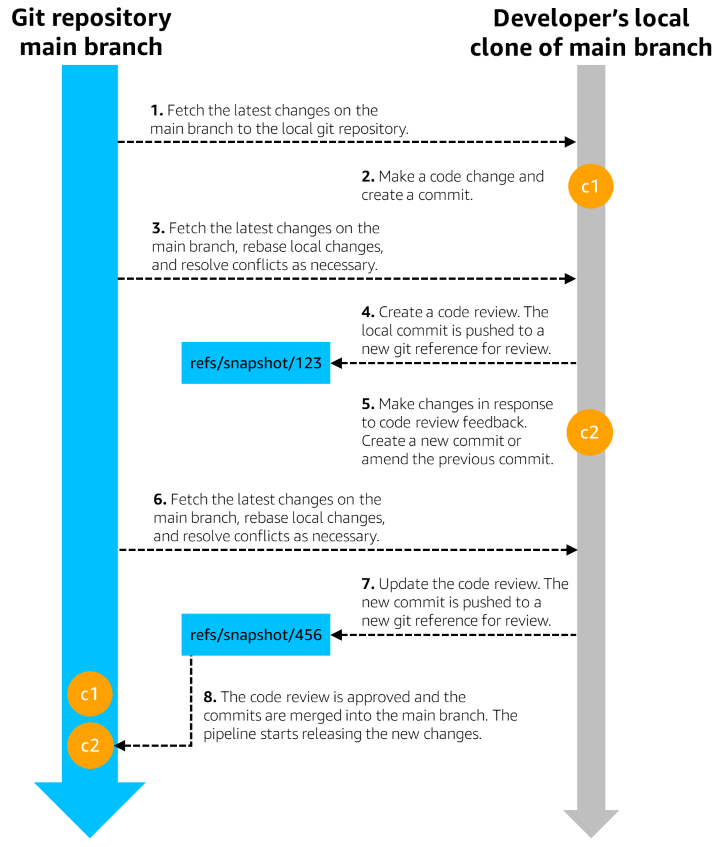

In rare cases, teams might need to create a short-lived release branch to deploy a very urgent change, such as a security fix that needs to be deployed to all production environments as quickly as possible. The team merges the bare minimum code changes needed for the security fix into the release branch and excludes any unrelated code changes that might be on the main branch but not yet deployed in production, to reduce the risk of accelerating the deployment of the release branch to all production environments. We require a high level of scrutiny on the release branch in these cases. The team must review the code changes, as well as the urgency and risk of impact, with very experienced developers who are experts in operational safety, including their organization’s Principal Engineers. After the fix has been fully deployed, the release branch is no longer used.

## Safe, automatic production releases

Prior to adopting CI/CD pipelines at Amazon, deploying a release to production required a lot of pre-work by a release captain. The release captain wrote up a detailed plan for deploying a release to the production environments, including the code changes to be deployed, the order in which the release would be deployed to each production environment, and which metrics would be looked at to ensure it was safe to proceed with deploying to the next environment. The release captain then reviewed the plan with others and got the plan approved, all before even starting the long, manual process of deploying the release to production.  

Now as a developer at Amazon, my CI/CD pipeline releases my changes to production for me automatically, without the need for me to create a release plan or actively monitor any production deployments. Our CI/CD pipelines model the automated release process across environments as a series of “stages,” “approvals,” and “promotions.” When a new release is built by the pipeline, it progresses through the pipeline by being “approved” by a stage and then “promoted” to the next stage in the pipeline. Each stage in the pipeline deploys to one or more environments in parallel, then runs a set of “approval steps” like integration tests and alarm monitoring for each of those environments. If all the deployments and approval steps in the stage succeed, then the release is approved by that stage and is promoted to the next stage of the pipeline. If any of the deployments or approval steps in the stage fail, the release isn’t approved by the stage, and it isn’t promoted to the next stage. Production environments are also typically automatically rolled back to get back to a healthy state when deployments or approval steps fail.

At Amazon, we structure our CI/CD pipelines to limit the risks associated with production deployments as much as possible by cautiously and safely releasing changes to production. One of our strategies for minimizing deployment risk is splitting production into many smaller production environments, some even as small as a single virtual machine or single container (called _one-box_ environments). Instead of a single large and risky production deployment, each release instead goes through a sequence of many deployments to these smaller production environments in the CI/CD pipeline. Limiting the scope of each production deployment to a single smaller environment limits the potential risk associated with each deployment to the small percentage of customer workloads or requests served by that environment. At AWS, teams typically first split production into individual Regions, and then further split Regions into a production environment for each Availability Zone, and a one-box environment for each Availability Zone. The CI/CD pipeline takes care of cautiously deploying and promoting a release across these many production environments in a series of stages and approval steps.  

When the first few production deployments of a new release are successful in the CI/CD pipeline, we have found that we can typically have higher confidence that the remaining production deployments for that release will also be successful. We built that learning into how we structure our CI/CD pipelines by grouping some production environments into parallel deployments called _waves_. Waves let us balance minimizing deployment risk with maximizing deployment speed in our pipelines. Each wave is made up of one or more pipeline stages that deploy to a set of production environments in parallel, then run those environments’ approval steps. Earlier waves in the pipeline deploy to only one production environment at a time to limit risk and build confidence in the safety of a release. Each wave in the pipeline builds more confidence in the release, so the waves later in the pipeline deploy to an increasing number of production environments in parallel as the release progresses down the pipeline. A deeper dive into waves and strategies for minimizing deployment risk is covered in the Builders’ Library article [Automating safe, hands-off deployments.](https://aws.amazon.com/builders-library/automating-safe-hands-off-deployments/)

  
The following diagram shows a sample pipeline that deploys to 26 Regions in five waves of increasing size, after building source code changes into a new release and testing it in pre-production environments.  

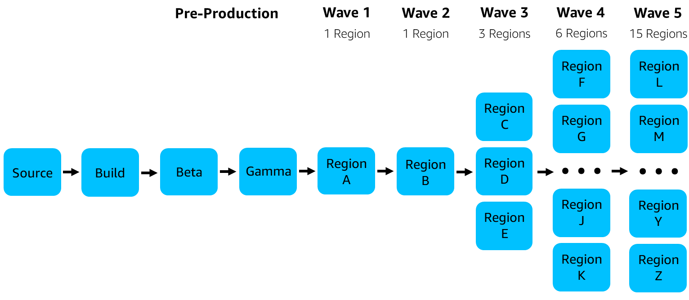

The following diagram zooms in on Wave 3 in the sample pipeline. This pipeline splits each Region into a production environment and a one-box environment for each Availability Zone (AZ), so each wave is actually made up of multiple pipeline stages. In Wave 3, Stage 1 deploys to a one-box environment in the first Availability Zone of each Region in parallel, then Stage 2 deploys to the production environment in the first Availability Zone of each Region. Stages 3 and 4 deploy to the second Availability Zone of each Region, and Stages 5 and 6 deploy to the third Availability Zone of each Region.

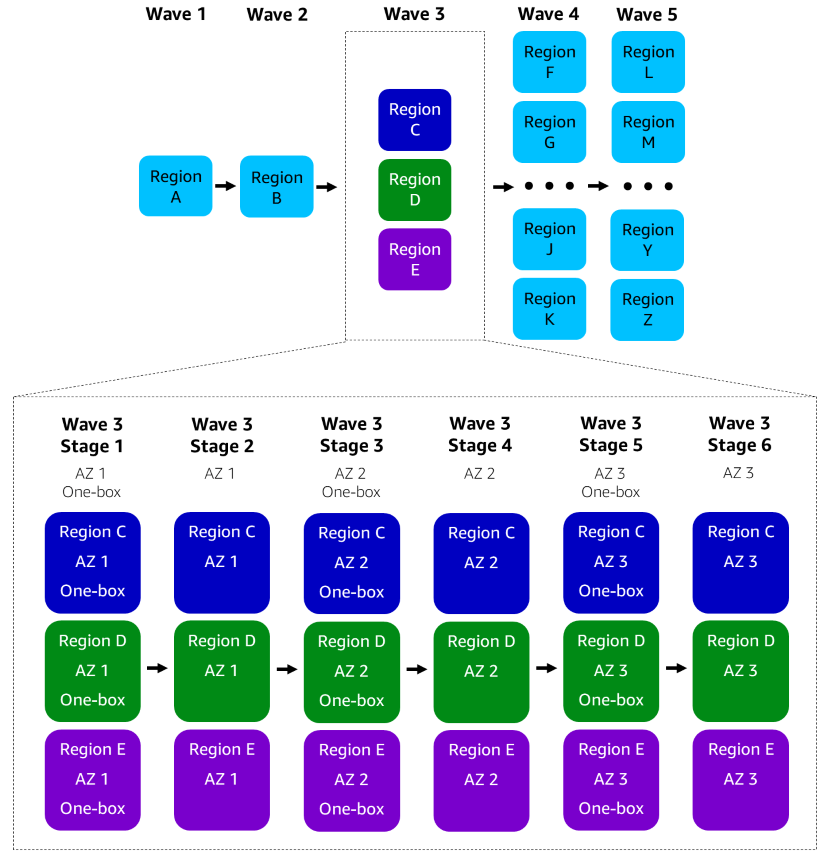

The following diagram shows a release progressing from Stage 1 to Stage 2 of Wave 3 in the sample pipeline. The promotion between the two stages is represented by the arrow between Stage 1 and Stage 2. Stage 1 deploys the release to a set of zonal one-box environments in parallel. The release is approved by Stage 1 after the zonal one-box environments successfully deploy and alarms don’t fire. The release is then promoted to Stage 2. Stage 2 deploys the release to a set of zonal environments in parallel, then runs integration tests and alarm monitoring for each of those environments.

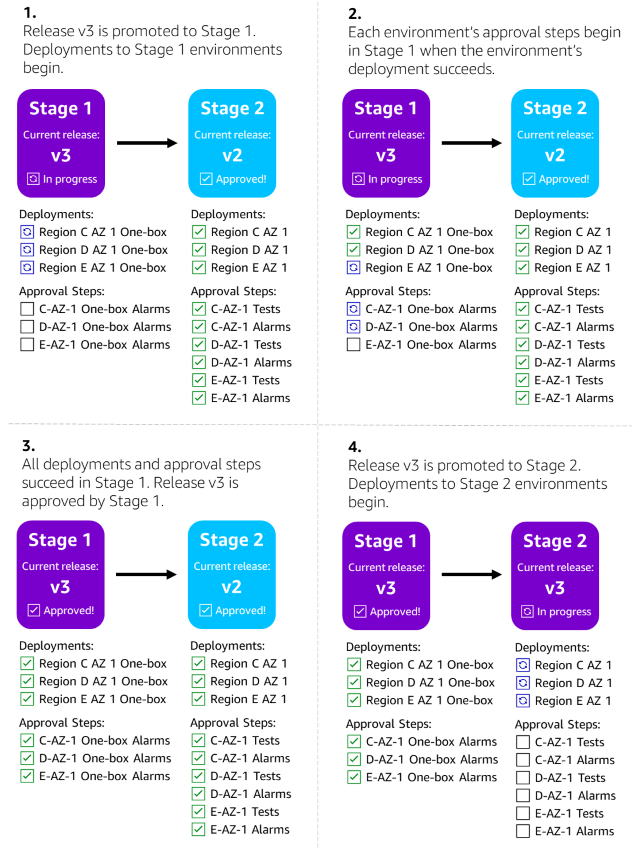

## Multiple in-flight releases

Prior to adopting continuous deployments at Amazon, typically there was only one release at a time to production. For a release captain, it would be complex and error-prone to manually coordinate multiple releases in parallel for the same service across the service’s production environments. They would need to keep careful track of which source code changes went into each release, which releases had been tested, which releases were currently deployed to each production environment, and which releases were ready to be deployed to the next production environment. However, doing one release at a time to production increased the time it took for a code change to be deployed and available to customer workloads in production. Any new code changes made while a release was in process had to wait for the next release to be deployed to production.

Today, our CI/CD pipelines automate the coordination of multiple inflight releases across production environments to minimize the time that code changes spend waiting to be deployed in the pipeline. As soon as a developer merges new code changes into the main branch, a new release is built and starts progressing down the pipeline. Since developers frequently merge new code changes when practicing trunk-based development, often multiple new releases are built and enter the pipeline each day.  

As described in the previous section, our CI/CD pipelines model deployments to multiple environments as a series of stages and promotions. Stages can execute in parallel in the pipeline. Think of each stage in the pipeline as an independent workflow, working to deploy, approve, and promote its current release. As soon as a pipeline stage has finished attempting to deploy and approve its current release, it can start working on the next release waiting to be promoted by the pipeline into this stage. This stage doesn’t need to wait for any of the stages further down the pipeline to deploy and approve the current release before it starts working on the next release. Because stages can run in parallel, multiple releases can be in flight in the pipeline, with each stage working to deploy, approve, and promote a different release.  

The pipeline ensures that releases are promoted through the pipeline in the correct order. If a release catches up to another one in the pipeline, the newer release will supersede the older release and will be the one to continue down the pipeline. For example, if one release fails a pre-production stage’s integration tests, a newer release with a bug fix can successfully progress through the pipeline by superseding the older, failed release. As another example, one production environment might take longer than others in the pipeline to deploy, sometimes due to differences in the size of the environments. While a deployment or approval step for that environment is in progress, newer releases coming through the pipeline can’t be promoted into that stage and will need to wait to be promoted. If the deployment and approval steps for that environment take long enough, multiple releases could be approved by the previous stage and would be waiting to be promoted into that stage. However, newer releases will supersede any older releases waiting to be promoted, and only the latest approved release will be promoted after the deployment and approval steps are completed.  

The following diagram shows how a pipeline coordinates multiple inflight releases and promotes them through three of its stages. In this example, the Stage 3 deployment takes a long time to complete relative to previous stages, because Stage 3 contains a very large production environment with many more Amazon EC2 instances than in previous stages. While the Stage 3 deployment is in progress, multiple releases are approved by the previous stage but must wait to be promoted until the Stage 3 deployment is completed. A newer approved release supersedes the older waiting release, until the latest approved release is eventually promoted into Stage 3 when the deployment and approval steps are completed.  

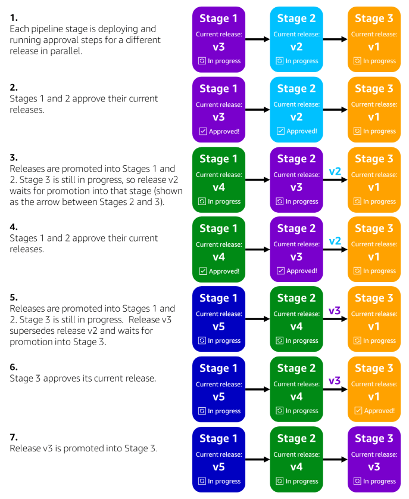

Our pipelines’ ability to coordinate multiple inflight releases across production environments helps us optimize deployment safety and speed. For example, if a pipeline only did one release at a time to production and each release took a week to safely and cautiously deploy to all production environments, then any new code changes merged by developers during that week would need to wait for the pipeline’s next release to be deployed to production. That waiting period for new code changes would slow down the speed at which changes are delivered to production. A week’s worth of code changes batched together waiting for the next release would also increase the risk of deploying the next release to production. Batching up a large amount of changes into a single release increases the risk that any one of those changes could trigger production impact. By coordinating multiple inflight releases, the pipeline typically introduces only a small number of new code changes to production in each release, reducing the risk that any given production deployment will trigger impact and delivering code changes to production more quickly.

## Transparent, immutable deployment artifacts

Our CI/CD pipelines not only manage coordinating releases, they also manage _what_ is deployed for each release—the deployment artifact. Previously, the release captain created a build from the source code on a release branch, assigned a release version number to the built artifact, and then carefully ensured that the correct artifact was deployed to each production environment when running the release. Today, our pipelines entirely manage the deployment artifacts for releases. This process is almost entirely transparent to developers. Developers don’t need to worry about calculating version numbers or keeping track of deployment artifact IDs or build IDs.  

The pipeline creates a new, immutable deployment artifact every time new source code changes are pushed to the main branch. The pipeline then keeps track of which source code commit the release artifact was built from and which environments the release artifact has been deployed to. Because the pipeline keeps track of the relationships between releases, deployments, and source code commits, developers don’t need to be aware of deployment artifacts or releases to see what code has been deployed. In the pipeline UI, developers can see a history of deployments for each environment, including which new source code changes were deployed to the environment in each deployment. Developers can also view where a particular source code change has been deployed by the pipeline, for example to see if a bug fix they wrote has been deployed to all production environments.  

The following sample view shows the deployment history for a given environment, which can be populated by the pipeline using its records of releases, deployments, and source code commits.

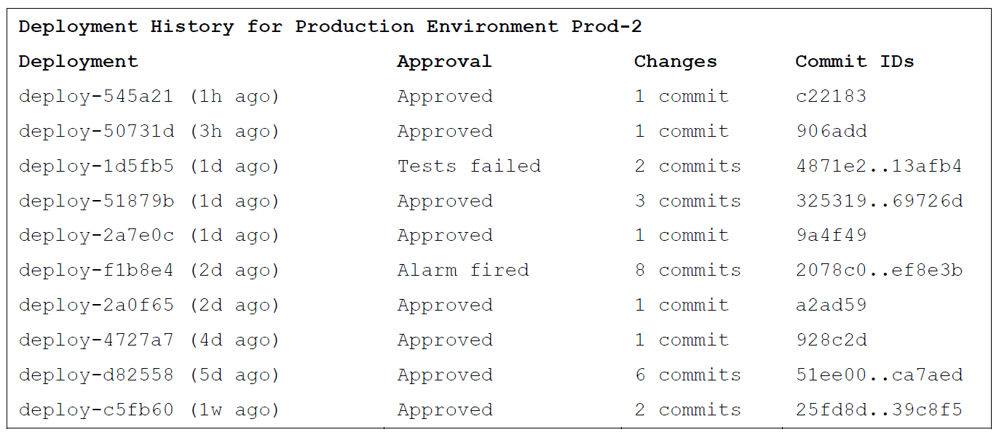

The pipeline can also use the same data about releases, deployments, and source code commits to populate the following sample view of the deployment history of a particular source code commit.

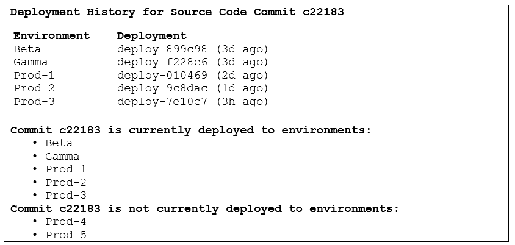

Immutable deployment artifacts help ensure that the pipeline can accurately keep track of the deployment history of releases and the associated source code across many environments. When the pipeline is triggered by a new source code change on the main branch, the pipeline creates a new, unique deployment artifact containing everything needed for deployment and assigns a unique ID to it. These deployment artifacts might include Amazon Machine Images (AMIs), Docker images, AWS Lambda function deployment packages, and AWS CloudFormation templates. After the deployment artifact for a release is built by the pipeline, it isn’t altered in any subsequent stage. For example, for a containerized application, the pipeline might build the application’s source code, create a Docker image with a unique tag, and push the image to a container registry. The pipeline might also generate an infrastructure as code template that will deploy that new Docker image using its unique tag and store the template in Amazon S3 using a unique name. The deployment stages in the pipeline then deploy these immutable deployment artifacts from the container registry and Amazon S3 and don’t interact directly with the source code repository. 

## Easy and automatic rollbacks

Rollbacks are a crucial part of our operational culture at Amazon. The first question an on-call engineer is typically asked during an operational event is “Do you have any recent deployments that need to be rolled back?” Our operational practices prioritize mitigating an issue first, and waiting to do deep troubleshooting later, after we have relieved the impact on customers. We have found that rolling back any recent deployments prior to the start of an operational issue is frequently the fastest path to mitigation, even before we have determined whether any code changes in those deployments triggered the issue. Spending time to identify which specific code change triggered the issue or working to get a new code change deployed to fix the issue prolongs the impact on customers. Instead, our first action is to proactively roll back any recent deployments across the team’s microservices.  

Prior to adopting CI/CD pipelines at Amazon, a release captain spent a lot of time writing up a detailed plan for rolling back each production deployment before starting the release, to be used in case the new release triggered any operational issues. The release captain needed to carefully note which release and deployment artifacts were currently deployed to each production environment and document the steps to take to re-deploy the previous artifacts, so that they could correctly roll back the environment to its previous state. Because our operational practices are built around rollbacks, our CI/CD pipeline system was built to both automatically roll back production environments and to enable developers to roll back their production environments quickly and easily.

Today, developers at Amazon don’t need to spend crucial time during an operational event trying to figure out any manual steps to roll their environments back to an older version. Pipelines monitor alarms and automatically roll back any ongoing deployments if alarms are triggered. In most cases during an operational issue, the pipeline has already started rolling back deployments when the on-call engineer is engaged. If the on-call engineer does need to roll back an environment, they can follow a few simple steps in the CI/CD pipeline UI to kick off a rollback deployment. The rollback action in our pipelines kicks off a regular deployment, but instead of deploying a new release, a rollback deployment re-deploys an older release that was previously successfully deployed to that environment. A rollback deployment effectively restores the system back to an older point in time when the environment was healthy, including rolling back the application, the infrastructure as code templates, and the configuration files contained in the older release’s deployment artifact. Designing software changes that can be safely rolled back by the pipeline is covered in depth in the Builders’ Library article [Ensuring rollback safety during deployments.](https://aws.amazon.com/builders-library/ensuring-rollback-safety-during-deployments/)

We can ensure that rollback deployments happen in the exact same way as regular deployments without side effects or unintended changes by using immutable artifacts and immutable environments. Deploying code into the same directory on an EC2 instance for every deployment is an example of a mutable environment. Deployments to this environment could leave newer files hanging around in the directory even after a rollback, which could cause an operational issue by impacting the older code’s behavior. By instead using infrastructure as code and deploying immutable AMIs, container images, and Lambda functions, we can ensure that the application’s environment is completely replaced with the older release after a rollback deployment. Even in cases where a team deploys code onto existing EC2 instances (instead of replacing them with a new AMI), we strive for immutability as much as possible. Each deployment creates a brand-new directory where it deploys the new code, then updates symbolic links to point to the current version’s directory. During a rollback deployment, the same steps occur: the older code is deployed to a new directory and the symbolic links are updated, so that we reduce the chances of causing any side effects by rolling back.

Developers at Amazon can quickly roll back one or more environments in the pipeline UI. When the developer starts a rollback action in the pipeline UI, the pipeline automatically selects the last release that was successfully deployed and approved in those environments for re-deployment. The developer can then preview the differences between the current release and the selected rollback release’s deployment artifacts, like source code changes and changes in library versions. When the developer approves the rollback in the pipeline UI, the pipeline starts new deployments to the selected environments with the selected rollback release’s deployment artifacts. The rollback deployments follow the same steps as a regular deployment, just with the older artifacts.

In some cases, the code change that triggered an operational issue was deployed to the production environment multiple deployments ago and is only now triggering customer impact—this is what we call a _latent change_. For example, a change that is determined to be currently causing impact might have been deployed to an environment a week ago, and that environment has had multiple successful deployments of new changes since then. Rolling back to the most recent previous deployment would not remove that change from the environment. To roll back the latent change, the developer can choose which previously deployed release to use for the rollback in the pipeline UI, instead of the default selected release. However, the developer must first weigh the trade-offs of rolling back the latent change along with a week’s worth of other code changes, which may include new features and bug fixes, versus waiting for the pipeline to “roll forward” a new release that includes a bug fix. To help the developer and their team make this decision, the pipeline UI shows the history of releases that have been deployed to the environment, including when each release was previously deployed, the code changes in each release, and whether each release was approved through successful deployment and approval steps like integration tests.

When the developer initiates a rollback deployment, promotions into and out of the selected environments are automatically disabled in the pipeline to prevent the release from being re-deployed. At that point, the developer has a few options on how to proceed after any immediate impact on customers has been mitigated by the rollback. Depending on the exact issue, the developer might need to proactively roll back more environments that could potentially also be affected, even if they aren’t currently showing any customer impact. Or, if the issue appears to be environment-specific, the developer might choose to instead wait for the pipeline to roll forward a new release that includes a bug fix.

The source code repository isn’t affected by the developer initiating a rollback, so any source code changes that caused impact in production will still be checked into the main branch of the repository. Once the code change that caused customer impact is identified, the developer can either work on a bug fix or create a revert Git commit to remove the changes, then create a code review and get the new commit merged into the main branch. When the bug fix or revert is merged into the repository, the pipeline builds and deploys those changes. The developer re-enables promotions into and out of the rolled-back environments when the pipeline is ready to promote the fix into those environments.  

The following diagrams illustrate a scenario where a single production environment has been rolled back using the pipeline UI to mitigate customer impact in that environment. In this example, the pipeline deploys a Lambda function to each Region across seven pipeline stages. The developer decides to roll back a few more production environments that could also be impacted by the issue. The developer creates a bug fix, merges it into the source code repository, and the pipeline rolls that bug fix forward. The developer then re-enables promotions between stages as needed to safely get the bug fix deployed to all environments.  

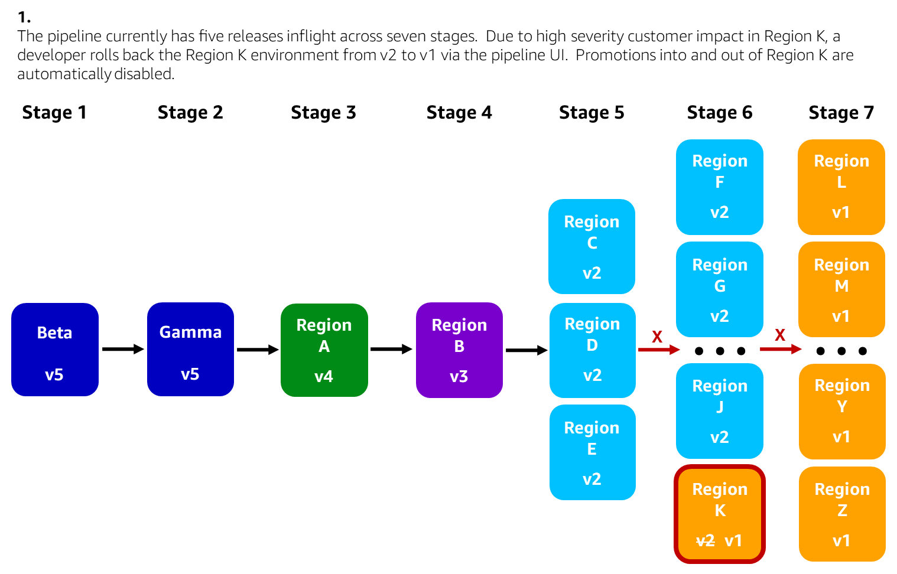

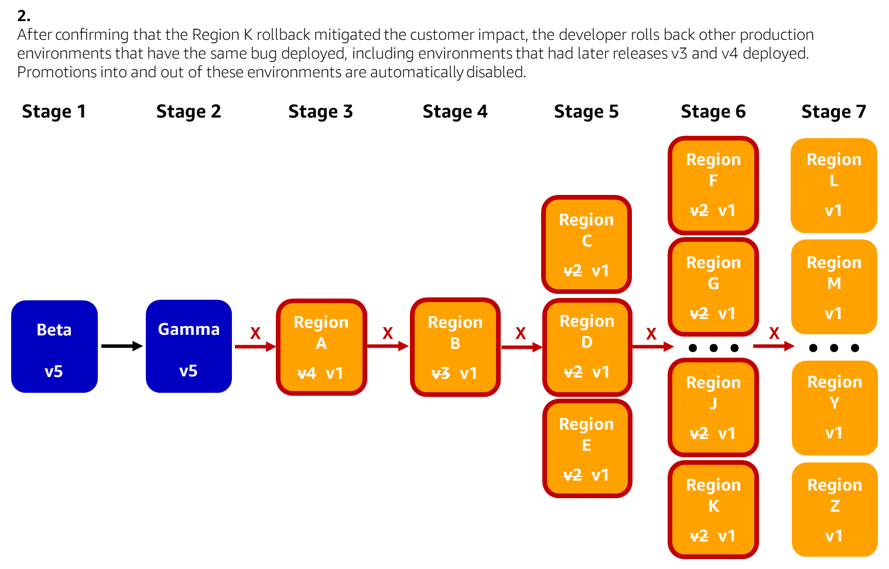

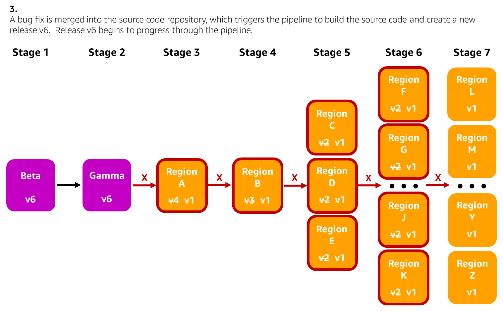

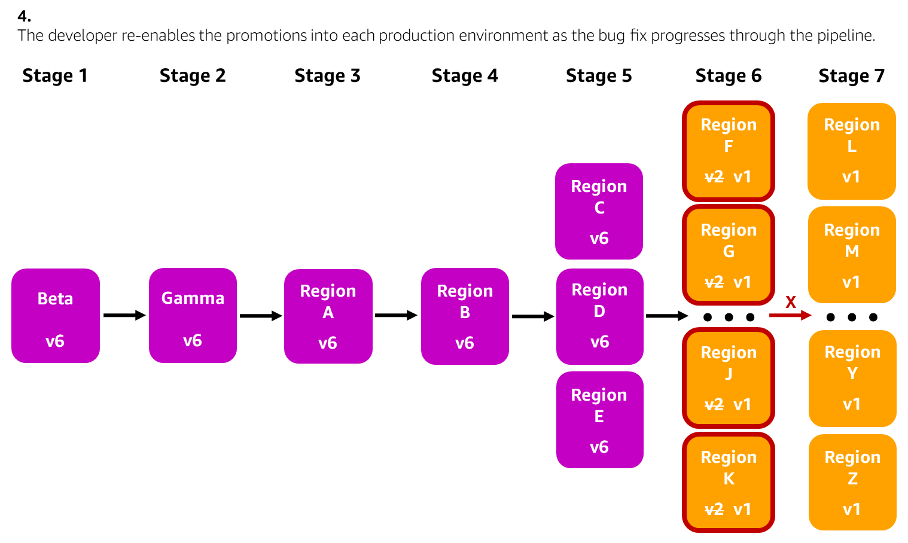

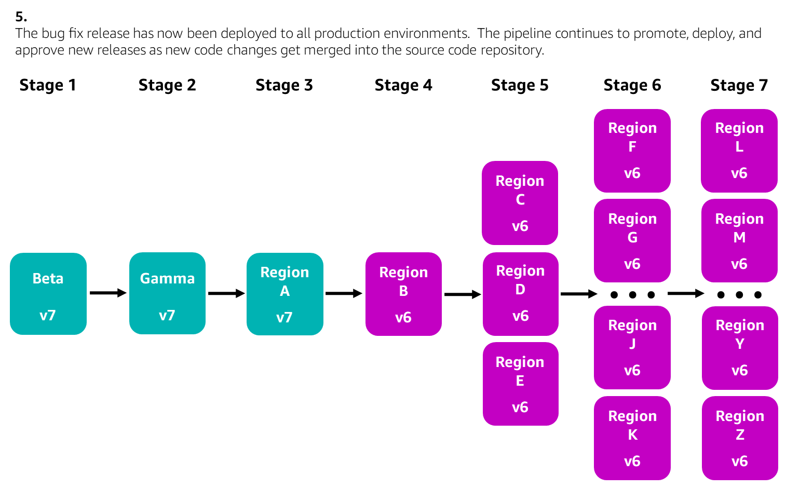

## Conclusion

At Amazon, the combination of our continuous deployment practices and our CI/CD pipeline system have enabled us to mostly let go of the release captain role. There are some teams at Amazon that deliver versioned software, such as mobile applications and device firmware, so some of those teams practice traditional releases and carefully manage release branches, schedules, and versioning. However, most developers at Amazon are able to focus on building and not on managing releases. Instead of having a release captain manage releases to production, the CI/CD pipeline’s role is now to automatically trigger when new code changes are pushed to the main branch of the source code repository, create new releases and deployment artifacts, coordinate rolling out multiple releases to production, and enable fast and easy rollbacks. To let the CI/CD pipeline be the release captain, teams continuously release code changes through trunk-based development and deploy their applications using immutable artifacts, immutable environments, and infrastructure as code. We have found that our continuous deployment practices and our CI/CD pipeline system have both been key to letting developers trust that their pipeline is taking care of releasing their code to production. 

___

## Reference

- [Going faster with continuous delivery](https://aws.amazon.com/builders-library/going-faster-with-continuous-delivery/) 
- [Automating safe, hands-on deployments](https://aws.amazon.com/builders-library/automating-safe-hands-off-deployments/) 
- [Ensuring rollback safety during deployments](https://aws.amazon.com/builders-library/ensuring-rollback-safety-during-deployments/)
- [Trunk based CICD Pipeline at Amazon](https://aws.amazon.com/builders-library/cicd-pipeline/)
- 