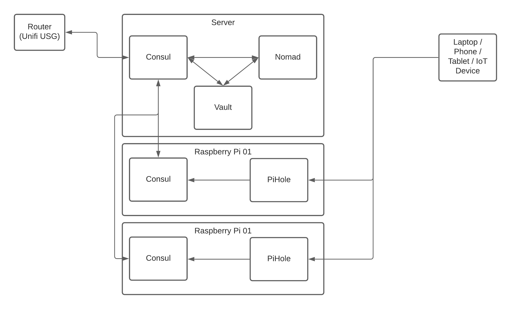

# Container visibility and dashboards

Recently I [posted a survey](https://www.facebook.com/budgetsmarthomeuk/posts/167745451792351) on our [Facebook page](https://www.facebook.com/budgetsmarthomeuk) asking for input on future topics. Overwhelmingly the favourite topic was “visibility and dashboards”, so I started to plan out what that content might look like.

At the same time, I [posted to the PiHole sub-reddit](https://www.reddit.com/r/pihole/comments/m63mw0/thanks_everyone_who_helped_me_get_setup_with/) that I’d managed to integrate data from PiHole with my existing monitoring setup, which led to a number of calls for me to document my setup.

This mini-series of blog posts will cover all of these subjects, starting with building out a “home server” that can be used to run additional services needed to display dashboards and the like, and running right through the software I use to come up with a dashboard like the one at the top of this post.

This first post will lay out the tech stack and hardware that I’m using, then future posts will look at each of the components in turn until we have a dashboard up and running!

## The Hardware

When I built my home server, I had a fixed budget and the best custom-build I could get was the following specification:

-   AMD Ryzen 5 2600 CPU
-   16G RAM
-   256G nVME drive for the Operating System
-   1TB SSD for “storage”
-   Nvidia GT710 Graphics Card for both display output _and_ to explore CUDA-based data analysis/machine learning

I originally ran [CentOS Linux](https://www.centos.org/) on the server, however recently I rebuilt it to use [Arch Linux](https://archlinux.org/). I’ve been using Linux for over 20 years, so don’t be scared by this - you could easily achieve the same on Ubuntu or another flavour of Linux!

Alongside the server, I also have a number of [Raspberry Pi](https://www.raspberrypi.org/) computers for various projects, however two of them are reserved for [PiHole](https://pi-hole.net/) - a network-wide DNS filter and ad-blocker, and it is those two that we’ll focus on during this series.

## The Software Stack

The network is made up of numerous software services that deal with DNS, Service Discovery, Secrets Management, and Container Orchestration, with a monitoring layer over the top of this.

If you think of your home infrastructure as a pyramid, we start with the network at the bottom, then DNS, then service discovery, then container orchestration and monitoring, with the applications on top of that.

### The Hashicorp Holy Trinity

[Hashicorp](https://www.hashicorp.com/) write some of the most advanced tools out there for managing system and platform deployments, from [vagrant](https://www.vagrantup.com/) to run multiple virtual machines on local laptops and [Packer](https://www.packer.io/) for building VM’s, containers, and cloud images right through to [Terraform](https://www.terraform.io/) for deploying across multiple cloud platforms, [Nomad](https://www.nomadproject.io/) for container orchestration (similar to Kubernetes) and [Consul](https://www.consul.io/) & [Vault](https://www.vaultproject.io/) for service discovery and secrets management.

Three of these tools (Consul, Vault, and Nomad) will form the heart of our setup because when they are used together they can do amazing things!

#### Consul

[Consul](https://www.consul.io/) is a platform dedicated to service discovery. Applications and services can `register` with Consul via the API or agent, and those services and nodes appear in DNS.

As an example, if we register a postgresql database server as a service called `pgsql` with Consul, as soon as the health checks pass we’ll be able to access that server at `pgsql.service.consul`. (We can change the domain name, and we’ll look at how we do that when we get to the Consul section of this series!).

It’s not just services though, any host running the Consul agent and connected to the cluster can act as a DNS relay and will also register itself at `<node_name>.node.consul`, so if our host running Postgresql is called `caliban` then we’ll end up with two DNS entries in Consul:

-   `pgsql.service.consul` for the service
-   `caliban.node.consul` for the host itself

The great thing about Consul is that it talks really nicely to Nomad, so containers that are deployed using Nomad are automatically registered with Consul and appear in DNS within seconds of being launched.

#### Nomad

[Nomad](https://www.nomadproject.io/) is what we’ll use to orchestrate our containers. Nomad is similar to the darling of the DevOps and SRE world [Kubernetes](https://kubernetes.io/), although I find it far simpler to get up and running whilst providing all of the features that I’d want from an orchestration platform.

We’re still going to be using Docker under the hood, however Nomad allows us to describe how we want to deploy a service in a way that also allows us to pull secrets from Vault and register with Consul.

We’ll dig into some examples later in the series, however for now it’s worth checking out the materials on [Hashicorp’s Learning Portal](https://learn.hashicorp.com/) if you want to understand more about how Nomad works.

#### Vault

[Vault](https://vaultproject.io/) is the final piece of the puzzle when it comes to our Hashicorp Triumvirate and will deal with “secrets management”. Initially this could be seen as overkill, however we’ll install it now because it can integrate with all kinds of other platforms to allow for security features such as auto-rotation of database passwords and even SSH access!

Again, we’ll go into more detail in future posts, and [Hashicorp’s Learning Portal](https://learn.hashicorp.com/) is the best place to look for more information on how all three of these bits of software hang together.

### Other software

Aside from the Linux Operating System, we’ll also be leaning heavily on [PiHole](https://pi-hole.net/) for DNS and ad-blocking, [FluentD](https://www.fluentd.org/) and [Fluent-Bit](https://www.fluent-bit.org/) for log collection, [Loki](https://grafana.com/oss/loki/) for log storage, [Prometheus](https://www.prometheus.io/) for metrics collection, and [Grafana](https://grafana.com/) for data visualisation.

We’ll cover these in a couple of posts around logging and monitoring towards the end of the series.

### The setup

I’d like to end this post with a quick image to show how DNS in particular will flow through the platform, but also how the network components are connected.

If you’ve already read my mini-series on [building a stable network](https://www.budgetsmarthome.co.uk/tags/network) you’ll know that I use the Ubiquiti Unifi platform for my network, so we’ll be integrating with those but I’ll make sure to add more generic instructions or alternatives where I can for those of you using other kit.

In the diagram above, a DNS request starts with the `network client` (the laptop, tablet, phone, or IoT device) which sends the request to PiHole. PiHole blocks any requests for hosts that are on the blocklist (this could be adverts, adult content, social media, or anything else you want to remove from your network) and then passes the request on to Consul.

Consul does a check to see if it can resolve the request against any of its nodes or services, and then if that fails it passes it upstream via the Unifi Security Gateway (USG) to an external service such as [Google](https://developers.google.com/speed/public-dns) or [OpenDNS](https://www.opendns.com/).

This gives us the ability to block unwanted content whilst still accessing our local services and nodes and the wider world.

___

In the next part of this series, we’ll look at installing Consul and Vault, so be sure to like and follow our social media channels or subscribe to our RSS feed!