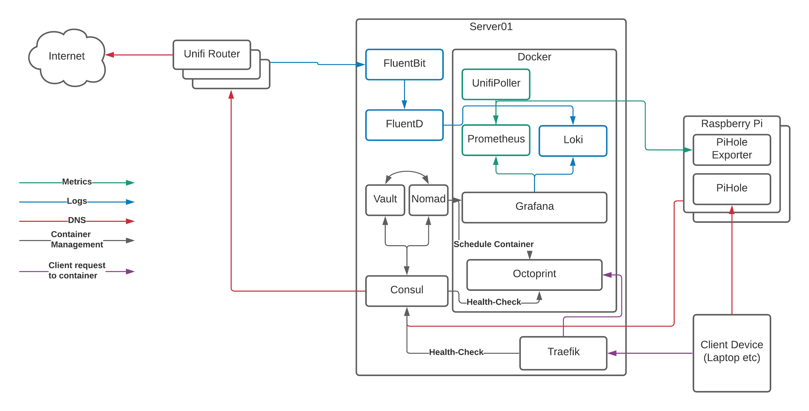

# Containers and service discovery - part 2

So far in this series we’ve covered [an overview of the stack we’re trying to create](https://www.budgetsmarthome.co.uk/2021/03/16/starting-to-visualise-the-smart-home/), looked at [DNS filtering with PiHole](https://www.budgetsmarthome.co.uk/2021/03/18/dns-filtering-with-pihole/), and [gone over the theory](https://www.budgetsmarthome.co.uk/2021/03/24/containers-and-service-discovery/) of how this all works.

This post is going to finally get us up and running with the various containers and underlying software we need to monitor our network.

### Reviewing the Container Management Stack

Before we start looking at the installation itself, let’s remind ourselves what it is we’re building:

[](./img/containers-and-service-delivery/HomeServerContainerSetup.png)

`Server01` is the physical server running [Arch Linux](https://www.archlinux.org/). You _can_ do this with a number of Raspberry Pi’s instead of a single server, but that adds some more complexity and reduces the amount of resources available to us, so we’ll focus on a dedicated server here.

`Server01` has a number of services running on it:

-   [Docker](https://www.docker.com/) is the “run-time” for our containers. It uses a common format to ensure that we can run multiple applications in a managed way and “virtualise” the resources on the server to make as much use of the hardware as possible. Think of it as a lightweight VMWare or HyperV.
-   [Nomad](https://www.nomadproject.io/) is what we use to tell docker what to run and how to run it. We _can_ do this directly with docker commands or the `docker-compose` project, however Nomad gives us the ability to template files, set CPU/RAM limits, connect to multiple networks, expose ports, and (most importantly!) auto-register with Consul so containers “appear” in DNS without any other work needed.
-   [Consul](https://www.consul.io/) provides that service/container registration part that converts the container names into DNS records. Consul is also capable of acting as a key/value storage solution, but we’ll leave that for another day.
-   [Vault](https://www.vaultproject.io/) is the secrets management engine and allows us to protect data and pull it in to container templates for provisioning of databases etc. We won’t go into Vault in too much detail here, but we will get it installed and touch on how it can be used for future projects
-   [FluentBit](https://www.fluent-bit.org/) and [FluentD](https://www.fluentd.org/) are used for log processing. I’ll go into detail shortly about why I’m using both, however they run on the physical server and process log events before sending them on to the logging storage engine. The logging storage engine runs in a container, so we’ll cover that in a bit.
-   [Traefik](https://traefik.io/) claims to “Make networks boring”, and it does a great job of talking to Consul, registering the healthy services, and passing traffic from common ports through to the back-end container’s random port. This is the last piece of the puzzle and the bit that allows us to resolve our services to `http://myapp.service.my.domain` rather than `http://my.container.server:91523/`.

#### The Containers

Running on top of Docker, you can see a number of containers:

-   [Unifi Poller](https://github.com/unifi-poller/unifi-poller) - Talks to our [Ubiquiti Unifi Cloud Key 2+](https://unifi-protect.ui.com/cloud-key-gen2) and collects metrics on the state of our network such as the number of WiFi clients connected at any given time
-   [Prometheus](https://www.prometheus.io/) - Our metrics storage engine, reaching out to the various pollers (Unifi and Pi Hole in this particular case) and collecting the metrics we need for our graphs
-   [Loki](https://grafana.com/oss/loki/) - A relatively new solution for storing and searching logs with a similar query syntax to Prometheus
-   [Grafana](https://grafana.com/) - The most flexible Open Source data visualisation tool on the market, Grafana connects to Loki and Prometheus and displays the data it finds there

### OK, enough already, let’s get installing!

First things first, I’m _not_ going to give line-by-line installation instructions for each bit of software here. There are many reasons for this, the main one being that I’ve no idea which flavour of Linux you’re running and that has a massive bearing on the instructions. For example, I run Arch Linux, most people run either CentOS or Ubuntu, which would mean that just to install something like `wget`, I’d need to issue three sets of installation instructions.

The other reason is because all of the software that we’re installing on to the physical server is incredibly well documented for multiple flavours of Linux, so I’d just be repeating documentation from elsewhere that’s always going to be better than mine!

What I _will_ be doing, is providing sample configuration files as we go. If you want to see these from the start then they’re [available on github](https://github.com/BudgetSmartHome/home-lab-configs) and we’ll be copying them into the correct location and updating them as we go along.

### Setting up the basics

> **NOTE**
> 
> From this point on I’m going to assume that you have a Linux server with at least 8G of RAM available to you, that you’ve updated it to the latest version of your particular Linux release, and that you have installed [Docker Server](https://docs.docker.com/engine/install/). If you don’t have this, you’ll need it before we start…

[Consul](https://www.consul.io/) is going to form the basis for everything that we do, so [follow the instructions](https://learn.hashicorp.com/collections/consul/getting-started) to get started with Consul and, once you’ve completed the tutorial, stop the consul server and remove the `data_dir` folder that’s listed in your config file. This gives us a clean installation of consul to get started with.

Repeat the process for [Vault](https://learn.hashicorp.com/collections/vault/getting-started) and [Nomad](https://learn.hashicorp.com/collections/nomad/getting-started), and make sure you are familiar with the details of how they all interact.

Now that all of the services are installed, you’ve played with them, and have shut them down and removed any data you created, it’s time to configure them the way we need them.

From the [example configs on github](https://github.com/BudgetSmartHome/home-lab-configs), copy the `consul.d`, `nomad`, `docker`, and `vault` directories to the appropriate place under `/etc/` on your host (it varies between linux distros, if you’ve followed the Hashicorp Tutorials then you should have seen where these files should live!).

Update the files in those folders to reflect the configuration you want by replacing the following:

| Value | Description | Notes |
| --- | --- | --- |
| <LOCAL\_DOMAIN> | The domain name that you want to resolve against on the network. | You can use pretty much anything you want here, but keep in mind that if it’s already registered by someone else you’re going to have issues when it comes to visiting those websites! |
|  |  |  |
| <SERVER\_IP> | The “public” IP Address (i.e. _not_ 127.0.0.1) of your server on the network | Make sure that this is either set as static on the server itself, or reserved on your DHCP server, otherwise you’re going to run into trouble fast! |
| <SERVER\_HOSTNAME> | The hostname of your server | You did name your server, didn’t you? This is used to register the host with various services and filter out targets for containers, so it’s important you pick something that is memorable and unique on your network - just calling your server `ubuntu` because that was the default from the installer isn’t going to cut it! |
| <DATACENTRE\_NAME> | The name of your Consul/Nomad/Vault [Datacentre](https://www.consul.io/docs/install/glossary#datacenter) | This is usually unique to each physical site/cloud region, and can be anything you want but it needs to be the same across all three parts of the solution! |
| <OUTPUT\_OF\_CONSUL\_ENCRYPT> | Run the `consul keygen` command and put the output here | Specific to Consul, this encrypts traffic across the network when you expand to additional hosts. See [these docs](https://www.consul.io/docs/security/encryption) for more information. |
| <REGION\_NAME\_IF\_NEEDED> | The “region” your Nomad Client resides in | It’s unlikely you’ll need this, so you can happily remove it unless you’re running multiple Nomad servers across various regions. Usually this would equate to something like “EU-West-2” in AWS, but it could equally be “House” on one server and “Garage” on another to distinguish which building the server is in. |
| <CONSUL\_ACL\_TOKEN> | The token that allows Nomad to talk to Consul | This is part of the enhanced security and is covered in the [Hashicorp Documentation](https://learn.hashicorp.com/tutorials/nomad/consul-service-mesh?in=nomad/integrate-consul) |
| <VAULT\_TOKEN> | A Token to allow Consul and Nomad to talk to Vault and retrieve secrets | Also part of the enhanced security, and allowing you to set and pass secrets to containers automatically, this is covered in the [Hashicorp Docs](https://learn.hashicorp.com/collections/nomad/integrate-vault) |

Now restart the services in the following order:

-   Consul (`systemctl start consul`)
-   Vault (`systemctl start vault`)
-   Nomad (`systemctl start nomad`)

Finally, [initialise the new Vault setup](https://www.vaultproject.io/docs/commands/operator/init) and [unseal the vault](https://www.vaultproject.io/docs/concepts/seal#unsealing).

You should now be able to browse to `https://<SERVER_IP>:8200/` and view the Vault interface, with the Consul interface at `http://<SERVER_IP>:8500`, and Nomad at `http://<SERVER_IP>:4646`.

Assuming that all the above is working, congratulations, you now have Nomad, Consul, and Vault all talking to each other and ready to run containers!

### Setting up the DNS Filtering

Now that we have the ability to map DNS to local services, let’s go ahead and setup DNSMasq on the _primary server_ so we can resolve stuff on the network, and the “downstream” DNS Servers that will be running PiHole.

#### DNSMasq

DNSMasq in our setup acts as a DNS Server and passes requests from port `53` (the standard DNS port) to port `8600` (the port on which Consul listens for DNS queries). This means we don’t have to worry about clients that cannot deal with DNS being on a non-standard port, whilst also allowing them to lookup local services in Consul.

Fortunately, the configuration is _really_ simple.

Either append the following to your `/etc/dnsmasq.conf` or add it to a file named `10-consul` in `/etc/dnsmasq.d/` depending on your distribution:

```
server=/service.your.domain/<SERVER_IP>#8600

rev-server=your.network.ip.range/24,127.0.0.1#8600
```

Now restart DNS Masq and check that you can ping the following addresses from your server:

-   consul.service.your.domain
-   [www.google.com](http://www.google.com/)

Finally, we’ll setup [Traefik](https://traefik.io/).

Traefik will take the random port numbers assigned to our container services and map them to the standard HTTP port, allowing us to access our services easily in a browser without having to remember which port they are on.

Grab the latest release of Traefik 2.x from the [releases](https://github.com/traefik/traefik/releases) page and move it to `/usr/bin/traefik`.

Copy the `traefik.system` file to `/etc/systemd/system/traefik` and run the commands to enable and start traefik:

```
systemctl daemon-reload
systemctl enable traefik
systemctl start traefik
```

You should now be able to browse to `http://<SERVER_IP>:8080` and access the Traefik web interface - keep this tab open as we’ll use it to check that the services is registering properly later on!

Assuming that this works, we can move on to setting up PiHole!

#### PiHole

On my network I’m running two Raspberry Pi 3 B+ devices because that’s what suits me best, however for your setup it may need to be different. The important parts are:

1.  We run multiple PiHole servers and keep them in sync so that we don’t overload the device
2.  We add the `consul-agent` to our Pi’s to reduce requests on the upstream consul server
3.  We set the PiHole servers as the primary DNS servers on all our devices, and set Consul as our “upstream”

OK, so take your Raspberry Pi(s) or virtual machines or however you’re going to install PiHole and, following the [install instructions](https://docs.pi-hole.net/main/prerequisites/), install PiHole on your devices.

> **NOTE** You _must_ set up the PiHole devices with either a static IP Address or one that is reserved in your DHCP Pool. Failure to do this will cause issues in future as your clients will try to resolve against an IP Address that has been assigned to something else on the network, and **all DNS lookups will fail**!

Once you can log in to the PiHole web UI (`http://<PiHole_IP>/admin`), we need to setup two more things - the first is [Gravity-Sync](https://github.com/vmstan/gravity-sync) to keep the configuration in check between the two devices, and the other is [PiHole Exporter](https://github.com/eko/pihole-exporter) to expose the metrics we need for monitoring.

#### Gravity Sync

Gravity Sync is an excellent project, and [incredibly easy to install](https://github.com/vmstan/gravity-sync/wiki/Installing) - Note that the installation procedure suggests piping commands from the internet straight to your Pi, so make sure you’re happy with what the script does _before_ you run them!

One issue I found was that when I [automated the sync](https://github.com/vmstan/gravity-sync/wiki/Installing#automation) it caused an outage on the network whilst PiHole restarted. I logged in to the _secondary_ PiHole server and configured it to update once a day at 0100hrs by [editing the crontab](https://github.com/vmstan/gravity-sync/wiki/Installing#adjusting-automation) as suggested, and now my changes are kept in sync without any disruption during the day.

You can confirm that the sync is working by adding a site to the whitelist within the UI on the _primary_ PiHole system, and then running `./gravity-sync.sh` on the secondary - once the script has finished running then the change should show up in the UI on the _secondary_ PiHole system.

#### PiHole Exporter

Whilst you _can_ run PiHole exporter as a docker container, adding Docker to our Pi takes up a reasonable amount of resources so [download the latest binary](https://github.com/eko/pihole-exporter/releases) to each of the PiHole servers (you’ll want the `pihole_exporter-linux-arm` binary if you’re running on a Pi) and install it via the following commands:

```
mv pihole_exporter-linux-arm /usr/local/bin/pihole_exporter
chown root:root /usr/local/bin/pihole_exporter
chmod +x /usr/local/bin/pihole_exporter
```

Test that it works by running `pihole_exporter-linux-arm` from the command line.

Now install the [PiHole Exporter Startup Scripts](https://github.com/BudgetSmartHome/home-lab-configs/tree/main/pihole_exporter) from the example code repository, putting `start_phe.sh` in `/usr/local/bin` and making it executable (`chmod +x /usr/local/bin/start_phe.sh`), and then putting `pihole-exporter.service` into `/etc/systemd/system.d/` and running `systemctl daemon-reload`.

**Remember, you need to do this on _both_ PiHole servers**

You can now start and enable the export (so it starts again after a reboot) with the following code:

```
systemctl enable pihole-exporter
systemctl start pihole-exporter
```

If you browse to `http://<PiHole_IP>:9100/metrics` then you should see the output of the exporter and you’re ready to setup Prometheus!

#### Configuring PiHole to talk to Consul

This is the last step in our configuration of PiHole, and the final part in the DNS setup for our local network.

Install Consul on to each of the PiHole servers, and copy the configuration file from your primary server changing the following values:

```
    "ports": {
        "dns": 8600,
        "grpc": -1,
        "http": -1,
        "https": -1,
        "serf_lan": 8301,
        "serf_wan": 8302,
        "server": 8300
    },
...
    "retry_join": [
        "<SERVER_IP>",
        "<PIHOLE_IP_1>",
        "<PIHOLE_IP_2>"
    ],
```

You’ll also want to update the configuration on the primary server so that the `retry_join` section matches the above. **DO NOT CHANGE THE `PORTS` ON THE PRIMARY SERVER OR BAD THINGS WILL HAPPEN!**.

Restart Consul on the primary server so that it picks up the new config and elects itself as leader, then start and enable consul on each of the PiHole boxes:

```
systemctl start consul
systemctl enable consul
```

If you check the consul logs (`journalctl -fu consul`) then you should see the PiHole servers register with the central server, and you can check this by browsing to `http://<SERVER_IP>:8500` and clicking on `nodes` at the top of the screen - you should see three nodes listed: your primary server, and each of the PiHoles.

Now log in to the primary UI of your PiHole and go to the DNS Settings (`http://<PIHOLE_IP_1>/admin/settings.php?tab=dns`). Configure two custom Upstream DNS servers for IPv4 using the following settings:

```
Upstream 1: <PIHOLE_IP_ADDRESS>#8600
Upstream 2: <PRIMARY_SERVER_IP_ADDRESS>
```

Note that the PiHole IP Address has `#8600` as the suffix - this tells PiHole to use port 8600 for DNS resolution on this host, which is where Consul is running. **If you leave out the port number, you will have DNS issues!**

Finally, configure your router settings to use the two PiHole IP Addresses as the default DNS servers for all devices on your network and refresh your network settings. You should now be able to browse to `http://consul.service.your.domain:8500` from any device and see the Consul web interface.

### Setting up the monitoring

We’re here at last - the monitoring we’ve all be waiting for is just a few commands away!

First of all, make sure that you have the [example code repo](https://github.com/BudgetSmartHome/home-lab-configs) on the machine you’re going to be using to control your setup, and that `nomad status` runs against your primary server and returns the expected result:

```
$ export NOMAD_ADDR=http://nomad-clients.service.your.domain/
$ nomad status
ID          Type     Priority  Status   Submit Date
```

Update the Nomad Manifest files as appropriate, replacing `<SERVER_HOSTNAME>`, `<LOCAL_DOMAIN>`, and `<SERVER_IP>` with the appropriate values as we did with Consul, Vault, and Nomad earlier in this post.

Now execute the manifest against your Nomad server (your evaluation ID will be different!):

```
$ nomad run monitoring_stack.nomad
==> Monitoring evaluation "93058697"
    Evaluation triggered by job "monitoring"
    Evaluation status changed: "pending" -> "complete"
==> Evaluation "93058697" finished with status "complete"
```

If you now browse to `http://nomad-clients.service.your.domain:4646/` then you should see that the job has been started and all of the allocations have failed. This is expected, so let’s fix that now.

If you SSH to your primary server and look in `/media/`, you should see a number of directories have been created without any content in them. Copy the appropriate files from the `config` sub-directories to `/media/<service_name>/config` and update the variables as we’ve done before (making sure to setup the PiHole IP Addresses in Prometheus and the Unifi Controller Credentials if you’re using them in the UnifiPoller config), then restart the nomad group via the Nomad Web Interface.

Once Nomad has successfully started the services, you can check in Consul that they have registered, and then in Traefik that the ports have been mapped. You should now be able to browse to `http://grafana.service.your.domain` and see the Grafana login page. The default credentials are:

```
Username: admin
Password: admin
```

Once logged in, follow the [PiHole Exporter Instructions](https://grafana.com/grafana/dashboards/10176) to import the default dashboard for PiHole, and repeat the process for the [UnifiPoller](https://grafana.com/grafana/dashboards?search=unifi-poller) if using (make sure you use the “prometheus” dashboards, not the InfluxDB ones!), and you should be able to see the data from both PiHole and your Unifi Equipment being graphed.

## What’s next?

We’ve reach just over 3,000 words in this post, so that feels like a good place to stop for now (congratulations if you’ve made it this far!) - In my next post I’ll document how to setup Fluent-Bit, FluentD, and Loki so we can finally get the dashboard that started this all up and running, however if you want to skip ahead then all the config files you need are in that example repo.

If any of this has failed to work for you, please [log a bug](https://github.com/BudgetSmartHome/home-lab-configs/issues) against the repo leaving clear details of how far you’ve got and what the errors are that you’re seeing and I’ll do my best to help resolve it.

Until next time… :)

## Reference

* https://www.budgetsmarthome.co.uk/2021/05/15/containers-and-service-discovery-part-2/
