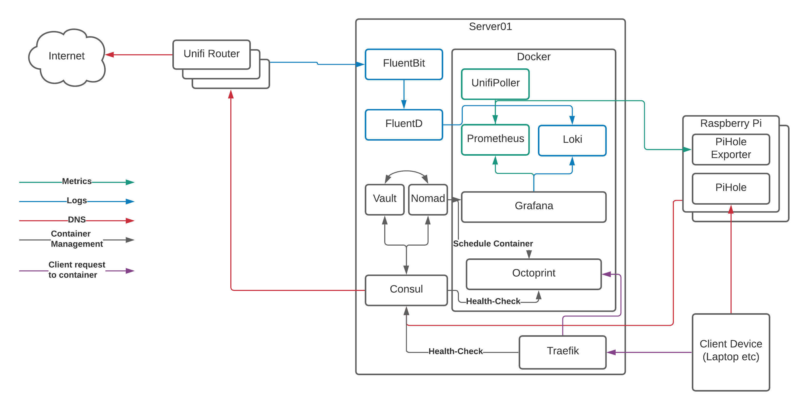

# Containers and service discovery

So far in this series we’ve covered [an overview of the stack we’re trying to create](container-visibility-and-dashboards.md) and looked at [DNS filtering with PiHole](https://www.budgetsmarthome.co.uk/2021/03/18/dns-filtering-with-pihole/).

This post is going to look at how we run containers on our network, how we can easily browse to those containers, and how we find their services.

## The Container Management Stack

Before we dive in to the detail, let’s look at the target state for our setup:

This might look complicated at first glance, but it really isn’t.

`Server01` is the physical server running [Arch Linux](https://www.archlinux.org/) that I talked about in our overview. You _can_ do this with a number of Raspberry Pi’s instead of a single server, but that adds some more complexity and reduces the amount of resources available to us, so we’ll focus on a dedicated server here.

`Server01` has a number of services running on it, so let’s take a brief look at them now:

-   [Docker](https://www.docker.com/) is the “run-time” for our containers. It uses a common format to ensure that we can run multiple applications in a managed way and “virtualise” the resources on the server to make as much use of the hardware as possible. Think of it as a lightweight VMWare or HyperV.
-   [Nomad](https://www.nomadproject.io/) is what we use to tell docker what to run and how to run it. We _can_ do this directly with docker commands or the `docker-compose` project, however Nomad gives us the ability to template files, set CPU/RAM limits, connect to multiple networks, expose ports, and (most importantly!) auto-register with Consul so containers “appear” in DNS without any other work needed.
-   [Consul](https://www.consul.io/) provides that service/container registration part that converts the container names into DNS records. Consul is also capable of acting as a key/value storage solution, but we’ll leave that for another day.
-   [Vault](https://www.vaultproject.io/) is the secrets management engine and allows us to protect data and pull it in to container templates for provisioning of databases etc. We won’t go into Vault in too much detail here, but we will get it installed and touch on how it can be used for future projects
-   [FluentBit](https://www.fluent-bit.org/) and [FluentD](https://www.fluentd.org/) are used for log processing. I’ll go into detail shortly about why I’m using both, however they run on the physical server and process log events before sending them on to the logging storage engine. The logging storage engine runs in a container, so we’ll cover that in a bit.
-   [Traefik](https://traefik.io/) claims to “Make networks boring”, and it does a great job of talking to Consul, registering the healthy services, and passing traffic from common ports through to the back-end container’s random port. This is the last piece of the puzzle and the bit that allows us to resolve our services to `http://myapp.service.my.domain` rather than `http://my.container.server:91523/`.

### The Containers

Running on top of Docker, you can see a number of containers. We’ll focus more on these containers in the next post, however leaving Octoprint (the system that provides a web interface to my 3D printer) to one side we can see the following software in the stack:

-   [Unifi Poller](https://github.com/unifi-poller/unifi-poller) - Talks to our [Ubiquiti Unifi Cloud Key 2+](https://unifi-protect.ui.com/cloud-key-gen2) and collects metrics on the state of our network such as the number of WiFi clients connected at any given time
-   [Prometheus](https://www.prometheus.io/) - Our metrics storage engine, reaching out to the various pollers (Unifi and Pi Hole in this particular case) and collecting the metrics we need for our graphs
-   [Loki](https://grafana.com/oss/loki/) - A relatively new solution for storing and searching logs with a similar query syntax to Prometheus
-   [Grafana](https://grafana.com/) - The most flexible Open Source data visualisation tool on the market, Grafana connects to Loki and Prometheus and displays the data it finds there

> **But what about ELK?**
> 
> The ELK Stack (Elasticsearch, Logstash, and Kibana) is probably one of the best known open-source monitoring solutions out there and I’ve been using it in my professional life for nearly 10 years now.  
> It scales, it ingests logs beautifully, and it’s one of the darlings of the open-source world, however recent changes around their approach to licensing and some experiences with using it to query metrics rather than logs have made me question whether it’s the right tool to be using in my professional work.  
> This led me to discover Prometheus and Loki as alternatives (I’ve always used Grafana instead of Kibana because Grafana is far more flexible and connects to many more back-ends than Kibana can), and I though “what better way to experiment than on my home network?”. Three months in and I don’t regret it at all. Loki, Prometheus, and Grafana are all far more lightweight than their ELK counterparts and it _feels_ quicker to respond to complex queries. As a result, I’m sticking with this as a combination at home, and even starting to suggest it to clients at work!

## So how does it all glue together?

When we launch a container via Nomad, Nomad does two things:

1.  Schedules the container to be started by docker with the appropriate configuration and file volumes mounted
2.  Registers the container service name and health-checks (usually a simple connection attempt to the appropriate port) with Consul

Consul then executes the health-check repeatedly based on the parameters until it passes a number of times in a row. At this point, it marks the service as “healthy” and it appears in DNS.

Finally Traefik checks consul for services that are healthy, and then configures itself to pass traffic through from HTTP, HTTPS, or another TCP port to the container’s exposed port, allowing you to access your container via the default port for your application via the DNS hostname.

## Yes, but where’s the config?!

When I started on this post, I expected it to include all the configuration files for Consul, Nomad, Vault, Docker, and Traefik, however I’m well past 1,000 words now and I’ve not even started on the configuration yet, so I’ll save that for the next post.

Those of you wishing to “get ahead” on the subject could look at the sections for [Consul](https://learn.hashicorp.com/consul), [Vault](https://learn.hashicorp.com/vault), and [Nomad](https://learn.hashicorp.com/nomad) from the excellent documentation at [https://learn.hashicorp.com/](https://learn.hashicorp.com/), and I promise that I’ll have config files for you in my next post!

## Reference

* https://www.budgetsmarthome.co.uk/2021/03/24/containers-and-service-discovery/
