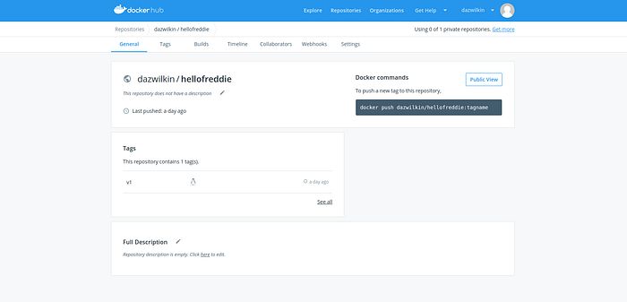
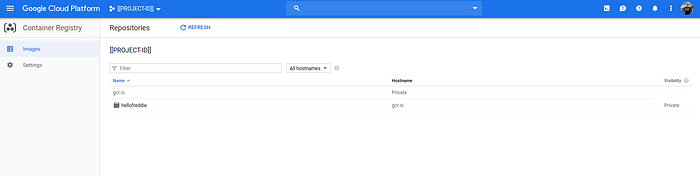
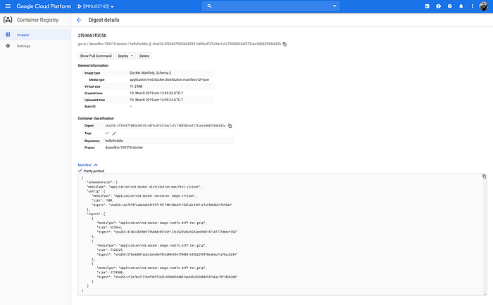
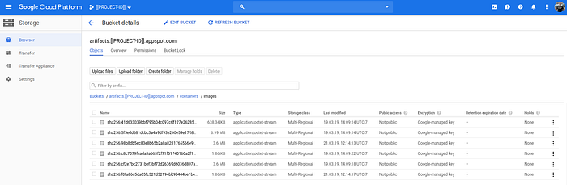

# How to debug dockerhub pull image

**TL;DR** Gain an understanding of Container image manifests, how these are calculated|verified, and how manifests correspond to layers. 

> **NB** Your sha256’s will vary

I created the simplest Golang httpd and containerized it with:

```shell
FROM golang:1.12 as buildWORKDIR /go/src/appCOPY . .RUN go get -d -v ./...RUN go install -v ./...FROM gcr.io/distroless/baseCOPY --from=build /go/bin/app /ENTRYPOINT ["/app"]
```

Then:

```shell
$ IMAGE=hellofreddieTAG=v1docker build \
  --rm \
  --file=Dockerfile \
  --tag=${IMAGE}:${TAG} \
  hellofreddie
```

> **NB** `--rm` removes intermediate containers and is the default.

Then:

```shell
$ docker history ${IMAGE}:${TAG} \
--format="{{.ID}}\t{{.CreatedBy}}"
IMAGE               CREATED BY                                      
c8c7079fcada        /bin/sh -c #(nop)  ENTRYPOINT ["/app"]
de61bd0d36a4        /bin/sh -c #(nop) COPY file:549fe06ce41c1ab2…
a5a1c6b2c22f        bazel build ...
<missing>           bazel build ...
```

These image layers correspond top-to-bottom to the commands in the Dockerfile in reverse:

```shell
$ docker image ls gcr.io/distroless/base
REPOSITORY               TAG                 IMAGE ID
gcr.io/distroless/base   latest              a5a1c6b2c22f
docker image history gcr.io/distroless/base \
--format="{{.ID}}\t{{.CreatedBy}}"
a5a1c6b2c22f        bazel build ...
<missing>           bazel build ...
```

Then the copy of the file generated by the `build` layer.

Lastly, setting the `ENTRYPOINT`.

We may:

```shell
$ docker image inspect ${IMAGE}:${TAG} \
| jq --raw-output '.[0].Id'
sha256:c8c7079f...

$ docker image inspect ${IMAGE}:${TAG} \
| jq --raw-output '.[0].RepoDigests[]'
dazwilkin/hellofreddie@sha256:2f93667f...
gcr.io/dazwilkin-190319-docker/hello@sha256:2f93667f...
gcr.io/dazwilkin-190319-docker/hellofreddie@sha256:2f93667f...

$ docker image inspect ${IMAGE}:$}{TAG} \
| jq --raw-output '.[0].RootFS.Layers[]'
sha256:44873b56...
sha256:87c747af...
sha256:5ef84fd2...
```

> **Hypothesis #1**: the (Repo)Digest hashes (`2f93667f`) should be determined exclusively from the content of an image manifest. Hopefully, before the end of this post, we’ll prove that.

## Docker Hub (`hub.docker.com`)

If you have Docker credentials (`${USERNAME}`), you may push your image to Docker’s registry (`hub.docker.com`):

```shell
$ docker tag ${IMAGE}:${TAG} ${USERNAME}/${IMAGE}:${TAG}
$ docker push ${USERNAME}/${IMAGE}:${TAG}
```

Here’s how this looks for me:



dockerhub

The UI looks good but it appears to lack functionality for drilling into manifests and layers. Fortunately, there’s a Registry API and this doc is helpful in using it:

[https://success.docker.com/article/how-do-i-authenticate-with-the-v2-api](https://success.docker.com/article/how-do-i-authenticate-with-the-v2-api)

For continuity, I’ll repro some of those examples here:

```shell
$ REG="https://hub.docker.com/v2"
$ USR=[[YOUR-DOCKER-USERNAME]]
$ PWD=[[YOUR-DOCKER-PASSWORD]]
$ TOKEN=$(\
  curl \
  --silent \
  --header "Content-Type: application/json" \
  --request POST \
  --data '{"username": "'${USR}'", "password": "'${PWD}'"}' \
  ${REG}/users/login/ \
  | jq -r .token\
) && echo ${TOKEN}

$ curl \
    --silent \
    --header "Authorization: JWT ${TOKEN}" \
    ${REG}/repositories/${USR}/?page_size=100 \
    | jq -r '.results|.[]|.name'

$ curl \
    --silent \
    --header "Authorization: JWT ${TOKEN}" \
    ${REG}/repositories/${USR}/${IMAGE}/tags/
```

> **NB** I recommend jq heartily but, if you’d prefer not to use it, you’ll need to manually grab the `token` value from the JSON returned by the curl command.

The next step should be to pull a manifest for image `${IMAGE}:${TAG}` but I’ve struggled to get this to work against dockerhub:

```shell
$ curl \
  --silent \
  --header "Authorization: JWT ${TOKEN}" \
  ${REG}/${USR}/${IMAGE}/manifests/v1
```

Let’s see what the nice folks on Stackoverflow have to say:

[https://stackoverflow.com/questions/55269256/how-to-get-manifests-using-http-api-v2](https://stackoverflow.com/questions/55269256/how-to-get-manifests-using-http-api-v2)

Because I’m unable to pull the manifest, I can’t explore further corroborating the manifest on dockerhub.

**Update 2019–09–12:** [**Solved**](https://stackoverflow.com/a/57878742/609290) **by** [**schnatterer**](https://stackoverflow.com/users/1845976/schnatterer) **— thanks!**

You acquire a `TOKEN` using:

```shell
$ AUTH="https://auth.docker.io"SERV="registry.docker.ioREPO=${USR}/${IMAGE}TOKEN=$(\  curl \
    --silent \
    --location \
    "${AUTH}/token?service=${SERV}&scope=repository:${REPO}:pull" \
    | jq --raw-output .token\) && echo ${TOKEN}
```

And then:

```shell
$ REG="https://index.docker.io/v2"SCHEMA="application/vnd.docker.distribution.manifest.v2+json"curl \
    --silent \
    --location \
    --header "Authorization: Bearer ${TOKEN}" \
    --header "Accept: ${SCHEMA}" \
    "${REG}/${USR}/${IMAGE}/manifests/${TAG}" \
  | jq --raw-output
```

Or:

```shell
$ curl \
    --silent \
    --location \
    --header "Authorization: Bearer ${TOKEN}" \
    --header "Accept: ${SCHEMA}" \
    "${REG}/${USR}/${IMAGE}/manifests/${TAG}" \
  | sha256sum \
  | head --bytes 642f93667f...
```

## Google Container Registry

If you have access to a Google Cloud Platform project, you can use Google Container Registry too:

```shell
$ docker tag ${IMAGE}:${TAG} gcr.io/${PROJECT}/${IMAGE}:${TAG}
$ docker push gcr.io/${PROJECT}/${IMAGE}:${TAG}
v1: digest: sha256:2f93667f... size: 949
```

**NB** The digest (`sha256:2f9e667f…`) that’s provided to us upon completion of the push.

Here’s how this looks for me using the Cloud Console:

[https://console.cloud.google.com/gcr/images/${PROJECT}](https://console.cloud.google.com/gcr/images/$%7BPROJECT%7D)



Google Container Registry

and there’s a useful drilldown feature into images, first to show the available tags and then to show manifest specifics:



Google Container Registry: manifest

**NB** Container Registry provides the digest (`2f93667f`). This matches the digest that was provided to us when we completed the push. When we reference the image, we can reference it by `${IMAGE}:${TAG}` but the same `${IMAGE}:${TAG}` may produce different images. Instead, we may refer to the image uniquely and immutably as `${IMAGE}@sha256:2f9e667f...`.

Google Container Registry implements the Docker Registry API v2. Unfortunately, because the Container Registry is \
  *not\* a regular Google API, it’s not possible to use the wonderful Google APIs Explorer to explorer this API.

However, given the experience above with the Docker implementation, the main gotcha here is working out how to authenticate against the Google Registry.

Here’s the solution:

```shell
$ TOKEN=$(gcloud auth print-access-token)
```

Because this is easy to grab, I recommend using the command directly in the ensuing commands instead of using `${TOKEN}` as this will expire.

**Aside**: I tried to work out which API calls are used by using gcloud `-log-http` against `gcloud container image` commands:

```shell
$ gcloud container images list \
    --repository=gcr.io/${PROJECT} \
    --log-http
==== request start ====
uri: https://gcr.io/v2/token?scope=repository%3A${PROJECT}%3Apull&service=gcr.io
method: GET
== headers start ==
Authorization: --- Token Redacted ---
content-type: application/json
== headers end ==
== body start ==
== body end ==
---- response start ----
-- body start --
{
  "expires_in":43200,
  "issued_at":"2019-03-21-T23:59:59.00000000-7:00",
  "token":"[[TOKEN]]"
}
-- body end --
==== request start ====
uri: https://gcr.io/v2/${PROJECT}/${IMAGE}/tags/list
method: GET
== headers start ==
Authorization: --- Token Redacted ---
== headers end ==
== body start ==
== body end ==
==== request end ====
---- response start ----
-- headers start --
content-location: https://gcr.io/v2/${PROJECT}/${IMAGE}/tags/list
docker-distribution-api-version: registry/2.0
server: Docker Registry
status: 200
-- headers end --
-- body start --
{
  "child":["${IMAGE}"],
  "manifest":{"sha256:2f93667f...":{...}},
  "name":"${PROJECT}",
  "tags":["${TAG}"]
}
-- body end --
---- response end ----
----------------------
DIGEST        TAGS  TIMESTAMP
2f93667f005b  v1    2019-03-19T00:00:00
```

I was unable to apply the value `[[TOKEN]]` in subsequent calls against the Container Registry API. Instead using my credentials to gain an access token (`gcloud auth print-access-token`) works so I abandoned this path.

What is interesting from the above is that you see that the Google Container Registry is accepting Docker Registry v2 API calls:

```
/token
/${PROJECT}/tags/list
/${PROJECT}/${IMAGE}/tags/list
```

So, let’s now use the same API calls as with dockerhub, configured for the Container Registry repository:

```shell
$ REPO=https://gcr.io/v2/${PROJECT}/${IMAGE}
$ TOKEN=$(gcloud auth print-access-token)
$ curl \
    --silent \
    --request GET \
    --user _token:${TOKEN} \
    ${REPO}/tags/list
{
 "child": ["${IMAGE}"],
 "manifest": {},
 "name": "${PROJECT}",
 "tags": []
}
```

and:

```shell
$ curl \
    --silent \
    --request GET \
    --user _token:${TOKEN} \
    ${REPO}/tags/list
{
 "child": [],
 "manifest": {"sha256:2f93667f...": {...}},
 "name": "${PROJECT}/${IMAGE}",
 "tags": ["${TAG}"]
}
```

and, the manifests command that I’m unable to get to work with dockerhub, works correctly with Container Registry:

```shell
$ curl \
    --silent \
    --request GET \
    --user _token:${TOKEN} \
    ${REPO}/manifests/${TAG} \
    | jq .
{
  "schemaVersion": 2,
  "config": {
    ...
    "digest": "sha256:c8c7079f..."
  },
  "layers": [
    {
      "size": 653664,
      "digest": "sha256:41d63303..."
    },
    {
      "size": 7326227,
      "digest": "sha256:5f5edd68..."
    },
    {
      "size": 3774900,
      "digest": "sha256:cf2e7bc2..."
    }
  ]
}
```

Let’s take a pause here and try to understand (I’m not sure I do at this point) what we have:

-   `config.digest` (`c8c7079f...`) corresponds to the `Id` way back when we inspect the image after it was built.
-   However, Container Registry reports another Digest of `2f93667f...`. And this value corresponds to the `RepoDigest` value from the same image inspect command. This is the Digest value that we may use to pull the image too: `docker pull ${REPO}/${IMAGE}@sha2f93667f...`.
-   The `layers[].digest` values do not match the layer hashes on the local copy.

Let’s use the digest this time:

```shell
$ DIGEST="sha256:2f93667f..."
$ curl \
    --silent \
    --request GET \
    --user _token:${TOKEN} ${REPO}/${IMAGE}/manifests/${DIGEST} \
    | jq .
{
  "schemaVersion": 2,
  "config": {
    ...
    "digest": "sha256:c8c7079f..."
  },
  "layers": [
    {
      "size": 653664,
      "digest": "sha256:41d63303..."
    },
    {
      "size": 7326227,
      "digest": "sha256:5f5edd68..."
    },
    {
      "size": 3774900,
      "digest": "sha256:cf2e7bc2..."
    }
  ]
}
```

The result is the same. This Digest uniquely references the image. If we were to change the image (no matter how slightly) and repush it as `${IMAGE}:${TAG}`, its Digest would (very probably) be different.

And, finally, let’s compute the manifest’s SHA-256 hash:

```shell
$ curl \
  --silent \
  --request GET \
  --user _token:${TOKEN} ${REPO}/${IMAGE}/manifests/${TAG} \
  | sha256sum \
  | head --bytes 642f93667f...
```

**Aside**: [skopeo](https://github.com/containers/skopeo)

I found skopeo in my searches. I’d not used it before but it’s helpful:

```shell
$ ./skopeo inspect docker://docker.io/${USER}/${IMAGE}:${TAG}
{
    "Name": "docker.io/${USER}/${IMAGE}",
    "Digest": "sha256:2f93667f...",
    "RepoTags": [
        "${TAG}"
    ],
    "Created": "2019-03-19T00:00:00.000000000Z",
    "DockerVersion": "18.06.2-ce",
    "Labels": null,
    "Architecture": "amd64",
    "Os": "linux",
    "Layers": [
        "sha256:41d63303...",
        "sha256:5f5edd68...",
        "sha256:cf2e7bc2..."
    ]
}
```

And:

```shell
$ ./skopeo inspect docker://gcr.io/${PROJECT}/${IMAGE}:${TAG}
{
    "Name": "gcr.io/${PROJECT}/${IMAGE}",
    "Digest": "sha256:2f93667f...",
    "RepoTags": [
        "v1",
        "v2"
    ],
    "Created": "2019-03-19T00:00:00.000000000Z",
    "DockerVersion": "18.06.2-ce",
    "Labels": null,
    "Architecture": "amd64",
    "Os": "linux",
    "Layers": [
        "sha256:41d63303...",
        "sha256:5f5edd68...",
        "sha256:cf2e7bc2..."
    ]
}
```

> **NB** There’s no `/v2/` in the GCR URL in this case.
> 
> **NB** The `Digest` and the `Layers[]` values match.
> 
> **NB** The Digests match because the manifests are identical.

## Layers

According to Docker’s API, it should be possible to pull specific layers by their hash. I’ve been unsuccessful with this call both with Docker and GCR. However, with GCR, I know where the layers are buried. GCR uses Google Cloud Storage (GCS) for layer persistence.

Using the GCS Storage Browser, a bucket `artifacts.${PROJECT}.appspot.com` was created by GCR and it contains `containers/images/`:



Cloud Storage Browser

If you’ll recall, I had Layers named `sha256:441d63303...`, `sha256:5f5edd68...` and `sha256:cf2e7bc2`. Let’s compute the hashes of these archives:

```shell
$ DIGESTS=$(\
  curl \
  --silent \
  --request GET \
  --user _token:${TOKEN} \
  ${REPO}/${IMAGE}/manifests/${TAG} \
  | jq -r .layers[].digest \
)

$ BUCKET=artifacts.${PROJECT}.appspot.com
$ for DIGEST in ${DIGESTS}
do
  echo "Provided: ${DIGEST}"
  CALCD="sha256:"$(gsutil cp gs://${BUCKET}/containers/images/${DIGEST} - \
  | sha256sum \
  | head --bytes 64)
  echo "Calculated: ${CALCD}"
  if [ "${DIGEST}" != "${CALCD}" ]; then
    echo "Match!"
  else
    echo "Error!"
  fi
 done
```

So, this script grabs the manifest for `${IMAGE}:${TAG}` and uses this to determine the corresponding archive of the layer stored in GCS. It then streams each archive into `sha256sum` to (re)calculate the archive’s hash and compares it with the manifest’s digest for the layer. In my case, the results are:

```shell
sha256:41d63303...
sha256:41d63303...
Match!
sha256:5f5edd68...
sha256:5f5edd68...
Match!
sha256:cf2e7bc2...
sha256:cf2e7bc2...
Match!
```

It’s also possible to use a similar process to confirm that the archive sizes match. In this case it would be preferable to retain the archive locally, calculate its `sha256sum` and determine its size.

## Conclusion

I’ve been avoiding gaining a better understanding of the metadata underpinning container images. Hopefully this post is useful to others in understanding the basics behind image manifests and layers, in addition to providing a basic overview of navigating the DockerHub and Google Container Registry registries.

You may recall Hypothesis #1. We were indeed able to prove that the (Repo)Digest which is the manifest digest may be calculated simply from the manifest.

That’s all!

**Addendum**

Another riff on the sha256 calculations for Container Registry’s underlying buckets is:

```shell
$ BUCKET=[[YOUR-BUCKET]]
$ for OBJECT in $(gsutil ls gs://${BUCKET}/containers/images)
do 
  OBJECT_SHA=$(gsutil cp ${OBJECT} - | sha256sum | head --bytes 64)
  printf "%s\tsha==%s\n" ${OBJECT} ${OBJECT_SHA}
done
```

## Reference

* https://medium.com/google-cloud/adventures-w-docker-manifests-78f255d662ff
