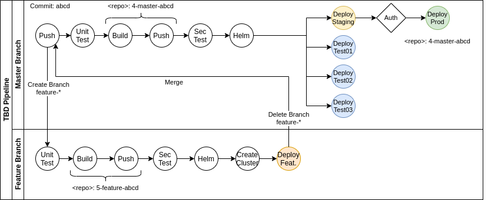
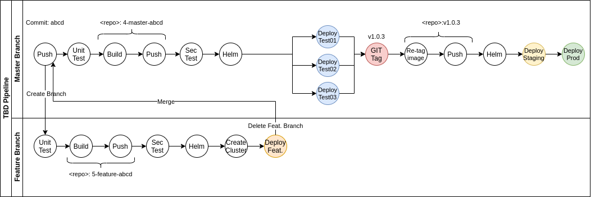
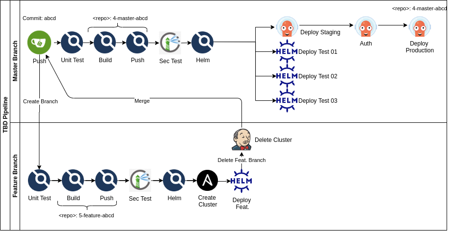
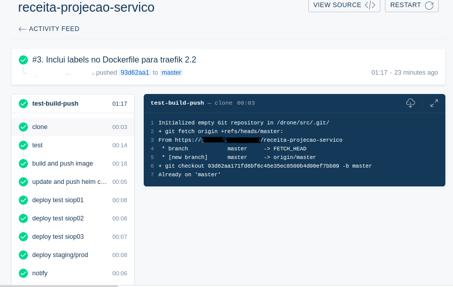
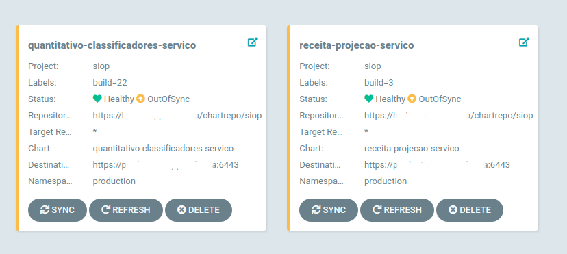
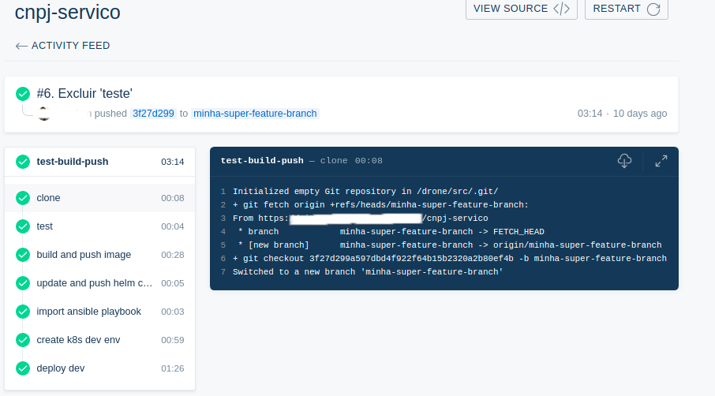

# A CI/CD Pipeline Project for a Trunk-Based Development Strategy in a Kubernetes Environment

The main purpose of this story is to present a project on how to build a pipeline for Continuous Integration and Continuous Deployment (CI/CD) on a Trunk-Based Development (TBD) Strategy in a Kubernetes environment, leveraging opensource tools in order to foster automation, control and agility.

In the next paragraphs, we will outline the Trunk-Based Development process and how it can be supported in a real-world CI/CD pipeline. We will also present a set of open source tools that enables automation on a TBD strategy and the general steps to integrate and achieve their full potential on delivering an automated TBD CI/CD pipeline.

## The Trunk-Based Development (TBD) Strategy in the real world

Many organizations are now working with (or migrating to) TBD. As from [https://trunkbaseddevelopment.com/,](https://trunkbaseddevelopment.com/) this model aims to reduce the effort on merging procedures, focusing on maintaining a constant buildable "main/master" branch. Due to its simplicity, it integrates seamlessly with CI/CD pipelines.

Having an everlasting deployable main branch offers additional benefits. First, it promotes shared responsibility, where all developers are committed to maintain a stable trunk. Second, as the merging process become more challenging, developers commit smaller changes more frequently, delivering faster features and bug-fixes. On the other hand, as risk rises when commits are made straight into main, TBD often requires experienced developers to support this strategy.

In my organization, every commit (and push) to the main branch is considered a "good to go" build. This means that whenever an image is built, it suffices to say that it has already passed all tests and are ready for production.

In this pipeline project, it has been considered, along with the main branch, feature branches, which can be short or long-lived. It is up to the developer to decide for it, provided that the longer the life of a feature-branch, the more challenging the merge process will be.

Meanwhile, the validation process with our clients is done either in a feature branch, before merging with the main branch, or in staging, leveraging toggle features, which can be enabled or disabled by configuration. This aligns with the devops idea of "fail fast", which encourages the team to fix faster and improve the system.

The picture below outlines the actual TBD pipeline in my organization:

Pic.1: TBD Pipeline

The downside of this workflow is the lack of control by the Release Manager on what is promoted into production. As soon the image is deployed on staging it only takes a sync step(the "auth" part) to deploy that release on production. There is no validation or release candidates. Therefore, it requires strong communication between Devs and the Release Manager to avoid unwanted releases in production.

It’s under discussion, however, an improvement of this process, where the Release Manager role will be responsible for **tagging** the release whenever it is ready for staging and production stages. As consequence, this will move the "authorization" phase one step earlier. It is also under the radar some automation between the our local dev Workflow Management tool and local git tool, enabling auto-tagging when the ticket (or user story) is validated by the release manager.

In such scenario, the new TBD pipeline would be something like this:

Pic. 2: New TBD Pipeline with tagging step

This new pipeline empowers the Release Manager to decide when the code is ready to move on. The drawback is that emergency bug fixes will be dammed waiting for the tag, which reduces agility, eventually affecting fast fixes.

Despite this new approach, for now on in this project, the first TBD pipeline (Pic. 1) will be considered for CI/CD implementation.

## The Toolkit

In devops world, it can be extremely challenging to find the perfect tool. There are literally hundreds available which offer amazing features. There are, however, some differences that can make a few of them particularly interesting for a project. At the end of the day, it is a matter of taste, usability, features and integration to your environment. In our case, in addition to their core features, being an open-source tool was also a requirement. A good way to start is to check if the project is supported by the CNCF (Cloud Native Computing Foundation — [https://landscape.cncf.io/](https://landscape.cncf.io/)). As we had already decided for orchestrating containers with kubernetes, having a k8s native tool was also a plus.

Besides, all tools, applications and systems should be able to be deployed in a fully managed private cloud. And this is definitely not a constraint. Rather, being a cloud-ready project, all infrastructure can be easily migrated to a hybrid or public cloud providers, such as AWS, Azure or GCP.

After some research, testing and sweat, this is our chosen fleet (we will see how they work together later on):

-   [**Argo CD**](https://argoproj.github.io/argo-cd)— "Argo CD is a declarative, GitOps continuous delivery tool for Kubernetes". We decided to use Argo-cd as the deployment tool for deploying helm charts in staging and production environments. It provides not only visibility and rollbacks but also the option to manually sync newly available helm charts to prod. This complies with the authorization requirement for publishing in production (only those with proper rights can sync into prod). In staging, nevertheless, the synchronization is automatic. Whenever a new helm chart of a project became available on the chart repository, Argo-cd takes care of its deployment. This means that it also enforces configuration. If someone accidentally changes or deletes an object in the k8s namespace watched by Argo it then triggers an auto-sync (or fire a not-in-sync warning for a production environment on UI). Argo-cd has recently joined CNCF as an incubating project.
-   [**Drone**](https://drone.io/)— Drone is used for the pipeline automation. This is the core tool that enables the CI/CD pipeline. Drone is an amazing project that has been recently acquired by Harness.io. The pipeline is described within the built project itself, in a drone.yaml file. It is a docker based pipeline tool. This means that every step in the pipeline is a container, that dramatically enhances performance with reduced resource consumption. Describing the whole pipeline in a drone.yaml file in each repository can be a problem when you have an application with dozen or even hundreds of microservices managed by independent repos. Luckily, Drone provides the possibility to centralize configuration in only one repo and describe the rules for forwarding the proper drone.yaml file by configuring a drone-config service ([https://github.com/drone/boilr-config](https://github.com/drone/boilr-config)). Despite already being a stable tool, Drone obviously has a lot to evolve, but is a promising project that definitely worth a look.
-   [**Jenkins**](https://www.jenkins.io/)— The well-known alternative for Drone. As drone still don’t support pipeline triggers based on branch deletion (as its inner logic is based on a drone.yaml file available on that branch), we decided to use jenkins only to execute the deletion of a "feature" k8s cluster every time a feature branch is deleted.
-   [**Ansible**](https://ansible.com/) — Tool for automation and configuration management of infrastructure and applications. Ansible was used in this project to automate the creation and deletion of a k8s cluster to host a feature-branch build.
-   [**Harbor**](https://goharbor.io/)— Docker Images and Helm Chart Repository. It has also native integration with Clair and Trivy image security scanners. It is possible to define security thresholds for pulling images. If an image is tainted with critical vulnerability, the pull for that image will fail, making it possible to use this feature in the **Security Test** step.
-   [**Gitea**](https://gitea.io/)— Git-based service for code hosting. It is a great option for self-hosting a git service on-premise.
-   [**Helm**](https://helm.sh/) — Tool for templating and packaging for kubernetes objects. With Helm, it is possible to manage the creation and deployment of all kubernetes declarative files (deployment.yaml, service.yaml, ingress.yaml, etc) by templating them. In this project, we defined only one template for all repos. This has enabled centralized configuration with simplified management. The trade-off, however, is more complex templates.
-   [**Kubernetes**](https://kubernetes.io/)— Container orchestration infrastructure. The foundation platform for our container-based projects.
-   [**Rancher**](https://rancher.com/)— Rancher is a powerful stack capable of managing hundreds of kubernetes clusters, providing an API, a friendly UI and integrating many tools for cluster administration.
-   [**VMWare**](https://vmware.com/)— Private cloud infrastructure, already part of our inventory.

## The automated CI/CD pipeline

So, let’s put it all together — taking into consideration that we will not delve into the configuration of all pipeline’s components, otherwise, it will be longer than it is already. All config is specific for the environment and must be adapted for each situation. In this project, all tools are already running in a **kubernetes** cluster (except **jenkins**, which was already installed in a standalone VM).

**Drone** is the backbone of the process and is responsible for the underlying pipeline automation. All steps in the pipeline are commanded or orchestrated by drone and its plugins.

Let’s take a second look into the pipeline, now with our tools in place:

Pic.3: Our tool choice for the TBD process

First, let’s consider a commit in the main branch and a push to **Gitea** for a random repo. This is the default path/flow to production in the automated pipeline.

-   **Gitea** is configured to send webhooks to **Drone** that triggers the pipeline process. This configuration is easy and can be done by creating an OAuth Application in **Gitea** ([https://docs.drone.io/server/provider/gitea/](https://docs.drone.io/server/provider/gitea/)). By default, **Gitea** will send webhook events for branch or tag creation, pull requests and pushes, but this can be also configured.
-   Push: **Drone server** will receive this event and will call the **drone-config** service (another container from a boilerplate project) to retrieve the proper centralized drone.yaml file, which is also versioned in a git repo. It is possible to write a logic for this step, in case you have different pipelines for different repos.
-   **Drone server** will then pass this selected drone.yaml to **drone agent**, the third component of the "Drone suite". **Drone agent** is responsible for parsing this yaml file and call the plugins. Plugins in Drone are nothing more than docker containers running specific images to execute the step. There are many available in [http://plugins.drone.io/](http://plugins.drone.io/). The first (and default) step for drone is to clone the target repo into a workspace. This workspace is a temporary docker volume that is mounted on each container for each step. This is quite useful when passing information from one step to another. **Drone** will then execute the following steps:

Pic. 4: Print from a main-branch build in the Drone Server UI

-   **Unit Test**: Drone will execute the unit tests defined in the repo.
-   **Build and Push**: Drone will call the build plugin to build the image, tag it with a combination of the build’s number, the branch and 8 digits from the commit’s hash(ex: _3-main-93d62a1_). This enables traceability for the image in production. This tagged image is then pushed to Harbor to become available for the next steps.
-   **Security Test**: While in **Harbor**, Clair (our choice for security scan) will inspect the image for vulnerabilities. We’ve set an auto-scan on push and set a rule to prevent vulnerable images with low severity and above to be pulled. This constraint will force the pipeline to fail in further steps in case of vulnerabilities.
-   **Helm**: The next step is to build and publish the **helm chart** which will be used for deployment. We used the helm package and helm push commands in a custom docker image to execute this step. As one of our principles is to reduce complexity and redundancies in configuration, we maintain only one repo for templating all helm charts. The developer only needs to describe the specific configs for that service in a **values.yaml** file inside the project and the script will blend it with the unified template to generate the final chart. Our chart versioning policy is to match the minor version of a chart (ex: 0.1.4) with each image build (ex: 4-main-abcdefgh).
-   **Deploy Test Environments**: In this step, drone invokes the drone-helm3 plugin to deploy the **helm chart** on each environment. This plugin can be configured to set values during the deploy. This is quite useful for setting specific URLs for ingress according to the environment.
-   **Deploy Staging and Production**: Despite the name, Drone will only configure the **Argo-cd** application to sync the new available **helm chart**. **Argo** will, then, be the one that actually deploys and enforces configuration on **kubernetes** staging and production environments. What **Drone** does is to check if the **Argo** application already exists (in case of a new repo) and creates it otherwise. It sets some **helm** values just like the last step and sets staging deployment as auto-sync and production as manual sync.
-   **Authorization**: This is **not** a **Drone** step. The authorization occurs when the Release Manager approves the deployment in production and manually sync all "out-of-sync" repos in **Argo-cd**. In **Argo**, it is possible not only to sync specific **kubernetes** objects but also check the history of all deployments and execute rollbacks for previously working releases.

This is how it looks in Argo-cd UI:

Pic 5: Images (Helm Charts) ready for sync

Now, let’s describe the **feature-branch pipeline**. It will also start in **Gitea**, but now triggered by a push in a **non-main** branch:

-   **Push**: It is possible to configure conditions in Drone pipelines. In our case, whenever the commit is on a branch with "feature-\*" name pattern, the alternative pipeline will be executed. This means that we don’t need to specify another drone.yaml. Rather, we can reuse common steps and execute others when the branch condition is satisfied. The image below shows those new steps:

Pic. 6: Pipeline for a push in a feature-branch

-   **Unit Test, build, push, sec test and helm**: Nothing new or special here, except that images are now tagged with the name of the **feature-branch** instead of "main"(Ex: 5-myfeature-fedcba99). This will also make it easier to find the **production-to-be** microservice among all others in the development cluster.
-   **Create k8s cluster**: This is probably the most interesting step in the hole pipeline. In order to test and validate the new feature, we automatically create a temporary **kubernetes** cluster that will live until the feature branch exists. This will not only create a standalone and isolated environment for testing but also curb unnecessary resources consumption (specially useful in the pay-as-you-go public cloud model). For this automation, **drone** will call the ansible plugin to execute this step.

This **ansible-**playbook can be quite extensive and can be found in [https://github.com/alexismaior-ansible/play-create-rancher-cluster-per-branch](https://github.com/alexismaior-ansible/play-create-rancher-cluster-per-branch). The overall steps executed by this playbook are:

1.  Check if there are available VMs in **VMWare** vCenter. As we are in a private cloud environment and we don’t want to wait a long time for the VM provisioning, the VMs were previously created and its "availability" controlled by tagging. If the VM has the "available" tag, it can be used in our new cluster. This playbook can be easily adapted to dynamically create and delete a VM on the fly.
2.  Install prerequisites on those VMs, such as docker, helm and kubectl.
3.  Create a **kubernetes** cluster in Rancher. For this, we use an **ansible** role designed for communicating with Rancher API (alexismaior.ansible\_role\_manage\_rancher\_cluster).
4.  Add the VMs to this new cluster, using the same **ansible** role.
5.  Create and set a **VMWare** tag to VMs. Now they are formally assigned to the cluster and won’t be available for other feature-branch clusters.
6.  Register DNS entries for the **kubernetes** ingress.
7.  Clone staging environment. For testing purposes, it is critical to have an environment closest as possible to production. Therefore, we run a shell script ([https://github.com/alexismaior/kubernetes/blob/master/scripts/kubeconfig-devtest.yaml](https://github.com/alexismaior/kubernetes/blob/master/scripts/kubeconfig-devtest.yaml)) that deploys all helm charts available in staging on the new cluster.
8.  Finally, communicate in a Telegram group that the new k8s cluster is available, application deployed with its respective ingress URL.

Following into the feature-branch steps, we still have:

-   **Deploy Feature in dev**: Back to **drone**, here we call the drone-helm3 plugin to do the job and deploy the new feature **helm chart** on the new cluster.
-   **Delete k8s Cluster**: As said, drone cannot yet be triggered by branch deletion, therefore we have chosen to rely on **jenkins** to execute the cluster deletion playbook. **Jenkins** receives a webhook from **Gitea** whenever a branch is deleted and pass its name for **ansible-**playbook. P.S.: Automatic deletion of a cluster can be dangerous for obvious reasons (Imagine someone creating a "production" feature branch). Well, besides creating clusters with "feature" prefix, we also guarantee that the service user running this action in Rancher does not have RW rights in prod.

That’s it! This is the happy ending of the pipeline.

## Conclusion

This project has incredibly enhanced our control and observability in the deployment process. Now, we can measure delivery and deployment times, test error rates and deployment frequency. Besides, the devops team can now prioritize slower steps and improve testing.

Many other tools, such as **fluentd**, **elastic search**, **kibana**, **prometheus** and **grafana** are also being used for logging and reporting purposes. **Rancher** also provides great features for **kubernetes** cluster management and security auditing and controls. Much more must be done, but the overall result has shown us that leveraging automation is the key to greater productivity with managed risks.

## Reference

* https://medium.com/swlh/a-ci-cd-pipeline-project-for-a-trunk-based-development-strategy-in-a-kubernetes-environment-c4ffea9700fe
* https://madeintandem.com/blog/branching-strategies-ci-cd/