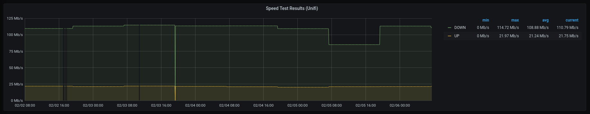
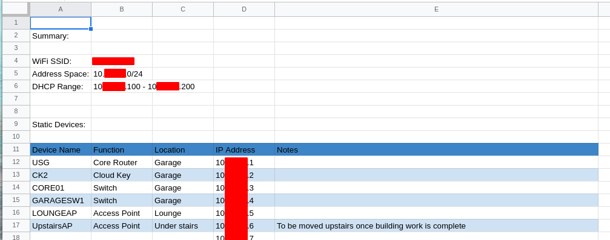

# The network part 1 - the heart of your smart home

We’re getting close to being able to start using our smart home now - we’ve decided on [smart switches](https://www.budgetsmarthome.co.uk/2021/01/13/smart-bulbs-vs-switches-part-2-smart-switches/) instead of [smart bulbs](https://www.budgetsmarthome.co.uk/2021/01/05/smart-bulbs-vs-switches-part-1-smart-bulbs/), we’re using [Hubitat](https://www.hubitat.com/) as our “[hub](https://www.budgetsmarthome.co.uk/2021/02/06/the-network-part-1-the-heart-of-your-smart-home/2021/02/02/choosing-a-hub/)”, and we understand when to [automate](https://www.budgetsmarthome.co.uk/2021/02/04/what-is-automation/) and when to leave well alone, but there’s something vital we’ve not talked about yet - the network.

A quick search for “home network setup” on Google returns nearly 500 million results, so what are the basics that we want to look for and how should we ensure we get the best value for our money?

### Don’t skimp on the network!

Before I start diving in to the details, this is one of the few areas on this blog where I’ll be encouraging you to **spend** money, not save it.

A good network (along with a good Zigbee mesh, which we’ll cover in a later post!) is what dictates whether your smart home succeeds or fails.

We’ve looked at how you can automate your home to interact with you, but you need to be able to download media from streaming services at high rates across the house, and if you’re using any voice assistants you’ll want to make sure you’ve got good WiFi coverage as well.

The router that your ISP gave you? Get rid of it. It’s useless unless you’ve got fewer than three WiFi devices and you live in a single room.

Broadband from [Sky](https://www.sky.com/tvandbroadband)? Change it. I’ve seen so many issues both in real life and on community forums with all kinds of devices where the issue turned out to be some random setting that Sky enforce, preventing their customers from having an efficient network setup.

In short, this is where you absolutely need to make sure you’re buying kit that will work for you for a long time without interruptions, and an area that you need to plan before you implement.

### How to plan a solid home network for home automation

When we start to plan for our home network, there are a few things we need to take into consideration:

1.  What options do we have for the broadband connection, and what speeds to we really need?
2.  How many clients (phones, tablets, laptops, voice assistants, etc.) will likely be connected?
3.  How many media streams (Netflix, Amazon Prime Video, Spotify, Apple Music, local video, etc.) will be streaming at the same time, and what quality will they be streaming at?
4.  What size is the house, what is the house made from, and how many floors do we need to cover?
5.  Do we need to think about CCTV or other security solutions?

All of these things will shape the configuration we end up with, so let’s look at them one by one.

#### 1\. Broadband Connectivity

The first thing to say about sourcing a broadband connection is that you almost certainly don’t need the top speed available to you.

There are five of us in our house, it’s not uncommon to have multiple Netflix, Amazon Prime, and Spotify streams being watched/listened to at the same time in different rooms, and we’ve just downgraded from 330Mbps to 100Mbps without any drop in our ability to stream in 4K across multiple devices.

The second thing to say is that the connection _type_ matters. There are a wide range of options available these days from ADSL (typically up to 35Mbps) over copper phone lines through Fibre to the Cabinet (FTTC, speeds up to 75Mbps) to Fibre to the Premises (FTTP, a fibre optical cable direct to your house, capable of speeds in excess of 500Mbps), however only FTTP will give you a solid connection at a fixed speed.

ADSL tends to fluctuate wildly (ours used to switch between around 2.5Mbps and 17Mbps!) and will only realy cope with one 4K stream at a time.

FTTC is more stable, but can still vary (ours used to be between 35Mbps and 45Mbps), but can happily carry a couple of 4K streams.

FTTP is the most expensive option, but is rock solid as far as connections speeds go as shown below with the variation due to network pressures from our media consumption whilst the speedtest was running (the drops are where I’ve reset the hardware to install it into my new rack!).

The other thing we need to be aware of is that some Internet Service Providers decide that they’re going to use “non standard” settings as part of their setup, which means you can’t replace their own router with one of your own, limiting the amount you can do with your home network. Sky is the primary candidate for doing this, but there are others out there so search the forums or facebook pages of any ISP you’re thinking about switching to for “replace router”, “my own router”, or similar and read up on how possible it is before you commit. You will _always_ want to use your own router and not the one that the ISP provides.

In the same way that I’m going to recommend reasonably expensive network hardware in the later posts in this series, I’d strongly recommend [Zen](https://www.zen.co.uk/) as your Internet Service Provider - I don’t get any commission, I’m just a very happy customer!

#### 2\. How many clients will be connected to the network?

This is where I start to document our network. I have a spreadsheet with one tab for each of the VLANs (more on what VLAN’s are in a future post, but for now let’s just agree that it’s a convenient way of splitting up the network into “boxes”!), and in that tab I list the device type, the device name, and the IP Address I’m going to give it if that IP will be static.

Once I’ve documented all of the devices I currently have (Phones, Tablets, Smart TV’s, Smart Speakers, Voice Assistants, etc.), I start to think about the devices that I might add in future such as network-connected kitchen appliances, weather stations, and anything else and then add them to the appropriate tab in the spreadsheet.

Once I’ve done that, I tally them up and from that I can start to get an idea of how many devices I’ll have on my network (in my case, that’s a lot!) and whether they will need a wired or a wireless connection.

This will guide our decisions on the most appropriate network hardware to purchase when we get to that stage.

#### 3\. The number of media streams

We’ve already touched on this in section 1, however we didn’t include **internal** network streams. This could be from a media server to your TV, or between smart speakers, or just between local laptops as a file transfer.

Whilst the speed of the internet connection into the house is important, the speed of the internal network is also something we need to consider - There’s no point getting an internet connection that’s 100Mbps if the internal network can only cope with 10Mbps!

By this point in the process, we have a good idea of how many devices are going to be wired and how many are going to be wireless. We’ll look at the various types of network hardware in future posts, but you’re going to want to be looking at the ability to “switch” at least 100Mbps of traffic across your network, and ideally push up to that 1Gbps mark to make sure all your bases are covered for the foreseeable future!

As long as the WiFi and wired networks can cope with at least the same speed as your external internet connection, you’re probably going to be ok hosting all those streams!

#### 4\. What size is the house, and what is it made of?

The size of the house and the materials it is made from will greatly affect the way we lay out our network. A 1980’s build like mine with plasterboard internal walls and brick outer walls will provide a very different experience when drilling holes for network cables or trying to cover the area with a good WiFi signal than an 1890’s cottage where all the walls are solid stone and 2ft thick!

[Ubiquiti](https://www.ui.com/) are one of the most popular brands for advanced home networking (for reasons I’ll cover in future posts), and their [Network Designer](https://design.ui.com/) is a great tool, allowing you to upload a floor-plan, deploy access points and network sockets, check coverage, and see just how difficult those cable runs are actually going to be.

Even if you choose not to use Ubiquiti products in the future, the design tool is a great place to try out various combinations of wiring etc. and reduces the chance of any nasty surprises after you have purchased and installed the hardware.

#### 5\. CCTV and other security elements

The final area we need to look at is the CCTV and security aspects of our property.

Are you going to have CCTV and a smart alarm system installed? Does that system require a dedicated network connection? How will you ensure that if someone gains access to your home WiFi they can’t see the content from your CCTV cameras or arm/disarm your home alarm system?

Remember the “VLANs” that I talked about earlier, this is where they come in really handy. You can “section off” a part of your network and use it just for your security system, and then only allow particular devices to access the data on that VLAN.

I’ve got a dedicated VLAN for my CCTV, and only my phone and my laptop can access the controller and camera streams. The cameras can’t access the main network either, so there’s a much reduced risk of my CCTV system being [the “way in” for any potential attacker](https://www.which.co.uk/news/2019/10/the-cheap-security-cameras-inviting-hackers-into-your-home/) (not that I’ve got anything valuable on the network to gain access to!).

### Summary

This has been quite a long post, so thanks for getting this far!

When we start to look at a home network, we need to take into account the connection into the house, the number of devices that will be connected, the number of streams we could be using at any given time, and the layout/materials of the house itself. We also need to consider whether we need to section off any particular type of devices.

In our next post, I’ll take a look at “routers” - the first device in the chain between your external connection and your network - and how they can play a major role in ensuring that your home network is fit for purpose when it comes to Home Automation.

Until then, be sure to follow us on social media to get all the latest updates, and please leave your thoughts and comments in the box below!

## Reference

* https://www.budgetsmarthome.co.uk/2021/02/06/the-network-part-1-the-heart-of-your-smart-home/
