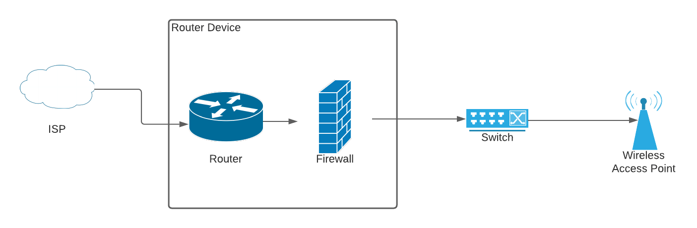

# The network part 2 - routers, switches, and access points

In our [last post](./2021/02/09/the-network-part-2-routers-switches-and-access-points/2021/02/06/the-network-part-1-the-heart-of-your-smart-home/) I talked about the criteria for deciding on how to build your network including the inbound connection, the number of clients, and any security considerations.

In this post I’ll talk about what a “good” home network design looks like, provide links to a few of the resources I’ve followed when building out my own network, and touch on the various hardware devices that you’ll want to think about purchasing.

As I said in my last post - **don’t skimp on the network hardware** - cheap or ISP-provided hardware will cause you all kinds of pain when it comes to running your smart home effectively, so if you’re going to splash out on your setup, this is one of the key areas in which to spend!

### Designing a “good” network

As I mentioned in my last post, googling for “Home Network Setup” returns nearly 500 million results, so what do we need to have in place to make sure we are secure and that we can host the required number of devices?

A “good network” will consist of a Router (often with a firewall included), a “switch”, and one of more “access points” as drawn in the diagram below, so let’s take a look at each of these in turn.

#### A brief word on security

Yes, this is your home network, and no, you probably haven’t got anything worth stealing as far as data is concerned, but we still need to talk about security.

So-called “bad actors” (anyone who is trying to use your network in a way it shouldn’t be) are constantly probing home networks looking for a way in so they can take over computers and re-purpose them to attack other sites. There are also people who try to “borrow” your WiFi connection, and every now and again there are reports about cheap IoT (Internet of Things) devices such as [CCTV Cameras](https://www.which.co.uk/news/2019/10/the-cheap-security-cameras-inviting-hackers-into-your-home/) being used to compromise your home network.

I’m not trying to give you nightmares, I’m just trying to make sure you’re aware that we need to adopt what is known as a “threat posture” when it comes to our network.

#### The router

So, what is “routing”, and why does it matter?

A router is a device that sits on the “edge” of the network (between your Internet Service Provider and your other network equipment) and ensures that data sent from your computers can access computers elsewhere on the internet.

I’m not going to go into how routers work in depth here, but I would recommend checking out [this video](https://www.youtube.com/watch?v=JOomC1wFrbU) if you want to know more.

The most important thing to know is that as the router is responsible for making sure traffic is “routed” to the correct location (either locally or on the wider internet), without it none of your devices will be able to see each other unless you put in a _lot_ of effort to configure them all.

On our network, the router will fulfil three jobs:

1.  Connect us to the internet via the ISP’s connection (in our case, FTTP or “Fibre To The Premises”)
2.  Protect us from malicious traffic from outside the network by running a “firewall”
3.  Hand out IP Addresses (the unique address that every device gets when it connects to the network)

Configuring the router to connect to the internet is different for each ISP, however you will need to know the username and password for your internet connection, and sometimes you’ll be asked to configure a specific “VLAN” (we’ll get to these, I promise!).

The “firewall” is a system often built in to routers (unless you go for the high-end commercial variants!) which allows or denies traffic depending on its source, destination, and the type of data it is sending. As an example, I have a firewall rule which says “Only the CCTV Controller can access the video streams from the cameras, and it can only be over a secure connection”.

Finally, the “handing out” of IP Addresses is vital as it means we don’t need to configure the network interfaces on all of our phones, servers, laptops, home automation hubs etc. We tell the router which “range” we want the addresses to be in, and it makes sure that every device gets a unique address. I’ll expand on this in a bit, however for now just keep this concept in mind whilst reading through the rest of this post.

#### The Switch

A switch is usually a reasonably long, thin box with a number of network ports built in to it.

Devices connect to these ports and the switch ensures that traffic is… well… “switched” across the network. The router will be plugged into one of the ports on the switch and, through handing out IP Addresses, helps the switch understand which port should see which traffic. This is a fairly simplistic description of the job of a switch but again, for now, it will suffice.

#### The Access Point

The final piece of the puzzle for now is the Access Point. These come in all shapes and sizes however the important thing here is that without an access point you won’t have a wireless network for your phones, tablets, smart speakers, etc. to connect to.

When you signed up for your internet connection, your ISP would have sent you a router that combined the router, the switch, _and_ the access point all in one and I’m pretty confident that at some point you’ve struggled to get good WiFi coverage across the house.

Installing dedicated access points into your home means you can control the spread of the signal more effectively throughout the building, providing a much better connection no matter where you are!

### Summary

“Another reasonably technical blog post, when are we going to get to the disco lights?” I hear you ask, and rightly so, but in order to build a solid, reliable smart home we must start with foundations, just like we would with the physical house itself.

The next part in this networking series will cover some more advanced topics such as VLANs and why I always recommend that people cable their networks instead of relying on meshes but for now, as always, if you have any questions please leave them in the comments box below and I’ll get to them as soon as I can!

## Reference

* https://www.budgetsmarthome.co.uk/2021/02/09/the-network-part-2-routers-switches-and-access-points/
