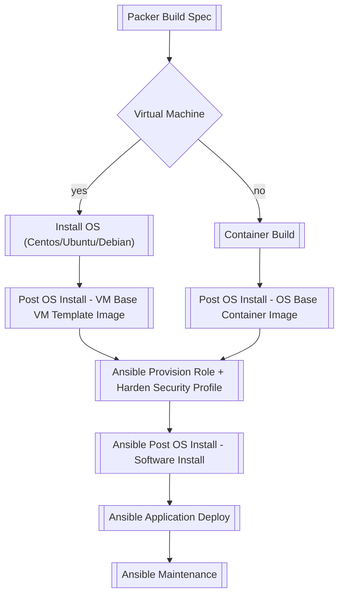

# Images Templates

The following diagram presents an overview of the image creation process relating to both virtual machines and container images:

## Bootstrapping Virtual Machine Templates

The [bootstrap_vm_template.yml](./../bootstrap_vm_template.yml) playbook is used by [vm-templates repo](https://github.com/lj020326/vm-templates) to build VMware Ubuntu, Debian, and Centos templates. 

The 'ansible' and 'vm template build' pipelines are both automated using the [pipeline-automation-lib](https://github.com/lj020326/pipeline-automation-lib/) jenkins library.
