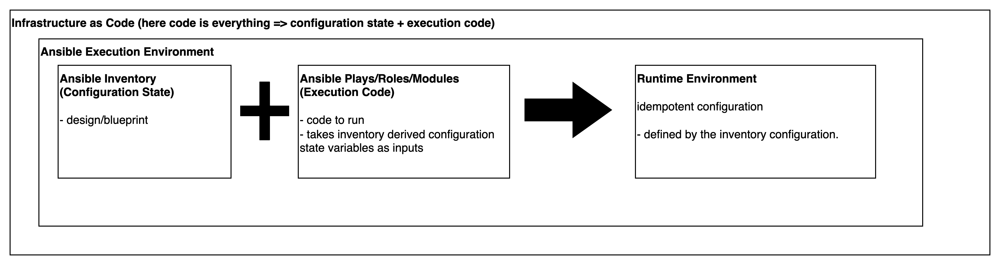
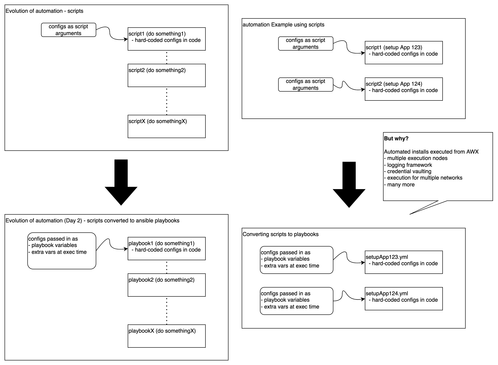
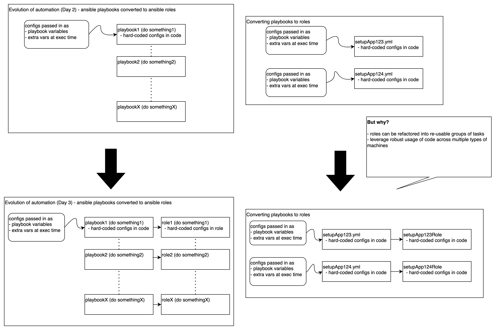
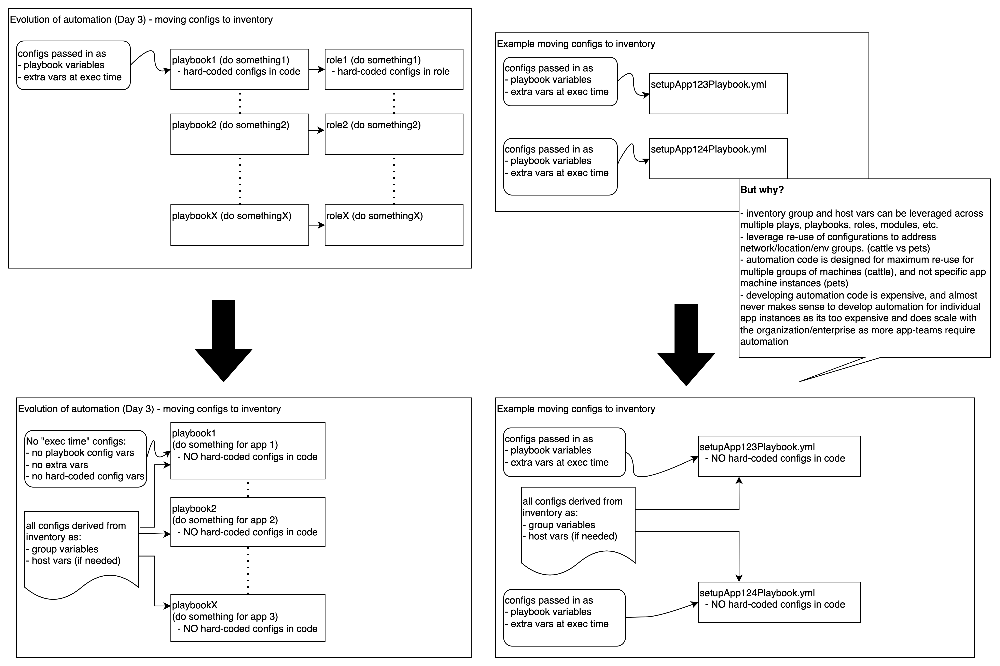
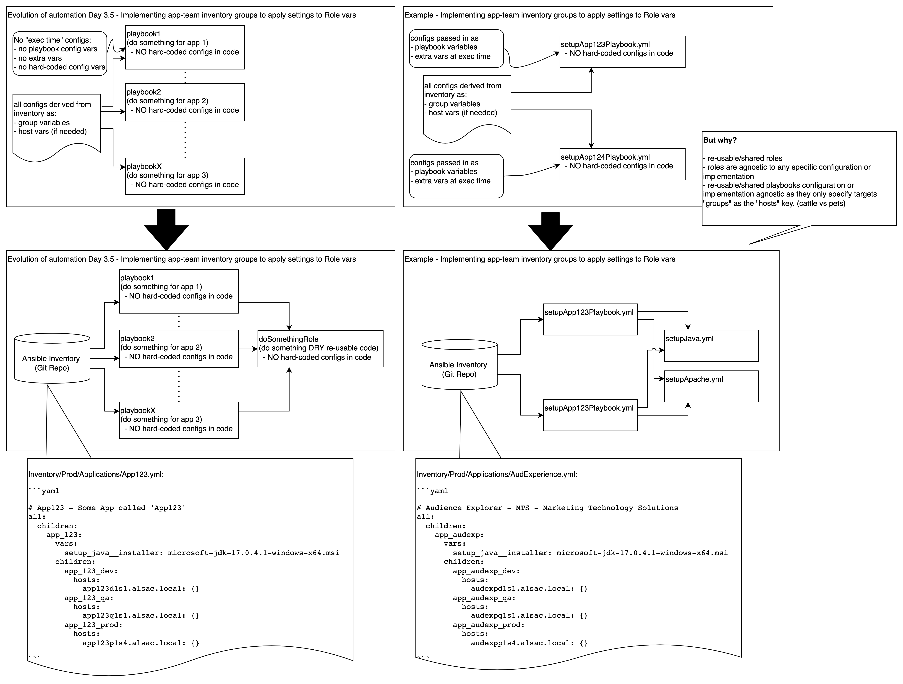
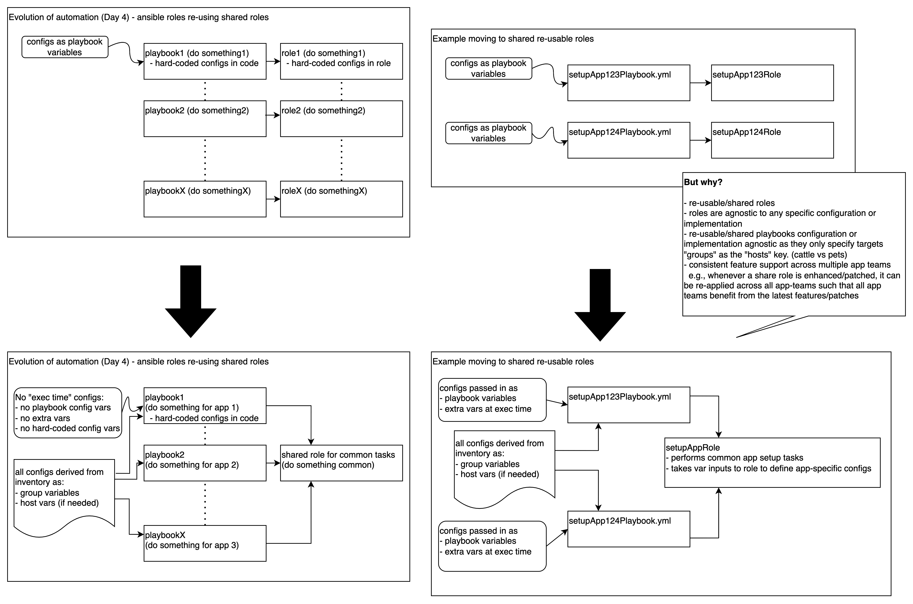
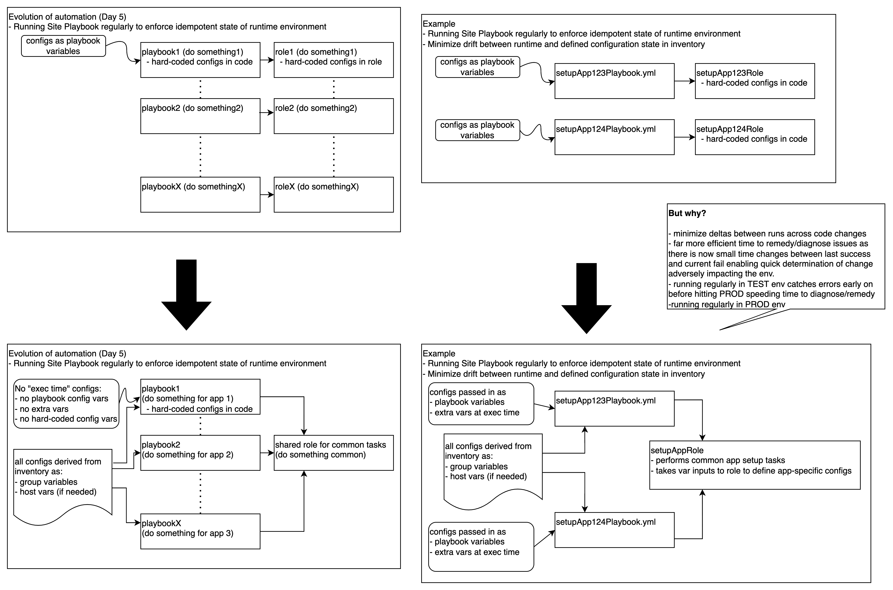
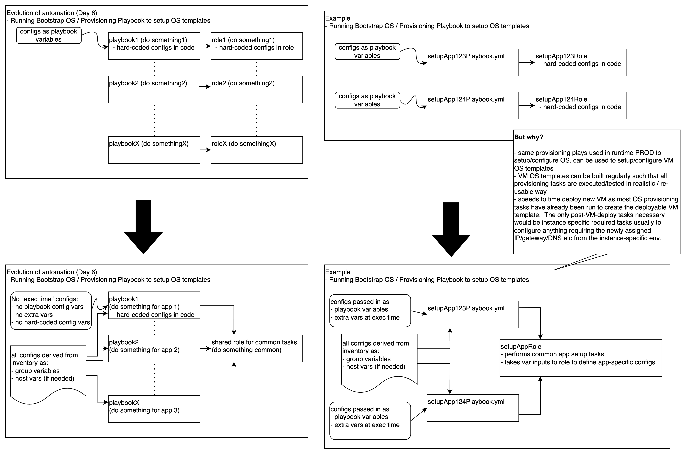
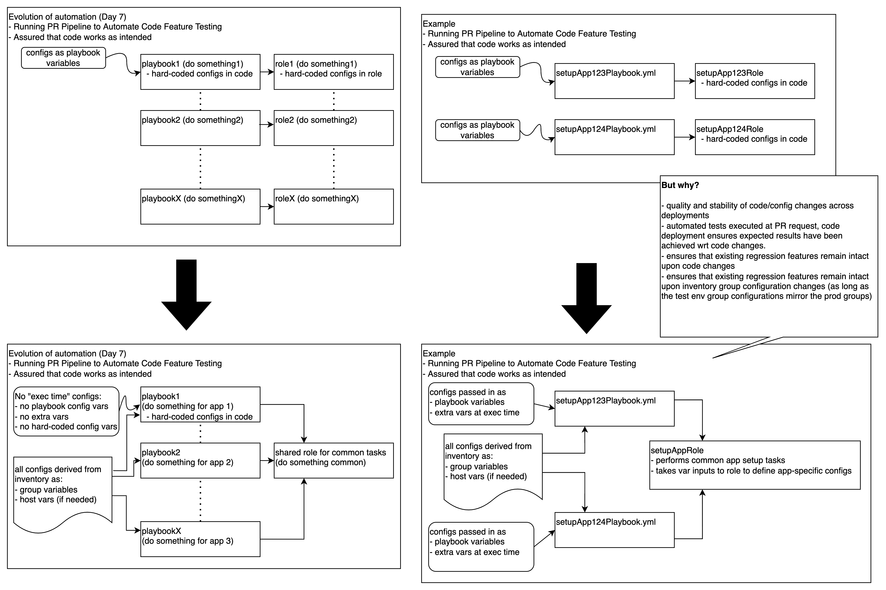

# Infrastructure as Code (IaC)

## Audience

The content is relevant to any/all infrastructure as code (IaC) development team(s).

In an enterprise IT environment, these developers/software engineers are normally scoped into the following teams:

1) Automation Software Engineering
2) DevOps Engineering
3) Network Engineering
4) Storage Engineering
5) DB Engineering
6) Middleware Engineering
7) Platform Engineering
8) Cloud Infra/Platform Automation
9) Application Deployment/Integration Teams (AppDev, Product, etc usually in a user self-service format)
10) Others...

### Adhering to development standards and processes

"DevOps" by definition means developers that develop "ops code".

Meaning all infrastructure "DevOps" teams should consider themselves as another development team.

"DevOps" teams have to hold themselves to the same development principals, standards and processes.

In fact, "DevOps" teams are held to even higher standards, since the infrastructure automation use cases are shared across the enterprise/organization with the highest expectations for:

* security
* stability
* quality
* risk

## Infrastructure domains 

The infrastructure automation spans infrastructure domains including:

* Network Hardware
  - f5
  - cisco
  - meraki
  - juniper
  - other/etc

* Storage Hardware
  - Dell
  - HP
  - NetGear
  - QNAP
  - NetApp
  - IBM
  - etc

* Compute Hardware OS (HW)
  - Dell idrac
  - HPE iLo
  - Supermicro ipmi
  - DC compute other
    - ssh (linux)
    - ntlm/winrm (windows)

* Hypervisor OS 
  - vmware ESX
  - vmware vcenter server appliance (VCSA) (Photon)
  - hyperv (Windows Server 2019)

* Compute Operating Systems (OS) 
  - redhat (RHEL/LNX)
  - windows (WIN)

* Software (SW)
  - database
  - client/server
    - postfix
    - ntp
    - ldap
    - many others
  - middleware application
    - weblogic
    - websphere
    - jboss
    - IIS/dotnet
    - other
  - application

* Virtual Networks
  - vmware vswitch
  - openstack vswitch

* Container Platforms 
  - Openshift
  - Kubernetes(k8s)
  - Docker swarm
  - Mesosphere
  - etc

* Cloud Infra as a Service (IaaS)
  * Amazon AWS
  * MS Azure
  * Google GCP
  * others

* Cloud Platform as a Service (PaaS)
  * Heroku
  * Netlify

* Cloud Edge/Routing Services
  * Akamai
  * Cloudflare

## Goals/Objectives

Infrastructure as Code is an automation development framework that seeks to:

### Goal 1: automate routine infrastructure tasks 

The infrastructure automation spans routine tasks including:

* install
* configuration
* patching
* upgrades
* operational
* etc/other

### Goal 2: Store all code in online code repositories

Store all code for intended/designed inventory configuration state and execution code in online repository.

Examples here include bitbucket, github, etc... 

### Goal 3: separate configuration state from runtime execution code

### Goal 4: PR requests into online code repository triggers Quality Gate checks

Quality gate checks including:

1) code quality/linting checks
2) automated integration testing

### Goal 5:  upon successful quality gate checks, automated promotion to the next upper environment

At a high level, the Software Development Lifecycle (SDLC), code development/deployment observes the following path:

1) develop code in a development environment (DEV)
2) test code in a fixed production-like environment (TEST/QA)
3) deploy code into the production environment (PROD)

## Automation Scopes, Patterns and Use Cases

When designing, developing and testing automation code, abstracting the usage pattern requirements to be automated is essential.
As such, processes are used to design, develop, and test/verify the related automation such that the code is highly re-usable and can readily be tested given different pattern/domain usages.

At a high level, infrastructure automations usually observe the following patterns:

### Scope 1: Client / Server SW Deployments 

Many use cases require network-specific servers/fixtures/assets to be setup to serve/enable clients for respective network groups within an enterprise.

Some example use cases involving servers within networks serving clients machines in the respective networks:

- router/gateways/firewalls
- dns servers
- ntp servers
- ldap servers
- postfix servers
- nfs servers
- archive servers (apache archiva, jfrog artifactory, sonatype nexus, etc)
- source code repo (bitbucket, gitlab, gitea, etc)
- etc (many other similar software network/client domain use cases)

### Scope 2: Basic App Setup

### Scope 3: Application Cluster Setup

### Scope 4: Application Cluster Multi-DC Setup

### Scope 5: VMware ESX Setups

### Scope 6: VM OS Instance Setups

### Scope 7: VM hosting Multi-tenant Application Setups

### Scope 8: Baremetal / Below Control Plane Setups

### Scope 9: Cloud Based Inventory Setups

### Scope 10: VM OS Template Setups

### Scope 11: Others/Specialized Use Cases/Domains (many more)

## Ansible Evolutionary Steps

### Step 1: Scripts to Ansible Playbooks

### Step 2: Ansible Playbooks to Roles

### Step 3: Config State to Ansible Inventory

### Step 4: Implementing Application Team groups for setting role based variables

### Step 5: Shared/Re-usable Roles

### Step 6: Periodic/Regular Running of Key Complete Idempotent Plays

### Step 7: Using Bootstrap OS Provisioning Plays to create VM OS Templates

### Step 8: Running PR Pipelines to Automate Code Feature Testing 

  This will assure that code works as intended enabling high-quality code deployments.

### Step 9: many more...

