# Jenkins Ansible Jobs

This section describes how to utilize Jenkins as the job controller for running the `ansible-datacenter` site plays.

## Job Configuration

The 'ansible' and 'vm template build' pipelines are both automated using the [pipeline-automation-lib](https://github.com/lj020326/pipeline-automation-lib/) Jenkins library.

## Setup jenkins to run ansible site plays

### Ansible role to setup docker jenkins control node

An ansible role is used to setup all docker stack instances.

The `bootstrap_docker_stack` ansible role used to stand up the docker stack [can be found here](https://github.com/lj020326/ansible-datacenter/tree/main/roles/bootstrap_docker_stack).

The [`bootstrap_docker_stack` ansible role](https://github.com/lj020326/ansible-datacenter/tree/main/roles/bootstrap_docker_stack) contains the [__jenkins config-as-code (jcac) yaml definition__](https://github.com/lj020326/ansible-datacenter/blob/main/roles/bootstrap_docker_stack/templates/jenkins_jcac/jenkins_casc.yml.j2) in template form used to setup the jenkins jcac instance.

[The jcac definition can be found here](https://github.com/lj020326/ansible-datacenter/blob/main/roles/bootstrap_docker_stack/templates/jenkins_jcac/jenkins_casc.yml.j2).  

### Setup pipeline automation library used by all jenkins jobs

The pipeline automation library used can be found [here](https://github.com/lj020326/pipeline-automation-lib).
[The pipeline automation library](https://github.com/lj020326/pipeline-automation-lib) defines the shared jenkins templates that are used throughout all of the jenkins ansible pipelines.  

Configure the library in jenkins as seen below.
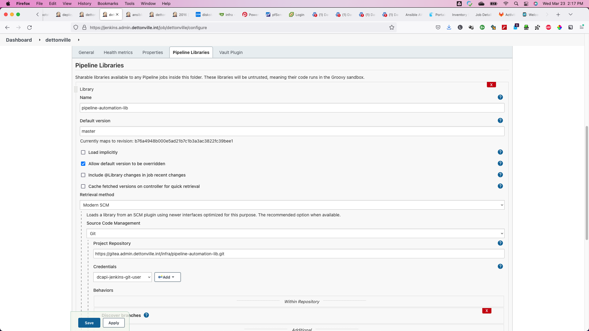

### Site Root folder

A root folder for the ansible-datacenter environment can be setup similar to the following.
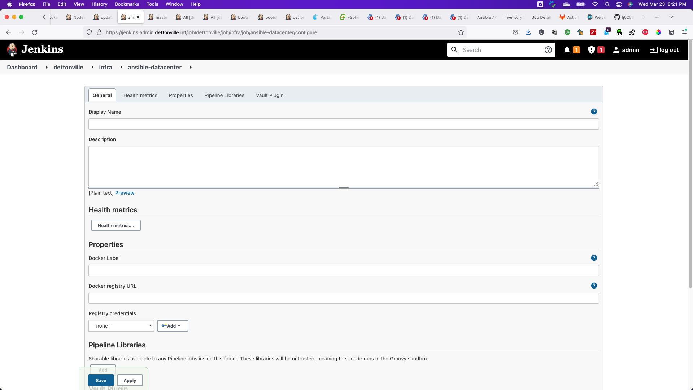

### Ansible Vault file credential

Setup the ansible vault file credential to be used by the ansible playbook pipeline and passed into every play.
If using the aforementioned [pipeline-automation-library](https://github.com/lj020326/pipeline-automation-lib), make sure the credential ID is 'ansible-vault-pwd-file'.
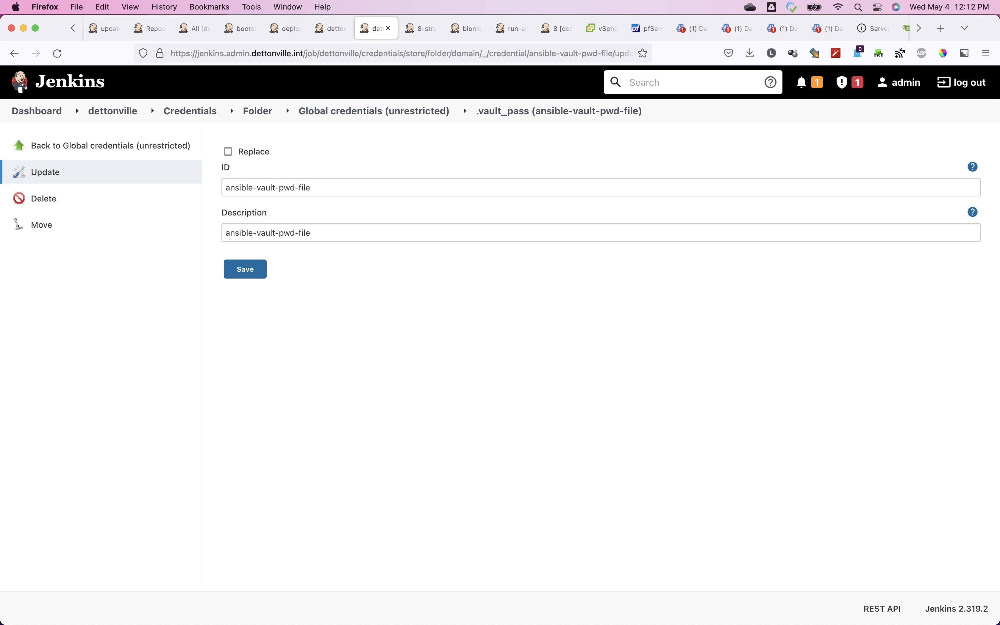

### Inventory Environment folders

Then setup folders for each environment defined in the inventory similar to the following.
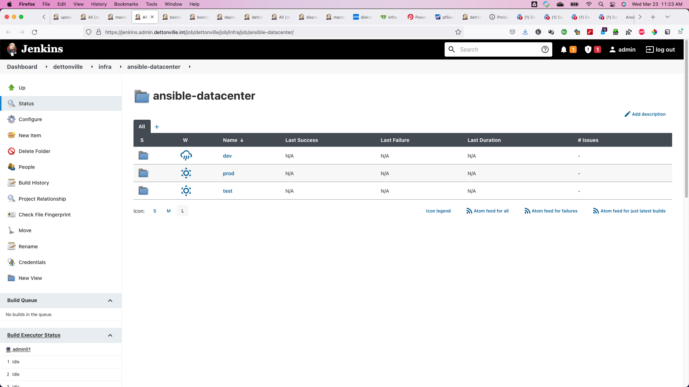

### Jenkins Pipelines to run Ansible tags

Each job folder corresponds to a tag defined in the site.yml playbook.
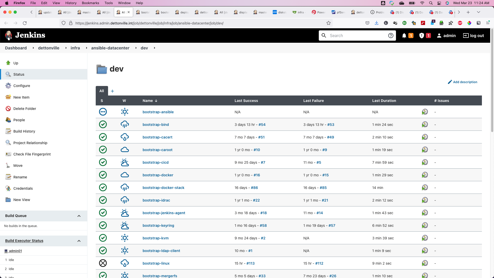

To make setting up each folder consistent and simple as possible, the jobs all are exactly the same except the folder name.
The job folders all use the same pipeline definition as seen below.  Using this method, whenever a new ansible tag is created, adding a corresponding jenkins job folder is as easy as copying an existing one and naming it respectively to match the newly created ansible tag. 
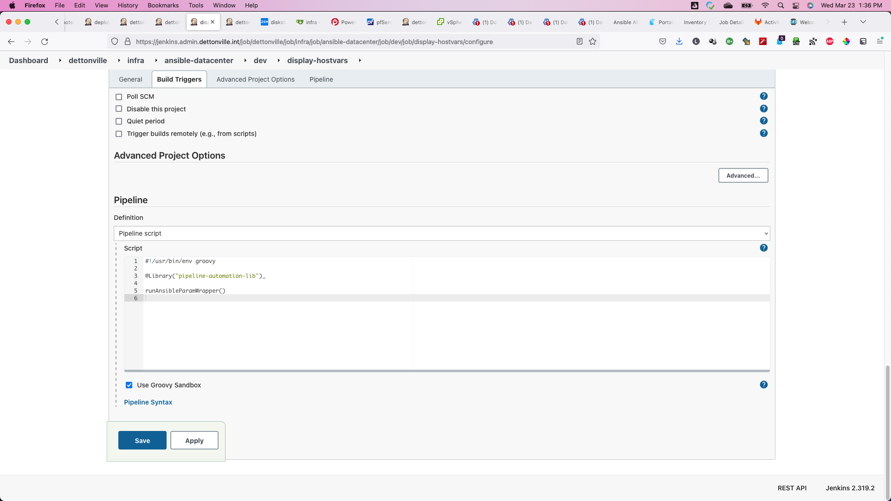

### Ansible Pipeline Parameters

All jobs use the same 2 parameters for the limit hosts directive and debug.
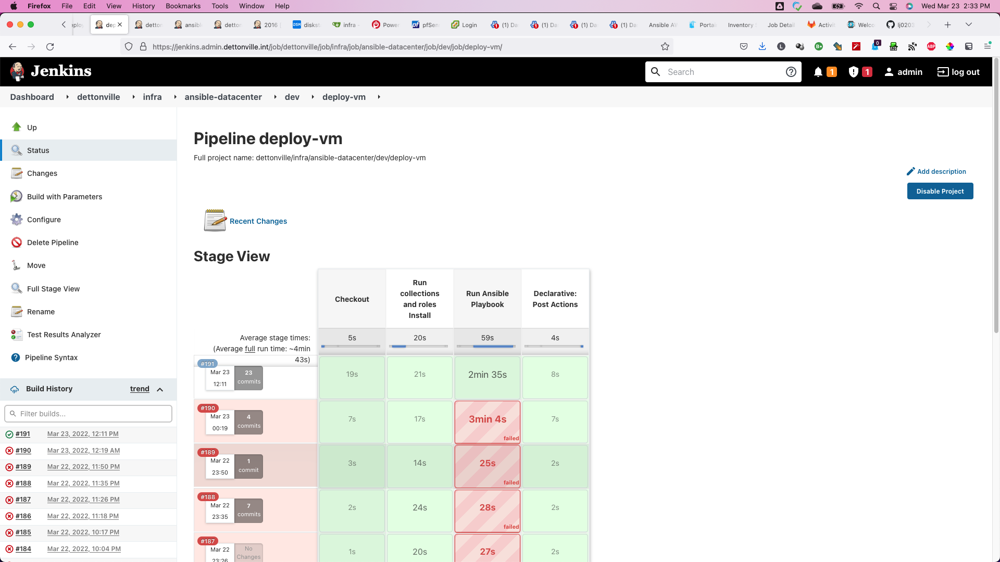

### Run for defined site.yml tags

The job history for the tag execution is readily/easily viewable.
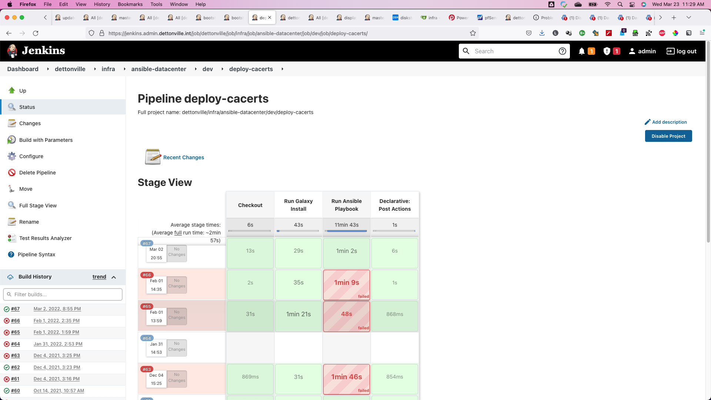

Here is the bootstraps linux job history.
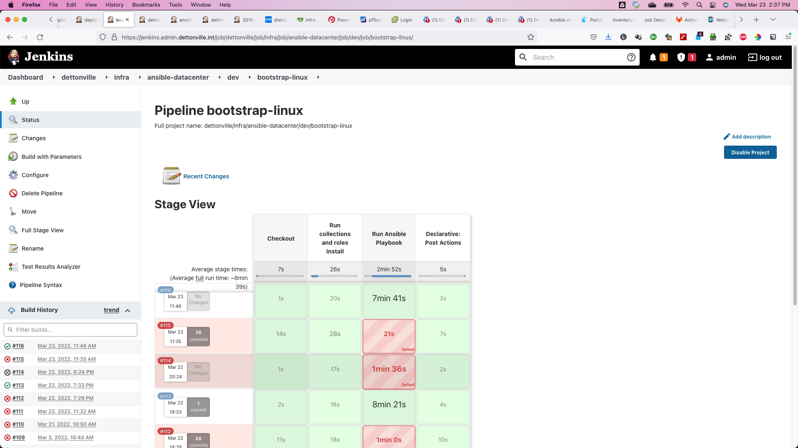

Specify host(s) or leave blank to run across all hosts for the group(s) defined for the play(s) associated with the tag.
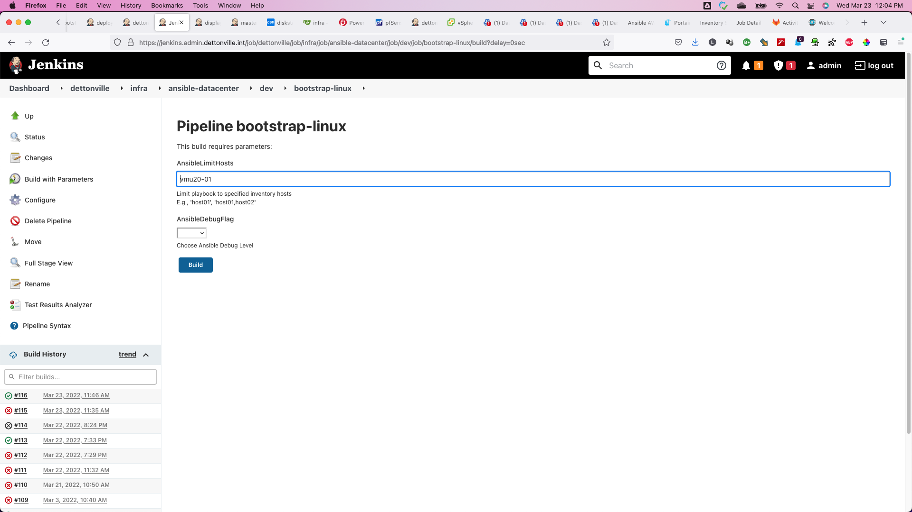

See the job console for all ansible pipeline input values and play output.
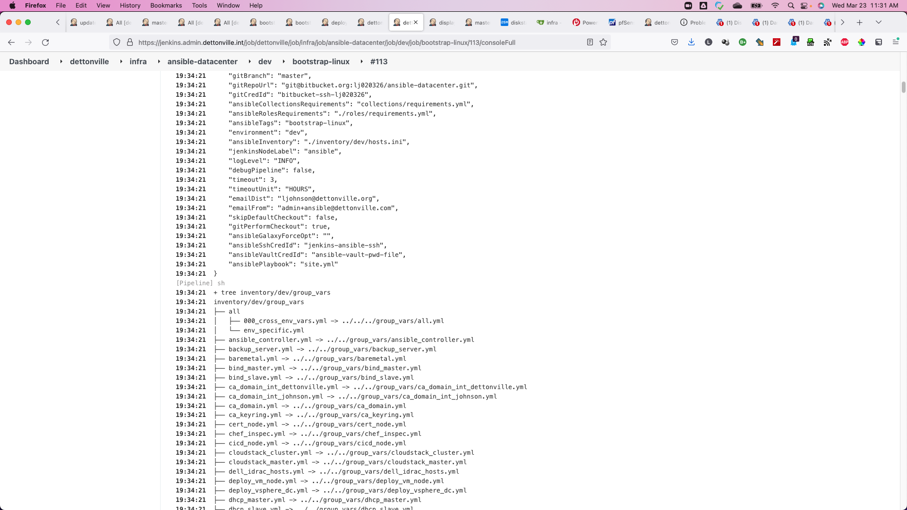

The [pipeline job console output](./img/screenshots/ansible-datacenter-3d-bootstrap-linux-console.md).

Another job just created to bootstrap docker stacks onto machines.
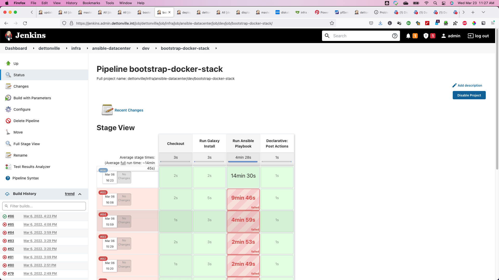

## Ansible Role Development Pipelines

### Role Development Root Folder

Setup root folder.
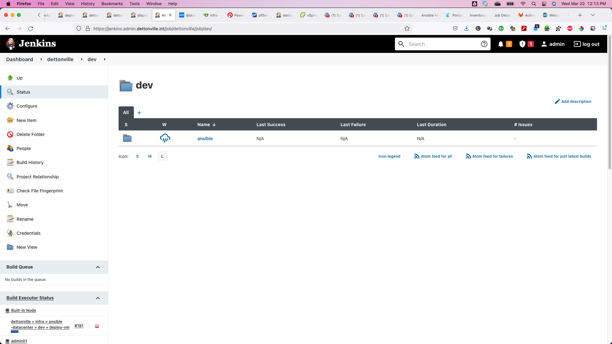

### Role Development Root Folder

Setup jenkins CICD pipeline folders for each repository.
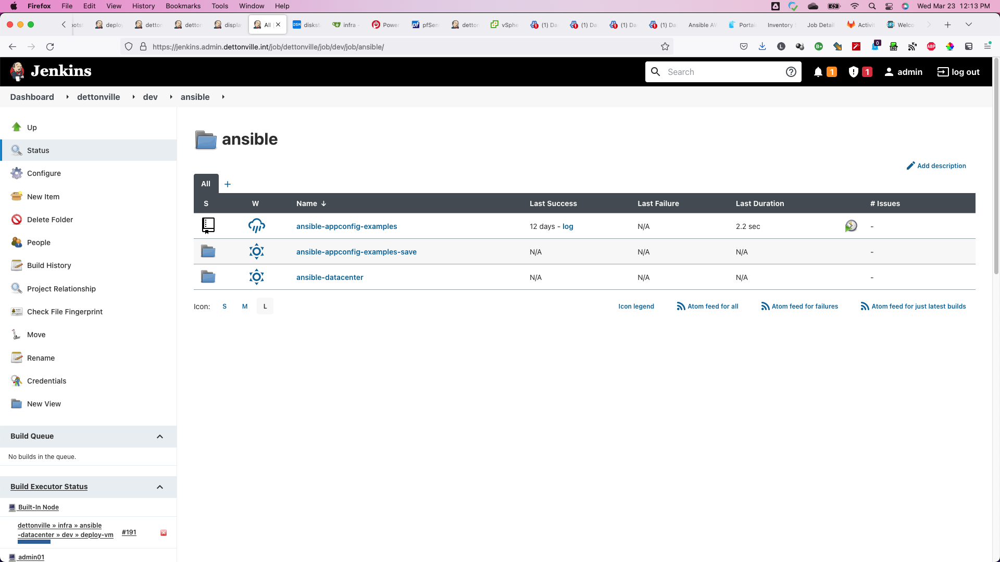

The jenkins CICD branch strategy folder is used to automatically pick up the respective branches and merge strategy.
We are using a clone of the [public ansible repo here](https://github.com/lj020326/ansible-configvars-examples). 
Once the pipeline is configured with the repo, jenkins will scan the repo branches for the existance of the Jenkinsfile and then setup the corresponding branch folders used to run ansible for each branch.
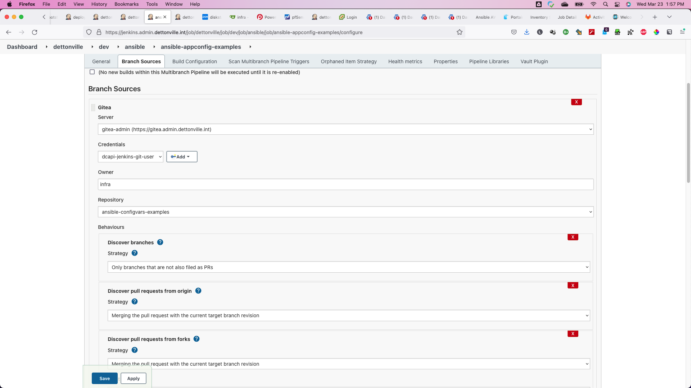

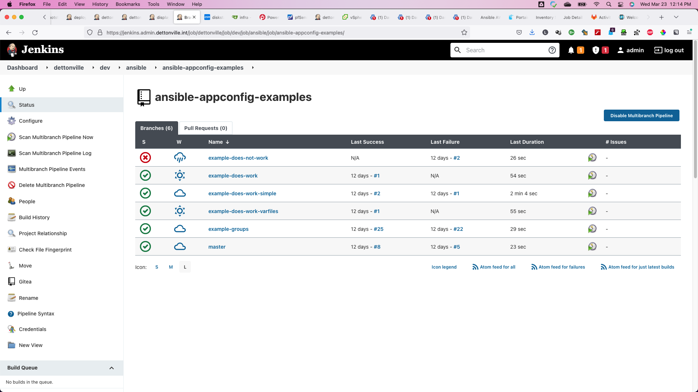

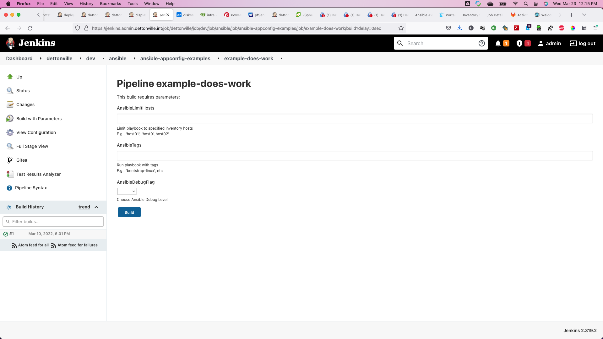

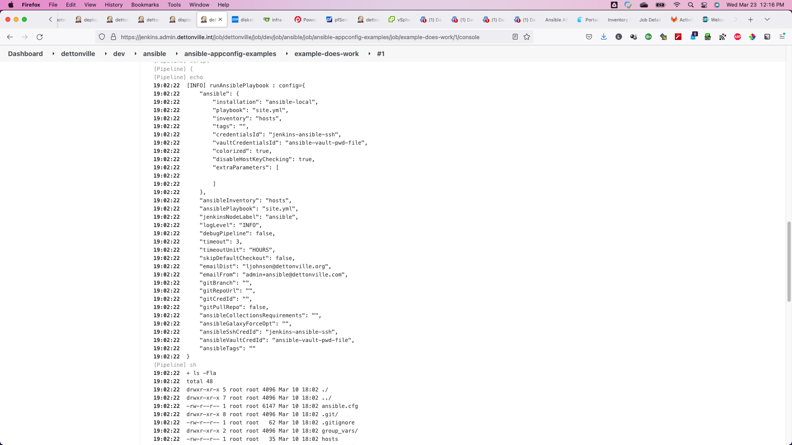
