# How To Automate Jenkins Job Configuration Using Job DSL

### Introduction

[Jenkins](https://jenkins.io/) is a popular automation server, often used to orchestrate [continuous integration (CI) and continuous deployment (CD)](https://www.digitalocean.com/community/tutorials/an-introduction-to-continuous-integration-delivery-and-deployment) workflows. However, the process of setting up Jenkins itself has traditionally been a manual, siloed process for the system administrator. The process typically involves installing dependencies, running the Jenkins server, configuring the server, defining pipelines, and configuring jobs.

Then came the _Everything as Code (EaC)_ paradigm, which allowed administrators to define these manual tasks as declarative code that can be version-controlled and automated. In previous tutorials, we covered how to [define Jenkins pipelines as code using `Jenkinsfile`s](https://www.digitalocean.com/community/tutorials/how-to-set-up-continuous-integration-pipelines-in-jenkins-on-ubuntu-16-04), as well as how to [install dependencies and define configuration of a Jenkins server as code using Docker and JCasC](https://www.digitalocean.com/community/tutorials/how-to-automate-jenkins-setup-with-docker-and-jenkins-configuration-as-code). But using only Docker, JCasC, and pipelines to set up your Jenkins instance would only get you so far—these servers would not come pre-loaded with any jobs, so someone would still have to configure them manually. The [Job DSL](https://plugins.jenkins.io/job-dsl) plugin provides a solution, and allows you to configure Jenkins jobs as code.

In this tutorial, you’ll use Job DSL to configure two demo jobs: one that prints a `'Hello World'` message in the console, and one that runs a pipeline from a Git repository. If you follow the tutorial to the end, you will have a minimal Job DSL script that you can build on for your own use cases.

## Prerequisites

To complete this tutorial, you will need:

-   A Jenkins server set up either via the setup wizard, or by using Jenkins Configuration as Code (JCasC). If you don’t have a Jenkins server you can experiment with, you can follow our other guides to [install Jenkins on Ubuntu](https://www.digitalocean.com/community/tutorials/how-to-install-jenkins-on-ubuntu-20-04), on [Kubernetes](https://www.digitalocean.com/community/tutorials/how-to-install-jenkins-on-kubernetes), or [with Docker and JCasC](https://www.digitalocean.com/community/tutorials/how-to-automate-jenkins-setup-with-docker-and-jenkins-configuration-as-code).

## Step 1 — Installing the Job DSL Plugin

The [Job DSL](https://plugins.jenkins.io/job-dsl) plugin provides the Job DSL features you’ll use in this tutorial for your demo jobs. In this step, you will install the Job DSL plugin.

First, navigate to `your_jenkins_url/pluginManager/available`. In the search box, type in `Job DSL`. Next, in the resulting plugins list, check the box next to **Job DSL** and click **Install without restart**.

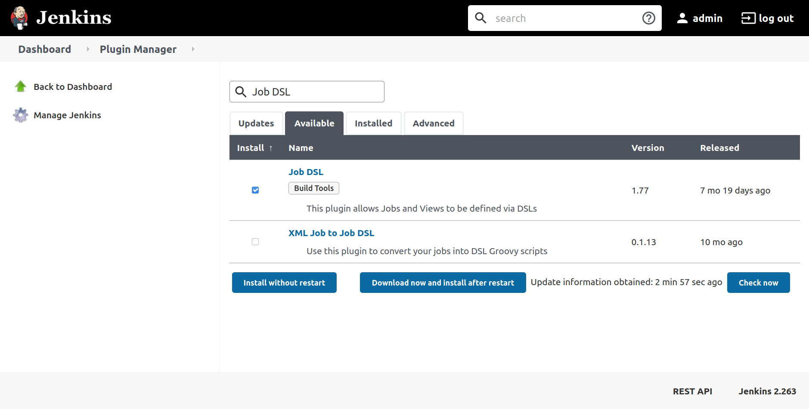

**Note:** If searching for `Job DSL` returned no results, it either means the Job DSL plugin is already installed, or that your Jenkin server’s plugin list is not updated.

You can check if the Job DSL plugin is already installed by navigating to `your_jenkins_url/pluginManager/installed` and searching for `Job DSL`.

You can update your Jenkins server’s plugin list by navigating to `your_jenkins_url/pluginManager/available` and clicking on the **Check Now** button at the bottom of the (empty) plugins list.

After initiating the installation process, you’ll be redirected to a page that shows the progress of the installation. Wait until you see **Success** next to both **Job DSL** and **Loading plugin extensions** before continuing to the next step.

You’ve installed the Job DSL plugin. You are now ready to use Job DSL to configure jobs as code. In the next step, you will define a demo job inside a Job DSL script. You’ll then incorporate the script into a seed job, which, when executed, will create the jobs defined.

## Step 2 — Creating a Seed Job

The _seed job_ is a normal Jenkins job that runs the Job DSL script; in turn, the script contains instructions that create additional jobs. In short, the seed job is a job that creates more jobs. In this step, you will construct a Job DSL script and incorporate it into a seed job. The Job DSL script that you’ll define will create a single freestyle job that prints a `'Hello World!'` message in the job’s console output.

A Job DSL script consists of API methods provided by the Job DSL plugin; you can use these API methods to configure different aspects of a job, such as its type (freestyle versus pipeline jobs), build triggers, build parameters, post-build actions, and so on. You can find all supported methods on the [API reference site](https://jenkinsci.github.io/job-dsl-plugin/).

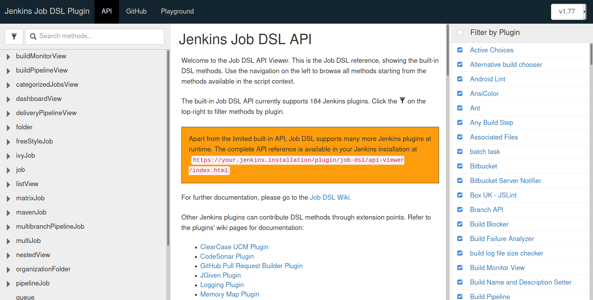

By default, the site shows the API methods for job configuration settings that are available as part of the core Jenkins installation, as well as settings that are enabled by 184 supported plugins (accurate as of `v1.77`). To get a clearer picture of what API methods the Job DSL plugin provides for only the core Jenkins installation, click on the funnel icon next to the search box, and then check and uncheck the **Filter by Plugin** checkbox to deselect all the plugins.

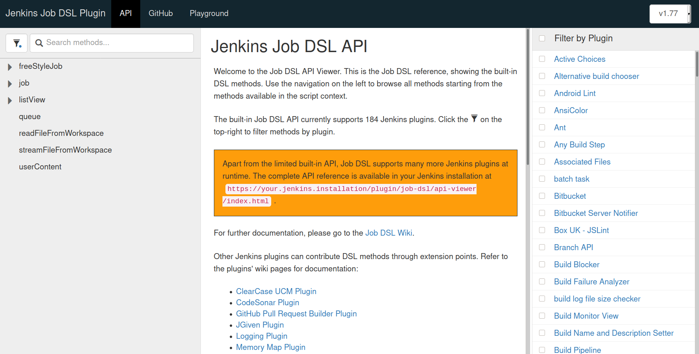

The list of API methods are now significantly reduced. The ones that remain would work even if the Jenkins installation had no plugins installed apart from the Job DSL plugin.

For the ‘Hello World’ freestyle job, you need the `job` API method (`freeStyleJob` is an alias of `job` and would also work). Let’s navigate to the [documentation for the `job` method](https://jenkinsci.github.io/job-dsl-plugin/#path/job).

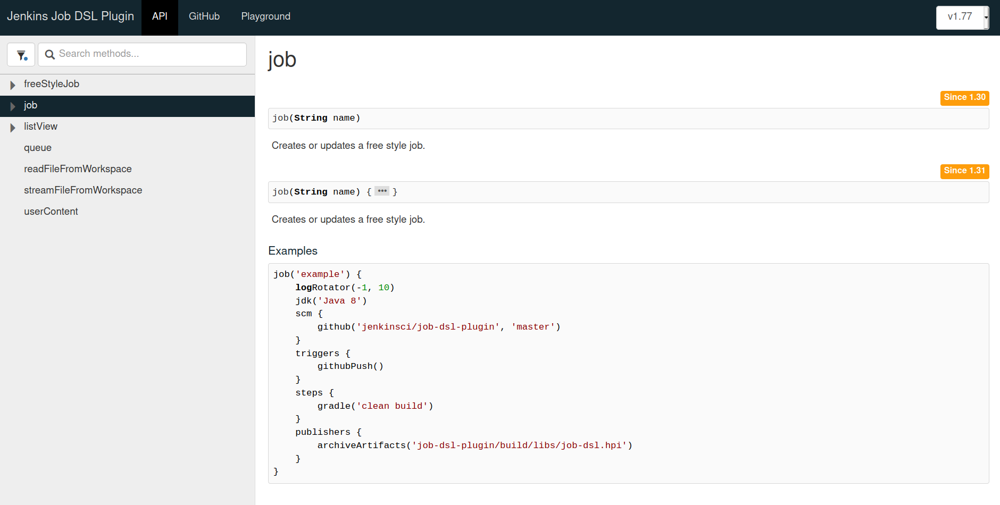

Click the ellipsis icon (`…`) in `job(String name) { … }` to show the methods and blocks that are available within the `job` block.

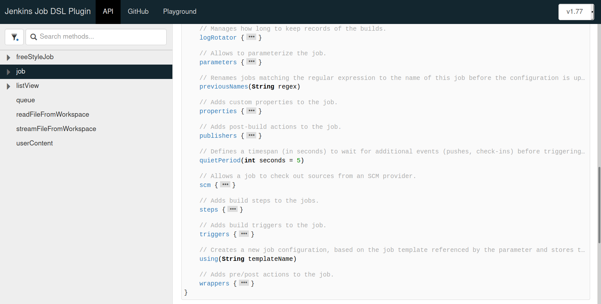

Let’s go over some of the most commonly used methods and blocks within the `job` block:

-   `parameters`: setting parameters for users to input when they create a new build of the job.
-   `properties`: static values that are to be used within the job.
-   `scm`: configuration for how to retrieve the source code from a source-control management provider like GitHub.
-   `steps`: definitions for each step of the build.
-   `triggers`: apart from manually creating a build, specifies in what situations the job should be run (for example, periodically like a [cron job](https://www.digitalocean.com/community/tutorials/how-to-use-cron-to-automate-tasks-ubuntu-1804), or after some events like a push to a GitHub repository).

You can further expand child blocks to see what methods and blocks are available within. Click on the ellipsis icon (`…`) in `steps { … }` to uncover the `shell(String command)` method, which you can use to run a shell script.

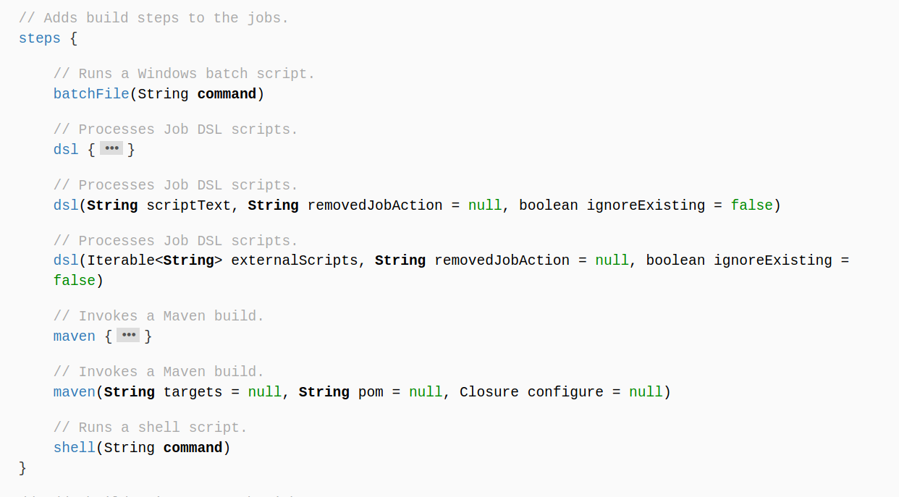

Putting the pieces together, you can write a Job DSL script like the following to create a freestyle job that, when run, will print `'Hello World!'` in the output console.

To run the Job DSL script, we must first incorporate it into a seed job.

To create the seed job, go to `your_jenkins_url`, log in (if necessary), click the **New Item** link on the left of the dashboard. On the screen that follows, type in `seed`, select **Freestyle project**, and click **OK**.

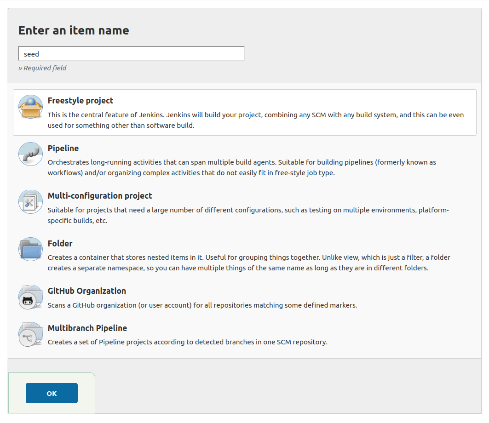

In the screen that follows, scroll down to the **Build** section and click on the **Add build step** dropdown. Next select **Process Job DSLs**.

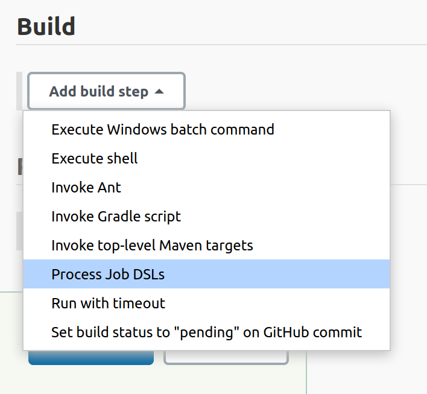

Then, click on the radio button next to **Use the provided DSL script**, and paste the Job DSL script you wrote into the **DSL Script** text area.

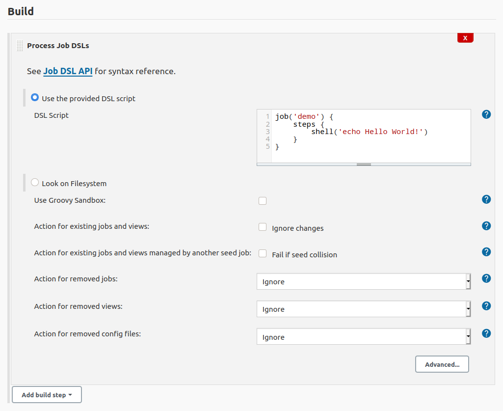

Click **Save** to create the job. This will take you to the `seed` job page.

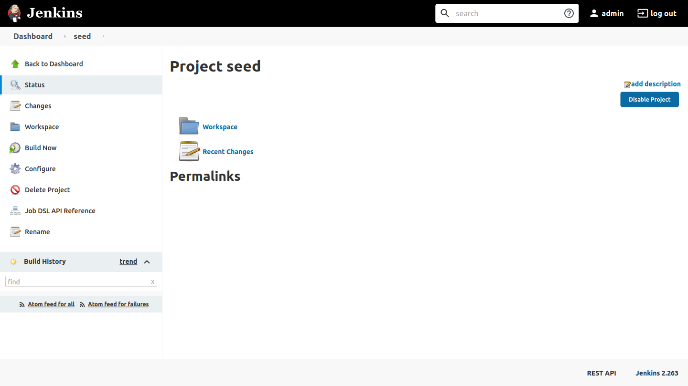

Then, navigate to `your_jenkins_url` and confirm that the `seed` job is there.

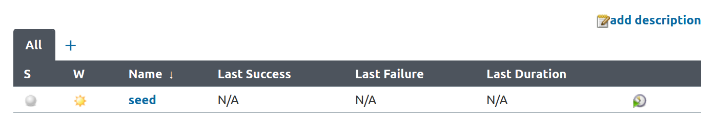

You’ve successfully created a seed job that incorporates your Job DSL script. In the next step, you will run the seed job so that new jobs are created based on your Job DSL script.

## Step 3 — Running the Seed Job

In this step, you will run the seed job and confirm that the jobs defined within the Job DSL script are indeed created.

First, click back into the `seed` job page and click on the **Build Now** button on the left to run the `seed` job.

Refresh the page and you’ll see a new section that says **Generated Items**; it lists the `demo` job that you’ve specified in your Job DSL script.

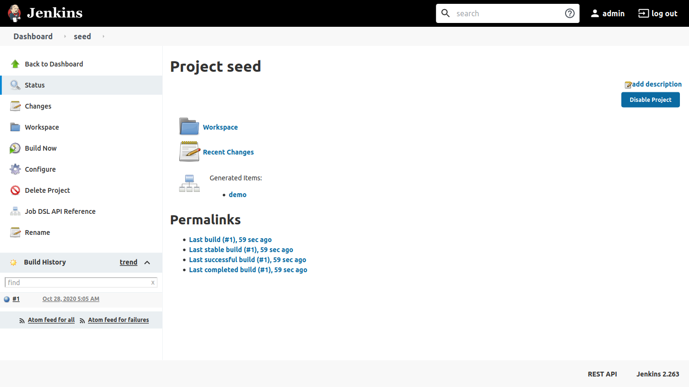

Navigate to `your_server_ip` and you will find the `demo` job that you specified in the Job DSL script.

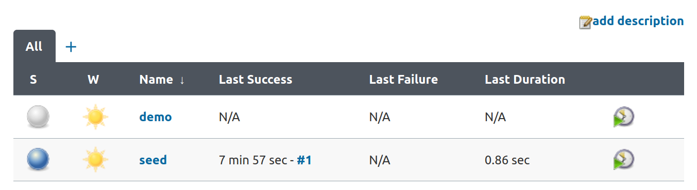

Click the **demo** link to go to the `demo` job page. You’ll see **Seed job: seed**, indicating that this job is created by the `seed` job. Now, click the **Build Now** link to run the `demo` job once.

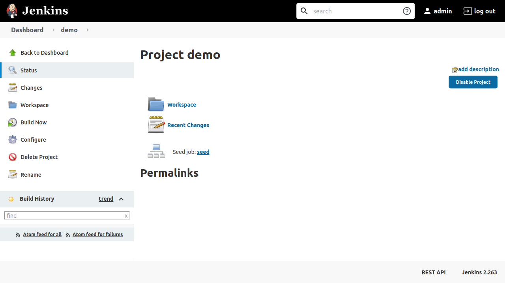

This creates an entry inside the **Build History** box. Hover over the date of the entry to reveal a little arrow; click on it to reveal the dropdown. From the dropdown, choose **Console Output**.

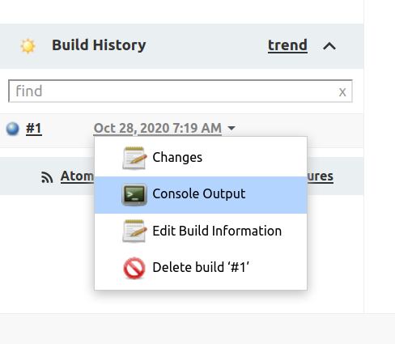

This will bring you the logs and console output from this build. In it, you will find the line `+ echo Hello World!` followed by `Hello World!`, which corresponds to the `shell('echo Hello World!')` step in your Job DSL script.

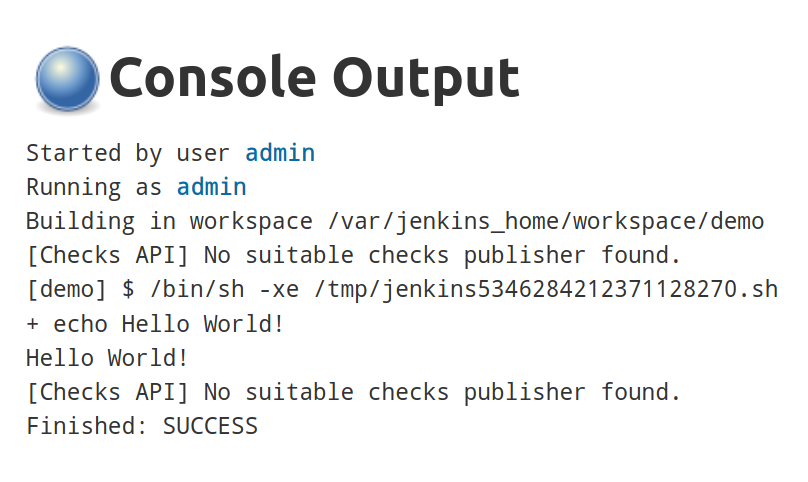

You’ve run the `demo` job and confirmed that the `echo` step specified in the Job DSL script was executed. In the next and final step, you will be modifying and re-applying the Job DSL script to include an additional pipeline job.

## Step 4 — Defining Pipeline Jobs

In line with the Everything as Code paradigm, more and more developers are choosing to define their builds as [pipeline](https://www.jenkins.io/doc/book/pipeline/) jobs—those that use a pipeline script (typically named `Jenkinsfile`)—instead of freestyle jobs. The `demo` job you’ve defined so far is a small demonstration. In this step, you will define a more realistic job that pulls down a Git repository from GitHub and run a pipeline defined in one of its pipeline scripts.

For Jenkins to pull a Git repository and build using pipeline scripts, you’ll need to install additional plugins. So, before you make any changes to the Job DSL script, first make sure that the required plugins are installed.

Navigate to `your_jenkins_url/pluginManager/installed` and check the plugins lists for the presence of the [Git](https://plugins.jenkins.io/git/), [Pipeline: Job](https://plugins.jenkins.io/workflow-job/), and [Pipeline: Groovy](https://plugins.jenkins.io/workflow-cps/) plugins. If any of them are not installed, go to `your_jenkins_url/pluginManager/available` and search for and select the plugins, then click **Install without restart**.

Now that the required plugins are installed, let’s shift our focus to modifying your Job DSL script to include an additional pipeline job.

We will be defining a pipeline job that pulls the code from the public [`jenkinsci/pipeline-examples`](https://github.com/jenkinsci/pipeline-examples) Git repository and run the [`environmentInStage.groovy`](https://github.com/jenkinsci/pipeline-examples/blob/4af47ea76232588c01f3abac1677e22e09645d33/declarative-examples/simple-examples/environmentInStage.groovy) declarative pipeline script found in it.

Once again, navigate to the [Jenkins Job DSL API Reference](https://jenkinsci.github.io/job-dsl-plugin/), click the funnel icon to bring up the **Filter by Plugin** menu, then deselect all the plugins except **Git**, **Pipeline: Job**, and **Pipeline: Groovy**.

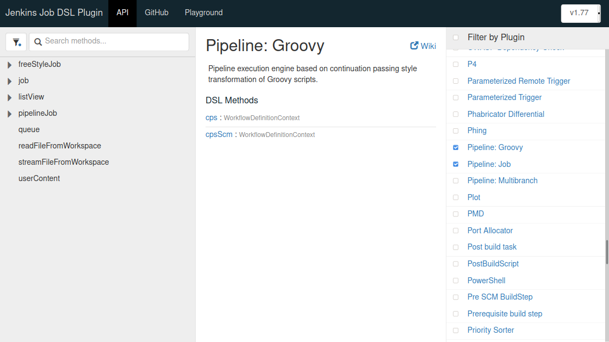

Click on **pipelineJob** on the left-hand side menu and expand the `pipelineJob(String name) { … }` block, then, in order, the `definition { … }`, `cpsScm { … }`, and `scm { … }` blocks.

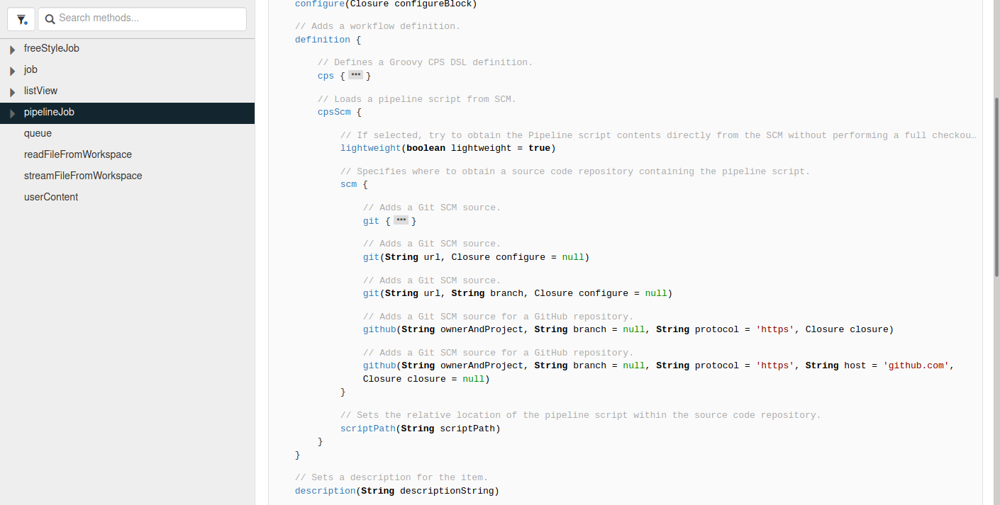

There are comments above each API method that explain their roles. For our use case, you’d want to define your pipeline job using a pipeline script found inside a GitHub repository. So you’d need to modify your Job DSL script as follows:

To make the change, go to `your_jenkins_url/job/seed/configure` and find the **DSL Script** text area, and replace the contents with your new Job DSL script. Then press **Save**. In the next screen, click on **Build Now** to re-run the seed job.

Then, go to the Console Output page of the new build and you’ll find `Added items: GeneratedJob{name='github-demo'}`, which means you’ve successfully added the new pipeline job, whilst the existing job remains unchanged.

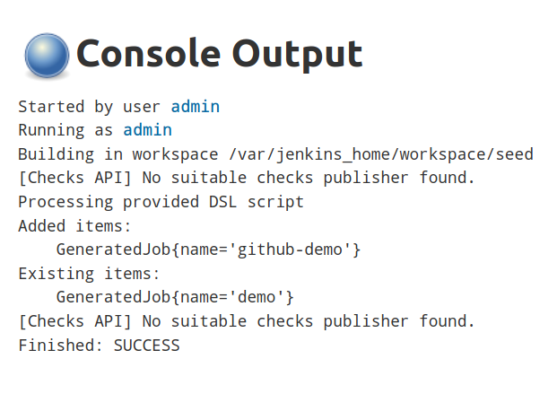

You can confirm this by going to `your_jenkins_url`; you will find the `github-demo` job appear in the list of jobs.

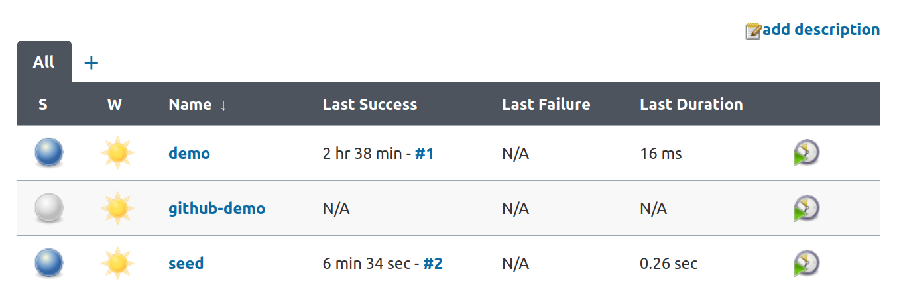

Finally, confirm that your job is working as intended by navigating to `your_jenkins_url/job/github-demo/` and clicking **Build Now**. After the build has finished, navigate to `your_jenkins_url/job/github-demo/1/console` and you will find the Console Output page showing that Jenkins has successfully cloned the repository and executed the pipeline script.

## Conclusion

In this tutorial, you’ve used the Job DSL plugin to configure jobs on Jenkins servers in a consistent and repeatable way.

But Job DSL is not the only tool in the Jenkins ecosystem that follows the Everything as Code (EaC) paradigm. You can also [deploy Jenkins as Docker containers and set it up using Jenkins Configuration as Code (JCasC)](https://www.digitalocean.com/community/tutorials/how-to-automate-jenkins-setup-with-docker-and-jenkins-configuration-as-code). Together, Docker, JCasC, Job DSL, and pipelines allow developers and administrators to deploy and configure Jenkins completely automatically, without any manual involvement.

## Reference

* https://www.digitalocean.com/community/tutorials/how-to-automate-jenkins-job-configuration-using-job-dsl
* https://devops.stackexchange.com/questions/11833/how-do-i-load-a-jenkins-shared-library-in-a-jenkins-job-dsl-seed#11862
* https://www.digitalocean.com/community/tutorials/how-to-automate-jenkins-setup-with-docker-and-jenkins-configuration-as-code
* https://wiki.jenkins.io/JENKINS/XML-Job-to-Job-DSL.html
* https://github.com/jenkinsci/job-dsl-plugin/wiki/Tutorial---Using-the-Jenkins-Job-DSL
* https://stackoverflow.com/questions/35898020/job-dsl-to-create-pipeline-type-job
* https://github.com/jenkinsci/job-dsl-plugin/wiki/Real-World-Examples
* https://stackoverflow.com/questions/69364938/error-creating-jobdsl-parameters-programatically
* https://plugins.jenkins.io/job-dsl
* 
