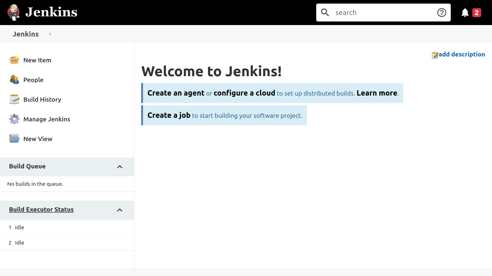
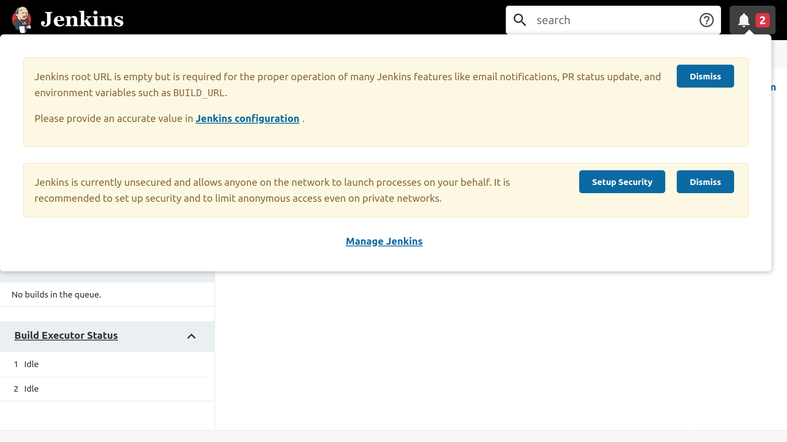
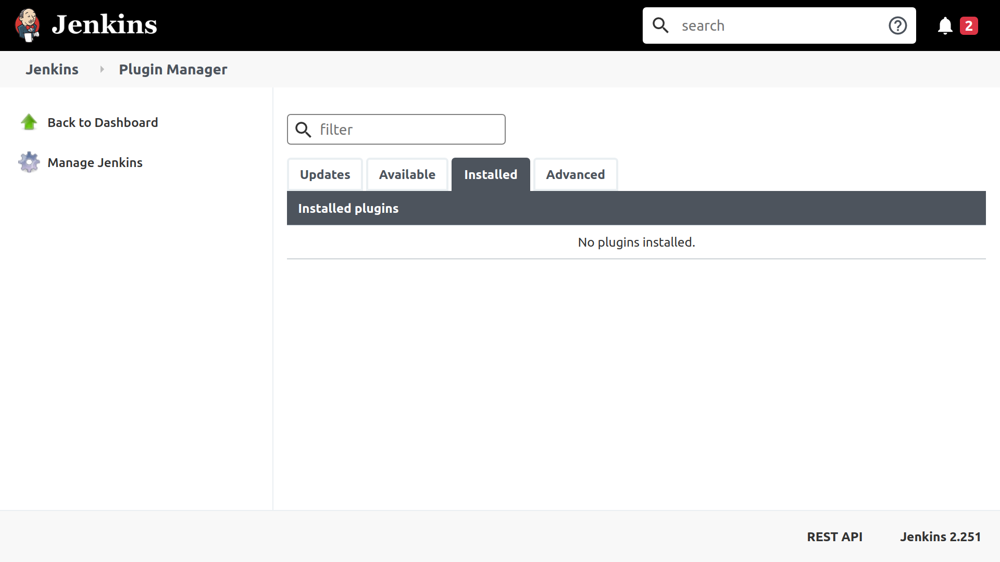
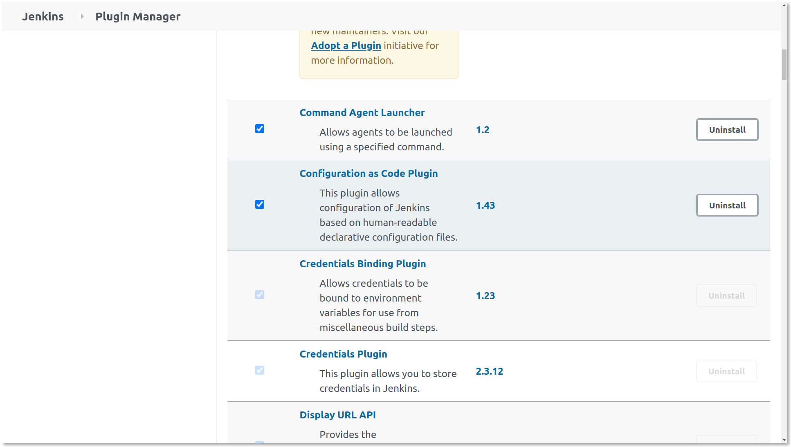
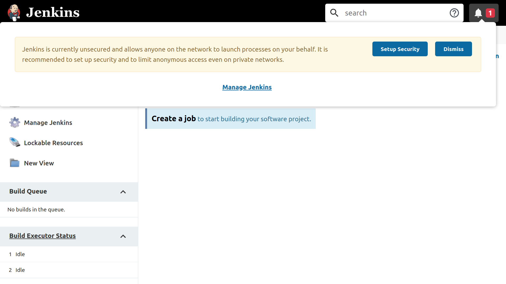
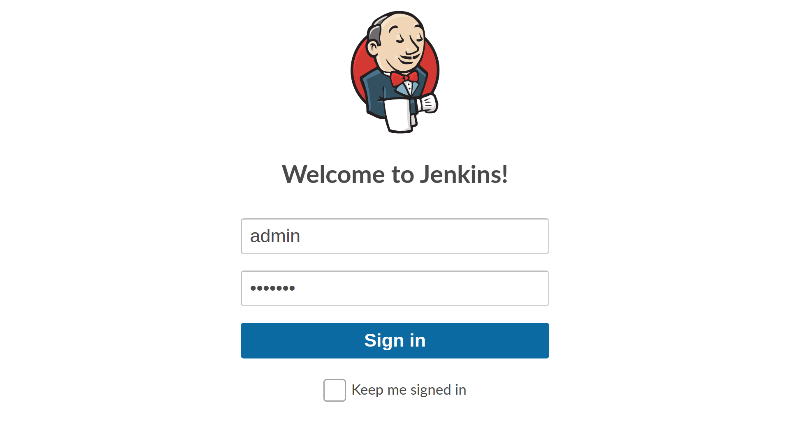
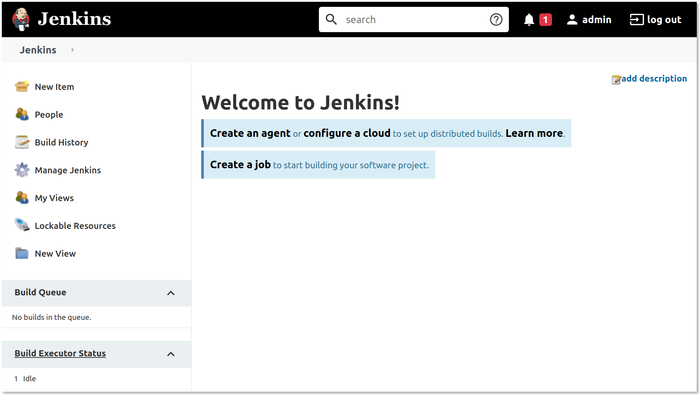
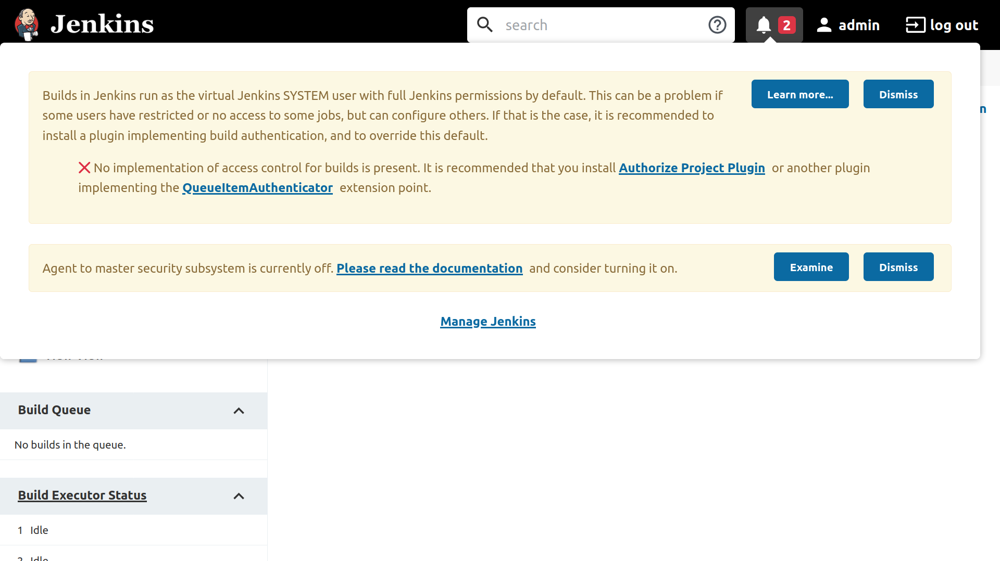
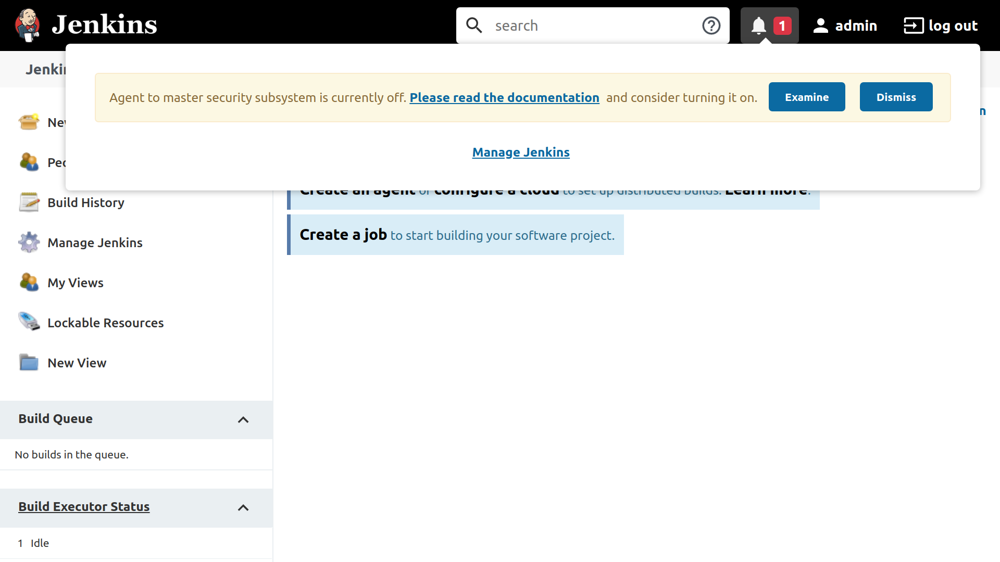
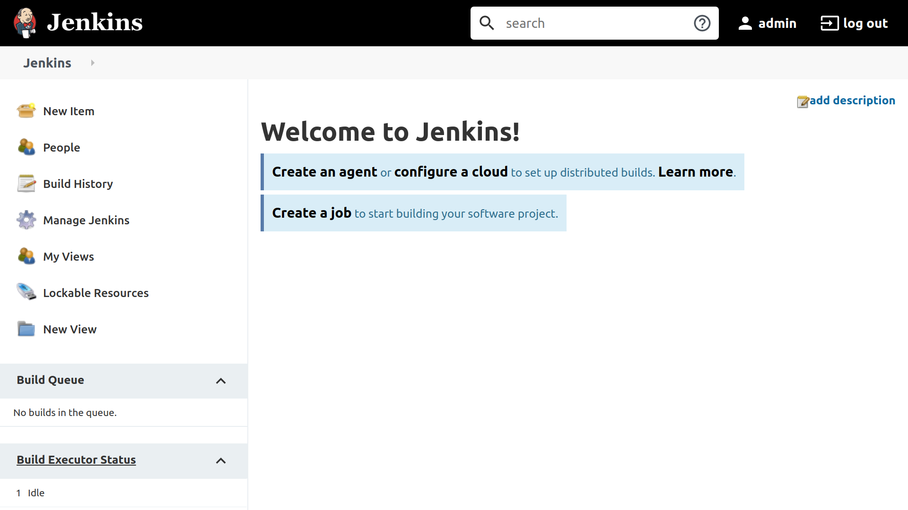

# How To Automate Jenkins Setup with Docker and Jenkins Configuration as Code

### Introduction

[Jenkins](https://jenkins.io/) is one of the most popular open-source automation servers, often used to orchestrate [continuous integration (CI) and/or continuous deployment (CD)](https://www.digitalocean.com/community/tutorials/an-introduction-to-continuous-integration-delivery-and-deployment) workflows.

Configuring Jenkins is typically done manually through a web-based setup wizard; this can be a slow, error-prone, and non-scalable process. You can see the steps involved by following [Step 4 — Setting Up Jenkins](https://www.digitalocean.com/community/tutorials/how-to-install-jenkins-on-ubuntu-18-04#step-4-%E2%80%94-setting-up-jenkins) of the [How To Install Jenkins on Ubuntu 18.04](https://www.digitalocean.com/community/tutorials/how-to-install-jenkins-on-ubuntu-18-04) guide. Furthermore, configurations cannot be tracked in a _version control system_ (VCS) like [Git](https://git-scm.com/), nor be under the scrutiny of any code review process.

In this tutorial, you will automate the installation and configuration of Jenkins using [Docker](https://www.docker.com/) and the [Jenkins Configuration as Code](https://www.jenkins.io/projects/jcasc/) (JCasC) method.

Jenkins uses a pluggable architecture to provide most of its functionality. JCasC makes use of the [Configuration as Code](https://plugins.jenkins.io/configuration-as-code/) plugin, which allows you to define the desired state of your Jenkins configuration as one or more [YAML](https://yaml.org/) file(s), eliminating the need for the setup wizard. On initialization, the Configuration as Code plugin would configure Jenkins according to the configuration file(s), greatly reducing the configuration time and eliminating human errors.

[Docker](https://www.docker.com/) is the de facto standard for creating and running [containers](https://www.digitalocean.com/community/tutorials/the-docker-ecosystem-an-overview-of-containerization), which is a _virtualization_ technology that allows you to run isolated, self-contained applications consistently across different _operation systems_ (OSes) and hardware architectures. You will run your Jenkins instance using Docker to take advantage of this consistency and cross-platform capability.

This tutorial starts by guiding you through setting up JCasC. You will then incrementally add to the JCasC configuration file to set up users, configuration authentication and authorization, and finally to secure your Jenkins instance. After you’ve completed this tutorial, you’ll have created a custom Docker image that is set up to use the Configuration as Code plugin on startup to automatically configure and secure your Jenkins instance.

## Prerequisites

To complete this tutorial, you will need:

-   Access to a server with at least 2GB of RAM and Docker installed. This can be your local development machine, a Droplet, or any kind of server. Follow **Step 1 — Installing Docker** from one of the tutorials in the [How to Install and Use Docker](https://www.digitalocean.com/community/tutorial_collections/how-to-install-and-use-docker) collection to set up Docker.

**Note:** This tutorial is tested on Ubuntu 18.04; however, because Docker images are self-contained, the steps outlined here would work for any OSes with Docker installed.

## Step 1 — Disabling the Setup Wizard

Using JCasC eliminates the need to show the setup wizard; therefore, in this first step, you’ll create a modified version of the official [`jenkins/jenkins`](https://hub.docker.com/r/jenkins/jenkins/) image that has the setup wizard disabled. You will do this by creating a `Dockerfile` and building a custom Jenkins image from it.

The `jenkins/jenkins` image allows you to enable or disable the setup wizard by passing in a _system property_ named `jenkins.install.runSetupWizard` via the `JAVA_OPTS` environment variable. Users of the image can pass in the `JAVA_OPTS` environment variable at runtime using the [`--env`](https://docs.docker.com/engine/reference/commandline/run/#set-environment-variables--e---env---env-file) flag to `docker run`. However, this approach would put the onus of disabling the setup wizard on the user of the image. Instead, you should disable the setup wizard at build time, so that the setup wizard is disabled by default.

You can achieve this by creating a `Dockerfile` and using the [`ENV`](https://docs.docker.com/engine/reference/builder/#env) instruction to set the `JAVA_OPTS` environment variable.

First, create a new directory inside your server to store the files you will be creating in this tutorial:

Then, navigate inside that directory:

Next, using your editor, create a new file named `Dockerfile`:

Then, copy the following content into the `Dockerfile`:

~/playground/jcasc/

Here, you’re using the [`FROM`](https://docs.docker.com/engine/reference/builder/#from) instruction to specify `jenkins/jenkins:latest` as the _base image_, and the `ENV` instruction to set the `JAVA_OPTS` environment variable.

Save the file and exit the editor by pressing `CTRL+X` followed by `Y`.

With these modifications in place, build a new custom Docker image and assign it a unique tag (we’ll use `jcasc` here):

You will see output similar to the following:

```shell
OutputSending build context to Docker daemon  2.048kB
Step 1/2 : FROM jenkins/jenkins:latest
 ---> 1f4b0aaa986e
Step 2/2 : ENV JAVA_OPTS -Djenkins.install.runSetupWizard=false
 ---> 7566b15547af
Successfully built 7566b15547af
Successfully tagged jenkins:jcasc
```

Once built, run your custom image by running [`docker run`](https://docs.docker.com/engine/reference/run/):

You used the `--name jenkins` option to give your container an easy-to-remember name; otherwise a random hexadecimal ID would be used instead (e.g. `f1d701324553`). You also specified the `--rm` flag so the container will automatically be removed after you’ve stopped the container process. Lastly, you’ve configured your server host’s port `8080` to proxy to the container’s port `8080` using the `-p` flag; `8080` is the default port where the Jenkins web UI is served from.

Jenkins will take a short period of time to initiate. When Jenkins is ready, you will see the following line in the output:

```shell
Output... hudson.WebAppMain$3#run: Jenkins is fully up and running
```

Now, open up your browser to `server_ip:8080`. You’re immediately shown the dashboard without the setup wizard.



You have just confirmed that the setup wizard has been disabled. To clean up, stop the container by pressing `CTRL+C`. If you’ve specified the `--rm` flag earlier, the stopped container would automatically be removed.

In this step, you’ve created a custom Jenkins image that has the setup wizard disabled. However, the top right of the web interface now shows a red notification icon indicating there are issues with the setup. Click on the icon to see the details.



The first warning informs you that you have not configured the Jenkins URL. The second tells you that you haven’t configured any authentication and authorization schemes, and that anonymous users have full permissions to perform all actions on your Jenkins instance. Previously, the setup wizard guided you through addressing these issues. Now that you’ve disabled it, you need to replicate the same functions using JCasC. The rest of this tutorial will involve modifying your `Dockerfile` and JCasC configuration until no more issues remain (that is, until the red notification icon disappears).

In the next step, you will begin that process by pre-installing a selection of Jenkins plugins, including the Configuration as Code plugin, into your custom Jenkins image.

## Step 2 — Installing Jenkins Plugins

To use JCasC, you need to install the Configuration as Code plugin. Currently, no plugins are installed. You can confirm this by navigating to `http://server_ip:8080/pluginManager/installed`.



In this step, you’re going to modify your `Dockerfile` to pre-install a selection of plugins, including the Configuration as Code plugin.

To automate the plugin installation process, you can make use of an installation script that comes with the `jenkins/jenkins` Docker image. You can find it inside the container at `/usr/local/bin/install-plugins.sh`. To use it, you would need to:

-   Create a text file containing a list of plugins to install
-   Copy it into the Docker image
-   Run the `install-plugins.sh` script to install the plugins

First, using your editor, create a new file named `plugins.txt`:

Then, add in the following newline-separated list of plugin names and versions (using the format `<id>:<version>`):

~/playground/jcasc/plugins.txt

```
ant:latest
antisamy-markup-formatter:latest
build-timeout:latest
cloudbees-folder:latest
configuration-as-code:latest
credentials-binding:latest
email-ext:latest
git:latest
github-branch-source:latest
gradle:latest
ldap:latest
mailer:latest
matrix-auth:latest
pam-auth:latest
pipeline-github-lib:latest
pipeline-stage-view:latest
ssh-slaves:latest
timestamper:latest
workflow-aggregator:latest
ws-cleanup:latest
```

Save the file and exit your editor.

The list contains the Configuration as Code plugin, as well as all the plugins suggested by the setup wizard (correct as of Jenkins v2.251). For example, you have the [Git](https://plugins.jenkins.io/git/) plugin, which allows Jenkins to work with Git repositories; you also have the [Pipeline](https://plugins.jenkins.io/workflow-aggregator/) plugin, which is actually a suite of plugins that allows you to define Jenkins jobs as code.

**Note:** The most up-to-date list of suggested plugins can be inferred from the [source code](https://github.com/jenkinsci/jenkins/blob/master/core/src/main/resources/jenkins/install/platform-plugins.json). You can also find a list of the most popular community-contributed plugins at [plugins.jenkins.io](https://plugins.jenkins.io/). Feel free to include any other plugins you want into the list.

Next, open up the `Dockerfile` file:

In it, add a `COPY` instruction to copy the `plugins.txt` file into the `/usr/share/jenkins/ref/` directory inside the image; this is where Jenkins normally looks for plugins. Then, include an additional `RUN` instruction to run the `install-plugins.sh` script:

~/playground/jcasc/Dockerfile

Save the file and exit the editor. Then, build a new image using the revised `Dockerfile`:

This step involves downloading and installing many plugins into the image, and may take some time to run depending on your internet connection. Once the plugins have finished installing, run the new Jenkins image:

After the `Jenkins is fully up and running` message appears on `stdout`, navigate to `server_ip:8080/pluginManager/installed` to see a list of installed plugins. You will see a solid checkbox next to all the plugins you’ve specified inside `plugins.txt`, as well as a faded checkbox next to plugins, which are dependencies of those plugins.



Once you’ve confirmed that the **Configuration As Code** plugin is installed, terminate the container process by pressing `CTRL+C`.

In this step, you’ve installed all the suggested Jenkins plugins and the Configuration as Code plugin. You’re now ready to use JCasC to tackle the issues listed in the notification box. In the next step, you will fix the first issue, which warns you that the **Jenkins root URL is empty**.

## Step 3 — Specifying the Jenkins URL

The Jenkins URL is a URL for the Jenkins instance that is routable from the devices that need to access it. For example, if you’re deploying Jenkins as a node inside a private network, the Jenkins URL may be a private IP address, or a DNS name that is resolvable using a private DNS server. For this tutorial, it is sufficient to use the server’s IP address (or `127.0.0.1` for local hosts) to form the Jenkins URL.

You can set the Jenkins URL on the web interface by navigating to `server_ip:8080/configure` and entering the value in the **Jenkins URL** field under the **Jenkins Location** heading. Here’s how to achieve the same using the Configuration as Code plugin:

1.  Define the desired configuration of your Jenkins instance inside a declarative configuration file (which we’ll call `casc.yaml`).
2.  Copy the configuration file into the Docker image (just as you did for your `plugins.txt` file).
3.  Set the `CASC_JENKINS_CONFIG` environment variable to the path of the configuration file to instruct the Configuration as Code plugin to read it.

First, create a new file named `casc.yaml`:

Then, add in the following lines:

~/playground/jcasc/casc.yaml

`unclassified.location.url` is the path for setting the Jenkins URL. It is just one of a myriad of properties that can be set with JCasC. Valid properties are determined by the plugins that are installed. For example, the `jenkins.authorizationStrategy.globalMatrix.permissions` property would only be valid if the [Matrix Authorization Strategy](https://plugins.jenkins.io/matrix-auth) plugin is installed. To see what properties are available, navigate to `server_ip:8080/configuration-as-code/reference`, and you’ll find a page of documentation that is customized to your particular Jenkins installation.

Save the `casc.yaml` file, exit your editor, and open the `Dockerfile` file:

Add a `COPY` instruction to the end of your `Dockerfile` that copies the `casc.yaml` file into the image at `/var/jenkins_home/casc.yaml`. You’ve chosen `/var/jenkins_home/` because that’s the default directory where Jenkins stores all of its data:

~/playground/jcasc/Dockerfile

Then, add a further `ENV` instruction that sets the `CASC_JENKINS_CONFIG` environment variable:

~/playground/jcasc/Dockerfile

**Note:** You’ve put the `ENV` instruction near the top because it’s something that you are unlikely to change. By placing it before the `COPY` and `RUN` instructions, you can avoid invalidating the cached layer if you were to update the `casc.yaml` or `plugins.txt`.

Save the file and exit the editor. Next, build the image:

And run the updated Jenkins image:

As soon as the `Jenkins is fully up and running` log line appears, navigate to `server_ip:8080` to view the dashboard. This time, you may have noticed that the notification count is reduced by one, and the warning about the Jenkins URL has disappeared.



Now, navigate to `server_ip:8080/configure` and scroll down to the **Jenkins URL** field. Confirm that the Jenkins URL has been set to the same value specified in the `casc.yaml` file.

Lastly, stop the container process by pressing `CTRL+C`.

In this step, you used the Configuration as Code plugin to set the Jenkins URL. In the next step, you will tackle the second issue from the notifications list (the **Jenkins is currently unsecured** message).

## Step 4 — Creating a User

So far, your setup has not implemented any authentication and authorization mechanisms. In this step, you will set up a basic, password-based authentication scheme and create a new user named `admin`.

Start by opening your `casc.yaml` file:

Then, add in the highlighted snippet:

~/playground/jcasc/casc.yaml

In the context of Jenkins, a _security realm_ is simply an authentication mechanism; the local security realm means to use basic authentication where users must specify their ID/username and password. Other security realms exist and are provided by plugins. For instance, the [LDAP](https://plugins.jenkins.io/ldap) plugin allows you to use an existing LDAP directory service as the authentication mechanism. The [GitHub Authentication](https://plugins.jenkins.io/github-oauth) plugin allows you to use your GitHub credentials to authenticate via OAuth.

Note that you’ve also specified `allowsSignup: false`, which prevents anonymous users from creating an account through the web interface.

Finally, instead of hard-coding the user ID and password, you are using variables whose values can be filled in at runtime. This is important because one of the benefits of using JCasC is that the `casc.yaml` file can be committed into source control; if you were to store user passwords in plaintext inside the configuration file, you would have effectively compromised the credentials. Instead, variables are defined using the `${VARIABLE_NAME}` syntax, and its value can be filled in using an environment variable of the same name, or a file of the same name that’s placed inside the `/run/secrets/` directory within the container image.

Next, build a new image to incorporate the changes made to the `casc.yaml` file:

Then, run the updated Jenkins image whilst passing in the `JENKINS_ADMIN_ID` and `JENKINS_ADMIN_PASSWORD` environment variables via the [`--env`](https://docs.docker.com/engine/reference/commandline/run/#set-environment-variables--e---env---env-file) option (replace `<password>` with a password of your choice):

You can now go to `server_ip:8080/login` and log in using the specified credentials.



Once you’ve logged in successfully, you will be redirected to the dashboard.



Finish this step by pressing `CTRL+C` to stop the container.

In this step, you used JCasC to create a new user named `admin`. You’ve also learned how to keep sensitive data, like passwords, out of files tracked by VCSs. However, so far you’ve only configured user authentication; you haven’t implemented any authorization mechanisms. In the next step, you will use JCasC to grant your `admin` user with administrative privileges.

## Step 5 — Setting Up Authorization

After setting up the security realm, you must now configure the _authorization strategy_. In this step, you will use the [Matrix Authorization Strategy](https://plugins.jenkins.io/matrix-auth) plugin to configure permissions for your `admin` user.

By default, the Jenkins core installation provides us with three authorization strategies:

-   `unsecured`: every user, including anonymous users, have full permissions to do everything
-   `legacy`: emulates legacy Jenkins (prior to v1.164), where any users with the role `admin` is given full permissions, whilst other users, including anonymous users, are given read access.

**Note:** A _role_ in Jenkins can be a user (for example, `daniel`) or a group (for example, `developers`)

-   `loggedInUsersCanDoAnything`: anonymous users are given either no access or read-only access. Authenticated users have full permissions to do everything. By allowing actions only for authenticated users, you are able to have an audit trail of which users performed which actions.

**Note:** You can explore other authorization strategies and their related plugins in the [documentation](https://jenkins.io/doc/developer/extensions/jenkins-core/#authorizationstrategy); these include plugins that handle both authentication and authorization.

All of these authorization strategies are very crude, and does not afford granular control over how permissions are set for different users. Instead, you can use the Matrix Authorization Strategy plugin that was already included in your `plugins.txt` list. This plugin affords you a more granular authorization strategy, and allows you to set user permissions globally, as well as per project/job.

The Matrix Authorization Strategy plugin allows you to use the `jenkins.authorizationStrategy.globalMatrix.permissions` JCasC property to set global permissions. To use it, open your `casc.yaml` file:

And add in the highlighted snippet:

~/playground/jcasc/casc.yaml

The `globalMatrix` property sets global permissions (as opposed to per-project permissions). The `permissions` property is a list of strings with the format `<permission-group>/<permission-name>:<role>`. Here, you are granting the `Overall/Administer` permissions to the `admin` user. You’re also granting `Overall/Read` permissions to `authenticated`, which is a special role that represents all authenticated users. There’s another special role called `anonymous`, which groups all non-authenticated users together. But since permissions are denied by default, if you don’t want to give anonymous users any permissions, you don’t need to explicitly include an entry for it.

Save the `casc.yaml` file, exit your editor, and build a new image:

Then, run the updated Jenkins image:

Wait for the `Jenkins is fully up and running` log line, and then navigate to `server_ip:8080`. You will be redirected to the login page. Fill in your credentials and you will be redirected to the main dashboard.

In this step, you have set up global permissions for your `admin` user. However, resolving the authorization issue uncovered additional issues that are now shown in the notification menu.



Therefore, in the next step, you will continue to modify your Docker image, to resolve each issue one by one until none remains.

Before you continue, stop the container by pressing `CTRL+C`.

## Step 6 — Setting Up Build Authorization

The first issue in the notifications list relates to build authentication. By default, all jobs are run as the system user, which has a lot of system privileges. Therefore, a Jenkins user can perform _privilege escalation_ simply by defining and running a malicious job or pipeline; this is insecure.

Instead, jobs should be ran using the same Jenkins user that configured or triggered it. To achieve this, you need to install an additional plugin called the [Authorize Project](https://plugins.jenkins.io/authorize-project) plugin.

Open `plugins.txt`:

And add the highlighted line:

~/playground/jcasc/plugins.txt

```
ant:latest
antisamy-markup-formatter:latest
authorize-project:latest
build-timeout:latest
...
```

The plugin provides a new build authorization strategy, which you would need to specify in your JCasC configuration. Exit out of the `plugins.txt` file and open the `casc.yaml` file:

Add the highlighted block to your `casc.yaml` file:

~/playground/jcasc/casc.yaml

Save the file and exit the editor. Then, build a new image using the modified `plugins.txt` and `casc.yaml` files:

Then, run the updated Jenkins image:

Wait for the `Jenkins is fully up and running` log line, then navigate to `server_ip:8080/login`, fill in your credentials, and arrive at the main dashboard. Open the notification menu, and you will see the issue related to build authentication no longer appears.



Stop the container by running `CTRL+C` before continuing.

In this step, you have configured Jenkins to run builds using the user that triggered the build, instead of the system user. This eliminates one of the issues in the notifications list. In the next step, you will tackle the next issue related to the Agent to Controller Security Subsystem.

## Step 7 — Enabling Agent to Controller Access Control

In this tutorial, you have deployed only a single instance of Jenkins, which runs all builds. However, Jenkins supports distributed builds using an agent/controller configuration. The controller is responsible for providing the web UI, exposing an API for clients to send requests to, and co-ordinating builds. The agents are the instances that execute the jobs.

The benefit of this configuration is that it is more scalable and fault-tolerant. If one of the servers running Jenkins goes down, other instances can take up the extra load.

However, there may be instances where the agents cannot be trusted by the controller. For example, the OPS team may manage the Jenkins controller, whilst an external contractor manages their own custom-configured Jenkins agent. Without the Agent to Controller Security Subsystem, the agent is able to instruct the controller to execute any actions it requests, which may be undesirable. By enabling Agent to Controller Access Control, you can control which commands and files the agents have access to.

To enable Agent to Controller Access Control, open the `casc.yaml` file:

Then, add the following highlighted lines:

~/playground/jcasc/casc.yaml

Save the file and build a new image:

Run the updated Jenkins image:

Navigate to `server_ip:8080/login` and authenticate as before. When you land on the main dashboard, the notifications menu will not show any more issues.



## Conclusion

You’ve now successfully configured a simple Jenkins server using JCasC. Just as the [Pipeline plugin](https://plugins.jenkins.io/workflow-aggregator/) enables developers to define their jobs inside a `Jenkinsfile`, the Configuration as Code plugin enables administrators to define the Jenkins configuration inside a YAML file. Both of these plugins bring Jenkins closer aligned with the _Everything as Code_ (EaC) paradigm.

However, getting the JCasC syntax correct can be difficult, and the documentation can be hard to decipher. If you’re stuck and need help, you may find it in the [Gitter chat](https://gitter.im/jenkinsci/configuration-as-code-plugin) for the plugin.

Although you have configured the basic settings of Jenkins using JCasC, the new instance does not contain any projects or jobs. To take this even further, explore the [Job DSL](https://plugins.jenkins.io/job-dsl) plugin, which allows us to define projects and jobs as code. What’s more, you can include the Job DSL code inside your JCasC configuration file, and have the projects and jobs created as part of the configuration process.

## Reference

* https://www.digitalocean.com/community/tutorials/how-to-automate-jenkins-setup-with-docker-and-jenkins-configuration-as-code
* https://www.digitalocean.com/community/tutorials/how-to-automate-jenkins-job-configuration-using-job-dsl
* https://stackoverflow.com/questions/32111825/jenkins-how-to-set-authorization-on-project-basis
* https://plugins.jenkins.io/job-dsl
* 