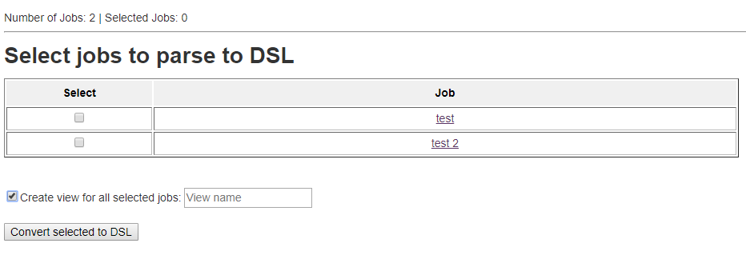
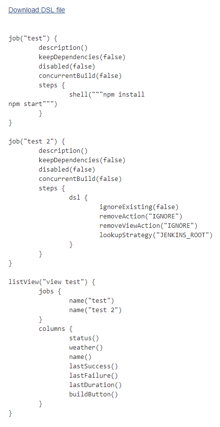
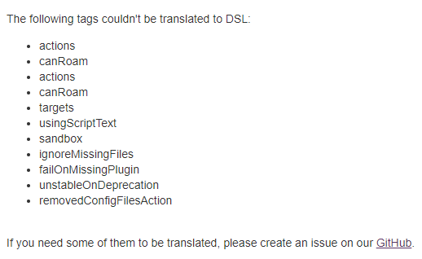

# Jenkins : How to convert existing XML based Job to Job DSL

Use this plugin to convert your current jobs in Job DSL scripts (see [Job DSL Plugin](https://wiki.jenkins.io/JENKINS/Job-DSL-Plugin.html) for more informations)

## Instructions

You can find the plugin on sidepanel of Jenkins.

1 - Select the jobs you want to convert.

2 - You can check the "Create view for all selected jobs" and give it a name

3 - Click on "Convert selected to DSL" button

4 - Now you can Download the file, copy the script itself

5 - Below we have the Non-translated section, if you need some of these tags translated, please, create an issue on [https://github.com/jenkinsci/xml-job-to-job-dsl-plugin](https://github.com/jenkinsci/xml-job-to-job-dsl-plugin)

## Reference

* https://wiki.jenkins.io/JENKINS/XML-Job-to-Job-DSL.html
* https://docs.cloudbees.com/docs/cloudbees-ci-kb/latest/client-and-managed-masters/how-can-i-convert-an-existing-jenkins-jobs-to-dsl-script
* https://github.com/jenkinsci/xml-job-to-job-dsl-plugin/
* https://stackoverflow.com/questions/69364938/error-creating-jobdsl-parameters-programatically
* https://stackoverflow.com/questions/48368407/any-predefined-jenkins-job-convert-them-to-dsl
* 
