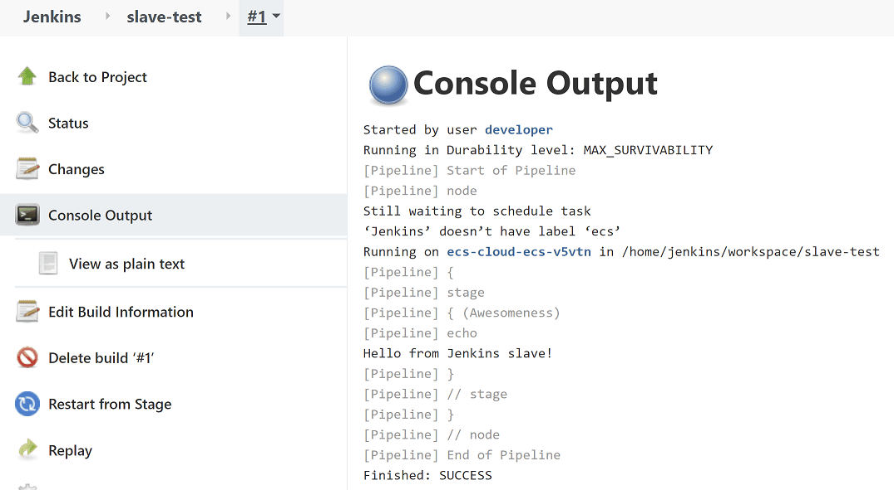
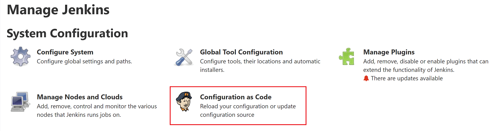
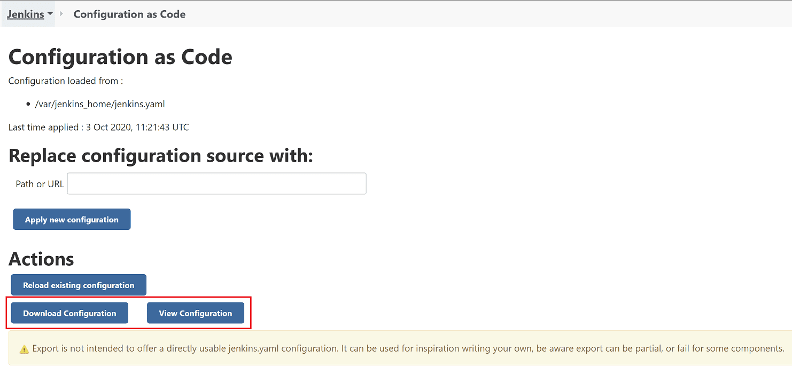
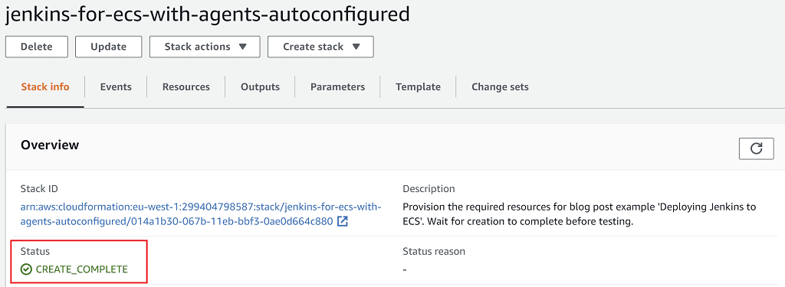
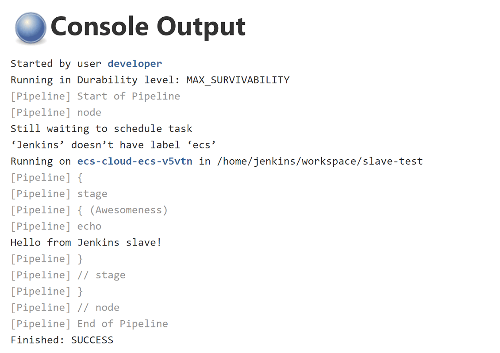

# Using jenkins configuration-as-code to setup aws slave agents automatically

Setting up a Jenkins cloud configuration allows you to run jobs on slaves agents, offloading your job workload to a container orchestration framework such as AWS ECS.

If you’ve ever done this, you’ll know that the manual configuration setup is complex and one small mistake means that your Jenkins job won’t start.

In this article you’ll learn how to **automate your Jenkins cloud configuration setup using Jenkins Configuration as Code (JCasC)**. This means your cloud configuration will be reproducible, version controlled, and dynamic based on your ever-changing infrastructure.

This is the third article in this three-part series about deploying Jenkins into AWS. Here are details of all three articles:

-   in **Part 1** _[Deploy your own production-ready Jenkins in AWS ECS](https://jenkinshero.com/deploy-jenkins-into-aws-ecs/)_ we explored how to setup a robust Jenkins master in AWS using CloudFormation
-   in **Part 2** _[Running Jenkins jobs in AWS ECS with slave agents](https://jenkinshero.com/jenkins-jobs-in-aws-ecs-with-slave-agents/)_ we got slave jobs running in ECS through a full worked example, doing all the cloud configuration manually for a full understanding of the process
-   in **Part 3** _Using Jenkins Configuration as Code to setup AWS slave agents_ (this article) we’ll improve what we had in part 2 by setting up our Jenkins master’s cloud configuration automatically using Jenkins Configuration as Code

## Running Jenkins slaves in AWS ECS recap

In the previous article _[Running Jenkins jobs in AWS ECS with slave agents](https://jenkinshero.com/jenkins-jobs-in-aws-ecs-with-slave-agents/)_, we explored the advantages of running jobs in containers, outside of the Jenkins master. By the end of the article, we had a working example setup in AWS, with a Jenkins master able to run jobs within ECS.



It’s fair to say that the example had a few manual steps to get us there. OK, maybe more than a few then! 17 configuration parameters were required to:

-   **setup a link between Jenkins and AWS ECS** – this included telling Jenkins what ECS cluster and subnets to deploy the slave in
-   **describe the type of Jenkins slave to be created** – this included telling Jenkins what Docker image to use, IAM roles, security groups, and container CPU & memory requirements

Maybe you’re thinking this manual configuration is fine as a one-off?

In my experience though, it never is just a one-off. Jenkins has an annoying habit of losing the cloud configuration when its version is updated. Plus, what if you ever need to rebuild your Jenkins from scratch in a disaster recovery scenario?

**Why not follow the same principles used to define AWS infrastructure with Jenkins?** Version controlled template specifications using tools like AWS CloudFormation make infrastructure easily reproducible. Jenkins has been a bit slow to catch-up, but fortunately now has the **Jenkins Configuration as Code** plugin to allow us to do just that.

## Jenkins configuration as code project

Jenkins Configuration as Code (JCasC) currently exists as a plugin, which has been around since March 2019. It has the excellent goals of configuration with:

-   no hands on keyboard
-   no click on UI

So rather than clicking about in the UI, you define your Jenkins configuration in a YAML file which then gets ingested and applied by the plugin. In fact, all we have to do is:

1.  apply the _configuration-as-code_ plugin to Jenkins master
2.  specify a configuration file _/var/jenkins\_home/jenkins.yaml_
3.  make sure that file contains a valid and relevant configuration for your Jenkins (the hard bit)

Fortunately, this plugin works both ways. You can export an existing UI-generated Jenkins configuration to help write your _jenkins.yaml_ file. This makes things a lot easier, since it can be difficult to figure out how to construct the template for a specific configuration.

Once you’ve applied the [configuration-as-code plugin](https://plugins.jenkins.io/configuration-as-code/) to your Jenkins instance, you’ll get an additional option under **Manage Jenkins**:



Clicking this allows you to download or view your current configuration as a YAML template.



The idea is that the exported template can then help you to define the template to be imported. Do take note of the warning though, which suggest that the exported configuration cannot always be reimported without changes.

This article isn’t a full exploration into this plugin (see the [plugin’s website](https://github.com/jenkinsci/configuration-as-code-plugin) for that). Instead, it’s an **introduction to the plugin** using a real use case of needing a Jenkins master that runs jobs in ECS. In fact, that’s what we’re going to do next. 👌

## An example Jenkins project in AWS

Let’s jump into getting a Jenkins environment setup with a Jenkins master running jobs in slave agents in AWS ECS. And remember, there must be **no manual configuration**. Got it?

Much of this example will build on top of the example from the previous article _[Running Jenkins jobs in AWS ECS with slave agents](https://jenkinshero.com/jenkins-jobs-in-aws-ecs-with-slave-agents/)_, so be sure to check it out first. We’ll be making the following improvements:

1.  **add our own Docker image** – rather than using the `jenkins/jenkins:lts` Docker image, we’ll build our own so we can specify all of our own custom configurations using the Jenkins Configuration as Code plugin
2.  **make CloudFormation changes** – our ECS task definition will need to reference the new Docker image, pass through various infrastructure related environment variables, as well as defining a default Jenkins password in AWS Secrets Manager

### Jenkins master with automatic cloud configuration setup

To setup Jenkins with the configuration needed to run slaves in ECS, we need to create our own Docker image for Jenkins.

Using Docker, we’ll be able to:

-   install all the plugins we need
-   include the required Jenkins configuration files

As you probably know, to create a Docker image you need a _Dockerfile_. Ours looks like this:

```
FROM jenkins/jenkins:2.346.2-jdk11

COPY jenkins-resources/plugins.txt /usr/share/jenkins/ref/plugins.txt
RUN jenkins-plugin-cli --plugin-file /usr/share/jenkins/ref/plugins.txt

COPY jenkins-resources/initialConfig.groovy /usr/share/jenkins/ref/init.groovy.d/initialConfigs.groovy
COPY jenkins-resources/jenkins.yaml /usr/share/jenkins/ref/jenkins.yaml
COPY jenkins-resources/slaveTestJob.xml /usr/share/jenkins/ref/jobs/slave-test/config.xml

ENV JAVA_OPTS -Djenkins.install.runSetupWizard=false
```

-   we’re using the latest Jenkins JDK 11 image at the time of writing
-   we’re copying a file [_plugins.txt_](https://github.com/jenkins-hero/jenkins-ecs-agents/blob/master/jenkins-resources/plugins.txt) into the image, and running a script which installs the plugins. The file includes only this minimum set of plugins we require:
    -   **amazon-ecs** – allows Jenkins to run jobs on slave agents in AWS ECS
    -   **configuration-as-code** – applies Jenkins configuration from a template file
    -   **workflow-aggregator** – allows the creation of pipeline jobs
-   a file [_initialConfig.groovy_](https://github.com/jenkins-hero/jenkins-ecs-agents/blob/master/jenkins-resources/initialConfig.groovy) is copied into _/usr/share/jenkins/ref/init.groovy.d._ Any Groovy scripts Jenkins finds in this directory when it starts up will be executed. In this case, the script tells Jenkins what is its external facing URL
-   a file _[jenkins.yaml](https://github.com/jenkins-hero/jenkins-ecs-agents/blob/master/jenkins-resources/jenkins.yaml)_ is copied into the Jenkins home directory. This is the main Jenkins Configuration as Code file, and we’ll get into the nitty-gritty details in a second.
-   a file _[slaveTestJob.xml](https://github.com/jenkins-hero/jenkins-ecs-agents/blob/master/jenkins-resources/slaveTestJob.xml)_ is copied into the Jenkins job directory. This is a pipeline job configured to run on a Jenkins agent with label _ecs_ (more details shortly).
-   a system property is passed to Jenkins so it doesn’t show us the setup wizard on startup

**Jenkins config locations** – when the Jenkins Docker image starts, anything located in _/usr/share/jenkins/ref_ will get copied to _/var/jenkins\_home_, the default Jenkins home directory. This is required because we’re mounting an EFS volume at _/var/jenkins\_home_. Any files that are at this location before the volume is mounted would disappear, so the files have to be copied after mounting.

#### Jenkins configuration as code template

Here’s the YAML file which represents the configuration which will be applied to Jenkins on startup:

```
jenkins:
  slaveAgentPort: 50000
  systemMessage: Jenkins with AWS ECS demo
  agentProtocols:
    - JNLP4-connect
  authorizationStrategy:
    loggedInUsersCanDoAnything:
      allowAnonymousRead: false
  remotingSecurity:
    enabled: true
  securityRealm:
    local:
      allowsSignup: false
      users:
        - id: ${JENKINS_USERNAME}
          password: ${JENKINS_PASSWORD}
  clouds:
    - ecs:
        credentialsId: ''
        cluster: ${ECS_AGENT_CLUSTER}
        name: ecs-cloud
        regionName: ${AWS_REGION}
        jenkinsUrl: ${JENKINS_URL}
        tunnel: ${PRIVATE_JENKINS_HOST_AND_PORT}
        templates:
          - assignPublicIp: true
            cpu: 1024
            executionRole: ${AGENT_EXECUTION_ROLE_ARN}
            image: jenkins/inbound-agent:alpine
            label: ecs
            launchType: FARGATE
            logDriver: awslogs
            logDriverOptions:
              - name: awslogs-group
                value: ECSLogGroup-jenkins-for-ecs-with-agents
              - name: awslogs-region
                value: ${AWS_REGION}
              - name: awslogs-stream-prefix
                value: jenkins-agent
            memoryReservation: 2048
            securityGroups: ${AGENT_SECURITY_GROUP_ID}
            subnets: ${SUBNET_IDS}
            templateName: jenkins-agent
```

The file is spilt into two segments, Jenkins configuration and cloud configuration.

##### Jenkins configuration

Here we’re setting up user access to Jenkins. The `JENKINS_USERNAME` and `JENKINS_PASSWORD` environment variables are injected at runtime, which can later be used to access the Jenkins UI

##### Cloud configuration

This is the real meat of the configuration, and relates almost exactly to the [table of configuration from the previous article](https://jenkinshero.com/jenkins-jobs-in-aws-ecs-with-slave-agents/#configuring-ecs-cloud). If you haven’t read it then this can be summarised as:

-   **configuration for connecting with an AWS ECS cluster** – the AWS credentials themselves are derived from the AWS IAM role attached to the Jenkins master, but we have to include things like the cluster name and tunnel details so that the Jenkins slaves can communicate with their master inside our private network.
-   **configuration for each ECS agent template** – the ECS agent template equates to an ECS task definition, which describes how a slave is going to be run as an ECS task. This includes the Docker image reference, log configuration, security groups, and subnets. You can have many different ECS agent templates for different types of jobs you might need to run. We’ll just have one, called _ecs_.

Notice in the template we use a lot of environment variables. This is because these values change based on our infrastructure setup. For example, subnet ids are generated randomly by AWS so will be different when you run this example to when I run it. You’ll see in the CloudFormation below how these environment variables are passed through to the ECS task when it starts.

#### Automating job creation

Jenkins Configuration as Code explicitly doesn’t concern itself with job creation. We’ve covered this topic in other articles such as _[Building a Spring Boot application in Jenkins](https://jenkinshero.com/building-a-spring-boot-application-in-jenkins/)_ where we use the Jenkins Job DSL plugin to create jobs. This time though, we’re going to keep things super-simple and just define a job using Jenkins’ native XML format.

Into the Dockerfile we copy [_slaveTestJob.xml_](https://github.com/jenkins-hero/jenkins-ecs-agents/blob/master/jenkins-resources/slaveTestJob.xml), which defines a very simple pipeline job.

```
<?xml version="1.0" encoding="UTF-8"?><flow-definition>
    <actions/>
    <description/>
    <keepDependencies>false</keepDependencies>
    <properties/>
    <triggers/>
    <definition class="org.jenkinsci.plugins.workflow.cps.CpsFlowDefinition">
        <script>
pipeline {
    agent {
        label 'ecs'
    }

    stages {
        stage('Awesomeness') {
            steps {
                echo 'Hello from Jenkins slave!'
            }
        }
    }
}
        </script>
        <sandbox>true</sandbox>
    </definition>
</flow-definition>
```

Don’t worry about the different XML tags as this is just the format Jenkins understands. Between the `<script>` tags though, we’re defining a simple pipeline which importantly is configured to run on an agent with label _ecs_. This label corresponds with the name of the ECS agent template defined in _jenkins.yaml_.

#### Accessing the Docker image

Since I’ve only given you the highlights of the Docker image here, I thought it would only be fair to provide you access to the source which is over in [the jenkins-ecs-agents GitHub repository](https://github.com/jenkins-hero/jenkins-ecs-agents.git).

The Docker image itself is hosted in the [jenkins-ecs-agents Docker Hub repository](https://hub.docker.com/repository/docker/tkgregory/jenkins-ecs-agents). We’ll be referencing the image in the CloudFormation in the next section.

### CloudFormation changes

Let’s take this configuration-as-code thing all the way and do some infrastructure-as-code too! One of the best ways to do this, I believe, is to use **AWS CloudFormation** to define you desired infrastructure state in a YAML template.

In _[Running Jenkins jobs in AWS ECS with slave agents](https://jenkinshero.com/jenkins-jobs-in-aws-ecs-with-slave-agents/)_ we had already built up a CloudFormation template, so we’ll be building on top of it by:

1.  passing in some **new parameters** for the default Jenkins username and Jenkins URL
2.  adding an **AWS Secrets Manager secret** to store an autogenerated password for Jenkins login
3.  referencing the **new Docker image** in the ECS container definition
4.  adding a load of **environment variables** to pass in various infrastructure related values referenced in _jenkins.yaml_

#### New CloudFormation parameters

Let’s add the new parameters which we’ll reference later on.

```
JenkinsUsername:
    Type: String
    Default: developer
JenkinsURL:
    Type: String
    Description: Public URL of your Jenkins instance e.g.
https://jenkins.tomgregory.com
```

-   the `JenkinsUsername` parameter has a default value of _developer_, but can be modified if you like
-   the `JenkinsURL` parameter must be the public URL of your Jenkins master, otherwise the Jenkins slave job won’t start correctly.

#### Jenkins password secret

By creating a secret using AWS Secrets Manager we can have it automatically generate an initial password for Jenkins.

```
  JenkinsPasswordSecret:
    Type: AWS::SecretsManager::Secret
    Properties:
      Name: JenkinsPasswordSecret
      GenerateSecretString:
        PasswordLength: 30
        ExcludeCharacters: '"@/\'
```

-   let’s be security conscious developers, and give it a nice long password. 🔒

#### Update the Jenkins master ECS task

The ECS task’s `ContainerDefinition` now needs to reference the new Docker image:

```
      ContainerDefinitions:
        - Name: jenkins
          Image: tkgregory/jenkins-ecs-agents:latest
```

We also need to pass in a load of environment variables to be used in the _jenkins.yaml_ configuration file.

```
          Environment:
            - Name: AGENT_EXECUTION_ROLE_ARN
              Value: !GetAtt JenkinsExecutionRole.Arn
            - Name: AGENT_SECURITY_GROUP_ID
              Value: !Ref JenkinsAgentSecurityGroup
            - Name: AWS_REGION
              Value: !Ref AWS::Region
            - Name: ECS_AGENT_CLUSTER
              Value: !Ref ClusterName
            - Name: JENKINS_URL
              Value: !Ref JenkinsURL
            - Name: LOG_GROUP_NAME
              Value: !Ref CloudwatchLogsGroup
            - Name: PRIVATE_JENKINS_HOST_AND_PORT
              Value: !Join
                - ''
                - - !GetAtt DiscoveryService.Name
                  - '.'
                  - !Ref AWS::StackName
                  - :50000
            - Name: SUBNET_IDS
              Value: !Join
                - ''
                - - !GetAtt VPCStack.Outputs.PrivateSubnet1
                  - ','
                  - !GetAtt VPCStack.Outputs.PrivateSubnet2
            - Name: JENKINS_USERNAME
              Value: !Ref JenkinsUsername
```

Each of these values is either referenced directly from a CloudFormation resource, or is concatenated with other values using the `!Join` function.

Lastly, we have to pass the Jenkins password stored in Secrets Manager through to the container, like this:

```
          Secrets:
            - Name: JENKINS_PASSWORD
              ValueFrom: !Ref JenkinsPasswordSecret
```

In practice this will also get injected into the container as an environment variable to be used in _jenkins.yaml_.

To see all the above CloudFormation changes inline, take a look at _[jenkins-for-ecs-with-agents-autoconfigured.yml](https://tomgregory-cloudformation-examples.s3-eu-west-1.amazonaws.com/jenkins-for-ecs-with-agents-autoconfigured.yml)_.

### Launching the stack

Enough talking, let’s get down to business and get this Jenkins environment deployed into AWS. Just click the _Launch Stack_ button below to deploy Jenkins to your own AWS account.

[](https://console.aws.amazon.com/cloudformation/home#/stacks/quickcreate?stackName=jenkins-for-ecs-with-agents-autoconfigured&templateURL=https://tomgregory-cloudformation-examples.s3-eu-west-1.amazonaws.com/jenkins-for-ecs-with-agents-autoconfigured.yml)

Note that this CloudFormation template works independently of those in the previous articles in this series.

On the _Quick create stack_ page you can leave all parameters as the default values, except:

-   `CertificateArn` which must be set to the ARN of the certificate you’re using to provide access to Jenkins over HTTPS (see [this article](https://jenkinshero.com/deploy-jenkins-into-aws-ecs/#certificates) for more info on certificate setup)
-   `JenkinsURL` which must be set to the URL you’ll use to access Jenkins (see [this article](https://jenkinshero.com/deploy-jenkins-into-aws-ecs/#certificates) for more info on DNS setup)

At the bottom of the page accept the additional required capabilities, then click **Create stack**. Wait 10 minutes for your stack to finish creating and enter the `CREATE_COMPLETE` status:



Your Jenkins instance is now ready to serve. Don’t forget to configure your DNS provider to point to the load balancer’s domain name as [described here](https://jenkinshero.com/deploy-jenkins-into-aws-ecs/#certificates).

### Trying it out

Now this last section should be very quick if we’ve done everything correctly.

1.  Grab the Jenkins password by going to **Services > Secrets Manager > JenkinsPasswordSecret** and click **Retrieve secret value**
2.  Log into Jenkins using username _developer_ and the password from step 1
3.  Click on the _slave-test_ job
4.  Run it by clicking **Build Now**
5.  Click on **Console Output**

Once the job competed you should now see a fun and imaginative message like this:



Awesome! _So our job ran on an ECS Jenkins slave and we didn’t have to click around the UI?_

Yep, only Jenkins configuration as code for me from now on. 👍

### But Tom, it doesn’t work

Don’t worry! Best thing to do in this case is either:

-   look for a hint as to what went wrong in the job’s **Console Output**
-   look in the Jenkins logs by going to **Manage Jenkins > System Log > All Jenkins Logs**. Scroll to the bottom and normally there is a helpful error message describing what went wrong.
-   if those options don’t work you can email me at [hello@jenkinshero.com](mailto:hello@jenkinshero.com) and I’ll scratch my head and see if I can help

### Tear down

Don’t forget to delete your AWS resources to avoid unnecessary charges by going to **Services > CloudFormation**, then select the _jenkins-for-ecs-with-agents_ stack and hit **Delete**.

## Resources

- https://jenkinshero.com/using-jenkins-configuration-as-code-to-setup-aws-slave-agents-automatically/
-   [Jenkins Configuration as Code plugin on GitHub](https://github.com/jenkinsci/configuration-as-code-plugin)
-   [GitHub project to generate the Docker image used in today’s example](https://github.com/jenkins-hero/jenkins-ecs-agents)
-   [Docker Hub repository containing the Docker image used in today’s example](https://hub.docker.com/repository/docker/tkgregory/jenkins-ecs-agents)
-   [CloudFormation template used in today’s example](https://tomgregory-cloudformation-examples.s3-eu-west-1.amazonaws.com/jenkins-for-ecs-with-agents-autoconfigured.yml) :::