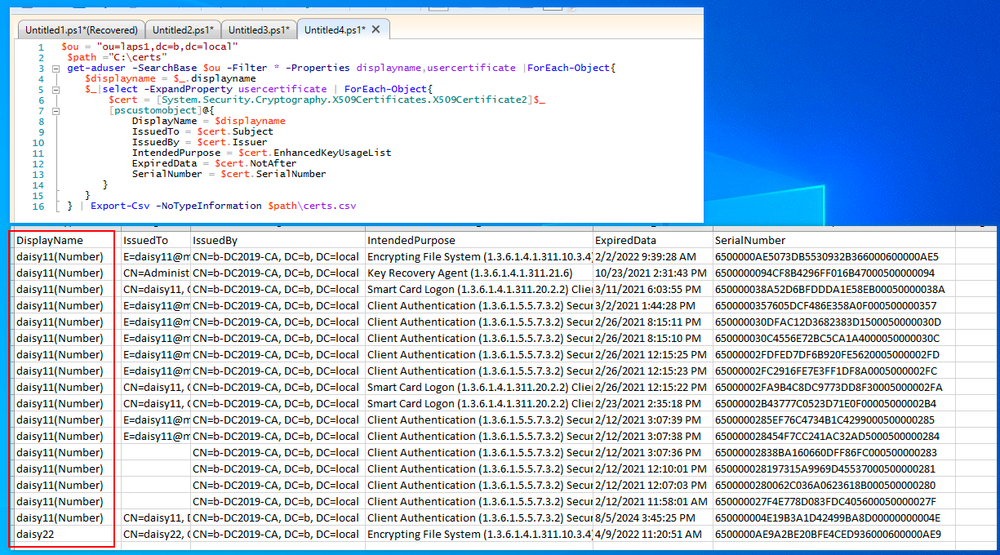
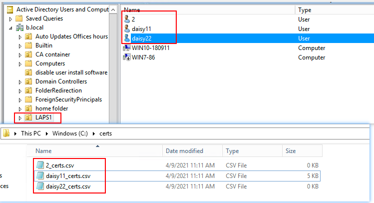
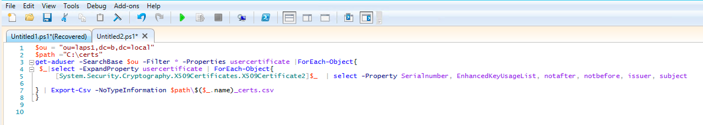
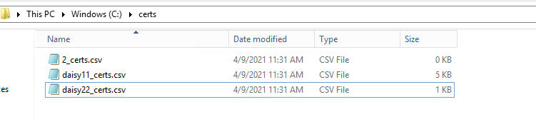
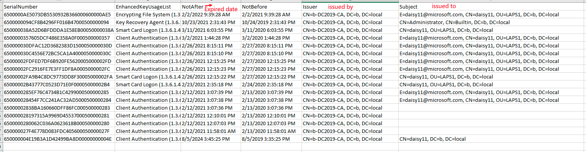
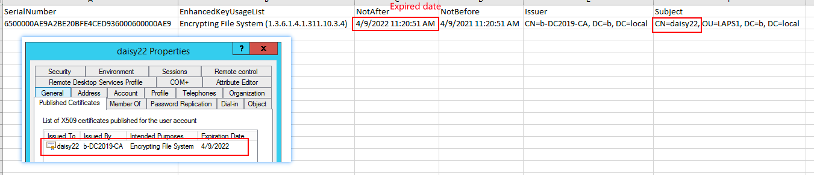
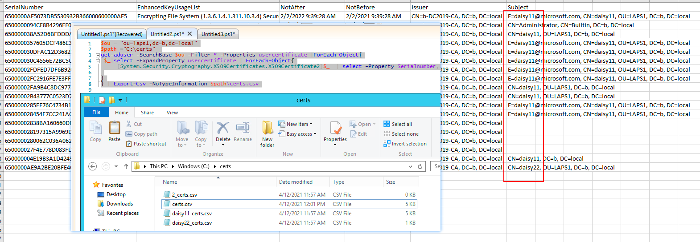

# Export a List of all AD users Certificates for each user

I had to have export the User X509 Certificates for each User in a specific OU, with the Issuer and the Expiration Date.

The Export should result with similar structure found in the AD User Object under Published Certificates Tab.

## Solution 1

You can try the PS script below.

```powershell
 $ou = "ou=laps1,dc=b,dc=local"
  $path ="C:\certs"
  get-aduser -SearchBase $ou -Filter * -Properties displayname,usercertificate |ForEach-Object{
     $displayname = $_.displayname
     $_|select -ExpandProperty usercertificate | ForEach-Object{
         $cert = [System.Security.Cryptography.X509Certificates.X509Certificate2]$_
         [pscustomobject]@{
             DisplayName = $displayname
             IssuedTo = $cert.Subject
             IssuedBy = $cert.Issuer
             IntendedPurpose = $cert.EnhancedKeyUsageList
             ExpiredData = $cert.NotAfter
             SerialNumber = $cert.SerialNumber
        }
     }
  } | Export-Csv -NoTypeInformation $path\certs.csv

```
  

Here is the result:  



## Solution 2

After lots of test in my lab, I can get the result as below.

1.Here is my OU named LAPS1, there are three users in it.  



2.Open Powershell ISE(run as administrator) and type the command below.

```powershell
 $ou = "ou=laps1,dc=b,dc=local"
 $path ="C:\certs" 
 get-aduser -SearchBase $ou -Filter * -Properties usercertificate |ForEach-Object{
  $_|select -ExpandProperty usercertificate | ForEach-Object{
      [System.Security.Cryptography.X509Certificates.X509Certificate2]$_  | select -Property Serialnumber, EnhancedKeyUsageList, notafter, notbefore, issuer, subject
    
 } | Export-Csv -NoTypeInformation $path\$($_.name)_certs.csv
 }
```



**Tip:Please change the OU name and domain name and export path based on your AD environment.**

3.We can see one csv file for one user  


4.For example: we can see cert list for daisy11 and daisy22.  
Daisy 11  


Daisy22  
  
You can try the PS command in your AD environment.


### If need all Certificate Lines in one Excel sheet

We can run PS script below.

```powershell
 $ou = "ou=laps1,dc=b,dc=local"
 $path ="C:\certs" 
 get-aduser -SearchBase $ou -Filter * -Properties usercertificate |ForEach-Object{
  $_|select -ExpandProperty usercertificate | ForEach-Object{
      [System.Security.Cryptography.X509Certificates.X509Certificate2]$_  | select -Property Serialnumber, EnhancedKeyUsageList, notafter, notbefore, issuer, subject
    
 }
 } | Export-Csv -NoTypeInformation $path\certs.csv 

```

Tip: Change the last line.

The result (all users certificates within the OU in the same Excel file):  


## Reference

* https://docs.microsoft.com/en-us/answers/questions/349196/export-a-list-of-all-ad-users-certificates-from-ea.html
* 