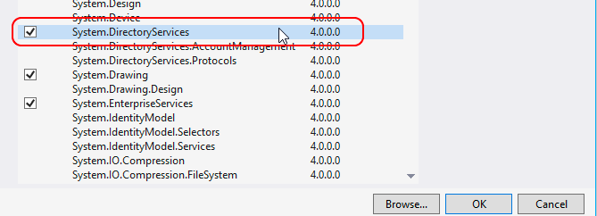

# Get user certificate from Active Directory

Recently I was working with Exchange Web Services or EWS. It’s a neat way to communicate with Exchange Server and manage it’s data, emails in particular. You can do a lot with it, but my task was to encrypt email messages by pooling a recipient certificate from Active Directory, save it to Exchange server and send it to the recipient. Long story short, this is not a post about EWS, but here I will show you a method that will return **X509Certificate2** object back from a byte array, stored under **userCertificate** property in Active Directory.

In order to work with Active directory, you will need to import **System.DirectoryServices** to your project.



The GetUserCertificateFromAD is not a “production grade” method, but it’s a good start. It is somewhat flexible; you can set username and password to authenticate to Active Directory or you can just set it to null. Second, you set the name of the property you want to fetch from AD and finally you can pass the LDAP filter. The property in my case was **userCertificate** and the filter was **(&(objectCategory = person)(objectClass = user)(name={0}))**. Please note, that function only returns first certificate from the array:

```powershell
Byte[] certBytes = (Byte[])result.Properties[propertyName][0];
```

After that it creates a certificate from that array and returns it.

## GetUserCertificateFromAD method
```powershell
/// <summary>
/// Get user certificate from Active Directory
/// </summary>
/// <param name="ldapEntry">LDAP://DC=domain,DC=local</param>
/// <param name="ldapUserName">User to connect to Active Directory, set null if not required.</param>
/// <param name="ldapPassword">Password to connect to Active Directory, set null if not required.</param>
/// <param name="userIdentificator">user name to search in AD</param>
/// <param name="propertyName">Set property name, for example userCertificate</param>
/// <param name="Filter">Ldap filter string like "(&(objectClass=contact)(name=John))".</param>
/// <returns></returns>
public static X509Certificate2 GetUserCertificateFromAD(string ldapPath, string ldapUserName, string ldapPassword, string userIdentificator, string propertyName, string Filter)
{
    try
    {
        DirectoryEntry de;

        if (String.IsNullOrEmpty(ldapUserName) || String.IsNullOrEmpty(ldapPassword))
        {
            de = new DirectoryEntry(ldapPath, null, null, AuthenticationTypes.Anonymous);
        }
        else
        {
            de = new DirectoryEntry(ldapPath, ldapUserName, ldapPassword, AuthenticationTypes.Secure);
        }

        DirectorySearcher dsearch = new DirectorySearcher(de);
        dsearch.Filter = String.Format(Filter, userIdentificator);
        SearchResultCollection searchResults = dsearch.FindAll();

        foreach (System.DirectoryServices.SearchResult result in searchResults)
        {
            //Find userCertificate
            if (result.Properties.Contains(propertyName))
            {
                Byte[] certBytes = (Byte[])result.Properties[propertyName][0];

                X509Certificate2 certificate = null;
                certificate = new X509Certificate2(certBytes);

                return certificate;
            }
            else
            {
                //implement logging
                return null;
            }
        }

        de.Close();
        de.Dispose();
        return null;
    }
    catch (Exception ex)
    {
        //implement logging
        return null;
    }
}
```

Use it like this:

```powershell
X509Certificate2 Certificate = GetUserCertificateFromAD("LDAP://DC=domain,DC=local", "myuser", "mypassword", 
                                                        "john.doe@domain.com", "userCertificate",
                                                        "(&(objectCategory = person)(objectClass = user)(name={0}))");
```

If you want to filter out users by e-mail address use this filter below. Just replace **(name={0})** with **(mail={0})** and pass in the email address and you are good to go.

```powershell
"(&(objectCategory=person)(objectClass=user)(mail={0}))"
```

Ta-da!

## References

* https://mjc.si/2016/12/10/get-user-certificate-from-active-directory/
* 