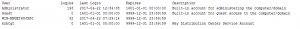

# Listing Active Directory Users Using Python

Sometimes it’s nice to be able to take a quick look at your Active Directory (AD) users and see what’s there and who is actually active. Here’s a quick little Python program to list out your current users.



It’s not a very heavy duty program thanks to the `ldap3` module. You can install the module easily using `pip install ldap3`. [The project page](https://ldap3.readthedocs.io/welcome.html#install) has more info and documentation.

We start off by setting variables with our custom values that we are going to need to use in the program. I would imagine that it’s obvious that you should replace the values used in the assignments with your own values.

```
server_name = 'your_server'
domain_name = 'your_domain'
user_name = 'your_username'
password = 'your_password'
```

Next we create an instance of the LDAP3 `Server` class. We can then use the `server` as a parameter to the `Connection`. Once we have our `connection` instance then we can perform a search in AD. The key is that we are querying for `(objectclass=person)`. That will give us the person objects from AD. Then it’s a quick little loop to display all of the results. Here’s the code:

```
import sys
from ldap3 import Server, Connection, ALL, NTLM, ALL_ATTRIBUTES, ALL_OPERATIONAL_ATTRIBUTES, AUTO_BIND_NO_TLS, SUBTREE
from ldap3.core.exceptions import LDAPCursorError

server_name = 'your_server'
domain_name = 'your_domain'
user_name = 'your_username'
password = 'your_password'

format_string = '{:25} {:>6} {:19} {:19} {}'
print(format_string.format('User', 'Logins', 'Last Login', 'Expires', 'Description'))

server = Server(server_name, get_info=ALL)
conn = Connection(server, user='{}\\{}'.format(domain_name, user_name), password=password, authentication=NTLM, auto_bind=True)
conn.search('dc={},dc=local'.format(domain_name), '(objectclass=person)', attributes=[ALL_ATTRIBUTES, ALL_OPERATIONAL_ATTRIBUTES])
for e in conn.entries:
    try:
        desc = e.description
    except LDAPCursorError:
        desc = ""

print(format_string.format(str(e.name), str(e.logonCount), str(e.lastLogon)[:19], str(e.accountExpires)[:19], desc))

```

If you would like to perform more complex searches there is a set of basic syntax for querying. The project page provides [more details on searching the Directory Information Tree](https://ldap3.readthedocs.io/tutorial_searches.html).

The [list_users program code](./list_users.py) is all yours to use.

## More useful info - group member queries

Use the following method to check all users in a particular group across a forest of OUs and sub-OUs.

To search for users in an OU that have a ‘Member Of’ a certain Group

The filter would be:

```output
(&(objectCategory=person)(objectClass=user)(memberOf:1.2.840.113556.1.4.1941:=CN=MyGroup,OU=User,OU=Groups,OU=Security,DC=domain,DC=com))
```

This example can also be found on SO: [https://stackoverflow.com/questions/6195812/ldap-nested-group-membership](https://stackoverflow.com/questions/6195812/ldap-nested-group-membership)

## How to handle large result sets that exceed AD limit

the limitation of 1000 in the single ldap query is often configured in Active Directory. 

Microsoft articles mention that limit per query. 

Here’s a link that offers a workaround in your AD environment:

https://olivermarshall.net/why-are-ldap-queries-only-returning-1000-results/


## [Query for user in AD using python](#query-for-user-in-ad-using-python)

To validate if a username exists in a particular domain.

```output
To query :
           username -- > anandabhis
           domain name --> example.com
Output : Successfully verified .
```

Here is a simple python script used to connect to the LDAP server.

```python
import ldap
def test_login(self):
        domain = 'EXAMPLE'
        server = 'ldap-001.example.com'
        admin_username = 'admin'
        admin_password = 'secret-password'
        connection = ldap.initialize('ldap://{0}'.format(server))
        connection.protocol_version = 3
        connection.set_option(ldap.OPT_REFERRALS, 0)
        connection.simple_bind_s('{0}\{1}'.format(domain, admin_username), admin_password)
        search_username = 'anandabhis'

```

And here is the next method used to search for the sAMAccountName of the user should allow you to get the attributes of the user.

```python
user_filter = '(sAMAccountName={})'.format(search_username)
base_dn = 'DC={},DC=com'.format(domain)
result = connection.search_s(base_dn, ldap.SCOPE_SUBTREE, user_filter)
print result
```


## References

* https://stackoverflow.com/questions/40225230/how-to-find-all-the-groups-the-user-is-a-member-ldap
* https://stackoverflow.com/questions/46870593/query-for-user-in-ad-using-python
* https://www.accadius.com/listing-active-directory-users-using-python/
* [https://stackoverflow.com/questions/6195812/ldap-nested-group-membership](https://stackoverflow.com/questions/6195812/ldap-nested-group-membership)
* https://olivermarshall.net/why-are-ldap-queries-only-returning-1000-results/
* 