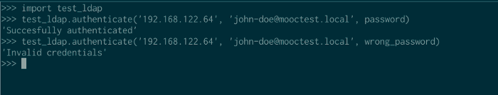
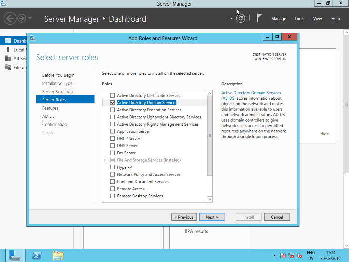
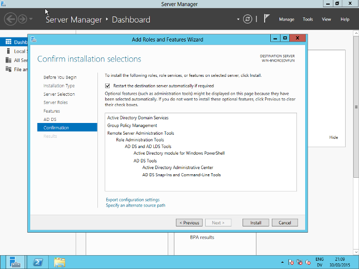
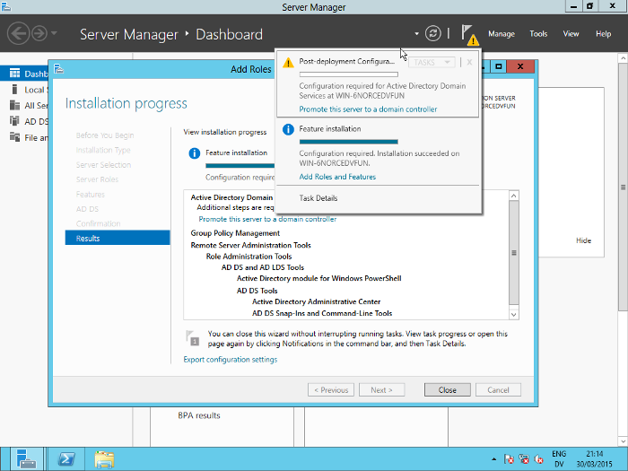
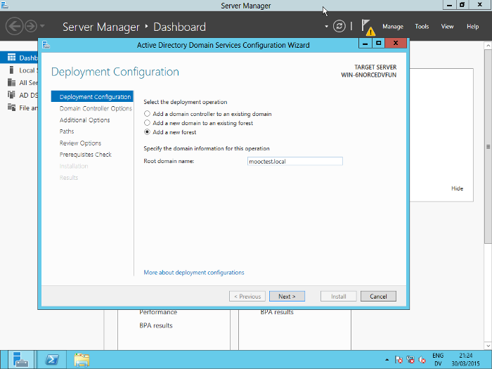
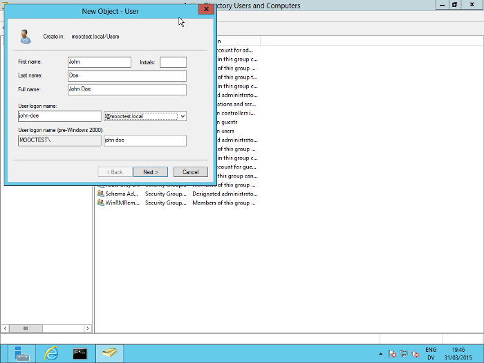
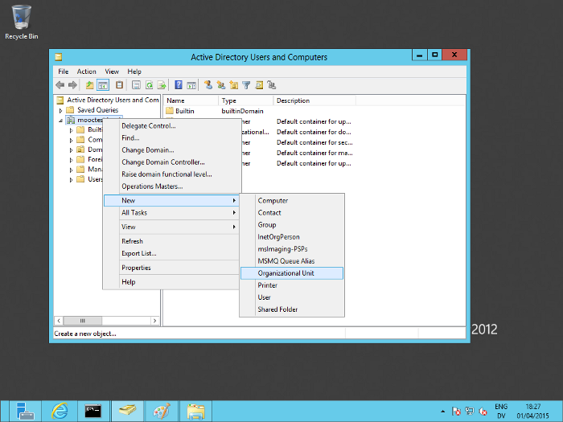
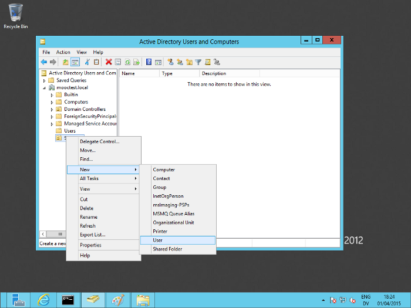
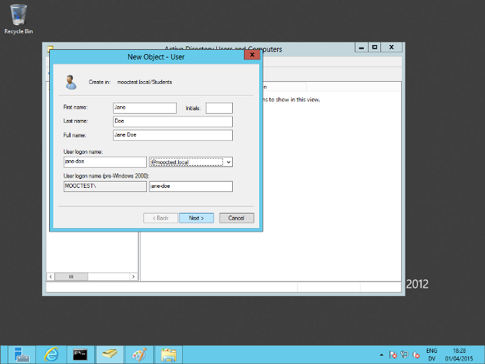
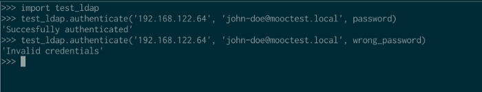

# Python LDAP authentication with Microsoft Active Directory

How to implement LDAP authentication in [edX](https://www.edx.org/) using Microsoft Server with Active Directory.



An example of how it will work

## Install needed roles

First, install the Active Directory Domain Services role:



Add the Active Directory Domain Services role to this Windows server



Click on install, and it’s go time!

After installing the role, promote the server to the domain controller:



Click on the notification to start the promotion wizard



Create a new forest. Since this is a test server, I’ll use a .local domain.

I did not set the server to provide DNS (under _Domain Controller Options_). I’ll set a static IP later, for now, I’ll just use the provided dynamic IP.

I still had to install the VirtIO Ethernet driver, you can find this on the [VirtIO drivers iso](http://www.linux-kvm.org/page/WindowsGuestDrivers/Download_Drivers) that you probably used to install the HDD VirtIO drivers during the installation. Right-click on `NETKVM.INF` and choose `Install`.

Note that you need **not** install Active Directory Lightweight Directory Services; you can query Active Directory just fine.

## Testing it out

If you’re on a debian machine, you can use `sudo apt-get install python-ldap` to install the Python LDAP package. That way, you can `import ldap` from the console anywhere. In the next section, we will install `python-ldap` in a virtual environment.

To try it out, grab the current IP of the Windows server (`ipconfig /all` in `cmd.exe`) and try this:

```shell
$ python
Python 2.7.9 (default, Mar  1 2015, 12:57:24) 
[GCC 4.9.2] on linux2
Type "help", "copyright", "credits" or "license" for more information.
>>> import ldap
>>> conn = ldap.initialize('ldap://192.168.122.64') # the IP address of the Windows Server
>>> conn.protocol_version = 3
>>> conn.set_option(ldap.OPT_REFERRALS, 0)
```

Now try to authenticate:

```shell
>>> conn.simple_bind_s('Administrator@mooctest.local', 'yourpassword') # an account to test
(97, [], 2, [])
```

This is what happens when specifying wrong credentials:

```shell
>>> conn.simple_bind_s('Administrator@mooctest.local', 'wrongpassword')
Traceback (most recent call last):
  File "<stdin>", line 1, in <module>
  File "/usr/lib/python2.7/dist-packages/ldap/ldapobject.py", line 208, in simple_bind_s
    resp_type, resp_data, resp_msgid, resp_ctrls = self.result3(msgid,all=1,timeout=self.timeout)
  File "/usr/lib/python2.7/dist-packages/ldap/ldapobject.py", line 469, in result3
    resp_ctrl_classes=resp_ctrl_classes
  File "/usr/lib/python2.7/dist-packages/ldap/ldapobject.py", line 476, in result4
    ldap_result = self._ldap_call(self._l.result4,msgid,all,timeout,add_ctrls,add_intermediates,add_extop)
  File "/usr/lib/python2.7/dist-packages/ldap/ldapobject.py", line 99, in _ldap_call
    result = func(*args,**kwargs)
ldap.INVALID_CREDENTIALS: {'info': '80090308: LdapErr: DSID-0C0903C5, comment: AcceptSecurityContext error, data 52e, v23f0', 'desc': 'Invalid credentials'}
```

This was surprisingly easy so far! Let’s see how we can use more of the Python LDAP API.

## Using Python’s LDAP module

## Getting set up

We’ll start a new project for this using `virtualenv`. You will need to install `libldap2-dev` and `libsasl2-dev` to install `python-ldap`, see [this answer](http://stackoverflow.com/questions/4768446/python-cant-install-python-ldap) for more information.

```shell
$ virtualenv python-ldap # create a new virtual environment
$ cd python-ldap
$ . bin/activate # activate the virtual environment
$ sudo apt-get install libldap2-dev libsasl2-dev # headers needed for installing python-ldap
$ pip install python-ldap
```

## A test script

Create a simple test script to verify LDAP still works from Python (it should):

```python
#!/usr/bin/env python
import ldap
def authenticate(address, username, password):
    conn = ldap.initialize('ldap://' + address)
    conn.protocol_version = 3
    conn.set_option(ldap.OPT_REFERRALS, 0)
    return conn.simple_bind_s(username, password)
```

Try it from the interpreter using `import test_ldap` and `test_ldap.authenticate()`:

```shell
$ python
Python 2.7.9 (default, Mar  1 2015, 12:57:24) 
[GCC 4.9.2] on linux2
Type "help", "copyright", "credits" or "license" for more information.
>>> import test_ldap
>>> test_ldap.authenticate('192.168.122.64', 'administrator@mooctest.local', 'password')
```

## Creating a new user account

Let’s try creating a new user account. On the server, go to _Active Directory Users and Computers_, then go to _Users_. Right-click, choose _New_ > _User_



Filling the details to create a new user

Observe that this works fine:

```shell
>>> test_ldap.authenticate('192.168.122.64', 'john-doe@mooctest.local', 'password')
(97, [], 1, [])
```

We’ll use the John Doe and the Jane Doe accounts (see the next section) for testing.

## Creating an organizational unit

Create a new organizational unit. I’ll call mine _Students_.



Create a new OU named Students

Now create a new user within that account. I’ll call her _Jane Doe_. We’ll use her to test how to bind to users in OUs.



Right-click on the OU and choose New > User



Fill in the details for the new user

## Exploring the API

Let’s look at some commonly used methods and where to find documentation

## Resources

These are some of the resources I found helpful in exploring `python-ldap`:

-   The [python-ldap site](http://www.python-ldap.org/)
-   The [online python-ldap docs](http://www.python-ldap.org/doc/html/index.html)
-   The [python-ldap tag on StackOverflow](http://stackoverflow.com/questions/tagged/python-ldap?sort=votes&pageSize=15)
-   The [Python LDAP Applications series on PacktPub](https://www.packtpub.com/books/content/python-ldap-applications-part-1-installing-and-configuring-python-ldap-library-and-bin) ([part 2](https://www.packtpub.com/books/content/python-ldap-applications-part-2-ldap-opearations), [part 3](https://www.packtpub.com/books/content/python-ldap-applications-part-3-more-ldap-operations-and-ldap-url-library), [part 4](https://www.packtpub.com/books/content/python-ldap-applications-part-4-ldap-schema))
-   [Python LDAP samples](http://www.grotan.com/ldap/python-ldap-samples.html) by Grotan

## Asynchronous methods

Methods not ending in `_s` are asynchronous methods. Those that do end in `_s` are synchronous.

## ldap.initialize()

The first method you need to use is `ldap.initialize`. It takes one parameter, the LDAP URL to connect to:

```shell
>>> ldap.initialize('ldap://192.168.100.50')
<ldap.ldapobject.SimpleLDAPObject instance at 0x7f6e626d9a70>
```

This returns a `SimpleLDAPObject` instance. We want to save this in a variable so we can do something with it.

```shell
>>> con = ldap.initialize('ldap://192.168.122.64')
>>>
```

Be aware that initializing does not connect to the server yet, you won’t get any errors if you specify a server that doesn’t exist (you will once you try to bind to it).

## ldap.\*bind()

These methods are used to bind to a server. The methods are `bind`, `bind_s`, `sasl_interactive_bind_s`, `simple_bind` and `simple_bind_s`.

You won’t ever need to use `bind` and `bind_s`, since only simply authentication is supported at the moment. You can use `bind`/`bind_s`, but you’d have to provide `ldap.AUTH_SIMPLE` as the third parameter all the time.

For `sasl_interactive_bind_s`, which I won’t cover, you can look [here](https://www.packtpub.com/books/content/python-ldap-applications-part-1-installing-and-configuring-python-ldap-library-and-bin).

I’ll only cover `simple_bind_s` here. As mentioned before, `simple_bind` is the same, but asynchronous. This is what the [documentation](http://www.python-ldap.org/doc/html/ldap.html#ldap.LDAPObject.simple_bind_s) says about it:

```output
LDAPObject.simple_bind_s([who=''[, cred='']]) -> None
After an LDAP object is created, and before any other operations can be attempted over the connection, a bind operation must be performed.
```

`simple_bind_s` takes two parameters: `who`, the username, and `cred`, the password.

```shell
>>> con.simple_bind_s('john-doe@mooctest.local', 'password')
(97, [], 4, [])
>>> con.simple_bind_s('john-doe@mooctest.local', 'wrongpassword')
Traceback (most recent call last):
  File "<stdin>", line 1, in <module>
  File "/usr/lib/python2.7/dist-packages/ldap/ldapobject.py", line 208, in simple_bind_s
    resp_type, resp_data, resp_msgid, resp_ctrls = self.result3(msgid,all=1,timeout=self.timeout)
  File "/usr/lib/python2.7/dist-packages/ldap/ldapobject.py", line 469, in result3
    resp_ctrl_classes=resp_ctrl_classes
  File "/usr/lib/python2.7/dist-packages/ldap/ldapobject.py", line 476, in result4
    ldap_result = self._ldap_call(self._l.result4,msgid,all,timeout,add_ctrls,add_intermediates,add_extop)
  File "/usr/lib/python2.7/dist-packages/ldap/ldapobject.py", line 99, in _ldap_call
    result = func(*args,**kwargs)
ldap.INVALID_CREDENTIALS: {'info': '80090308: LdapErr: DSID-0C0903C5, comment: AcceptSecurityContext error, data 52e, v23f0', 'desc': 'Invalid credentials'}
```

We see that binding successfully returns a weird tuple, while providing a wrong password throws an exception. Looking into the source shows that it returns this:

```python
return resp_type, resp_data, resp_msgid, resp_ctrls
```

…That doesn’t help a whole lot. But here’s what I figured out:

-   `resp_type`: the result type
-   `resp_data`: data returned by the LDAP server
-   `resp_msgid`: an identifier, this increases every message. In this case, it’s `4`, the next message will have a `resp_msgid` of `5`. This is important for asynchronous methods, as we’ll see later
-   `resp_ctrls`: no idea.

Microsoft’s [LDAP Error Codes](http://support.microsoft.com/en-gb/kb/218185) says 0x61 (97) means `The referral limit was exceeded.` but [RFC 2251](https://tools.ietf.org/html/rfc2251#section-4.1.10) says it should be treated as an unknown error code, as it’s not in the range.

[This post](https://mail.python.org/pipermail/python-ldap/2012q2/003121.html) on the mailing list sheds some light on the result type:

```output
The 97 is not the LDAP result code. It's the result type ldap.RES_BIND.
Normally you don't have to look at the results returned by
LDAPObject.simple_bind_s() (unless you want to extract the bind response
controls).
If the LDAP result code is not 0 the accompanying exception is raised like
ldap.INVALID_CREDENTIALS in your example.

```

So exceptions. For a wrong username or password, `ldap.INVALID_CREDENTIALS` will be raised. Another common one is `ldap.SERVER_DOWN`, which happened to me when I hadn’t used the connection in a while on the REPL. Re-initializing the connection did the trick. So trying to bind to the server should look like this (adapted from [here](https://www.packtpub.com/books/content/python-ldap-applications-part-1-installing-and-configuring-python-ldap-library-and-bin)):

```python
try:
    l.simple_bind_s('john-doe@mooctest.local', 'password')
except ldap.INVALID_CREDENTIALS:
    print("Your username or password is incorrect.")
except ldap.SERVER_DOWN:
    print("The server appears to be down.")
except ldap.LDAPError, e:
    if type(e.message) == dict and e.message.has_key('desc'):
        print e.message['desc']
    else: 
        print e

```

If we don’t receive any messages, we know that we bound (thus authenticated) successfully!

## ldap.unbind\*()

Unbinding will disconnect from the LDAP server and free up resources. It will also mark the `LDAPObject` invalid, and all new operations and it will fail. Yes, that includes new bindings:

```shell
>>> con.unbind_s()
>>> con.simple_bind_s('john-doe@mooctest.local', '123')
Traceback (most recent call last):
  File "<stdin>", line 1, in <module>
  File "/usr/lib/python2.7/dist-packages/ldap/ldapobject.py", line 207, in simple_bind_s
    msgid = self.simple_bind(who,cred,serverctrls,clientctrls)
  File "/usr/lib/python2.7/dist-packages/ldap/ldapobject.py", line 201, in simple_bind
    return self._ldap_call(self._l.simple_bind,who,cred,RequestControlTuples(serverctrls),RequestControlTuples(clientctrls))
  File "/usr/lib/python2.7/dist-packages/ldap/ldapobject.py", line 99, in _ldap_call
    result = func(*args,**kwargs)
ldap.LDAPError: LDAP connection invalid
```

You have to initialize the server again to bind again.

## Final script

```python
#!/usr/bin/env python
import ldap
def authenticate(address, username, password):
    conn = ldap.initialize('ldap://' + address)
    conn.protocol_version = 3
    conn.set_option(ldap.OPT_REFERRALS, 0)
    try:
        result = conn.simple_bind_s(username, password)
    except ldap.INVALID_CREDENTIALS:
        return "Invalid credentials"
    except ldap.SERVER_DOWN:
        return "Server down"
    except ldap.LDAPError, e:
        if type(e.message) == dict and e.message.has_key('desc'):
            return "Other LDAP error: " + e.message['desc']
        else: 
            return "Other LDAP error: " + e
    finally:
        conn.unbind_s()
    return "Succesfully authenticated"
```

## Conclusion



The final product

This post was an exploration into Python, Active Directory, and if they work together. Turns out they do, without a lot of configuration! I hope to use this in a future Django project. I was only really interested in authentication, but if you want to try more things (such as searching, modifying passwords, …) you can refer to the _Resources_ section above. For example, searching in the _Students_ OU we created earlier:

```shell
>>> import ldap
>>> import ldif
>>> ldif_writer = ldif.LDIFWriter(sys.stdout)
>>> basedn = = "OU=students,DC=mooctest,DC=local"
>>> results = con.search_s(basedn,ldap.SCOPE_SUBTREE,"(cn=*)")
>>> for dn,entry in results:
...     ldif_writer.unparse(dn,entry)
... 
dn: CN=Jane Doe,OU=Students,DC=mooctest,DC=local
accountExpires: 9223372036854775807
badPasswordTime: 130723115748598376
badPwdCount: 1
cn: Jane Doe
codePage: 0
countryCode: 0
dSCorePropagationData: 16010101000000.0Z
displayName: Jane Doe
distinguishedName: CN=Jane Doe,OU=Students,DC=mooctest,DC=local
givenName: Jane
instanceType: 4
lastLogoff: 0
lastLogon: 0
lastLogonTimestamp: 130723115727192242
logonCount: 0
name: Jane Doe
objectCategory: CN=Person,CN=Schema,CN=Configuration,DC=mooctest,DC=local
objectClass: top
objectClass: person
objectClass: organizationalPerson
objectClass: user
objectGUID:: E8uawUM+DkyLzjIQE5CSHQ==
objectSid:: AQUAAAAAAAUVAAAAyQ9OG3xBa/Vl4s3bVQQAAA==
primaryGroupID: 513
pwdLastSet: 130723115588128828
sAMAccountName: jane-doe
sAMAccountType: 805306368
sn: Doe
uSNChanged: 20571
uSNCreated: 20565
userAccountControl: 512
```

## References

* https://blog.thomastoye.be/python-ldap-authentication-with-microsoft-active-directory-46661bebc483
* 

