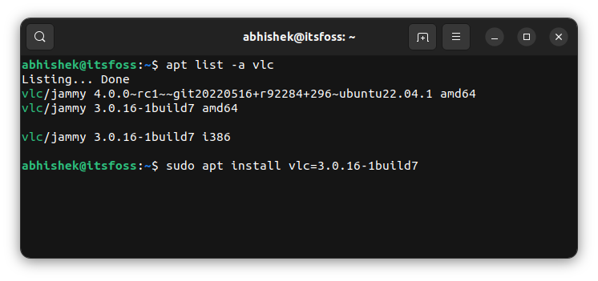
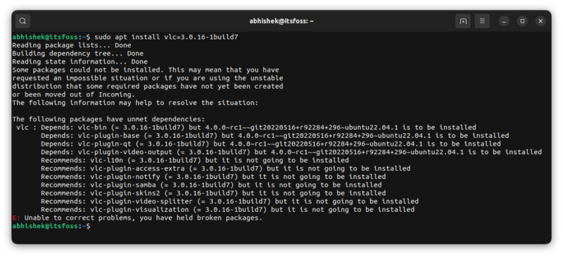
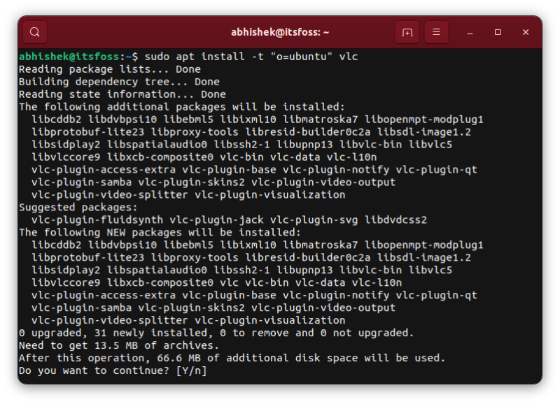

# Install Specific Package Version With Apt Command in Ubuntu

Want to install a specific version of a package in Ubuntu? You can do that ‘easily’ in the following manner:

```shell
sudo apt install package_name=package_version
```

How do you know which versions are available for a certain package? Use this command:

```shell
apt list --all-versions package_name
```

In the screenshot below, you can see that I have two versions of VLC available and I use the command to install the older version:



Install specific versions with Ubuntu

Sounds like a simple task, right? But things are not as simple as they look. There are several ifs and buts involved here.

This tutorial will cover all the important aspects of installing a specific program version using apt or apt-get commands.

## Things to know about installing a specific version of a program

You need to know a few things about how APT and repositories work in Ubuntu and Debian-based distributions.

### No older versions from the same source

Ubuntu doesn’t keep older versions of packages in the repository. You may see more than one version in specific cases, temporarily. For example, you run the apt update (but not upgrade), and a new version is available. You may see two versions for the same package in the [apt cache](https://itsfoss.com/apt-cache-command/). But as soon as the package is upgraded to the new version, the older version is removed from the cache as well as the repositories.

### Use multiple sources for different versions

To get multiple versions of the same package, you’ll have to add multiple sources. For example, VLC is in version 3.x. Adding the [VLC daily build PPA](https://launchpad.net/~videolan/+archive/ubuntu/master-daily?ref=its-foss) will give the (unstable) version 4.x.

Similarly, **__you can download a DEB file with a different version and install it__**.

### The higher version always gets the priority

If you have the same package available from more than one source, by default, Ubuntu will install the highest available version.

In the previous example, if I install VLC, it will install version 4.x, not 3.x.

### The older version gets upgraded to the available newer version

That’s another potential problem. Even if you install the older version of a package, it gets upgraded to the newer version (if available). You have to [hold the package and stop it from upgrading](https://itsfoss.com/prevent-package-update-ubuntu/).

### Dependencies also need to be installed

If the package has dependencies, you’ll have to install the required version of the dependent packages as well.

Now that you know a few potential issues let’s see how to tackle them.

## Installing specific version of a package

I am taking the example of VLC in this tutorial. VLC version 3.0.16 is available in Ubuntu’s repositories. I added the daily build PPA and that gives me the release candidate of VLC version 4.0.

As you can see, I have two VLC versions available in the system right now:


Multiple versions of the same package

```shell
abhishek@itsfoss:~$ apt list -a vlc
Listing... Done
vlc/jammy 4.0.0~rc1~~git20220516+r92284+296~ubuntu22.04.1 amd64
vlc/jammy 3.0.16-1build7 amd64
vlc/jammy 3.0.16-1build7 i386
```

Since the higher version takes priority, using ‘apt install vlc’ will result in the installation of VLC 4.0. But I want to install the older version 3.0.16 for the sake of this tutorial.

```shell
sudo apt install vlc=3.0.16-1build7
```

But here’s the thing. The vlc package has several dependencies and those dependencies also need specific versions. However, Ubuntu tries to install the available higher versions for them, and thus, you get the classic ‘[you have held broken packages](https://itsfoss.com/held-broken-packages-error/)‘ error.



To fix this, you have to provide specific versions of all the dependent packages it complains about. So that command becomes something like this:

```shell
sudo apt install vlc=3.0.16-1build7 \
 vlc-bin=3.0.16-1build7 \
 vlc-plugin-base=3.0.16-1build7 \
 vlc-plugin-qt=3.0.16-1build7 \
 vlc-plugin-video-output=3.0.16-1build7 \
 vlc-l10n=3.0.16-1build7 \
 vlc-plugin-access-extra=3.0.16-1build7 \
 vlc-plugin-notify=3.0.16-1build7 \
 vlc-plugin-samba=3.0.16-1build7 \
 vlc-plugin-skins2=3.0.16-1build7 \
 vlc-plugin-video-splitter=3.0.16-1build7 \
 vlc-plugin-visualization=3.0.16-1build7
```

In case you are wondering, the trailing \\ at the end of each line is just a way to write a single command over multiple lines.

**Does it work? In many cases, it will.** But I have chosen a complicated example of VLC, which has lots of dependencies. Even the mentioned dependencies have dependencies on other packages. It gets messy.

An alternative is to specify the source while installing.

### Alternatively, specify the repository source

You have added multiple sources, so you should have some idea about the sources the package comes from.

Use the command below and search for the repository:

```shell
apt-cache policy | less
```

Focus on the lines that come after the repository name:

```shell
500 http://security.ubuntu.com/ubuntu jammy-security/multiverse i386 Packages
     release v=22.04,o=Ubuntu,a=jammy-security,n=jammy,l=Ubuntu,c=multiverse,b=i386
     origin security.ubuntu.com
```

You can specify the o,l,a, etc parameters.

In my original example, I want to install VLC from Ubuntu’s repository (to get 3.16) instead of the PPA (which gives me 4).

So the command below will install VLC 3.16 along with all the dependencies:

```shell
sudo apt install -t "o=ubuntu" vlc
```



Looks good? But the problem comes when you have to update the system. Then it complains about not finding the specified version.

**What else can be done?**

To install an older version, remove the source of the newer version from your system (if possible). It helps get rid of the dependencies hell issues.

If that’s not possible, check if you can get it in some other packaging formats like Snap, Flatpak, AppImage, etc. In fact, Snap and Flatpak also allow you to choose and install from available versions. Since the applications are sandboxed, it’s easier to manage the dependencies for different versions.

## Hold the package and prevent upgrade

If you manage to install a specific program version, you may want to avoid accidentally upgrading to the newer version. It’s not too complicated to achieve this.

```shell
sudo apt-mark hold package_name
```

You can remove the hold so that it can be upgraded later:

```shell
sudo apt-mark unhold package_name
```

[More information on `apt-mark` can be found here](apt-prevent-package-update.md).

Note that dependencies of a package are not automatically held. They need to be individually mentioned.

## Conclusion

As you can see, there is a provision to install the selected version of a program. Things only get complicated if the package has dependencies. Then you get into the dependency hell.

The same approach can be used for [downgrading a package](https://itsfoss.com/downgrade-apt-package/) after installing it.

Downgrading a Package via apt-get in Ubuntu and Debian

## Reference

- https://itsfoss.com/apt-install-specific-version/
- 