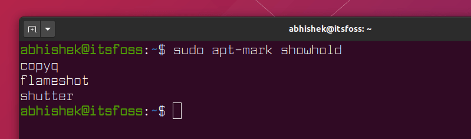
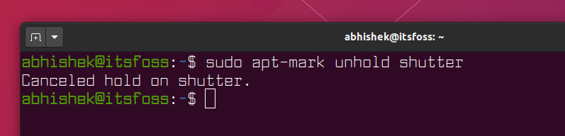
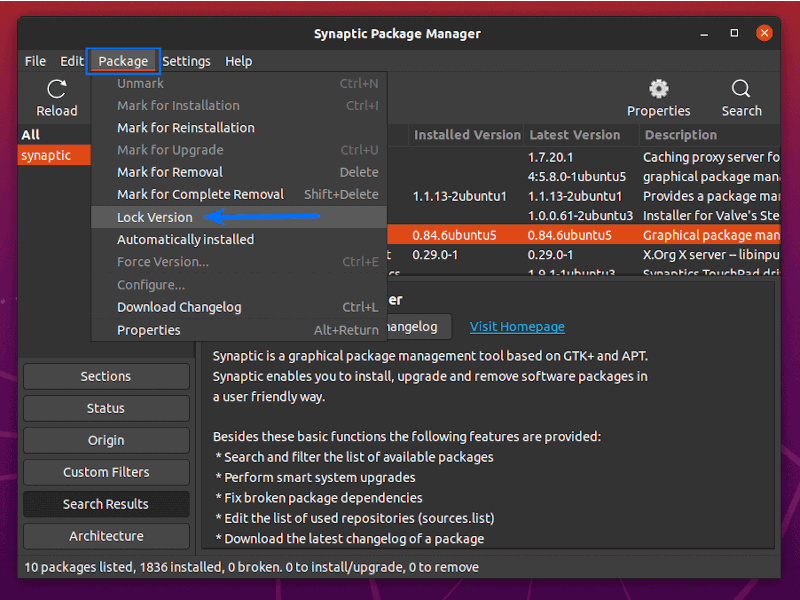

# Apt - How to prevent a Package From Being Updated in Ubuntu and Debian-based Linux Distributions

**__Brief: Quick tutorial to show you how to prevent certain packages from being updated in Ubuntu and Debian based Linux distributions.__**

When you [update your Ubuntu system](https://itsfoss.com/update-ubuntu/), all the applications, packages are updated at once.

This is of course very convenient as you don’t have to worry about updating the installed packages one by one.

But there may be situations where you want to retain the version of a particular installed application.

In this tutorial, I’ll show you both GUI and terminal methods to disable certain package updates in Ubuntu and other Ubuntu and [Debian](https://www.debian.org/?ref=itsfoss.com) based systems.

## Method 1: Prevent package update using apt-mark command

Ubuntu’s package manager, apt has plenty of useful utilities for almost every aspect of package management. One of the [apt commands](https://itsfoss.com/apt-command-guide/) is apt-mark that you can use to block or allow certain packages from the system updates.

To **hold** a package and thus prevent apt from making changes to it, you can use the apt-mark command with hold option.

**The tab completion doesn’t work with the apt-mark command**. You need to type the exact name of the package you are trying to update.

```shell
sudo apt-mark hold package_name
```

Make sure that you replace the **package-name** with the appropriate package you’re trying to target. Here’s an example:


To list all the packages that are held you can use:

```shell
apt-mark showhold
```



To remove **hold** on a package:

```shell
sudo apt-mark unhold package_name
```



Now that you are aware of the commands, let’s see how to prevent package update graphically.

## Method 2: Prevent package update using Synaptic Package Manager

Once upon a time, [Synaptic](https://www.nongnu.org/synaptic/?ref=itsfoss.com) used to ship by default in Ubuntu and it was also the default GUI package manager in Ubuntu until 11.10. You have a better graphical GNOME Software Center now but you could still use Synaptic.

Use the following command to [install Synaptic Package Manager in Ubuntu/Debian](https://itsfoss.com/synaptic-package-manager/):

```shell
sudo apt install synaptic
```

Next, the follow the steps below:

-   Launch Synaptic Package Manager
-   Search for your desired package in the search bar
-   Select the desired package
-   In the **Package** menu, choose **Lock Version**
-   Save it



To undo this, just do the same and, this time select **Unlock Version**.

## Reference

- https://itsfoss.com/prevent-package-update-ubuntu/
- 