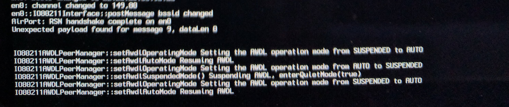

# How to fix Mac OSX stuck/hanging on progress bar after login

[](./img/Apple-Loading-Bar-630x630.jpg "How to fix Mac OSX stuck/hanging on progress bar after login")

Last night after I rebooted my 2013 Macbook Pro, I was completely unable to login to any user accounts, and even though the passwords were accepted and the login started, it would just sit (hang) at 100% progress, and wouldn't go any further.  After trying a few recovery options, including the feature when you’re "unable to enter password at login screen", that only resulted in the bootup hanging at the initial Apple logo progress bar at 100%.  I ended up spending almost 4 hours trying to figure out the problem, and here’s how I debugged it and was eventually able to resolve the issue.

Sooooo ... around 9PM last night and wouldn't you know it, right after I reboot my laptop I was completely unable to login or do anything at all ... how lucky is that?!  I spent the rest of the evening trying to figure out the problem (stayed up until almost 3am before I gave up), until I knew I needed to get some sleep and try again with a clear head.

## The Problem

So the issue I was having at first, the computer would boot up all the way to the login screen, I would enter my password and it would start to login just like normal, and once the progress bar got to 100%, it would just sit there.  No alerts, notices, sounds, nothing ... after about an hour of letting the laptop sit thinking it may be some update I wasn't aware of ... I knew there was some other problem preventing OSX Ventura from logging all the way in.  This happened on any user account I tried logging in with.

After letting the login screen sit there for a minute while I searched for anybody else online who had this problem, a notice came up on the screen saying if I wasn't able to enter my password, to power off my macbook, and then power it back on, and it would bring me to some recovery screen.  So of course I tried that, which then gave me three options ... I chose the one for not being able to enter password at login screen.  This asked me to unlock my drive, and of course, after rebooting, now the bootup stuck on the progress bar with the Apple logo ... doh! That’s even worse than it was before!  I tried booting into safe mode, tried resetting NVRAM, and still nothing!  Safe mode wouldn't even work at all for me, the only option that worked was booting into recovery.

## Debugging The Problem

Being as though I manage Windows and Linux server farms for corporations and businesses, that is where my skillset lies the most.  I’ve never really had to do much with OSX or Macbook, because the majority of things I can do through the command line which is the entire reason I went with a Macbook, because of OSX being a derivative of UNIX, but now that I couldn't do anything I was stuck between a rock and a hard place.

Here are the resources I found online for debugging the problem, which came in very handy:

[Mac OSX Startup Key Combinations](https://support.apple.com/en-us/HT201255)

[](./img/IMG_20161216_095254.jpg)
Above has all the startup key combinations you can use to try and fix any problems you’re having, make sure to read through them all, as you have to hit the keys at a certain time (after hearing the chime) for it to work correctly.  That threw me through a loop at first because I tried holding them before I heard the sound.

The two startup key combinations that were most useful (and only ones that worked) for me were  Command (⌘)-R  (Startup in [OSX Recovery](https://support.apple.com/kb/HT201314)) and Command (⌘)-V (Startup in [Verbose Mode](https://support.apple.com/HT201573)).

## First Issue Found

I first used the Startup in Verbose Mode to see what was actually happening and what was causing the system to hang and get stuck at the progress bar.

The first issue I found, was this error message constantly being output, but never moving past it:

```shell
Sandbox: coresymbolicatio(259) System Policy: deny(1) file-write-data /System/Library/Caches/com.apple.coresymbolicationd/data
Sandbox: coresymbolicatio(259) System Policy: deny(1) file-write-unlink /System/Library/Caches/com.apple.coresymbolicationd/data
Sandbox: coresymbolicatio(263) System Policy: deny(1) file-write-data /System/Library/Caches/com.apple.coresymbolicationd/data
Sandbox: coresymbolicatio(263) System Policy: deny(1) file-write-unlink /System/Library/Caches/com.apple.coresymbolicationd/data
Sandbox: coresymbolicatio(266) System Policy: deny(1) file-write-data /System/Library/Caches/com.apple.coresymbolicationd/data
Sandbox: coresymbolicatio(266) System Policy: deny(1) file-write-unlink /System/Library/Caches/com.apple.coresymbolicationd/data
No interval found for . Using 8000000
No interval found for . Using 8000000
No interval found for . Using 8000000
No interval found for . Using 8000000
```

So to me it looked like there was some type of permissions issue that was problem causing the issue.  To fix this, I rebooted the macbook into [OSX Recovery](https://support.apple.com/kb/HT201314) Command (⌘)-R and then went to **Utilities > Terminal** to load a terminal and try and resolve the problem.

The next problem was when I looked at the filesystem, my hard drive was nowhere to be found in the  /Volumes/ directory.  My drive was encrypted so I figured that was the problem, but even looking at Disk Utility, there was no way to mount the drive, and it just showed as greyed out in the drive list.

Luckily I found this issue on Stack Overflow with details on how to mount the drive (this comes in very handy to fix the second issue below).

### How to mount encrypted drive in Mac OSX Recovery Terminal

Inside the terminal window, type in the command below to list out all of the drives:

```shell
diskutil list
```

Look for something similar to this below. What we need is the lvUUID so we can mount it and then be able to access it from the OSX Recovery Terminal:

```shell
<span class="typ">Logical</span>
<span class="typ">Volume</span>
<span class="pln"> on disk0s2 </span>
<span class="lit">4B2EFAAE</span>
<span class="pun">-</span>
<span class="pln">C871</span>
<span class="pun">-</span>
<span class="lit">4E6D</span>
<span class="pun">-</span>
<span class="pln">AB15</span>
<span class="pun">-</span>
<span class="lit">2DDE604B97CE</span>
<span class="pun">//</span>
<span class="pln"> this is lvUUID</span>
<span class="typ">Unlocked</span>
<span class="typ">Encrypted</span>
```

As you can see, it shows as encrypted, and is probably why it wasn't auto mounted (I assume), so let’s go ahead and unlock and mount it.  Type the command below, and you will be prompted for your password:

```shell
diskutil cs unlockVolume lvUUID #replace lvUUID by the one shown in the diskutil listing
```

Once you run that command, you should now see another directory inside the  /Volumes/ directory, with all your hard drive contents. Yay!

### How to fix the coresymbolicationd deny error

To fix the first error, I found a post on a forum thread, and this command allowed me to then set permissions on the file without getting a permission died or read-only error:

```shell
chflags -R norestricted /Volumes/*/System/Library/Caches/com.apple.coresymbolicationd/data
```

You can change the asterisk to match your actual drive volume’s name if the above command doesn't work (it should work as a wildcard).

So, that should fix it right?  Let’s reboot and find out...

## Second Issue Found

Nope!  That wasn't the problem, after rebooting again the bootup would hang and get stuck at the initial bootup progress bar, this time the only error that could see (why booting up with Verbose mode), was this:

```shell
IO80211AWDLPeerManager::setAwdlOperatingMode Setting the AWDL operation mode from SUSPENDED to AUTO
IO80211AWDLPeerManager::setAwdlAutoMode Resuming AWDL
IO80211AWDLPeerManager::setAwdlOperatingMode Setting the AWDL operation mode from AUTO to SUSPENDED
IO80211AWDLPeerManager::setAwdlSuspendedMode() Suspending AWDL, enterQuietMode(true)
IO80211AWDLPeerManager::setAwdlOperatingMode Setting the AWDL operation mode from SUSPENDED to AUTO
IO80211AWDLPeerManager::setAwdlAutoMode Resuming AWDL
```

I was also seeing errors similar to this, when looking at the `/var/log/system.log` files:

```shell
com.apple.kextd[53]: Cache file /System/Library/Caches/com.apple.kext.caches/Startup/IOKitPersonalities_x86_64.ioplist.gz is out of date; not using.
com.apple.kextd[53]: Failed to send personalities to the kernel.
com.apple.kextd[53]: Error: Couldn't send kext personalities to the IOCatalogue.
```

After searching on Google looking for a fix, I couldn't find much of anything, until I came across a link to a blog post, while searching about kext , on a forum reply, or somewhere else on the internet (can't remember exactly where), which was exactly what I needed! Eureka!


[OS X El Capitan 10.11.x Hanging on Boot \[FIXED\]](https://www.justinsilver.com/technology/os-x-el-capitan-10-11-1-hanging-on-boot-fixed/)

In his blog post he goes over how his issue was related to Kernel Extension, and that’s when I remembered, before rebooting I had installed LG USB drivers, and that had to be the cause!

## The Final Resolution and Fix

Now that I had a little more to go on, I could do some more testing.  So go ahead and boot back into OSX Recovery (Command+R) and then open up the Terminal again (**Utilities > Terminal**).  First thing I had to do (unlike in tutorial in link above) was to unlock my hard drive mounted under /Volumes/.  Make sure you do that first if you don't see your drive under /Volumes (look above for tutorial).

Then go ahead and change directories to the Extensions directory:

```shell
cd /Volumes/*/Library/Extensions
```

I then did a quick `ls -lah | grep lg` and sure enough, there were about 7 lg extension files in that directory:

```shell
drwxr-xr-x   3 root  wheel   102B Dec 15 20:39 lgandroid_mdmcontrol.kext
drwxr-xr-x   3 root  wheel   102B Dec 15 20:39 lgandroid_mdmdata.kext
drwxr-xr-x   3 root  wheel   102B Dec 15 20:39 lgandroid_ndiscontrol.kext
drwxr-xr-x   3 root  wheel   102B Dec 15 20:39 lgandroid_ndisdata.kext
drwxr-xr-x   3 root  wheel   102B Dec 15 20:39 lgandroid_rndis.kext
drwxr-xr-x   3 root  wheel   102B Dec 15 20:39 lgandroid_serial.kext
drwxr-xr-x   3 root  wheel   102B Dec 15 20:39 lgandroid_usbbus.kext
```

Following the tutorial from the link above, I then created a new directory (in case I needed those files for some weird reason)

```shell
mkdir /Volumes/*/Library/ExtensionsDisabled
```

and then moved all the **lg** kernel extension files into that directory:

```shell
mv /Volumes/*/Library/Extensions/lg* /Volumes/*/Library/ExtensionsDisabled/
```

You can replace the asterisk with your drive name if that doesn't work, I think by default the full path should be `/Volumes/MAC\ HD/Library/Extensions` unless you have renamed or set a different label/name on the drive, like I did.

After that, close out the terminal and reboot the computer ... and to my surprise, VOILA!  It worked!! AHHH!  So in the end, the culprit came down to a stupid LG kernel extension that caused the problem.  Now this may not necessarily be your exact issue, but should point you in the right direction to get the issue resolved if it’s a kernel extension problem.

## Moving all non-default kext (Kernel Extension) files

The tutorial I found has great information, and code to move all **non-default** **kext files** to the disabled directory, which you can find below.  Make sure to update the paths to match yours, and if necessary, use the tutorial above to mount and unlock your drive if it’s not accessible already.

```shell
#!/bin/bash

# mount the drive as read/write
mount -rw /
 
# create a directory for "disabled" extensions
mkdir /Volumes/MAC\ HD/Library/ExtensionsDisabled
 
# view files that exist in your Extensions folder but not the recovery partition
kexts=`comm -23 <(ls /Volumes/MAC\ HD/Library/Extensions|sort) <(ls /Library/Extensions|sort)`
echo $kexts
 
# move "extra" kext files to the "disabled" directory
for kext in $kexts; do
    mv /Volumes/MAC\ HD/Library/Extensions/$kext /Volumes/MAC\ HD/Library/ExtensionsDisabled/$kext; 
done
 
exit
```

Because there’s a good chance if you try to type in this entire script by hand, that you may miss something, in the terminal run the following curl to fetch the code directly:

```shell
$ curl https://github.com/lj020326/ansible-datacenter/tree/main/docs/mac_OS/move-kext-to-disabled.sh -o /tmp/movekext.sh
```

Then edit the script above to UPDATE ALL INSTANCES OF `/Volumes/Macintosh\\ HD/Library/` TO MATCH YOURS, hit CTRL + X to exit and save:

```shell
nano /tmp/movekext.sh
```

Then set execute permissions on the file
```
$ chmod +x /tmp/movekext.sh
```

Then execute it by typing in this command:

```shell
bash /tmp/movekext.sh
```

And voila!  That should move all non-default kernel extension files (kext) to the ExtensionsDisabled  directory, reboot your computer, and you should now be able to login to the computer!  You may need to move some of those files back, see the tutorial this code came from for in depth explanation and details on how to do so.

Good luck and hopefully you are as happy as I was after dealing with such a stupid issue!  Without [Justin Silver’s blog post](https://www.justinsilver.com/technology/os-x-el-capitan-10-11-1-hanging-on-boot-fixed/) I would still be scratching my head wondering what to do next!

## Reference

- [OS X El Capitan 10.11.x Hanging on Boot \[FIXED\]](https://www.justinsilver.com/technology/os-x-el-capitan-10-11-1-hanging-on-boot-fixed/)
- [om.apple.coresymbolicationd -problems?](http://forums.macrumors.com/threads/com-apple-coresymbolicationd-problems.1957701/)
- [Mac startup key combinations](https://support.apple.com/en-us/HT201255)
- [Mounting/Unlocking Encrypted Drive in OSX Recovery Terminal](http://apple.stackexchange.com/questions/236206/backup-files-from-terminal-in-recovery-mode)
- [how-to-fix-mac-osx-stuckhanging-on-progress-bar-will-not-boot](https://smyl.es/how-to-fix-mac-osx-stuckhanging-on-progress-bar-will-not-boot/)

