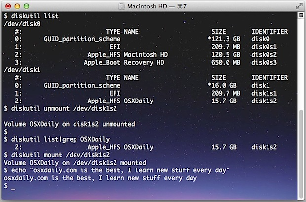

# Mount & Unmount Drives from the Command Line in Mac OS X

You can mount and unmount drives, volumes, and disks from the command line of MacOS and Mac OS X.
  
This method works with:

- external USB disks
- hard drives
- Firewire
- Thunderbolt
- DVD’s
- CD’s
- network drives
- even USB thumb drives
- any volume that can be mounted and accessed through the incredibly helpful diskutil command.

By using the command line to remount the drive, the entire process can be completed remotely if necessary through [SSH](https://osxdaily.com/2011/09/30/remote-login-ssh-server-mac-os-x/), and without ever having to physically disconnect a drive from the Mac. This is infinitely useful for troubleshooting situations, for scripting and automation, and it’s a great trick for those of us who just like to tinker around in Terminal.

## How to Unmount a Drive from Command Line on Mac

Let’s first cover unmounting drives. To do this you’ll need another volume attached or connected to the Mac in some form or another, then launch Terminal to get started (sits in /Applications/Utilities/).

#### 1: List All Drives

The first thing you’ll need to do is list the connected drives. This will provide a list of all drives that are attached to the Mac, that are either mounted and unmounted, and all of their respective partitions. We are doing this so we can get the drive identifier, which is typically something like disk1s2, or disk2s2, etc

`diskutil list`

The output will look something like this:

```shell
$ diskutil list
/dev/disk0
#: TYPE NAME SIZE IDENTIFIER
0: GUID_partition_scheme *121.3 GB disk0
1: EFI 209.7 MB disk0s1
2: Apple_HFS Macintosh HD 120.5 GB disk0s2
3: Apple_Boot Recovery HD 650.0 MB disk0s3
/dev/disk1
#: TYPE NAME SIZE IDENTIFIER
0: GUID_partition_scheme *16.0 GB disk1
1: EFI 209.7 MB disk1s1
2: Apple_HFS OSXDaily 15.7 GB disk1s2
```


For the sake of this example, we’ll focus on the attached drive named “OSXDaily”, which happens to be an external USB thumb drive that appears last in the list. Note the identifier for that drive is “disk1s2” and we’ll carry that to the next series of commands to unmount and remount it.

It’s probably worth mentioning that drives will always be located in /dev/ and thus /dev/ will always be prefixed to the identifier.

#### 2: Unmount the Specified Drive

Still using the diskutil command, we’ll point it at the drive in question to unmount.

`diskutil unmount /dev/disk1s2`

This will report back the named volume and location has been unmounted, like so:

`$ diskutil unmount /dev/disk1s2   Volume OSXDaily on disk1s2 unmounted`

That’s all there is to it. You’ll notice the drive is no longer accessible in Finder, but it will still be visible through diskutil from the command line, or the more familiar Disk Utility app in Mac OS X’s GUI.

## How to Mount a Drive from the Command Line on Mac

If you can unmount a drive, of course you can mount or remount one too. The command sequence is very similar; locate the volume, then mount the drive.

#### 1: Find the Drive to Mount

If you already know where the volume is located, you can ignore part 1 and jump straight to part 2, but let’s cover retrieving the volume identifier anyway. This time around we’ll shorten it a bit because we’ll assume we know the name of the drive to mount, thus we only need to locate the identifier. We’ll do this by using grep to shorten the output of the diskutil command like so:

`$ diskutil list |grep OSXDaily   2: Apple_HFS OSXDaily 15.7 GB disk1s2`

That output is obviously much shorter than the [full output](https://osxdaily.com/2009/12/01/list-all-mounted-drives-and-their-partitions-from-the-terminal/) of diskutil list which we showed above.

For this example, the drive “OSXDaily” is still located at /dev/disk1s2 and that’s what we’ll mount.

#### 2: Mount (or Remount) the Drive

To mount (or remount) a drive, we’ll use the same diskutil command with a new flag and inputs like so:

`diskutil mount /dev/disk1s2`

Using the same examples as elsewhere, here is what the command and the output will look like:

`$ diskutil mount /dev/disk1s2   Volume OSXDaily on /dev/disk1s2 mounted`

This obviously mounts the drive again, and it will also make the mounted volume visible again in the Mac OS X Finder and to GUI-based apps in the various Open or Save dialog boxes.



### How to Unmount & Remount a Drive / Volume in a Single Command

Want to quickly unmount and remount the same volume, essentially power cycling it’s connectivity to the Mac? You can do that in a single command by stringing the two together like so:

`diskutil unmount /dev/disk1s2;diskutil mount /dev/disk1s2;echo "Remounted Volume"`

This would look like the following when executed:

```shell
$ diskutil unmount /dev/disk1s2;diskutil mount /dev/disk1s2;echo "Remounted Volume"
Volume OSXDaily on disk1s2 unmounted
Volume OSXDaily on /dev/disk1s2 mounted
Remounted Volume
```

If you happened to be watching the volume in the Finder during this process, you would find it to disappear briefly, then reappear almost immediately. The last echo portion is optional but it makes the entire command action even more verbose.
