# How to Install Plex Media Server on Ubuntu 22.04

Plex Media Server is an application that lets you store all your music, movies, TV shows, and other media files in one place – on your computer or an external hard drive connected to it.

It means you can stream them to any device in your home (even smart TVs and gaming consoles). While Plex Media Server works excellent with Ubuntu out of the box, there are two optional steps you can take to make the installation process smoother and safer – adding the Plex repository.

In this tutorial we’ll cover how to install Plex Media Server on Ubuntu 22.04 LTS.

##### Table of Contents

1.  [Prerequisites](https://bytexd.com/how-to-install-plex-media-server-on-ubuntu/#prerequisites)
2.  [Install Plex Media Server](https://bytexd.com/how-to-install-plex-media-server-on-ubuntu/#install-plex-media-server)
3.  [Access and Configure the Plex Media Server](https://bytexd.com/how-to-install-plex-media-server-on-ubuntu/#access-and-configure-the-plex-media-server)
4.  [Register for Plex Media Server](https://bytexd.com/how-to-install-plex-media-server-on-ubuntu/#register-for-plex-media-server)
5.  [Configure Access and Permissions](https://bytexd.com/how-to-install-plex-media-server-on-ubuntu/#configure-access-and-permissions)
6.  [Upgrade/Update Plex Media Server](https://bytexd.com/how-to-install-plex-media-server-on-ubuntu/#upgrade-update-plex-media-server)
7.  [Uninstalling Plex](https://bytexd.com/how-to-install-plex-media-server-on-ubuntu/#uninstalling-plex)
8.  [Conclusion](https://bytexd.com/how-to-install-plex-media-server-on-ubuntu/#conclusion)

## Prerequisites

You will need an active internet connection for most of these steps and about 40 minutes. You can follow along with your hardware or use a cloud server.

At least 2GB of memory will be needed for one streamer, although 4GB would be ideal, and 8GB is better yet.

An SSD drive will improve performance as well. All commands should be run as root unless otherwise noted. If not logged in as **root**, then prepend **sudo** to each command.

There are several ways to install and configure Plex on Ubuntu, including using a .deb package or PPA. Still, to ensure you’re always up-to-date with any necessary bug fixes and security patches, it’s best to download Plex’s official Linux installer script and use that for installation.

To begin, open a terminal window by pressing **Ctrl + Alt + T** or searching for Terminal from your launcher menu. Then follow these steps:

Update your packages and check for available updates using this command.

sudo apt update && sudo apt upgrade -y

sudo apt update && sudo apt upgrade -y

```
sudo apt update && sudo apt upgrade -y
```

Add the required packages to run plex. Run this command:

sudo apt install apt-transport-https curl wget -y

sudo apt install apt-transport-https curl wget -y

```
sudo apt install apt-transport-https curl wget -y
```

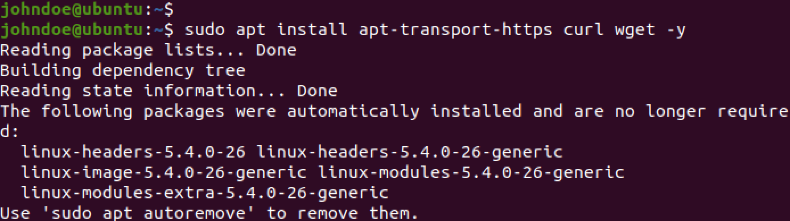

Next, add a plex repository or create a repository file to get pulls from the plex repository. Open the Terminal and execute the following command.

sudo wget -O- https://downloads.plex.tv/plex-keys/PlexSign.key | gpg – dearmor | sudo tee /usr/share/keyrings/plex.gpg

sudo wget -O- https://downloads.plex.tv/plex-keys/PlexSign.key | gpg – dearmor | sudo tee /usr/share/keyrings/plex.gpg

```
sudo wget -O- https://downloads.plex.tv/plex-keys/PlexSign.key | gpg – dearmor | sudo tee /usr/share/keyrings/plex.gpg
```

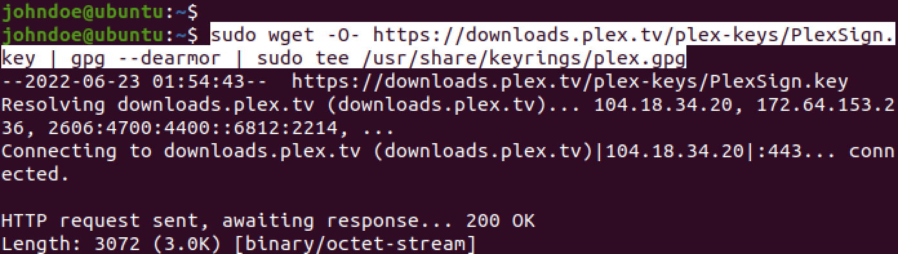

Next, execute the command below to add the Plex GPG key.

echo deb \[signed-by=/usr/share/keyrings/plex.gpg\] https://downloads.plex.tv/repo/deb public main | sudo tee /etc/apt/sources.list.d/plexmediaserver.list

echo deb \[signed-by=/usr/share/keyrings/plex.gpg\] https://downloads.plex.tv/repo/deb public main | sudo tee /etc/apt/sources.list.d/plexmediaserver.list

```
echo deb [signed-by=/usr/share/keyrings/plex.gpg] https://downloads.plex.tv/repo/deb public main | sudo tee /etc/apt/sources.list.d/plexmediaserver.list
```

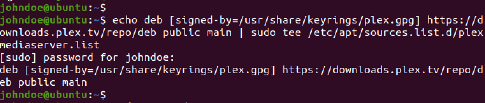

It’s highly recommended that you update your packages before installing the plex. To do this use this command.

```
sudo apt update
```

Now you can install the Plex media server with the following command:

sudo apt-get install plexmediaserver -y

sudo apt-get install plexmediaserver -y

```
sudo apt-get install plexmediaserver -y
```

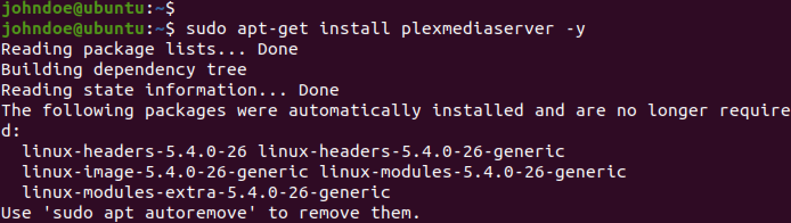

After running the above command, you will see a prompt to configure the `plexmediaserver.list` configuration file. There are four options provided.

-   **Y** or **I**: install the package maintainer’s version
-   **N** or **O**: keep your currently-installed version
-   **D**: show the differences between the versions
-   **Z**: start a shell to examine the situation

For this case, we will choose **N**. That allows us to keep the currently installed version of `plexmediaserver.list` and proceed with the installation. After a successful installation, the `plexmediaserver` service should start automatically. You can verify that by executing the command below.

sudo systemctl status plexmediaserver

sudo systemctl status plexmediaserver

```
sudo systemctl status plexmediaserver
```

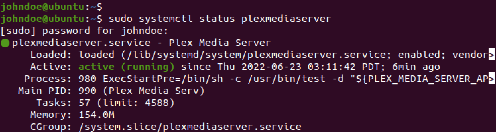

From the image above, you can see that the Plex Media Server service is already running on our system. In case you find that the service is not active, type the commands below to start the Plex Media server:

sudo systemctl enable – now plexmediaserver

sudo systemctl start plexmediaserver

sudo systemctl enable – now plexmediaserver sudo systemctl start plexmediaserver

```
sudo systemctl enable – now plexmediaserver
sudo systemctl start plexmediaserver
```

Now, we need to enable the Plex service to automatically start on boot whenever we boot or restart the system. Execute the commands below on the Terminal.

sudo systemctl enable plexmediaserver

sudo systemctl restart plexmediaserver

sudo systemctl enable plexmediaserver sudo systemctl restart plexmediaserver

```
sudo systemctl enable plexmediaserver
sudo systemctl restart plexmediaserver
```

To use this service, you must also have your UFW (Uncomplicated Firewall) enabled. By default, it’s enabled, but if not, execute the command below to enable UFW.

```
sudo ufw enable
```

Then add the Plex Media Server Port `32400` using by running this command:

```
sudo ufw allow 32400
```

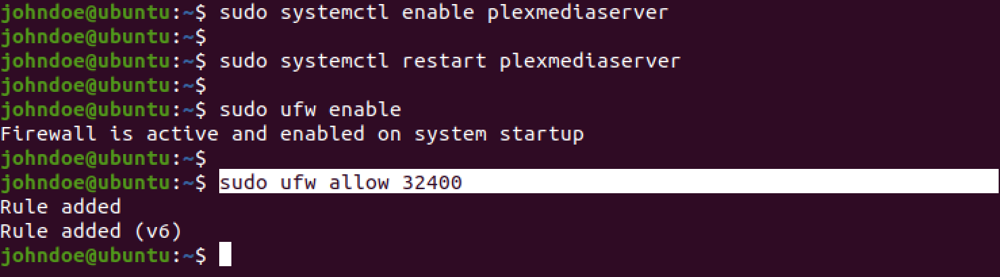

To verify whether port `32400` was enabled, execute the command below.

```
sudo ufw status
```

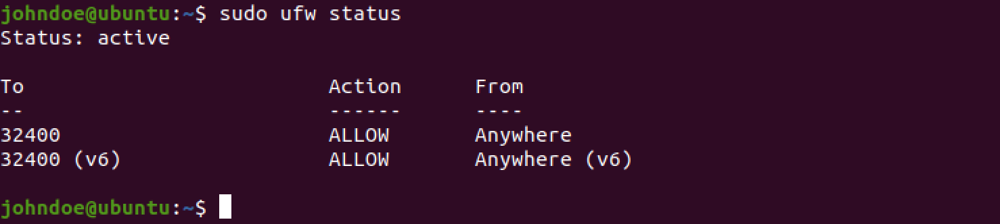

Let’s now look at how you can configure plex using the **WebUI**. To access the Plex web interface, use the URL below.

http://\[Your-Server-IP\]:\[Port-Number\]/web

http://\[Your-Server-IP\]:\[Port-Number\]/web

```
http://[Your-Server-IP]:[Port-Number]/web
```

e.g.,

http://127.0.0.1:32400/web

http://127.0.0.1:32400/web

```
http://127.0.0.1:32400/web
```

OR

http://localhost:32400/web

http://localhost:32400/web

```
http://localhost:32400/web
```

**Note**: If you installed Plex media server on a remote Ubuntu server, you will need to create an SSH Tunnel to access the web setup. Execute the command below on your local machine to create an SSH tunnel to your remote server/VPS.

ssh remote-server-ip -L 8888:localhost:32400

ssh remote-server-ip -L 8888:localhost:32400

```
ssh remote-server-ip -L 8888:localhost:32400
```

Then, using your device access the Plex web UI using the URL below.

http://localhost:8888/web

http://localhost:8888/web

```
http://localhost:8888/web
```

**Tip**: When the page first loads on your browser, you will see the Plex logo. However, after a few seconds, it will direct you to the Plex Tv official web page where you will be required to log in as shown below.

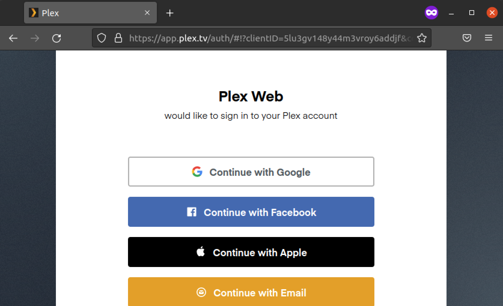

We need to create a user to run the plex server or log in to an existing user account. You can **SignUp** using social media accounts like Facebook, Apple, or email on the First Page. After a successful login, you will see a page similar to the image below.

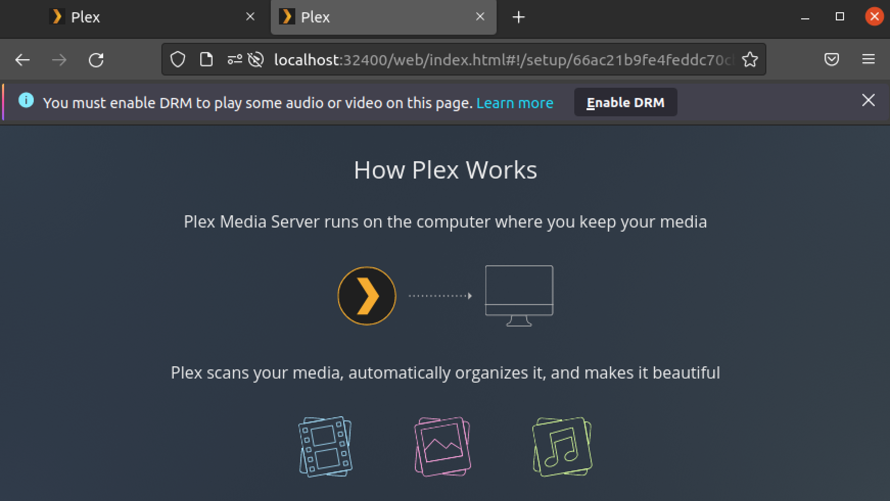

This page gives you a detailed explanation of how plex works. You will also see an option to **enable DRM** on your browser. Click _Enable DRM_ to allow plex Web UI to work correctly on your system. When done, scroll to the bottom of the page and click _GOT IT!_ to get started with Plex Media Server.

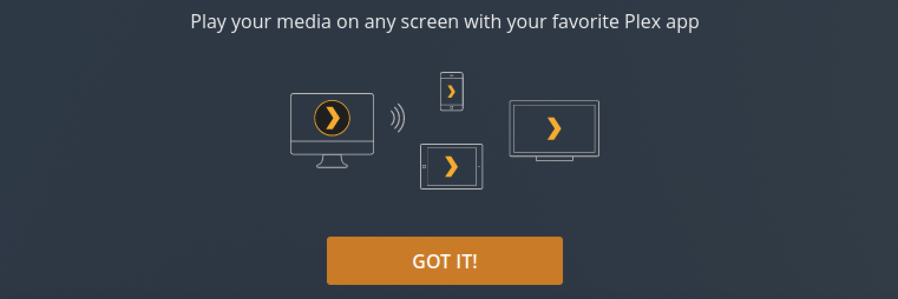

On the new page that appears, you will see the **Plex Pass** pop-up window that shows the various subscription rates. Close it and start configuring your Plex media server. Follow the steps below.

1.  Enter the name that you want to use for your Plex media server. For this post, we will set it as Ubuntu Plex media server.  
    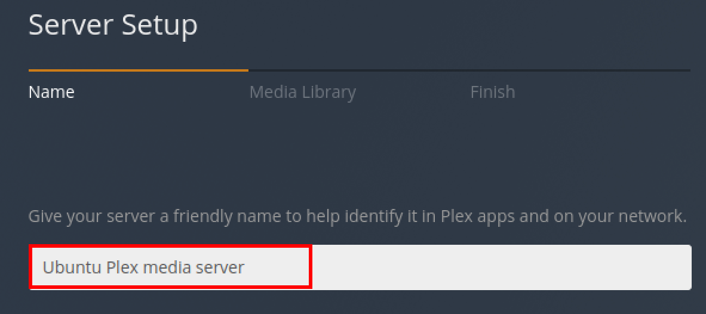  
    Click _Next_ to continue.
2.  On the next screen, you will need to add the media library. Click the **Add Library** button and select a folder on your system containing your media files. For this post, we used the Music and the Videos directories. You can add as many libraries as you wish.  
    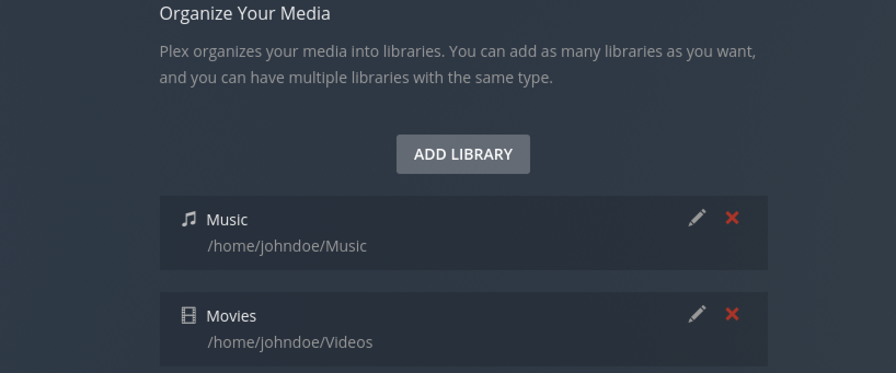
3.  Click _Next_ to continue. On the next screen, click _Done_ to save and apply your new configurations. You will see a window similar to the image below. That’s it! You have successfully configured the Plex media server on your Ubuntu system.  
    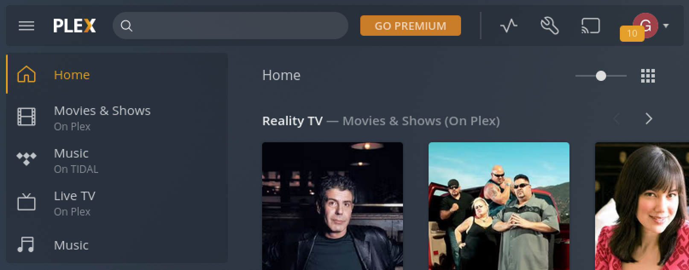

## Configure Access and Permissions

You may have noticed that your media did not appear during the initial setup or that you had issues adding content that was not picked up. Plex could not locate the content on your existing hard drive’s internal and external secondary hard drives. This is due to Plex creating a dedicated user account called **plexuser**, which requires read and execute permissions on your media directories.

We will need to install the ACL package needed for [chown](https://bytexd.com/using-the-chown-command-to-change-file-ownership-in-linux/) and [setfacl](https://bytexd.com/intro-to-acl-using-getfacl-setfacl-commands/) commands to set the required permissions on our media directories. Execute the command below to install ACL on your PC.

```
sudo apt install acl -y
```

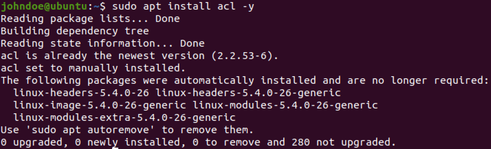

Both `chown` and `setfacl` used to set permissions in Ubuntu. Use the command below to apply read and execute permissions on your media directories using the ACL command.

sudo setfacl -R -m u:plex:rx \[Your-Media-Directory\]

sudo setfacl -R -m u:plex:rx \[Your-Media-Directory\]

```
sudo setfacl -R -m u:plex:rx [Your-Media-Directory]
```

e.g.,

sudo setfacl -R -m u:plex:rx /home/johndoe/Music

sudo setfacl -R -m u:plex:rx /home/johndoe/Videos

sudo setfacl -R -m u:plex:rx /home/johndoe/Music sudo setfacl -R -m u:plex:rx /home/johndoe/Videos

```
sudo setfacl -R -m u:plex:rx /home/johndoe/Music
sudo setfacl -R -m u:plex:rx /home/johndoe/Videos
```

Alternatively, you can use the `chown` command as shown below.

sudo chown -R plex:plex \[Your-Media-Folder\]

sudo chown -R plex:plex \[Your-Media-Folder\]

```
sudo chown -R plex:plex [Your-Media-Folder]
```

e.g.,

sudo chown -R plex:plex /home/johndoe/Music

sudo chown -R plex:plex /home/johndoe/Music

sudo chown -R plex:plex /home/johndoe/Music sudo chown -R plex:plex /home/johndoe/Music

```
sudo chown -R plex:plex /home/johndoe/Music
sudo chown -R plex:plex /home/johndoe/Music
```

To check for Updates on Plex Media server run this command:

```
sudo apt update
```

Then to upgrade:

sudo apt upgrade plexmediaserver -y

sudo apt upgrade plexmediaserver -y

```
sudo apt upgrade plexmediaserver -y
```

## Uninstalling Plex

To uninstall or remove Plex on Ubuntu, execute this command:

sudo apt autoremove plexmediaserver – purge -y

sudo apt autoremove plexmediaserver – purge -y

```
sudo apt autoremove plexmediaserver – purge -y
```

## Conclusion

The Plex Media Server is a very nice tool for streaming your media library to all devices in your house. We can set up our server and stream any movie or song in just a few minutes. This tutorial only tested on Linux-based operating systems. Still, you can follow along regardless of what kind of OS you use as long as you have root access and are familiar with terminal commands.

## Reference

* https://bytexd.com/how-to-install-plex-media-server-on-ubuntu/
* https://www.linuxcapable.com/how-to-install-plex-media-server-on-ubuntu-22-04-lts/
* 